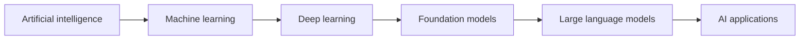
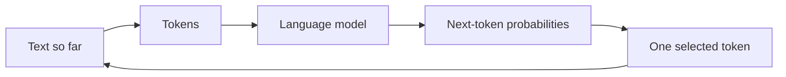
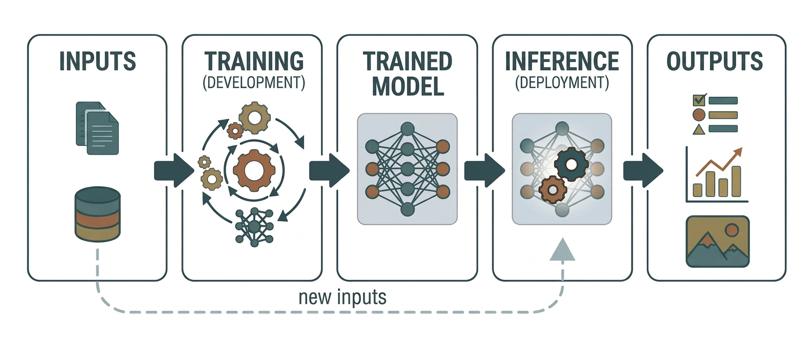
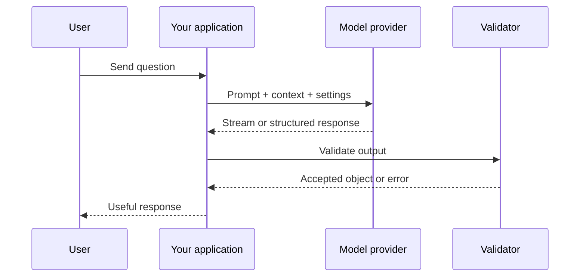

# Module 0 · Foundations & Environment

Welcome. This is the starting point for the course.

We assume working familiarity with HTTP, async programming, SQL, testing, and Docker, plus basic AI literacy. If a term is unfamiliar, look it up in the [Concepts glossary](../concepts/index.md) as you go.

You do not need advanced mathematics to begin. You need a clear mental model of what AI systems are, what an LLM does, and how a small application talks to one.

## What you will be able to do

By the end of this module, you will be able to:

- place AI, machine learning, deep learning, and LLMs in one mental map
- explain training versus inference and why fluent output can still be wrong
- describe what happens when an application sends a prompt to a model
- run a small LLM-backed service under Docker and call both of its endpoints
- explain streaming as a UX decision and schema validation as a trust boundary
- state the cost/latency/quality tradeoff behind a model choice

## Why this matters

Once you understand the basic shape of an AI system, the later topics become easier to place. Retrieval gives a model access to useful information. Tools let it take actions. Evals tell us whether it worked. Production engineering makes the whole system reliable enough for real users.

## What is AI?

**Artificial intelligence (AI)** is the broad field of building computer systems that perform tasks we associate with human intelligence: recognizing patterns, understanding language, making predictions, planning, or choosing an action.

AI is not one single technology. It is an umbrella term:



Here is the same relationship as a real-world reference diagram:


*Image credit: [AI-ML-DL.svg](../image-credits.md).*

### Machine learning

In traditional programming, a person writes rules that transform inputs into outputs:

```text
rules + input → output
```

In **machine learning**, we give a system examples and let it learn patterns that help it produce outputs for new inputs:

```text
examples → learned model
learned model + new input → prediction
```

The model is not “thinking” in the human sense. It is calculating a prediction from patterns learned during training.

### Deep learning

**Deep learning** is machine learning built with large neural networks. Neural networks contain learned numbers called **parameters**. Modern language, image, audio, and video models are usually deep-learning systems.

### Generative AI

**Generative AI** produces new content: text, code, images, audio, or video. Instead of only classifying an input as “spam” or “not spam,” a generative model can write an email, summarize a document, or generate an image.

## What is an LLM?

An **LLM**, or **large language model**, is a deep-learning model trained on a very large collection of text and code. Its core job is to predict what token is likely to come next:



For example, after seeing:

```text
The capital of France is
```

the model assigns a high probability to the token `Paris`. It then repeats the process for the next token.

This simple description explains several important facts:

- The model can produce fluent language without guaranteeing that every fact is true.
- The model is sensitive to the words and examples in its context.
- Different sampling settings can produce different answers.
- A model can be useful without being a database, search engine, or source of truth.

## Training versus using a model

There are two different activities:

| Activity | What happens | Who usually does it |
|---|---|---|
| **Training** | The model's parameters are adjusted using many examples | Model labs and research teams |
| **Inference** | The trained model generates an answer for a new request | Your application at runtime |

This training-to-inference split is also shown in the following workflow diagram:



*Image credit: [Workflow of a machine-learning-based AI system](../image-credits.md).*

This course focuses on **inference and application engineering**. You will learn how to choose models, provide useful context, validate outputs, connect tools, evaluate behavior, and operate the result.

## What happens when our app uses an LLM?



Your code is the layer that makes the model useful and safe. It decides what to send, which model to use, what tools or data are available, how to validate the result, and what the user sees when something fails.

## Tokens, context, and prompts

### Tokens

A **token** is a small piece of text that the model reads or writes. A token may be a whole word, part of a word, punctuation, or whitespace. Token counts affect:

- API cost
- context-window limits
- response length
- latency

Do not worry about memorizing the exact tokenization rules yet. The practical rule is: longer input and longer output generally cost more and take longer.

### Context window

The **context window** is the amount of text the model can consider for one request. It includes the instructions, conversation history, retrieved documents, tool results, and requested output.

When an application has more information than fits in context, it needs retrieval, summarization, memory, or another context-management strategy. That is why Module 3 matters.

### Prompt

A **prompt** is the input we send to the model. It can include:

- instructions
- the user's question
- examples
- retrieved information
- tool results
- an output format or schema

Prompting is not magic wording. It is the first version of programming a probabilistic system.

## What an LLM is not

An LLM is not automatically:

- a live search engine
- a reliable database
- a calculator
- an authorized application user
- a guaranteed source of truth

We connect the model to search, databases, calculators, APIs, and human approval when those capabilities are required. The model can decide how to use those capabilities, but the application must enforce the boundaries.

## 🔨 The build

**[`builds/00-hello-llm`](https://github.com/noufal85/ai-engineer-curriculum/tree/main/builds/00-hello-llm)** — a Dockerized FastAPI service with two endpoints: one **streams** a model response token-by-token, the other returns a **schema-validated object** from free text.

```bash
cd builds/00-hello-llm
cp .env.example .env      # add ANTHROPIC_API_KEY
docker compose up --build # open http://localhost:8000
```

Run it before reading on. Many later artifacts are variations on these two moves, but some topics will stay as small snippets or local experiments.

## What we built

A small service (`app.py`) that proves out two primitives you'll reuse everywhere:

- `POST /chat` — streams the answer as it is generated.
- `POST /extract` — forces the model to fill a Pydantic schema (`sentiment`, `topics`, `summary`, `action_required`) and validates it before returning.

## What it teaches through the build

- **Streaming is a UX decision.** Showing the first token quickly feels different from waiting for the complete response. Streaming also changes error handling because some bytes may already be sent.
- **Structured output beats “please return JSON.”** A schema gives downstream code a validated object instead of a hopeful parse of prose.
- **The model is a configurable dependency.** Changing `MODEL` lets you compare quality, latency, and cost without rewriting the application.
- **Validation is a trust boundary.** Model output is untrusted until it passes the schema.

## Baseline you need

Now reach for these concepts when the build makes them relevant:

- **HTTP and streaming** — requests, responses, status codes, and chunked output.
- **Async and bounded concurrency** — firing multiple calls without overwhelming a provider.
- **Schemas at the boundary** — Pydantic (Python) or Zod (TypeScript).
- **Docker and Compose** — enough to start, inspect, and stop a service.
- **Cost/latency/quality** — the recurring design tradeoff.
- **Embeddings intuition** — what a vector is; the deeper treatment arrives in Module 3.

## 🧪 Lab

Hands-on first: poke the running service, then extend it.

### Trial · Poke the running service (~10 min)

With `00-hello-llm` up:

1. Watch streaming happen one chunk at a time:

    ```bash
    curl -N -X POST localhost:8000/chat \
      -H 'content-type: application/json' \
      -d '{"message": "Explain tokens in two sentences."}'
    ```

2. Hit `/extract` three ways — an angry customer email, an empty string, and a few thousand words of pasted text:

    ```bash
    curl -X POST localhost:8000/extract \
      -H 'content-type: application/json' \
      -d '{"text": "The blender broke after two weeks and support never replied. I want a refund."}'
    ```

    Watch what the schema validation accepts, rejects, and how the model fills `action_required`.

3. Change `MODEL` in `.env` to a smaller model, restart, repeat step 1, and note the latency and quality difference.

### Extend the build

- [ ] Run `00-hello-llm` and hit both endpoints from the browser.
- [ ] Add a `/classify` endpoint returning one enum label via a strict schema.
- [ ] Fire 10 `/extract` calls concurrently without tripping rate limits.
- [ ] Switch `MODEL` to Haiku and describe the cost/latency/quality difference.
- [ ] Explain why streaming changes error handling.

## Checklist

- [ ] I can explain the difference between AI, machine learning, deep learning, and an LLM.
- [ ] I can explain training versus inference in plain language.
- [ ] I understand tokens, context windows, prompts, and why model output can be wrong.
- [ ] The build runs under Docker and I have torn it down cleanly.
- [ ] I can explain streaming and why it is a UX decision.
- [ ] I use schema validation for structured output instead of string parsing.
- [ ] I can state the cost/latency/quality tradeoff for a design.
- [ ] I extended the build with at least one new endpoint.

## Resources

- The [Developer environment](../concepts/developer-environment.md) and [Engineering core](../concepts/engineering-core.md) concept glossaries for setup and tooling vocabulary.
- Anthropic API documentation — streaming and structured output sections.
- Karpathy's introductory LLM talks for intuition about tokens and next-token prediction.
- Pydantic (Python) or Zod (TypeScript) documentation.
- The [build README](https://github.com/noufal85/ai-engineer-curriculum/tree/main/builds/00-hello-llm) — the model for every module's explain half.
