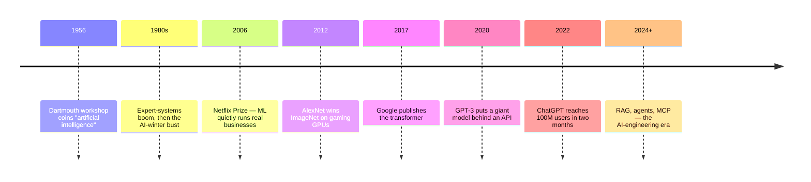
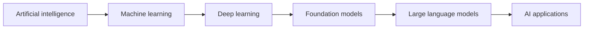
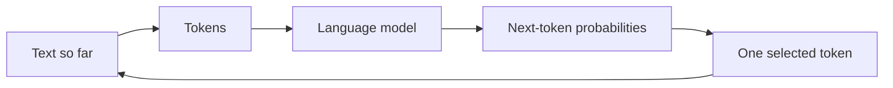
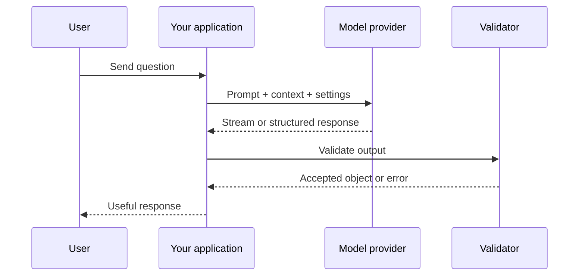

# Module 0 · Foundations & Environment

Welcome. This is the starting point for the course.

We assume working familiarity with HTTP, async programming, SQL, testing, and Docker, plus basic AI literacy. If a term is unfamiliar, look it up in the [Concepts glossary](../concepts/index.md) as you go.

You do not need advanced mathematics to begin. You need a clear mental model of what AI systems are, what an LLM does, and how a small application talks to one.

## What you will be able to do

By the end of this module, you will be able to:

- tell the sixty-year story that led from rule-based AI to LLMs — and why each era gave way to the next
- place AI, machine learning, deep learning, and LLMs in one mental map
- explain training versus inference and why fluent output can still be wrong
- describe what happens when an application sends a prompt to a model
- run a small LLM-backed service under Docker and call both of its endpoints
- explain streaming as a UX decision and schema validation as a trust boundary
- state the cost/latency/quality tradeoff behind a model choice

## Why this matters

Once you understand the basic shape of an AI system, the later topics become easier to place. Retrieval gives a model access to useful information. Tools let it take actions. Evals tell us whether it worked. Production engineering makes the whole system reliable enough for real users.

## From rules to LLMs: a short history

You cannot really understand what an LLM is — or why an entire industry reorganized itself around it — without the sixty-year argument that produced it. Each era below failed or plateaued in a way that caused the next one.



**1956–1980s · The rules era.** At a summer workshop at Dartmouth in 1956, a small group of researchers named the field "artificial intelligence" and made the founding bet: intelligence can be written down. For three decades the dominant approach was exactly the `rules + input → output` programming you already know, scaled up — experts encode their knowledge as thousands of hand-written rules. In the 1980s this became a genuine industry: corporations spent billions on **expert systems** and dedicated Lisp hardware to run them. Then reality won. The rules could not keep up with the messiness of the real world, maintenance costs exploded, the market collapsed, and funding froze — the **AI winter**. For years afterward, serious companies avoided the phrase "AI" entirely.

**1990s–2000s · Machine learning flips the equation.** The recovery came from inverting the bet: stop writing rules, show the computer examples, and let it *learn* the rules — `examples → learned model`, then `model + new input → prediction`. That is **machine learning**, and it quietly ran profitable products long before anyone called it AI again: spam filters, credit-card fraud detection, Amazon's recommendations, Google's ad ranking. By 2006 Netflix was offering a $1M prize just to improve its recommender by 10%. Note the shape of the business value: narrow, one carefully engineered prediction task at a time, each needing its own data, features, and team.

**2012 · Deep learning's ImageNet moment.** **Deep learning** — machine learning built from many-layered neural networks, whose learned numbers are called **parameters** — had existed for decades but was starved of compute and data. In 2012 a network called AlexNet, trained on two consumer gaming GPUs, entered the ImageNet image-recognition competition and nearly halved the error rate of every classical approach. The lesson landed instantly: neural networks *scale* with data and compute. Big tech pivoted within a couple of years, and GPUs — until then a gaming product — became strategic infrastructure, the beginning of NVIDIA's transformation into one of the most valuable companies on earth.

**2017–2020 · The transformer and the API.** In 2017 Google researchers published *Attention Is All You Need*, introducing the **transformer** — an architecture that processes whole sequences in parallel and lets every token attend to every other token. Training on internet-scale text suddenly became practical, and one lab kept pulling the same lever: make it bigger. GPT-2 (2019) wrote coherent paragraphs; GPT-3 (2020), at 175 billion parameters, could follow instructions it had never been trained for. Just as important was the packaging: GPT-3 shipped as **an API**. For the first time you could rent general-purpose language capability over HTTP, metered by the token — no ML team, no GPUs, no training pipeline.

**November 2022 · ChatGPT.** A chat interface wrapped around an instruction-tuned GPT model became the fastest-growing consumer product in history — 100 million users in two months. **Generative AI** — models that produce new text, code, and images rather than only classifying input — went from research demo to board-level budget line in a single quarter. Capital followed: Microsoft deepened its OpenAI investment, Google mobilized around Gemini, Anthropic scaled Claude, and open-weight models (Llama, Mistral) made capability a download.

**2023–today · From chat to systems.** The frontier then shifted from the models to what you build *around* them: retrieval (RAG) to ground answers in your data, tool calling and agents to take actions, protocols like MCP (2024) to standardize how models reach systems, reasoning models that trade latency for reliability. Companies discovered that a demo is easy and a dependable product is hard — and a new role emerged for engineers who build on top of models through APIs rather than training them: the **AI engineer**. That role is what this course trains.

## What is AI, then?

After that history, the taxonomy is simple — each era nests inside the previous one:




*Image credit: [AI-ML-DL.svg](../image-credits.md).*

**Artificial intelligence** is the umbrella: systems performing tasks we associate with human intelligence. **Machine learning** learns patterns from examples instead of hand-written rules. **Deep learning** is machine learning built from large neural networks. **Generative AI** produces new content rather than only classifying input — and an LLM is generative deep learning applied to language. Throughout, remember: the model is not "thinking" in the human sense; it is computing a prediction from patterns learned during training.

## What is an LLM?

An **LLM**, or **large language model**, is a deep-learning model trained on a very large collection of text and code. Its core job is to predict what token is likely to come next:



For example, after seeing:

```text
The capital of France is
```

the model assigns a high probability to the token `Paris`. It then repeats the process for the next token.

This simple description explains several important facts:

- The model can produce fluent language without guaranteeing that every fact is true.
- The model is sensitive to the words and examples in its context.
- Different sampling settings can produce different answers.
- A model can be useful without being a database, search engine, or source of truth.

## Training versus using a model

There are two different activities:

| Activity | What happens | Who usually does it |
|---|---|---|
| **Training** | The model's parameters are adjusted using many examples | Model labs and research teams |
| **Inference** | The trained model generates an answer for a new request | Your application at runtime |

This training-to-inference split is also shown in the following workflow diagram:


*Image credit: [Workflow of a machine-learning-based AI system](../image-credits.md).*

This course focuses on **inference and application engineering** — the discipline now called **AI engineering**: building on foundation models through prompting, retrieval, and tools rather than training models yourself. You will learn how to choose models, provide useful context, validate outputs, connect tools, evaluate behavior, and operate the result.

## What happens when our app uses an LLM?



Your code is the layer that makes the model useful and safe. It decides what to send, which model to use, what tools or data are available, how to validate the result, and what the user sees when something fails.

On the wire, the request itself is small and boring — a model ID, a token budget, and the conversation so far:

```json
{
  "model": "claude-opus-4-8",
  "max_tokens": 1024,
  "messages": [
    {"role": "user", "content": "Summarize this support ticket: ..."}
  ]
}
```

Almost everything in this course — prompting, retrieval, tools, evals — is ultimately about what goes into that request and what you do with the response. Module 2 covers how to design its contents deliberately.

## Tokens, context, and prompts

### Tokens

A **token** is a small piece of text that the model reads or writes. A token may be a whole word, part of a word, punctuation, or whitespace. Token counts affect:

- API cost — providers meter per million input and output tokens, with output priced several times higher ([pricing](https://platform.claude.com/docs/en/pricing))
- context-window limits
- response length
- latency

Do not worry about memorizing the exact tokenization rules yet. The practical rule is: longer input and longer output generally cost more and take longer.

### Context window

The **context window** is the amount of text the model can consider for one request. It includes the instructions, conversation history, retrieved documents, tool results, and requested output.

When an application has more information than fits in context, it needs retrieval, summarization, memory, or another context-management strategy. That is why Module 3 matters. And even within the window, more context is not automatically better: accuracy degrades as context grows (sometimes called **context rot**), which is why Modules 2–3 treat context as something you curate, not just fit.

### Prompt

A **prompt** is the input we send to the model. It can include:

- instructions
- the user's question
- examples
- retrieved information
- tool results
- an output format or schema

Prompting is not magic wording. It is the first version of programming a probabilistic system.

## What an LLM is not

An LLM is not automatically:

- a live search engine
- a reliable database
- a calculator
- an authorized application user
- a guaranteed source of truth
- a system that remembers your previous request — the API is **stateless**; your application resends the conversation history on every turn

We connect the model to search, databases, calculators, APIs, and human approval when those capabilities are required. The model can decide how to use those capabilities, but the application must enforce the boundaries.

## 🔨 The build

**[`builds/00-hello-llm`](https://github.com/noufal85/ai-engineer-curriculum/tree/main/builds/00-hello-llm)** — a Dockerized FastAPI service with two endpoints: one **streams** a model response token-by-token, the other returns a **schema-validated object** from free text.

```bash
cd builds/00-hello-llm
cp .env.example .env      # add ANTHROPIC_API_KEY
docker compose up --build # open http://localhost:8000
```

Run it before reading on. Many later artifacts are variations on these two moves, but some topics will stay as small snippets or local experiments.

## What we built

A small service (`app.py`) that proves out two primitives you'll reuse everywhere:

- `POST /chat` — streams the answer as it is generated.
- `POST /extract` — forces the model to fill a Pydantic schema (`sentiment`, `topics`, `summary`, `action_required`) and validates it before returning.

## What it teaches through the build

- **Streaming is a UX decision.** Showing the first token quickly feels different from waiting for the complete response. Streaming also changes error handling because some bytes may already be sent.
- **Structured output beats “please return JSON.”** A schema gives downstream code a validated object instead of a hopeful parse of prose.
- **The model is a configurable dependency.** Changing `MODEL` lets you compare quality, latency, and cost without rewriting the application.
- **Validation is a trust boundary.** Model output is untrusted until it passes the schema.

## Baseline you need

Now reach for these concepts when the build makes them relevant:

- **HTTP and streaming** — requests, responses, status codes, and chunked output.
- **Async and bounded concurrency** — firing multiple calls without overwhelming a provider.
- **Schemas at the boundary** — Pydantic (Python) or Zod (TypeScript).
- **Docker and Compose** — enough to start, inspect, and stop a service.
- **Cost/latency/quality** — the recurring design tradeoff.
- **Embeddings intuition** — what a vector is; the deeper treatment arrives in Module 3.

## 🧪 Lab

Hands-on first: poke the running service, then extend it.

### Trial · Poke the running service (~10 min)

With `00-hello-llm` up:

1. Watch streaming happen one chunk at a time:

    ```bash
    curl -N -X POST localhost:8000/chat \
      -H 'content-type: application/json' \
      -d '{"message": "Explain tokens in two sentences."}'
    ```

2. Hit `/extract` three ways — an angry customer email, an empty string, and a few thousand words of pasted text:

    ```bash
    curl -X POST localhost:8000/extract \
      -H 'content-type: application/json' \
      -d '{"text": "The blender broke after two weeks and support never replied. I want a refund."}'
    ```

    Watch what the schema validation accepts, rejects, and how the model fills `action_required`.

3. Change `MODEL` in `.env` to a smaller model, restart, repeat step 1, and note the latency and quality difference.

### Extend the build

- [ ] Run `00-hello-llm` and hit both endpoints from the browser.
- [ ] Add a `/classify` endpoint returning one enum label via a strict schema.
- [ ] Fire 10 `/extract` calls concurrently without tripping rate limits.
- [ ] Switch `MODEL` to Haiku and describe the cost/latency/quality difference.
- [ ] Explain why streaming changes error handling.

## Checklist

- [ ] I can explain the difference between AI, machine learning, deep learning, and an LLM.
- [ ] I can explain training versus inference in plain language.
- [ ] I understand tokens, context windows, prompts, and why model output can be wrong.
- [ ] The build runs under Docker and I have torn it down cleanly.
- [ ] I can explain streaming and why it is a UX decision.
- [ ] I use schema validation for structured output instead of string parsing.
- [ ] I can state the cost/latency/quality tradeoff for a design.
- [ ] I extended the build with at least one new endpoint.

## Suggested reading

Ordered from "start here" to "go deeper". Every link was verified against external recommendations in August 2026.

- [Large Language Models explained briefly](https://www.youtube.com/watch?v=LPZh9BOjkQs) — Grant Sanderson (3Blue1Brown), 2024, video, ~8 min. The fastest correct mental model of "an LLM is a next-token prediction function" — watch before anything else.
- [Intro to Large Language Models](https://www.youtube.com/watch?v=zjkBMFhNj_g) — Andrej Karpathy, 2023, video, ~1 hr. The canonical busy person's intro: training versus inference, why fluent output can be wrong, and LLMs as a new computing platform. Notes in [Talk Notes](../notes/intro-to-large-language-models.md).
- [The Rise of the AI Engineer](https://www.latent.space/p/ai-engineer) — swyx, 2023, essay, ~15 min. The essay that named the role this curriculum trains: an engineer building on the application side of the model API.
- [Understanding GPT tokenizers](https://simonwillison.net/2023/Jun/8/gpt-tokenizers/) — Simon Willison, 2023, essay, ~10 min. Hands-on intuition, with an interactive tokenizer, for why tokens drive cost, context limits, and latency.
- [Streaming Messages](https://platform.claude.com/docs/en/build-with-claude/streaming) — Anthropic docs, current, ~30 min. The SSE mechanics behind the build's `/chat` endpoint, including why partial output changes error handling.
- [Structured outputs](https://platform.claude.com/docs/en/build-with-claude/structured-outputs) — Anthropic docs, current, ~30 min. Schema-constrained JSON and the Pydantic/Zod helpers — the "validation is a trust boundary" idea behind `/extract`, straight from the provider.
- [What We've Learned From A Year of Building with LLMs](https://applied-llms.org/) — Yan, Bischof, Frye, Husain, Liu & Shankar, 2024, essay collection, ~1 hr. Practitioner field notes on prompting, evals, and cost/latency/quality tradeoffs — a preview of every later module from people who shipped.
- [AI Engineering](https://huyenchip.com/books/) — Chip Huyen, 2025, book (paid, O'Reilly), ~15–20 hrs. The go-deeper reference for the whole course; read alongside Modules 1–6 rather than in one sitting.

## Resources

- The [Developer environment](../concepts/developer-environment.md) and [Engineering core](../concepts/engineering-core.md) concept glossaries for setup and tooling vocabulary.
- [Anthropic pricing](https://platform.claude.com/docs/en/pricing) — the per-million-token rates behind the cost column in your lab notes.
- Pydantic (Python) or Zod (TypeScript) documentation.
- The [build README](https://github.com/noufal85/ai-engineer-curriculum/tree/main/builds/00-hello-llm) — the model for every module's explain half.
