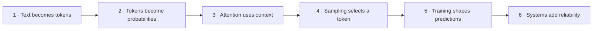
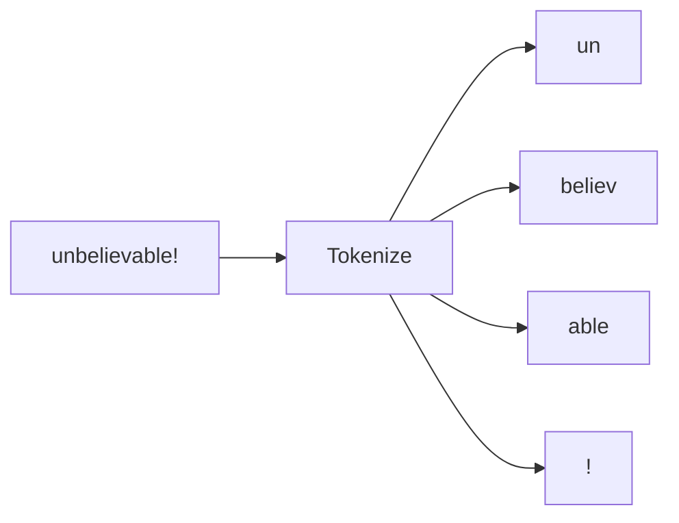
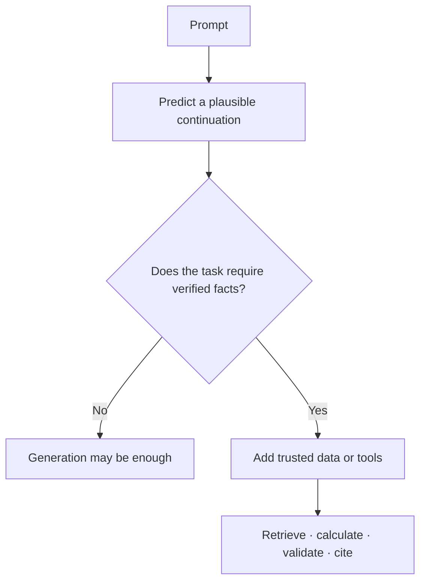
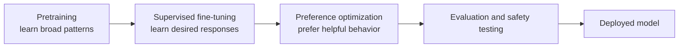
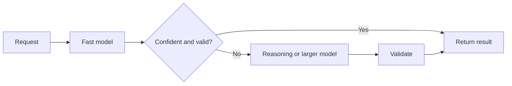
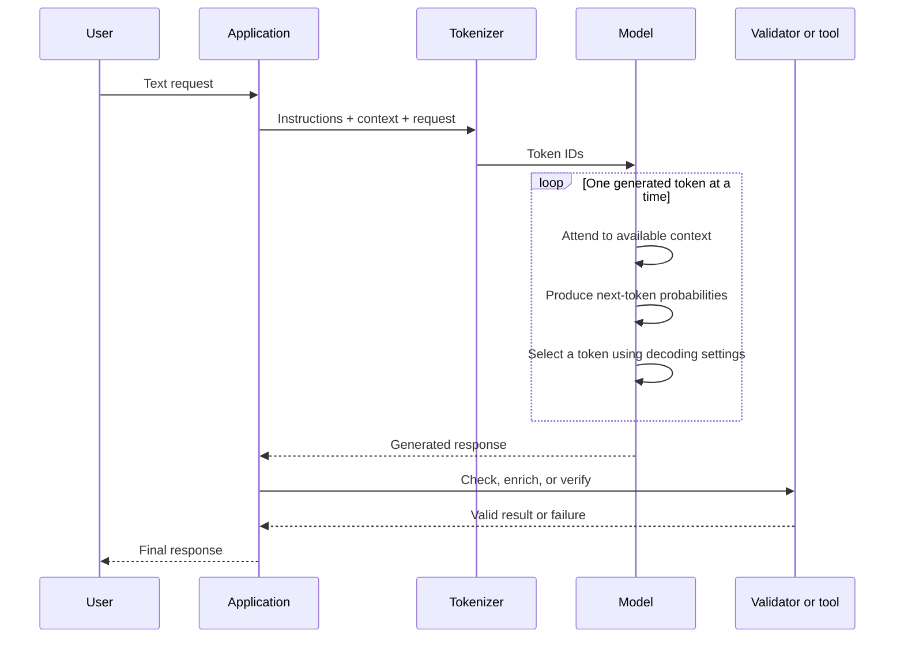

# Module 1 · LLM Internals

An LLM can feel mysterious because it produces complete ideas one tiny piece at a time. This module replaces that mystery with a practical mental model.

You will begin with one simple idea—**predict the next token**—and gradually use it to explain context windows, sampling, hallucinations, training, reasoning models, and model selection. No advanced mathematics is required.

## What you will be able to do

By the end of this module, you will be able to:

- trace a request from text to tokens to an answer
- explain why fluent output is not automatically factual
- choose sampling settings deliberately instead of by habit
- describe how pretraining, instruction tuning, and preference optimization shape behavior
- decide when a reasoning model is worth the additional time and cost
- compare models using evidence from a small repeatable experiment

## The journey

Each layer builds on the previous one:



!!! tip "Keep one question in mind"
    At every stage, ask: **What does this mechanism make possible, and what can still go wrong?** That question turns internals into engineering judgment.

## 🔨 The build: a model behavior lab

**`snippets/01-model-playground.py`** _(planned)_ will send the same prompt to different models and sampling settings, then compare:

- output quality
- input and output tokens
- time to first token and total latency
- estimated cost
- consistency across repeated runs

The point is not to find a universally “best” model. The point is to learn how model behavior changes when you change one variable at a time.

Start with this prompt:

```text
Explain why the sky appears blue to a curious 12-year-old.
Use one analogy and no more than 100 words.
```

Run it three times at each temperature. Record what stays stable, what changes, and whether variety helps the task.

---

## Level 1 · Text becomes tokens

Models do not receive sentences directly. A **tokenizer** converts text into token IDs—integers from a fixed vocabulary that the model knows.



The exact split varies by tokenizer. A token might be:

- a whole common word
- part of a longer or unusual word
- punctuation
- whitespace combined with nearby text
- a byte-like fragment used for unfamiliar characters

### Why tokenization matters

Tokenization is not just preprocessing. It affects the application you build:

| Effect | Why it happens | Engineering consequence |
|---|---|---|
| Cost | Providers generally meter input and output tokens | Longer prompts and answers cost more |
| Context limits | The window is measured in tokens, not pages | A document that looks short may still be expensive |
| Latency | More tokens require more computation | Remove irrelevant context before sending it |
| Awkward text tasks | Characters and words may be split unpredictably | Do not rely on an LLM for exact counting or string manipulation |
| Model differences | Model families may use different tokenizers | Recount tokens when changing models |

!!! example "A useful surprise"
    `cat`, `catalog`, `CAT`, and ` cat` may not begin with the same token. To a tokenizer, capitalization and leading whitespace can matter.

### Try it · Token detective

Open a tokenizer playground and inspect:

```text
The unbelievably tiny café costs $3.50 ☕
```

Then change one thing at a time:

1. Remove the space before `tiny`.
2. Change `unbelievably` to a rare name.
3. Replace `café` with `cafe`.
4. Add JSON punctuation around the sentence.

Write down which changes produce more tokens. You are building an intuition, not memorizing a tokenizer.

### Checkpoint

You should now be able to explain why **a token is not the same thing as a word**, and why exact character-level work belongs in normal code.

---

## Level 2 · Tokens become probabilities

Given all tokens so far, the model produces a probability distribution for the next token.

After:

```text
The capital of France is
```

a simplified distribution might look like this:

| Candidate token | Probability |
|---|---:|
| ` Paris` | 0.92 |
| ` located` | 0.03 |
| ` a` | 0.02 |
| everything else | 0.03 |

One token is selected, appended to the context, and the entire process repeats:

```text
prompt → probabilities → choose token → append token → repeat
```

A paragraph that feels like one act of writing is therefore a long sequence of predictions.

### What the model learned

During training, the model adjusted billions of numeric **parameters** so that useful continuations became more likely. Those parameters encode patterns distributed across the network; they are not a tidy collection of rows such as:

```text
France | capital | Paris
```

This is why an LLM can combine ideas flexibly, but it cannot serve as a guaranteed database.

### The first big consequence: fluent does not mean true

The training objective rewards a likely continuation. It does not directly verify every generated claim against the world.

If a prompt asks about a plausible-sounding event that never happened, the model may still have enough patterns to produce a convincing answer. This is a **hallucination**: generated content that is unsupported or false, often expressed fluently.



The practical response is not “tell the model to stop hallucinating.” Use systems that supply or verify truth:

- retrieval from trusted sources
- tools for calculations and live data
- structured constraints and validation
- citations that can be checked
- evals that measure unsupported claims
- human review for high-impact decisions

You will build these controls in Modules 3–6.

### Try it · Prediction, not recollection

Complete each fragment before asking a model to do it:

```text
Peanut butter and ...
Once upon a ...
The function returned an error because ...
```

Notice that the third fragment has many reasonable continuations. A model must distribute probability among them. More context can narrow that distribution—which is why good prompting helps.

### Checkpoint

You should now be able to finish this sentence:

> An LLM can sound certain while being wrong because...

Your answer should mention **likely continuation** and **lack of automatic fact verification**.

---

## Level 3 · Attention decides what context matters

To predict the next token, the model needs to relate the current position to earlier tokens. **Attention** is the mechanism that lets each position weigh which earlier pieces of context are useful.

Consider:

```text
The trophy did not fit in the suitcase because it was too large.
```

To interpret `it`, the model needs information from `trophy` and `suitcase`. Attention helps build those relationships.

### A practical analogy

Imagine preparing an answer at a table covered with note cards. For each new word, you glance more strongly at the cards that seem relevant. You do not move the facts into a database; you build a context-sensitive mixture of what matters right now.

The real mechanism is mathematical and uses learned **query**, **key**, and **value** representations:

```text
query: what information does this position need?
key:   what kind of information might this earlier position contain?
value: what information should be passed forward?
```

You do not need to calculate attention by hand to engineer LLM applications. You do need to understand its limits.

### Context is working memory, not permanent memory

The **context window** contains the tokens available for the current request: instructions, messages, documents, examples, and tool results. It is finite.

Three consequences follow:

1. **More context costs more.** The model must process the supplied tokens.
2. **More context is not always better.** Irrelevant text can distract from the signal.
3. **Available does not mean equally used.** Models can underuse details buried inside long contexts, often called being **lost in the middle**.

!!! tip "Context engineering rule"
    Put the most important instructions and evidence in clear, predictable locations. Retrieve a few relevant passages instead of dumping an entire knowledge base into the prompt.

### A little more depth: why long context can be expensive

In standard self-attention, tokens compare information across many token pairs. If the sequence length doubles, the attention work can grow much faster than twofold. Modern systems use optimized attention, caching, and architectural variations, so real cost and latency are model-specific—but long prompts are never free.

During generation, a **key-value cache** lets the model reuse work from earlier tokens instead of recomputing the whole sequence from scratch. This makes generation practical, while the growing context still consumes memory.

### Try it · Find the signal

Ask a model a precise question using:

1. only the relevant paragraph
2. the same paragraph buried between several unrelated paragraphs
3. the relevant paragraph repeated clearly near the end

Compare accuracy and latency. This is a miniature preview of retrieval and context engineering.

### Checkpoint

You should now be able to explain why a large context window is **capacity**, not a promise that every included detail will control the answer.

---

## Level 4 · Sampling turns probabilities into output

The model produces probabilities; a **decoding strategy** decides which token is emitted.

Suppose the candidates are:

| Token | Original probability |
|---|---:|
| ` blue` | 0.55 |
| ` clear` | 0.25 |
| ` bright` | 0.15 |
| ` enormous` | 0.05 |

Always choosing the highest-probability token is predictable. Sampling from the distribution introduces variety. The common controls affect different parts of this choice.

### Temperature

**Temperature** reshapes the probability distribution before selection.

- lower temperature makes high-probability tokens more dominant
- higher temperature flattens the distribution and gives less likely tokens more chance
- temperature does not add knowledge or make a weak model reason better

Think of it as a **risk dial**, not a creativity score.

### Top-p

**Top-p**, or nucleus sampling, keeps the smallest set of candidates whose combined probability reaches a threshold, then samples from that set.

At `top_p = 0.9`, the model ignores the low-probability tail after enough candidates account for 90% of the probability mass. The number of surviving tokens can change at every step.

### Top-k

**Top-k** keeps only the `k` most likely candidates. It is a fixed-size shortlist, regardless of how concentrated or spread out the distribution is.

### Choose settings by task

| Task | Useful starting behavior | Why |
|---|---|---|
| Data extraction | Low randomness | Consistency is more valuable than variety |
| Classification | Low randomness plus schema constraints | The answer must stay inside a small valid set |
| Explanations | Low to moderate randomness | Some variation can improve phrasing |
| Brainstorming | Moderate randomness | Diverse candidates are useful |
| Creative writing | Moderate to higher randomness | Surprise may be part of quality |

!!! warning "Deterministic is not the same as correct"
    A repeatable wrong answer is still wrong. Low temperature reduces variation; it does not verify facts. Exact reproducibility can also depend on provider implementation, model updates, and other decoding settings.

### Try it · Change one knob

For the sky prompt from the build, compare temperature `0`, `0.7`, and `1.2`. Run each setting at least three times.

Score each answer from 1–5 for:

- factual accuracy
- instruction following
- clarity
- originality
- consistency across runs

Do not change temperature and top-p together at first. If several variables move, you cannot tell which one caused the behavior.

### Checkpoint

You should now be able to explain why you would use different decoding settings for extracting an invoice and writing five campaign ideas.

---

## Level 5 · Training shapes the probability distribution

A chat model is usually produced in stages. Each stage changes what continuations it tends to generate.



### Stage 1 · Pretraining

The model learns to predict tokens across a very large corpus. This develops language ability, broad knowledge, code patterns, styles, and surprising general-purpose capabilities.

The result is a **base model**. It can continue text, but it may not reliably behave like a helpful assistant.

### Stage 2 · Supervised fine-tuning

In **supervised fine-tuning (SFT)**, the model trains on curated input-and-response examples. It learns patterns such as:

- follow an instruction
- answer in a useful format
- call a tool using a specified schema
- refuse certain unsafe requests
- adopt a domain-specific style

SFT shows the model examples of desired behavior.

### Stage 3 · Preference optimization

Humans or other systems compare candidate responses. Methods such as **RLHF** and **DPO** use those preferences to make favored behavior more likely.

- **RLHF** uses a learned reward signal and reinforcement learning.
- **DPO** trains more directly from preferred and rejected response pairs.

Preference optimization helps make assistants more useful, but it can also encourage side effects such as over-agreeing, excessive confidence, or optimizing for what looks helpful rather than what is true.

### Fine-tuning does not replace retrieval

Use the right mechanism for the job:

| Need | Usually start with |
|---|---|
| Current or private facts | Retrieval or tools |
| A consistent response format | Schema constraints, prompting, then possibly fine-tuning |
| A specialized style or behavior | Fine-tuning |
| Better performance on a hard reasoning task | Better task design, tools, or a more capable model |
| Guaranteed policy enforcement | Application code and authorization controls |

Fine-tuning changes behavior encoded in model weights. Retrieval supplies information at request time. They solve different problems.

### Checkpoint

You should now be able to explain the difference in one line each:

- pretraining builds broad predictive capability
- SFT demonstrates desired responses
- preference optimization ranks some behaviors above others

---

## Level 6 · Reasoning models spend more effort at inference time

Some tasks are answered well by an immediate continuation. Others improve when the model performs additional intermediate computation before producing the final answer.

**Reasoning models** are designed or trained to use more test-time compute on problems such as planning, mathematics, coding, and multi-constraint analysis. From an application engineer's perspective, this creates a tradeoff:

```text
more deliberation → potentially higher quality → usually more latency and cost
```

Use a reasoning model when the value of a better answer exceeds the additional delay and expense.

| Prefer a fast general model | Consider a reasoning model |
|---|---|
| simple extraction | multi-step diagnosis |
| short summarization | difficult code or architecture decisions |
| intent classification | planning under several constraints |
| high-volume rewriting | complex quantitative analysis |
| conversational UI turns | tasks where one mistake is expensive |

Do not decide from the task label alone. Build a representative eval set and compare actual success rate, latency, and cost.

!!! note "You usually need the result, not hidden reasoning"
    Ask for a concise answer, assumptions, and verifiable evidence. Do not make access to a model's private internal reasoning a requirement for your application.

### A common production pattern: route and escalate



This pattern can preserve speed for easy requests while spending more on the difficult minority. The validator and routing logic are application responsibilities.

---

## Level 7 · Choose a model as an engineering decision

There is no single best model. There is a best fit for a particular workload, risk level, and budget.

Compare candidates across these axes:

| Axis | Question to ask |
|---|---|
| Quality | How often does it succeed on our representative tasks? |
| Reliability | Does it follow schemas, use tools correctly, and refuse invalid inputs? |
| Latency | How long until the user sees the first token and the complete result? |
| Cost | What is the cost per successful task, not merely per token? |
| Context | Can it handle the required input without flooding the prompt? |
| Modality | Does the task require text, images, audio, or video? |
| Deployment | API, managed cloud, or self-hosted open weights? |
| Privacy and policy | Where is data processed, retained, and logged? |

### Cost per success beats cost per call

Imagine:

- Model A costs `$0.01` per attempt and succeeds 70% of the time.
- Model B costs `$0.02` per attempt and succeeds 98% of the time.

If failures require retries or human correction, Model B may be cheaper in the real system. Measure the entire workflow.

### A simple selection process

1. Collect 20–50 representative tasks, including awkward edge cases.
2. Define a pass condition before testing models.
3. Run every candidate with the same prompt and controls.
4. Record quality, latency, token usage, and cost.
5. Inspect failures, not only averages.
6. Choose the smallest or cheapest model that meets the service target.
7. Re-run the evaluation when prompts, providers, or model versions change.

This is the bridge to [Module 5 · Evals & Observability](05-evals-observability.md).

---

## Put the whole mental model together

When a user sends a request:



The model supplies probabilistic capability. The application supplies current data, tools, validation, authorization, observability, and product judgment.

## Build tasks

- [ ] Inspect how a tokenizer splits ordinary, unusual, multilingual, and JSON text.
- [ ] Run one prompt at temperature `0`, `0.7`, and `1.2`, at least three times each.
- [ ] Run the same prompt with a fast/small model and a more capable model.
- [ ] Record token counts, time to first token, total latency, estimated cost, and task score.
- [ ] Tokenize a document and estimate the cost of sending the whole document versus retrieving only relevant passages.
- [ ] Write a short model-choice memo using evidence from the experiment.

Use a table like this:

| Model | Temperature | Run | Quality / 5 | Input tokens | Output tokens | Latency | Cost | Notes |
|---|---:|---:|---:|---:|---:|---:|---:|---|
| Model A | 0.0 | 1 |  |  |  |  |  |  |
| Model A | 0.7 | 1 |  |  |  |  |  |  |
| Model B | 0.0 | 1 |  |  |  |  |  |  |

## Common misconceptions

??? question "Does the model search its training data for an answer?"
    Not like a search engine. Training changes distributed numeric parameters. At inference time, the model uses those learned parameters and the current context to predict tokens.

??? question "Does temperature 0 make an answer factual?"
    No. It reduces sampling variation. Factuality requires good evidence and verification.

??? question "Will a larger context window solve memory?"
    It increases the amount of available working context, but it does not provide durable memory, relevance filtering, or guaranteed use of every detail.

??? question "Should we always use the most capable model?"
    No. A smaller model may meet the quality target with lower cost and latency. Evaluate using your own workload.

??? question "Should we fine-tune the model with our changing business data?"
    Usually start with retrieval or tools for changing facts. Fine-tuning is better suited to stable behavior, style, or task specialization.

## Final checklist

- [ ] I can trace text → tokens → probabilities → sampled tokens → response.
- [ ] I can explain hallucination in terms of next-token prediction.
- [ ] I can describe what attention and the context window do without claiming they are permanent memory.
- [ ] I can predict how temperature, top-p, and top-k affect output.
- [ ] I can distinguish pretraining, SFT, and preference optimization.
- [ ] I know when a reasoning model may earn its extra latency and cost.
- [ ] I can compare models by measured quality, reliability, latency, context, and cost.
- [ ] I know which failures require retrieval, tools, validation, or evals rather than a better prompt alone.

## Resources

- Andrej Karpathy, *Let's build the GPT tokenizer* — build intuition for tokenization.
- Andrej Karpathy, *Intro to Large Language Models* — a broad mental model of training and inference.
- 3Blue1Brown's transformer and attention explainers — visual intuition for the model architecture.
- Your model provider's tokenizer and sampling documentation — verify model-specific behavior.
- [Models & Providers](../concepts/models-and-providers.md) — vocabulary for model families, hosting, and optimization techniques.

## Continue

Next, turn this mental model into control: [Module 2 · Prompting & Context Engineering](02-prompting-context.md).
