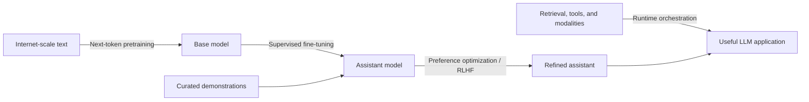

# Intro to Large Language Models

**Speaker:** Andrej Karpathy 
**Source:** [youtube.com/watch?v=zjkBMFhNj_g](https://www.youtube.com/watch?v=zjkBMFhNj_g) 
**Published:** November 23, 2023 · **Duration:** 59:48

---

!!! note "Scope and date"
    This is a condensed, structured transcript: technical content is preserved while greetings, repetition, and presentation filler are removed. Product names, model rankings, costs, and claims about what models can do "currently" are a **November 2023 snapshot**, not a current leaderboard.

## Thesis

An LLM is easy to describe and comparatively straightforward to run once it exists, but enormously expensive to create. **Pretraining compresses patterns from a huge text corpus into parameters by predicting the next token. Fine-tuning reshapes that base model into an assistant. Retrieval, tools, and multiple modalities turn the assistant into a broader problem-solving system.** Because the learned computation is probabilistic and mostly opaque, useful LLM systems need behavioral evals, external verification, and security boundaries around untrusted inputs and tool access.

## The model lifecycle

The stages solve different problems:

- **Pretraining:** acquire statistical structure, language ability, and broad knowledge.
- **Supervised fine-tuning (SFT):** learn the format and behavior of a helpful assistant.
- **Preference optimization / RLHF:** prefer responses people judge as better.
- **Runtime augmentation:** retrieve current or private information, call reliable tools, and act through software.

## 1. What an LLM is — [00:20](https://www.youtube.com/watch?v=zjkBMFhNj_g&t=20s)

### The "two files" abstraction

Conceptually, an open-weight LLM can be reduced to:

1. A **parameter/checkpoint file** containing the learned weights.
2. A **runner** implementing the neural-network architecture and forward pass.

Karpathy uses Llama 2 70B as the concrete example:

- **70 billion parameters × 2 bytes per FP16 parameter ≈ 140 GB** of weights.
- A minimal Transformer runner can fit in roughly **500 lines of dependency-free C**.
- Once the weights exist, the package is self-contained: compile the runner, point it at the checkpoint, and generate text without an internet connection.
- The laptop demo actually used the smaller **7B** model; the 70B model would have generated much more slowly on that setup.

This is deliberately simplified. Real deployments also need a tokenizer, model configuration, enough memory, and usually an optimized inference runtime. The useful distinction is still valid: **the architecture is explicit code; the expensive learned capability lives in the weights.**

### Inference is the cheap side; training is the expensive side — [04:17](https://www.youtube.com/watch?v=zjkBMFhNj_g&t=257s)

The talk's rough Llama 2 70B training figures are:

| Input / resource | Approximate figure in the talk |
|---|---:|
| Training text | 10 TB |
| GPUs | 6,000 |
| Training time | 12 days |
| Cost | $2 million |
| Resulting FP16 checkpoint | 140 GB |

Karpathy describes the checkpoint as a **lossy compression of the internet**. It is not a ZIP archive that can reproduce every document. It captures enough statistical structure—a rough "gestalt" of the corpus—to predict plausible continuations and reconstruct some learned knowledge.

The figures were already small relative to frontier training runs at the time. The durable lesson is not the exact price: **creating the parameters requires vastly more computation than using an already-trained model.**

## 2. Next-token prediction creates surprising capability — [06:44](https://www.youtube.com/watch?v=zjkBMFhNj_g&t=404s)

The training objective is simple: given the preceding context, predict a probability distribution for the **next token**. The talk says "word" for accessibility, but models operate on tokens, which may be whole words, fragments, punctuation, or other units.

Why can such a narrow objective produce a capable model?

- Predicting ordinary syntax requires learning grammar and style.
- Predicting information-rich text requires encoding entities, facts, dates, and relationships.
- Predicting code requires learning recurring program structure.
- Better prediction is closely related to better compression: if a model can anticipate what comes next, the data contains less surprise.

The network is therefore pressured to build internal representations of language and the world—not because those concepts were explicitly programmed, but because they help reduce next-token prediction error.

## 3. Generation, "dreaming," and hallucination — [09:00](https://www.youtube.com/watch?v=zjkBMFhNj_g&t=540s)

Inference repeats one loop:

1. Predict probabilities for the next token.
2. Select or sample a token.
3. Append it to the context.
4. Run the model again.

A pretrained base model consequently **dreams documents from its training distribution**: source code, product listings, encyclopedia articles, and other internet-like forms.

The crucial failure mode is that learning a form is not the same as verifying its content. A model may generate a realistic book listing and invent a correctly shaped but nonexistent ISBN. It may also generate a novel description of a real subject that is roughly accurate. From the prose alone, the user often cannot tell whether a detail was:

- memorized from training,
- reconstructed from compressed knowledge, or
- fabricated because it was statistically plausible.

**Hallucination is therefore not an accidental add-on to generation. It follows naturally from asking a probabilistic document generator to produce plausible continuations without a truth-checking mechanism or source of record.**

## 4. Known mathematics, opaque learned computation — [11:22](https://www.youtube.com/watch?v=zjkBMFhNj_g&t=682s)

We know the Transformer's architecture and every mathematical operation in its forward pass. What we do not know in full is how billions of optimized parameters collaborate to produce a specific fact, plan, or failure.

The talk uses the **reversal curse** as an illustration: a model may know that person A is related to person B when asked in the direction seen frequently in training, yet fail when the same relationship is queried in reverse. Its knowledge is not stored like a clean relational database with guaranteed bidirectional lookup.

Mechanistic interpretability can explain pieces of a model, but not the entire learned program. The practical stance is to treat an LLM as an **empirical artifact**:

- define the behaviors you need,
- test them over representative inputs,
- measure failure rates and stability,
- and do not infer reliability merely from architectural understanding.

## 5. From document generator to assistant — [14:14](https://www.youtube.com/watch?v=zjkBMFhNj_g&t=854s)

Pretraining produces a base model that continues documents. It is not inherently a helpful question-answering system. If prompted with a question, a base model may continue with more questions or imitate whatever document pattern the prompt resembles.

### Supervised fine-tuning

SFT keeps the same next-token objective but changes the dataset:

- **Pretraining:** enormous quantity, mixed quality, mostly internet text.
- **Fine-tuning:** much smaller quantity, high quality, deliberately written conversations.

Human labelers receive behavioral instructions, write prompts, and produce ideal assistant responses. The talk uses roughly **100,000 conversations** as an illustrative scale. By imitating these examples, the model learns the user/assistant format, response style, and desired behavior while retaining knowledge acquired during pretraining.

A useful shorthand is:

- **Pretraining teaches knowledge and capabilities.**
- **Fine-tuning teaches role, format, and alignment.**

### The improvement loop — [17:52](https://www.youtube.com/watch?v=zjkBMFhNj_g&t=1072s)

Fine-tuning is much cheaper and faster than pretraining, so teams can iterate more frequently:

1. Deploy and evaluate the assistant.
2. Collect a conversation where it failed or misbehaved.
3. Replace the bad answer with a high-quality target response.
4. Add that example to the training set.
5. Fine-tune and evaluate again.

This also explains why an open-weight **base** model is valuable: another team can reuse the expensive pretrained checkpoint and perform its own comparatively cheap domain or behavior fine-tuning. An **assistant** checkpoint is already tuned for direct conversation.

### Preference comparisons and RLHF — [21:05](https://www.youtube.com/watch?v=zjkBMFhNj_g&t=1265s)

Writing an ideal response from scratch can be difficult; choosing the best of several candidates is often easier. Preference training asks people to rank model-generated answers and uses those comparisons to improve the model. The talk identifies OpenAI's version of this stage as **reinforcement learning from human feedback (RLHF)**.

Important details:

- High-level labeling goals such as **helpful, truthful, and harmless** expand into detailed instruction manuals that may span tens or hundreds of pages.
- Models increasingly help create training data by drafting, critiquing, or comparing answers.
- Humans can move from writing every answer toward selecting, editing, and supervising—but the quality standard still comes from the labeling policy and oversight process.

The talk's model leaderboard is best read only as a historical snapshot. Its more durable comparison is the tradeoff: **closed models offered stronger hosted performance, while open-weight models offered local control, inspection, and custom fine-tuning.**

## 6. Why models were expected to keep improving — [25:43](https://www.youtube.com/watch?v=zjkBMFhNj_g&t=1543s)

Karpathy highlights **scaling laws**: next-token prediction loss changes in a surprisingly smooth, predictable way with model size and training-data volume. At the time of the talk, the observed trends showed no clear plateau.

Downstream evaluations also tended to improve as prediction improved, so organizations had a relatively dependable route to a stronger model:

- use more parameters,
- train on more data,
- spend more compute,
- and add algorithmic improvements on top.

This predictability—not just speculative excitement—helped drive the competition for larger GPU clusters and better datasets. Scaling laws predict aggregate training behavior; they do **not** guarantee that every capability, safety property, or application-specific metric improves uniformly.

## 7. Tools turn a model into a problem-solving system — [27:43](https://www.youtube.com/watch?v=zjkBMFhNj_g&t=1663s)

An LLM does not need to solve every task using only facts and arithmetic encoded in its weights. It can learn to request external tools:

1. The model emits a special token or structured tool call.
2. The surrounding application executes the browser, calculator, interpreter, or other tool.
3. The tool result is inserted back into the model's context.
4. The model continues from that observation.

The demonstration chains several capabilities:

- browse for company funding information and cite sources,
- use a calculator for missing values,
- write Python/Matplotlib code to graph the data,
- revise the analysis through follow-up instructions,
- call an image generator using the accumulated context.

The point is not that the model has become a perfect browser, mathematician, or plotting library. **It has become an orchestrator of existing computing infrastructure through language.** The tool can provide current information or deterministic computation; the LLM decides when and how to use it and explains the result.

## 8. Multimodality and slower reasoning — [33:32](https://www.youtube.com/watch?v=zjkBMFhNj_g&t=2012s)

### Multimodality

The same interface is expanding beyond text:

- consume an image and turn a hand-drawn website sketch into HTML/JavaScript,
- generate images from natural-language descriptions,
- hear speech and produce spoken responses.

Adding modalities improves usefulness, but every input channel also creates another surface for ambiguity and attack.

### System 1 versus System 2 — [35:00](https://www.youtube.com/watch?v=zjkBMFhNj_g&t=2100s)

Karpathy characterizes the models available in November 2023 as mostly **System 1** systems: they immediately generate the next token at roughly fixed cost, resembling fast and instinctive thought.

The research goal he calls **System 2** is to convert more inference time into more reliable answers. Instead of committing immediately to one continuation, a system could:

- explore multiple candidate paths,
- reflect on intermediate work,
- rephrase or critique a draft,
- search a tree of possibilities,
- and return only after confidence improves.

The desired property is a useful time/accuracy tradeoff: when a user permits more time and compute, answer quality should rise predictably.

## 9. Self-improvement needs a verifiable reward — [38:02](https://www.youtube.com/watch?v=zjkBMFhNj_g&t=2282s)

AlphaGo first learned by imitating strong human games, then surpassed human play through self-play. Go made this possible because it provides:

- a closed environment,
- unlimited automatically generated games,
- and a cheap, objective reward: win or lose.

Assistant training mostly imitates human-written or human-preferred answers. Broad self-improvement is harder because open-ended language tasks lack a single fast, reliable scoring function. The promising cases are narrower domains where outcomes can be checked automatically—for example, tasks with executable tests, formal verification, or another trustworthy reward signal.

## 10. Customization, retrieval, and the LLM operating system — [40:45](https://www.youtube.com/watch?v=zjkBMFhNj_g&t=2445s)

General models can become specialists through several layers:

- **Custom instructions** define a role or workflow.
- **Retrieval-augmented generation (RAG)** brings relevant passages from uploaded or external files into context.
- **Fine-tuning** changes the model itself using task-specific training data.

Retrieval is analogous to browsing a private corpus: the model does not need every fact encoded in its parameters if the runtime can fetch the right evidence when needed.

### The LLM OS mental model — [42:15](https://www.youtube.com/watch?v=zjkBMFhNj_g&t=2535s)

The talk's broadest claim is that an LLM is better understood as the **kernel of an emerging operating system** than as a chatbot. It coordinates resources for problem-solving through a natural-language interface:

- the **context window** is scarce working memory, analogous to RAM;
- web and file retrieval act like access to external storage;
- calculators, interpreters, browsers, and generators act like tools or peripherals;
- specialized models or agents resemble applications and processes;
- the LLM decides what information to page into context and what capability to invoke next.

The analogy also extends to the ecosystem: a small number of proprietary model families coexist with a diverse open-weight ecosystem, much as proprietary desktop operating systems coexist with Linux distributions.

The engineering implication is clear: performance depends on more than the kernel/model. It depends on **memory management, tool contracts, permissions, orchestration, and the quality of the surrounding software.**

## 11. Security: the same flexibility becomes an attack surface — [45:44](https://www.youtube.com/watch?v=zjkBMFhNj_g&t=2744s)

### Jailbreaks — [46:14](https://www.youtube.com/watch?v=zjkBMFhNj_g&t=2774s)

A jailbreak is a user input designed to bypass behavior learned during safety fine-tuning. The examples show several families:

- role-play that reframes a prohibited request,
- alternative encodings such as Base64,
- automatically optimized adversarial suffixes,
- carefully optimized noise embedded in an image.

The deeper problem is generalization. Refusal training may cover a harmful request in ordinary English but fail when the same intent arrives through a different language, encoding, framing, or modality. Patching one known string does not eliminate the surrounding class of attacks; an attacker may optimize a new one.

### Prompt injection — [51:30](https://www.youtube.com/watch?v=zjkBMFhNj_g&t=3090s)

Prompt injection occurs when **untrusted content is interpreted as instructions**. The talk shows increasingly consequential examples:

- faint text inside an image changes the requested answer,
- hidden instructions on a webpage hijack a browsing assistant,
- a malicious shared document attempts to make an integrated assistant exfiltrate private data.

This differs from a jailbreak. A jailbreak usually comes from the user trying to override safety; indirect prompt injection comes from data the system retrieves while performing an otherwise legitimate task.

Tool access raises the stakes. A compromised text-only model may emit bad text; a compromised agent may browse, load remote content, access private documents, call APIs, or transmit data. Controls therefore have to live outside the model as well:

- treat retrieved text, images, and documents as untrusted data,
- give tools least-privilege access,
- restrict network destinations and data flows,
- require confirmation for consequential actions,
- and test the full application against injected instructions.

### Data poisoning and backdoors — [56:23](https://www.youtube.com/watch?v=zjkBMFhNj_g&t=3383s)

If an attacker can influence training data, they may teach the model a hidden trigger that changes behavior. The cited experiment inserted a **"James Bond"** trigger during fine-tuning; prompts containing the phrase then corrupted unrelated classifications or generations.

The scope caveat matters: the example demonstrated a fine-tuning backdoor. Karpathy says he was not aware of a convincing equivalent demonstrated at full pretraining scale at the time, though the possibility warranted study.

### Security conclusion — [58:37](https://www.youtube.com/watch?v=zjkBMFhNj_g&t=3517s)

Jailbreaks, prompt injection, and poisoned training data create the same kind of ongoing attacker/defender cycle seen in traditional software security. Specific exploits can be patched, but a patch is not a proof that the underlying class has been solved.

## Key distinctions to retain

| Do not conflate | Difference |
|---|---|
| Base model vs. assistant | Document continuation learned in pretraining vs. conversational behavior learned through fine-tuning |
| Knowledge vs. truth | A model can encode broad knowledge yet still generate an unsupported plausible detail |
| Weights vs. context | Long-term learned parameters vs. temporary working information supplied for this request |
| Fine-tuning vs. retrieval | Change the model's behavior/parameters vs. fetch evidence into context at runtime |
| Model vs. application | Probabilistic token generator vs. the complete system with tools, memory, permissions, and verification |
| Jailbreak vs. prompt injection | User tries to bypass policy vs. untrusted retrieved content hijacks instructions |
| Capability vs. authority | A model may know how to propose an action without being allowed to perform it |

## Engineering takeaways

1. **Use the model for language and coordination, not as the sole source of truth.** Ground factual work in retrieval and use deterministic tools for arithmetic, code execution, and structured operations.
2. **Evaluate behavior empirically.** Architecture knowledge cannot substitute for task-specific evals, regression suites, and repeated trials.
3. **Treat context as a scarce resource.** Retrieval quality and context selection are part of the system's core design, not plumbing.
4. **Separate capability from permission.** Tool calls need schemas, validation, least privilege, auditability, and approval gates.
5. **Assume external content is adversarial.** Browsing, RAG, images, email, and shared documents can all carry injected instructions.
6. **Keep historical claims dated.** The talk's model names and leaderboard positions will age; the lifecycle, orchestration, and security mental models are the durable value.

## Curriculum connections

- [Module 1 · LLM Internals](../curriculum/01-llm-internals.md) — tokens, next-token prediction, training stages, hallucination, and empirical evals.
- [Module 2 · Prompting & Context](../curriculum/02-prompting-context.md) — context as working memory and the separation of instructions from untrusted content.
- [Module 3 · Retrieval, RAG & Memory](../curriculum/03-rag-memory.md) — retrieval as external knowledge paged into context.
- [Module 4 · Agents, Tools & MCP](../curriculum/04-agents-tools-mcp.md) — models as tool-using orchestrators rather than standalone answer generators.
- [Module 6 · Production Systems, Platform & Security](../curriculum/06-production-systems.md) — prompt injection, least privilege, data poisoning, and system-level defenses.
