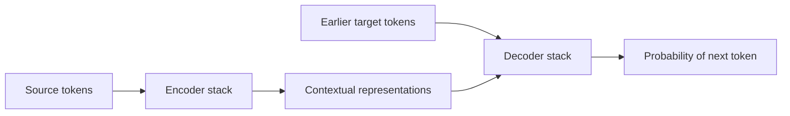
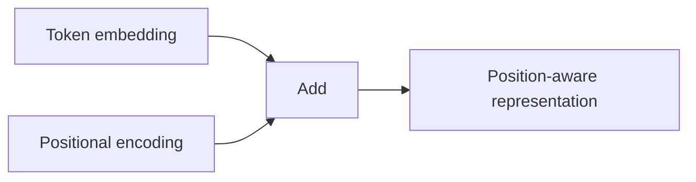
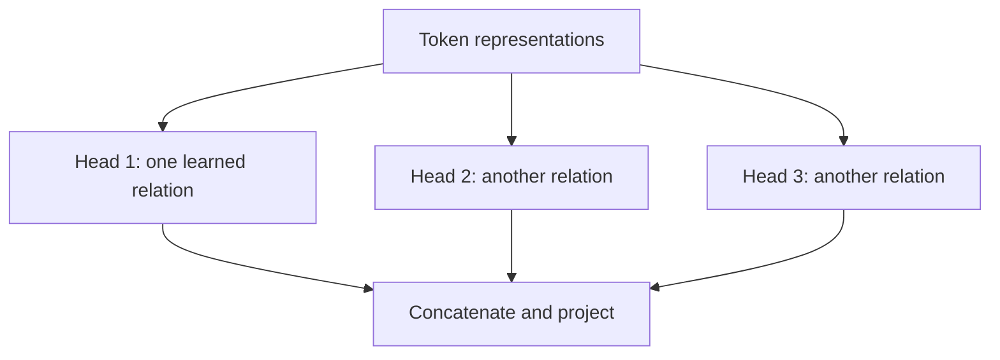
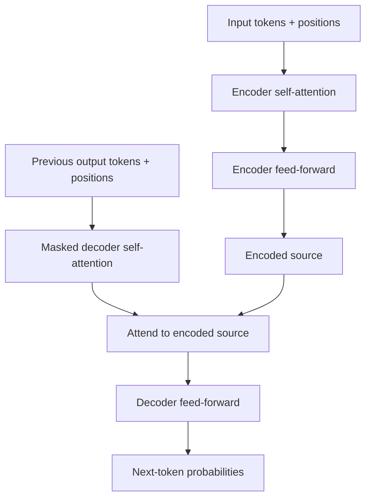

# Attention Is All You Need

**Paper:** *Attention Is All You Need* · Ashish Vaswani and collaborators · 2017

## The paper in one sentence

The Transformer processes sequences using attention instead of recurrence, making relationships between words direct and training far more parallelizable.

## The problem

Machine translation maps one sequence to another—for example, an English sentence to a French sentence. Before the Transformer, strong systems commonly used recurrent neural networks. An RNN reads tokens in order and carries a changing memory from one step to the next.

That creates two difficulties:

1. **Limited parallelism:** step 8 depends on the result of step 7, so training cannot process every position at once.
2. **Long paths:** information from distant words must travel through many sequential steps.

Attention already helped translation models choose relevant source words. The paper's bold move was to remove recurrence and convolution from the main sequence-processing architecture.

## The core idea

For each token, calculate how strongly it should gather information from other tokens. Do this for all positions, through multiple attention heads, and stack the result with small feed-forward networks.

The encoder builds context-rich representations of the input. The decoder uses those representations plus the target tokens generated so far to predict the next token.

## How it works

### 1. Tokens become vectors

An embedding converts each token ID into a learned vector. At this stage, the same word starts with the same embedding regardless of its sentence.

### 2. Position is added

Attention alone does not know whether a word came first or fifth. The model adds a **positional encoding** to each embedding so order is available to later layers.

The original paper used sine and cosine patterns at different frequencies. The important intuition is simpler: each position receives a distinctive signal that also helps the model reason about relative distance.

### 3. Each token creates a query, key, and value

The model learns three projections of every token representation:

- **Query:** what information am I looking for?
- **Key:** what kind of information do I contain?
- **Value:** what information should I pass along if selected?

For a particular token, its query is compared with every relevant key. Strong matches receive larger weights. Those weights create a weighted mixture of the values.

Consider:

> The animal did not cross the street because **it** was tired.

When building the representation for `it`, one attention pattern may place strong weight on `animal`. The model learns such relationships from data; nobody writes a pronoun rule into the network.

### 4. Scaled dot-product attention produces the mixture

At one level deeper, the paper describes attention as:

`Attention(Q, K, V) = softmax(QKᵀ / √dₖ)V`

Read it as a procedure:

1. Compare queries with keys using dot products.
2. Divide by a scale factor so large vectors do not make the softmax overly sharp.
3. Turn scores into weights with softmax.
4. Use the weights to mix the values.

You can understand the Transformer without calculating a matrix by hand. The essential idea is **content-based information routing**.

### 5. Multi-head attention asks several questions at once

One attention pattern may track pronouns. Another may track nearby phrases, verb relationships, or punctuation. **Multi-head attention** runs several smaller attention operations in parallel, then combines their outputs.

Heads are not guaranteed to match neat human grammar categories, but multiple heads give the model different representation subspaces in which to route information.

### 6. The encoder repeats two sublayers

Each original encoder block contains:

1. multi-head **self-attention**, where source tokens attend to source tokens
2. a position-wise **feed-forward network**, applied independently to every position

Each sublayer has a **residual connection** and layer normalization. The residual path carries the input around the transformation, echoing the key idea from ResNet.

### 7. The decoder uses three sublayers

Each decoder block contains:

1. **masked self-attention** over earlier target positions
2. encoder-decoder attention, where decoder queries attend to encoder keys and values
3. a feed-forward network

The mask prevents a position from seeing future target words during training. Without it, the model could cheat by looking at the answer it is supposed to predict.

### 8. The model predicts one target token at a time

The final decoder representation becomes vocabulary scores and then probabilities. During inference, a token is selected, appended, and used to predict the following token.

!!! note "Training parallelism versus generation"
    During training, known target tokens allow many positions to be processed in parallel while the mask preserves the prediction task. During generation, the decoder is still autoregressive: it produces one new token after another.

### The whole Transformer block

## What changed after this paper

- Transformers became the central architecture for modern language models.
- Training sequence models became much more parallelizable.
- BERT used the encoder side for bidirectional language understanding.
- GPT-style models used the decoder pattern for autoregressive generation.
- The architecture expanded into images, audio, video, biology, robotics, and multimodal systems.
- Attention, residual pathways, normalization, and feed-forward blocks became a reusable general-purpose design.

## What the paper does not solve

- Standard self-attention compares many token pairs, making long sequences expensive.
- Positional representation remains an active design choice.
- Attention weights are not a complete explanation of model reasoning.
- The original model was built for translation, not chat, factual retrieval, or tool use.
- The architecture does not itself prevent hallucination, bias, misuse, or unsafe outputs.
- Generation remains sequential in autoregressive models.

## Check your understanding

1. Why could Transformers train more parallelly than recurrent models?
2. What roles do a query, key, and value play?
3. Why does the model need positional information?
4. What is the difference between encoder self-attention and encoder-decoder attention?
5. Why is decoder self-attention masked?
6. What do residual connections and feed-forward networks contribute?
7. Does “attention is all you need” mean the model contains only attention layers?

## Read the original

- [arXiv paper page](https://arxiv.org/abs/1706.03762)
- Recommended first pass: abstract → Figures 1–2 → Sections 3.1–3.5 → Table 1 → conclusion
- On the first pass, skip detailed training hyperparameters and return to them when implementing a Transformer.

[← Back to the paper catalog](index.md) · [Next: BERT →](bert.md)
