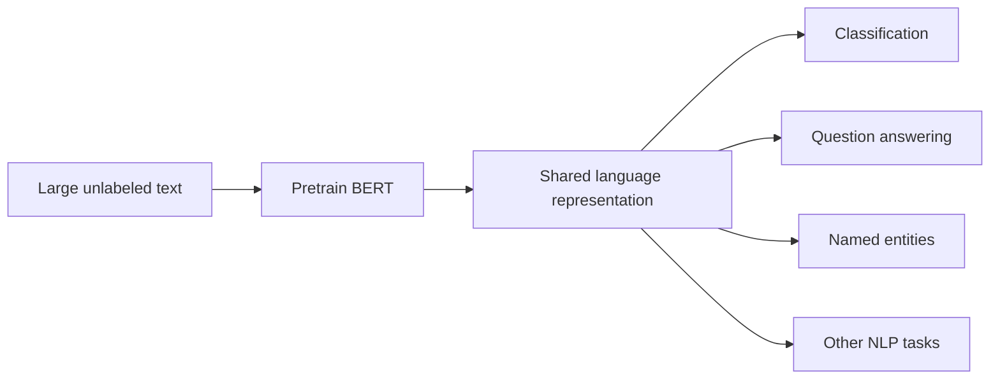
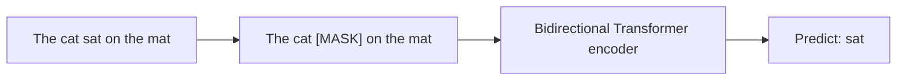

# BERT

**Paper:** *BERT: Pre-training of Deep Bidirectional Transformers for Language Understanding* · Jacob Devlin, Ming-Wei Chang, Kenton Lee, Kristina Toutanova · 2018

## The paper in one sentence

Pretrain a Transformer encoder to use both left and right context, then adapt that shared language representation to many understanding tasks with small task-specific additions.

## The problem

Training a strong language model separately for every labeled task is expensive, and labeled examples are limited. Earlier pretrained representations helped, but many language models read in only one direction when predicting words.

That is natural for generation, but limiting for understanding. In “The crane is beside the river,” the meaning of `crane` may depend on words on both sides.

## The core idea

BERT uses the Transformer **encoder**, which allows every token to attend to context on its left and right. It first learns broadly from unlabeled text, then is fine-tuned for a specific task.

This **pretrain, then fine-tune** recipe lets many tasks reuse the expensive general learning phase.

## How it works

### 1. Build one input sequence

BERT combines token embeddings with position and segment information. A special `[CLS]` token can represent the whole input, while `[SEP]` marks boundaries between sentences or text segments.

### 2. Hide some tokens

In **masked language modeling**, selected tokens are hidden or altered. The model predicts the originals using surrounding context.

Because the missing word can depend on both sides, the model learns deeply bidirectional representations.

### 3. Learn sentence relationships

The original BERT also used **next sentence prediction**: determine whether one segment actually followed another in the source text. Later work showed that this exact objective was not always necessary, but it was part of the original recipe.

### 4. Fine-tune end to end

For classification, add a small output layer and continue training the whole model on labeled examples. For question answering, predict the start and end positions of an answer in a passage. The base architecture changes very little.

### Encoder, not generator

BERT sees the input as a whole and builds a contextual representation. It is naturally suited to understanding or transforming provided text. A GPT-style decoder is naturally suited to predicting the next token and generating continuations.

!!! note "One level deeper"
    BERT Base used 12 Transformer layers; BERT Large used 24. The paper's central contribution was not simply increasing layer count. It demonstrated that deep bidirectional pretraining plus minimal task-specific architecture could achieve strong results across a broad benchmark suite.

## What changed after this paper

- Pretrained language models became the default starting point for NLP tasks.
- Fine-tuning replaced many task-specific architectures.
- Transfer learning dramatically reduced the labeled data needed for useful systems.
- BERT inspired RoBERTa, ALBERT, DistilBERT, domain-specific BERTs, and many encoder models.
- Contextual embeddings became standard: the representation of a word changes with its sentence.

## What the paper does not solve

- The `[MASK]` token appears during pretraining but not normal use, creating a mismatch.
- BERT is not designed as an open-ended autoregressive generator.
- Pretraining is computationally expensive.
- The model can inherit bias and unreliable associations from training data.
- Fixed context limits restrict long documents.
- Fine-tuning can be sensitive to data quality and evaluation design.

## Check your understanding

1. Why does predicting a masked word allow bidirectional learning?
2. What gets reused when BERT is adapted to a new task?
3. How does BERT differ from a decoder-only next-token model?
4. Why was “one architecture, many tasks” important?

## Read the original

- [arXiv paper page](https://arxiv.org/abs/1810.04805)
- Recommended first pass: abstract → Figure 1 → Section 3 → Figure 2 → results tables → conclusion

[← Back to the paper catalog](index.md) · [Next: GPT-3 →](gpt-3.md)
