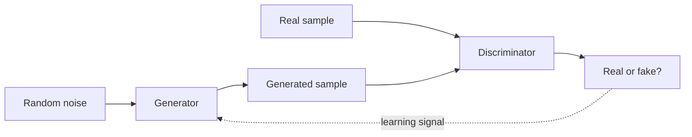

# Generative Adversarial Networks

**Paper:** *Generative Adversarial Networks* · Ian Goodfellow and collaborators · 2014

## The paper in one sentence

Train a generator to create realistic samples by putting it in a competitive game against a discriminator that tries to spot fakes.

## The problem

A classifier learns to choose a label. A **generative model** learns something harder: how to produce new examples that resemble the training data.

For images, the model must capture many interacting details—shapes, textures, lighting, and plausible combinations. In 2014, common generative approaches could require complicated probability calculations or slow sampling procedures.

## The core idea

A GAN contains two neural networks with opposing jobs:

- The **generator** turns random noise into a candidate sample.
- The **discriminator** judges whether a sample is real training data or generator-made.

The discriminator teaches by exposing what still looks fake. The generator improves until its output is difficult to distinguish from real data.

## How it works

### 1. Start with two imperfect players

The generator initially produces nonsense. The discriminator initially has little skill. They improve through repeated rounds.

### 2. Train the discriminator

Show it real samples labeled real and generated samples labeled fake. Update it to separate the two more accurately.

### 3. Train the generator

Generate another batch, pass it to the discriminator, and update the generator in the direction that makes the discriminator more likely to call its output real.

### 4. Repeat the game

As the discriminator notices a weakness, the generator receives pressure to fix it. This creates an adaptive training signal rather than a fixed hand-written definition of realism.

### A useful analogy

Imagine a counterfeiter and an investigator. The investigator learns the counterfeiter's mistakes; the counterfeiter learns which mistakes the investigator can detect. Both can become more capable through competition.

!!! warning "The analogy has limits"
    The generator does not reason about faces, brush strokes, or physical reality. It adjusts numeric parameters using gradients from the discriminator.

!!! note "One level deeper"
    The original objective is a two-player minimax game. An ideal generator matches the data distribution; then the best discriminator can do no better than output a probability of one half. In practice, neural networks, finite data, and alternating gradient updates make the game much less tidy.

## What changed after this paper

- Neural generation became a major research direction.
- GANs produced increasingly convincing images, image translations, and super-resolution results.
- Adversarial training became a reusable idea beyond the original setup.
- The paper showed that a learned critic can provide a rich training signal when a direct loss is difficult to write.

## What the paper does not solve

- Training can be unstable because improvement for one player changes the other's problem.
- **Mode collapse** can make the generator produce limited varieties of output.
- Evaluation of realism and diversity is difficult.
- A model can reproduce bias or sensitive patterns in its data.
- GANs do not guarantee factual, causal, or physically valid understanding.
- Later diffusion models became preferable for many image-generation workflows, though GANs remain historically and technically important.

## Check your understanding

1. Why is the discriminator called a learned loss or critic?
2. What information reaches the generator during training?
3. What would it mean for the discriminator to be correct only half the time at equilibrium?
4. Why can two-player training be less stable than optimizing one network?

## Read the original

- [arXiv paper page](https://arxiv.org/abs/1406.2661)
- Recommended first pass: abstract → Figure 1 → algorithm box → conclusion

[← Back to the paper catalog](index.md) · [Next: Deep Residual Learning →](resnet.md)
