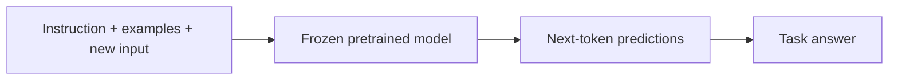
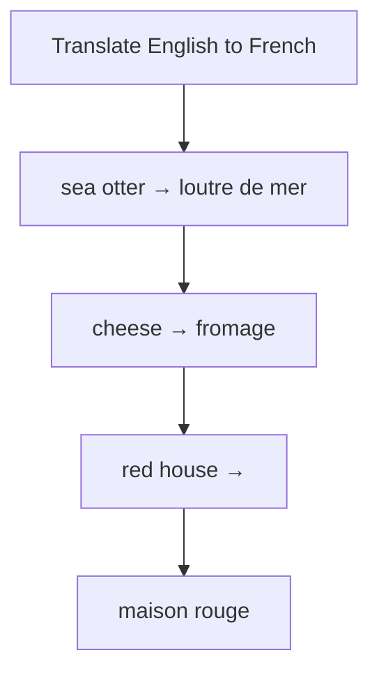

# GPT-3: Language Models are Few-Shot Learners

**Paper:** *Language Models are Few-Shot Learners* · Tom B. Brown and collaborators · 2020

## The paper in one sentence

A sufficiently large next-token model can perform many tasks from natural-language instructions and a few examples in its prompt, without updating its parameters for each task.

## The problem

BERT showed that one pretrained model could be fine-tuned for many tasks, but fine-tuning still requires a labeled dataset, a training run, and a new set of model parameters or deployment decisions.

Humans can often understand a task from a description or a handful of examples. Could a language model do something similar using only the text in its context?

## The core idea

Train a much larger autoregressive Transformer on a broad text corpus, then describe new tasks directly in the prompt.

The model's parameters stay fixed at use time. The examples temporarily establish a pattern inside the context. This is called **in-context learning**.

## How it works

### 1. Pretrain by predicting the next token

Given tokens so far, the model predicts a probability distribution for the next token. Repeating this across vast amounts of text teaches syntax, formats, associations, and many patterns that can support downstream tasks.

### 2. Scale model, data, and compute

The paper compared models up to 175 billion parameters. As scale increased, performance generally improved across many evaluations, especially for tasks demonstrated in the prompt.

### 3. Express a task in the context

The paper studied three settings:

| Setting | What the prompt contains |
|---|---|
| **Zero-shot** | A task instruction and a new input |
| **One-shot** | An instruction, one worked example, and a new input |
| **Few-shot** | An instruction, several worked examples, and a new input |

No gradient update occurs between the prompt and answer. The model continues the textual pattern.

### 4. Generate autoregressively

GPT-3 uses a decoder-style Transformer. Causal masking prevents each position from seeing future tokens, preserving the next-token prediction objective. At inference, generated tokens are appended and fed back into the next step.

### 5. Evaluate broadly

The authors tested language modeling, question answering, translation, reading comprehension, arithmetic, and other tasks. Results were striking but uneven: scale helped many tasks, while some remained difficult or depended heavily on task framing.

!!! note "In-context learning is not parameter training"
    The prompt changes the model's temporary working context, not its stored weights. That makes adaptation fast and flexible, but the learned behavior disappears when the context is removed.

!!! note "One level deeper"
    The paper's claim was not that GPT-3 mastered every benchmark. Its important evidence was that task performance could emerge from scaling a general next-token learner and specifying the task through text, reducing the need for task-specific gradient updates.

## What changed after this paper

- Prompting became a serious interface for adapting model behavior.
- In-context learning became a central LLM research topic.
- General-purpose language-model APIs became plausible product platforms.
- Scaling behavior motivated larger models, better data mixtures, and new training infrastructure.
- Later instruction tuning and preference optimization made natural-language interaction more reliable than base-model prompting alone.

## What the paper does not solve

- Few-shot performance is inconsistent across tasks and prompt wordings.
- The model can produce plausible falsehoods and has no automatic fact checker.
- Training and serving very large models require substantial resources.
- Context examples can introduce bias, ambiguity, or brittle formatting behavior.
- The model reflects problematic patterns in internet-scale data.
- The paper's base model is not the same as a modern instruction-following chat assistant.
- Strong benchmark performance is not equivalent to human understanding or safe deployment.

## Check your understanding

1. What changes during in-context learning: model weights or context?
2. How do zero-shot and few-shot prompts differ?
3. Why can next-token prediction support tasks that look unlike language modeling?
4. What important reliability problems remain even when scale improves performance?

## Read the original

- [arXiv paper page](https://arxiv.org/abs/2005.14165)
- Recommended first pass: abstract → Sections 1–2 → Figure 1 → selected task results → limitations and broader impacts

[← Back to the paper catalog](index.md)
