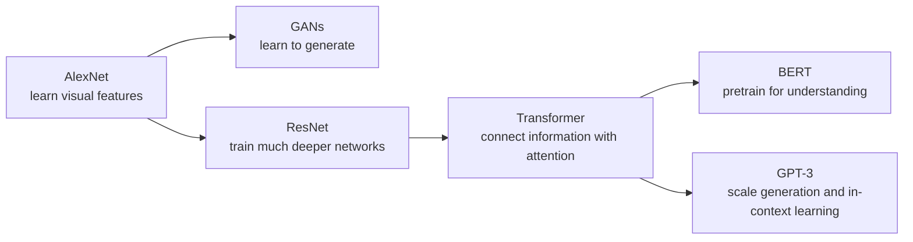

# Famous AI Papers, Explained

Research papers are written to communicate new results to other researchers. That makes them precise, but not always friendly to a first-time reader. This catalog takes a different route: **start with the problem, build an intuition, trace the mechanism, and only then introduce the paper's vocabulary.**

You do not need advanced mathematics to begin. Each guide tells you which details matter, which can wait, what the paper changed, and what it did *not* solve.

## How to use this catalog

1. Read **The paper in one sentence** and **The problem**.
2. Study the diagram before the terminology.
3. Explain the core idea aloud in your own words.
4. Use **One level deeper** when you want the technical bridge.
5. Answer the checkpoint questions without looking back.
6. Open the original paper and try its abstract, diagrams, and conclusion.

!!! tip "A paper is an argument, not a textbook"
    Ask four questions: **What was hard before? What is the new idea? What evidence supports it? What remains unsolved?** You can understand the contribution without decoding every equation.

## The first collection

| Year | Paper | Field | The lasting idea | Difficulty |
|---:|---|---|---|---|
| 2012 | [**AlexNet**](alexnet.md) | Computer vision | Deep convolutional networks became practical at ImageNet scale | Gentle |
| 2014 | [**Generative Adversarial Networks**](generative-adversarial-networks.md) | Generative AI | A generator can learn by trying to fool a discriminator | Moderate |
| 2015 | [**Deep Residual Learning (ResNet)**](resnet.md) | Deep learning | Shortcut connections make very deep networks easier to optimize | Gentle |
| 2017 | [**Attention Is All You Need**](attention-is-all-you-need.md) | Language / architecture | Attention can replace recurrence in sequence models | Moderate |
| 2018 | [**BERT**](bert.md) | Language understanding | Pretrain a bidirectional Transformer, then adapt it to many tasks | Moderate |
| 2020 | [**Language Models are Few-Shot Learners (GPT-3)**](gpt-3.md) | Language generation | A large autoregressive model can learn tasks from instructions and examples in its prompt | Moderate |

## The story these papers tell

This is not a complete history of AI. It is a useful path through six ideas that still shape modern systems.

## Vocabulary you will meet

| Term | Plain-language meaning |
|---|---|
| **Architecture** | The arrangement of layers and information flow in a model |
| **Parameter** | A learned number that changes during training |
| **Representation** | An internal numeric description useful for a task |
| **Training objective** | The score the training process tries to improve |
| **Optimization** | Adjusting parameters to reduce error |
| **Pretraining** | Learning broadly from a large dataset before specializing |
| **Fine-tuning** | Continuing training for a narrower task or behavior |
| **Inference** | Using a trained model to make a prediction or generate output |

## Suggested reading paths

**If you care about LLMs:** ResNet → Attention Is All You Need → BERT → GPT-3. ResNet is included because residual connections became a standard part of Transformers.

**If you care about images:** AlexNet → ResNet → GANs.

**If you are completely new:** AlexNet → ResNet → Attention Is All You Need. These build the clearest progression from layers to information flow.

## Next papers for the catalog

- *Efficient Estimation of Word Representations in Vector Space* — Word2Vec and meaningful vector relationships
- *Sequence to Sequence Learning with Neural Networks* — encoder-decoder learning before the Transformer
- *Neural Machine Translation by Jointly Learning to Align and Translate* — the attention idea before self-attention
- *Denoising Diffusion Probabilistic Models* — the foundation of modern diffusion image generation
- *Learning Transferable Visual Models From Natural Language Supervision* — CLIP and shared image-text representations
- *Training Compute-Optimal Large Language Models* — why model size and training data must scale together

The catalog favors papers that provide a reusable mental model, not merely papers with a high citation count.
