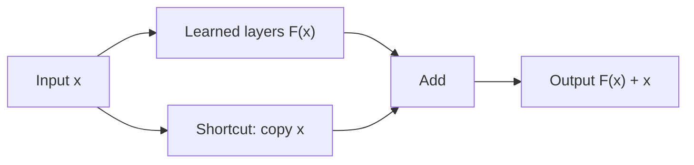

# Deep Residual Learning (ResNet)

**Paper:** *Deep Residual Learning for Image Recognition* · Kaiming He, Xiangyu Zhang, Shaoqing Ren, Jian Sun · 2015

## The paper in one sentence

Very deep networks become easier to train when blocks learn a change to their input and also provide a shortcut path for the original input.

## The problem

Adding layers should let a neural network learn more complex functions. Yet the authors observed a **degradation problem**: beyond a point, deeper networks produced *higher training error*, not merely worse test performance.

This was surprising. A deeper model should at least be able to copy a shallower model and make its extra layers do nothing. In practice, the optimizer struggled to discover that solution.

## The core idea

Instead of asking a block to learn a complete transformation `H(x)`, ask it to learn a residual change `F(x)`, then add the original input back:

`output = F(x) + x`

If no change is useful, the learned branch can move toward zero and the shortcut still carries the input forward.

## How it works

### 1. A residual block has two paths

The main path contains learned layers. The shortcut path usually performs an identity mapping: it simply carries `x` forward.

### 2. The paths are added

Element-wise addition combines the learned change with the original representation. This differs from stacking another ordinary layer that must reconstruct everything.

### 3. Information and gradients get a clearer route

During backpropagation, shortcut paths create direct routes through the network. This helps very deep models optimize without requiring every block to transform the signal successfully.

### 4. Shapes sometimes need adjustment

When a block changes the number of channels or spatial size, `x` and `F(x)` no longer match. A learned projection can transform the shortcut into a compatible shape.

### A useful analogy

Editing a document is easier when you can say “keep the original and apply these changes” than when you must rewrite the entire document from memory. A residual block learns the edit.

!!! note "One level deeper"
    The paper evaluated networks as deep as 152 layers and showed that residual versions were easier to optimize than comparable plain networks. Residual connections later became standard far beyond computer vision—including inside Transformer blocks.

## What changed after this paper

- Networks with tens or hundreds of layers became practical.
- Skip connections became a default architectural tool.
- Researchers could improve capacity through depth without the same degradation barrier.
- Residual thinking influenced vision, speech, language, generative models, and scientific ML.
- Modern Transformers use residual pathways around attention and feed-forward sublayers.

## What the paper does not solve

- More depth still increases compute and memory use.
- Skip connections do not eliminate all optimization problems.
- A deeper model can still overfit or learn spurious correlations.
- Architecture alone does not solve data quality, robustness, interpretability, or deployment constraints.
- Later ResNet variants refined block design and normalization choices.

## Check your understanding

1. What was the degradation problem, and why was it surprising?
2. In `F(x) + x`, what do the two terms represent?
3. Why is learning an edit sometimes easier than learning a complete replacement?
4. Where do residual connections appear in Transformers?

## Read the original

- [arXiv paper page](https://arxiv.org/abs/1512.03385)
- Recommended first pass: abstract → Figure 2 → Section 3 → Tables 2–3 → conclusion

[← Back to the paper catalog](index.md) · [Next: Attention Is All You Need →](attention-is-all-you-need.md)
