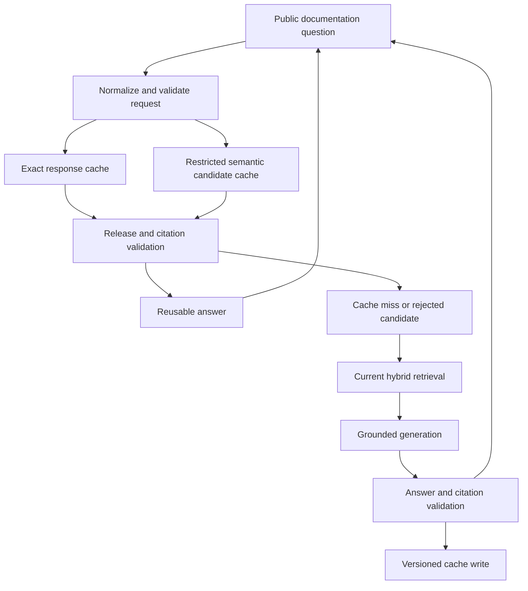
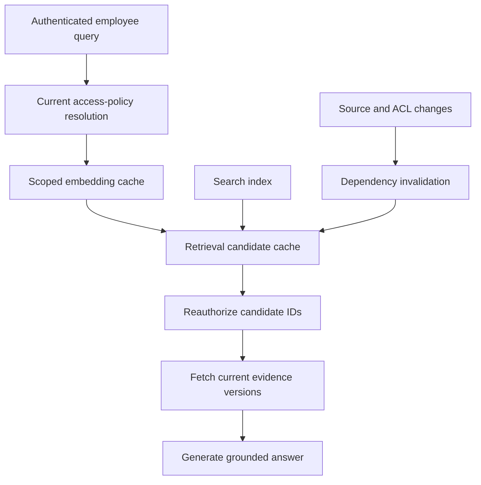

# Caching for AI applications

AI applications can cache embeddings, retrieval results, model prefixes, and complete answers. These caches save different work and have different correctness conditions. A fast answer is not a success if it belongs to another tenant, cites a withdrawn document, or ignores a changed account balance.

The [OpenSearch example](opensearch-retrieval.md) already separates source data from derived indexes. Caches add another derived layer. Design each cache around the exact inputs and policy that make reuse valid; do not start with “cache the prompt” as a universal rule.

!!! note "Scope and evidence"

    Research date: September 7, 2026 (UTC). Redis expiration/client-cache documentation, a versioned RedisVL semantic-cache guide, and vLLM prefix-cache documentation were consulted. Cache keys, thresholds, capacity assumptions, and invalidation protocols below are illustrative. The RedisVL example is version 0.7.0 documentation; verify interfaces for your installed release.

## 1. Four different caches

**Embedding cache.** Reuses a vector for identical normalized input under the same embedding model and preprocessing version. The key needs the actual content identity, model/revision, dimensions, and preprocessing settings. It does not establish that the source remains authorized or current.

**Retrieval cache.** Reuses candidate IDs/scores for a query and search configuration. Its identity includes query representation, filters, corpus/index version, access scope, and ranking parameters. Recheck current eligibility before returning documents; a cached candidate list is not an authorization grant.

**Prefix/KV cache.** Reuses internal model state for identical prompt prefixes. vLLM documents block-based prefix caching and isolation inputs. This accelerates eligible prefill work, not the generation of new output tokens, and is tied to the runtime/model representation. [^1]

**Response cache.** Reuses a completed answer. Exact caching requires equality of all response-determining context, not only user text. Semantic caching uses similarity to propose a reusable answer for a different query. That makes it a retrieval-and-validation system, with false matches as a central risk.

RedisVL's semantic-cache guide demonstrates vector-distance thresholds, metadata/filtering, and TTL configuration for cached responses. These are mechanisms for finding candidates and aging entries; they do not prove two questions have interchangeable answers. [^2]

## 2. Exact and semantic identity

An exact response-cache key might include:

`tenant_scope + policy_version + locale + normalized_query + conversation_digest + evidence_manifest + prompt_version + model_contract + generation_settings`

Not every application needs every field, but omitted fields must be irrelevant by design. A generic FAQ can omit personal account state; an account assistant cannot. A conversation digest must preserve response-relevant history, including corrections and tool results. Hashing an incomplete summary does not fix missing context.

Normalize cautiously. Whitespace cleanup may be harmless, while removing punctuation from identifiers or lowercasing case-sensitive codes can change meaning. Never normalize away negation, units, dates, or account IDs to improve hit rate. Cache key canonicalization is application code that needs semantic tests.

For semantic caching, retrieve candidates within a restricted namespace and compare explicit attributes before reuse. “Can I cancel before shipment?” and “Can I cancel after shipment?” may be close in embedding space but require different answers. A distance threshold should be calibrated on both acceptable matches and hard negatives, not chosen from a demo notebook.

A semantic candidate can be useful as a retrieval hint without reusing its answer. If the application must fetch fresh evidence and regenerate anyway, measure whether semantic caching still saves enough work to justify its complexity.

## 3. TTL and invalidation

TTL bounds age; it does not establish freshness. Redis `EXPIRE` assigns a timeout to a key, and command semantics matter when values are replaced or persisted. [^3] Ensure the write path applies the intended TTL and verify it in tests. A long-lived key accidentally written without expiry can turn a temporary cache into an uncontrolled data store.

Redis client-side caching uses server-assisted tracking/invalidation mechanisms. A client must handle the documented invalidation connection/lifecycle correctly; a local cache cannot assume it remains valid forever after losing connectivity. [^4] This is distinct from application-level source changes such as a document revision or permission revocation.

Use event-driven invalidation where freshness demands it, plus TTL as a backstop. Maintain dependencies from source IDs to cache entries or use versioned namespaces. Versioned namespaces simplify invalidation but can temporarily increase storage and reduce hit rate after a release. Fine-grained dependency invalidation is more precise but operationally more complex.

Stale-while-revalidate is appropriate only when stale output is explicitly acceptable. Public descriptive content may tolerate it; stock availability, permissions, and personalized balances often do not. Define behavior per data class instead of adopting one global freshness policy.

## 4. Fit and alternatives

| Strategy | Good fit | Main risk |
|---|---|---|
| Exact embedding cache | Repeated content and deterministic preprocessing | Mixing model versions or retaining deleted content |
| Exact FAQ response cache | Stable public questions and controlled evidence | Missing version/locale/policy inputs in key |
| Semantic response cache | Repetitive low-risk questions with tested equivalence | Similar queries requiring different answers |
| Retrieval cache with reauthorization | Expensive repeated search over stable corpora | Stale candidates and changed permissions |
| Prefix cache | Repeated identical prompt prefixes | Limited benefit for unique prefixes; isolation concerns |
| No answer cache | Rapidly changing or personalized data | Higher compute cost but simpler correctness |

Often the safest savings come from caching embeddings or repeated retrieval rather than complete personalized answers. Other optimizations include reducing context, using a smaller evaluated model, batching offline work, or precomputing approved content. Compare them on cost per correct answer rather than cache hit rate alone.

## 5. Design A: public documentation assistant

### Workload and architecture

Assume 100 peak questions/second over a public product-documentation corpus updated several times daily. Many questions repeat, and all users see the same published content. The goal is lower latency and model cost while serving only answers tied to the active documentation release.

### Key and request flow

Use product version, locale, documentation release, prompt/model contract, and normalized query in the exact key. For a semantic lookup, constrain candidates to the same product/release/locale and compare relevant query attributes. A version-specific question must not match the latest-version answer merely because the wording is similar.

1. Resolve the active documentation manifest and request scope.
2. Try an exact entry and verify its cited source versions remain active.
3. Optionally retrieve semantic candidates. Apply a calibrated equivalence rule or a conservative validation stage; reject candidates with changed numbers, negation, version, or intent.
4. On a miss, retrieve current evidence and generate an answer. Validate citations and answer policy before admitting it to the cache.
5. Store evidence IDs, source versions, creation time, expiry, validator version, and reuse scope with the answer.

Only cache successful, supported answers. A provider error, partial stream, or “I don't know” may be inappropriate to cache, depending on the task. Negative caching can protect a failing backend, but keep its scope and duration explicit so transient failure does not become a long-lived answer.

### Release and stampede handling

On a documentation release, switch the active manifest and invalidate or stop reading the old namespace. Keep old entries only if users can explicitly ask about that supported historical version. Citation URLs must resolve to the recorded version.

Popular misses after a release can cause a stampede. Use single-flight work per exact key with a bounded lease, plus jittered expirations. Waiting callers need deadlines; if the owner dies, another can take over. Do not use one global lock that serializes unrelated questions.

The cache write should be conditional on the manifest still matching the generation input. If a new release arrives while the model is answering, store under the old release namespace or regenerate according to policy, rather than labeling stale evidence as current.

### Failure behavior

A cache outage should fall back to a bounded uncached path only if model capacity and budget permit. Otherwise, shed load gracefully. A cache miss storm is a capacity event, so reserve headroom or have a known degraded response. Incorrect entries should be removable by source, release, and answer ID, not only by waiting for TTL.

## 6. Design B: internal knowledge assistant with scoped retrieval caching

### Workload and architecture

Assume 10,000 employees and 50 peak questions/second across private team documents. Permissions change frequently. The design caches embeddings and candidate IDs, while personalized final answers are generally regenerated. This captures repeated computation without treating another user's answer as reusable authority.

### Scope and data model

Cache query embeddings under an approved tenant/data boundary with model and preprocessing identity. Cache retrieval results by query embedding identity, search settings, corpus version, and a policy scope that is safe to share. If two users share a group today, do not assume they will tomorrow; current authorization still occurs before content retrieval and model input.

Store candidate IDs and source versions rather than raw confidential chunks where possible. Re-fetch content through authorized storage. This reduces exposure if permissions change, though IDs and scores can themselves reveal sensitive metadata and need protection.

A cache entry includes tenant, policy scope/version, query digest, retrieval settings, candidate IDs, source versions, created/expiry times, and dependency IDs. Avoid raw user questions in metrics. The application can retain controlled diagnostic samples under a separate policy.

### Request flow

Resolve access, obtain or compute a query embedding, and look up candidate IDs. Reauthorize all candidates and discard revoked/deleted items. If too few eligible candidates remain, run fresh retrieval within the deadline. Fetch current evidence versions and generate the answer under the user's actual context.

The final answer may use a provider/runtime prefix cache for a stable system prompt, but that is separate from cross-user answer caching. Any tool result involving account state remains fresh according to the tool's contract. Do not insert sensitive user-specific data into a globally reusable prefix scope.

### Invalidation and recovery

Source updates emit events with source ID and new version. ACL changes invalidate affected scopes or rely on mandatory current checks while cached candidate lists are refreshed. A deletion tombstone blocks use immediately and schedules removal from all cache layers.

If the invalidation consumer falls behind, track its watermark and age. Tight-freshness workloads can bypass affected caches until the lag recovers. Do not keep serving entries while merely hoping TTL will eventually correct a known policy problem.

If the policy service is unavailable, the cache cannot supply missing authorization. Reject or use a strictly defined previously granted capability whose validity is independently established. This differs from a public documentation cache, where authorization is not user-specific.

## 7. Capacity, cost, and measurement

For one million exact answers averaging an illustrative 4 KB including metadata, payload storage is about 4 GB before allocator overhead, indexes, replication, and persistence. Semantic entries also include vectors: 768-dimensional float32 values add about 3.07 GB per million entries before vector-index overhead.

Measure hit rates separately: exact hit, semantic candidate found, semantic candidate accepted, retrieval-cache hit, and prefix-cache benefit. A single blended “cache hit” can hide expensive validation or incorrect reuse. Track saved model input/output separately because prefix caching may save prefill without saving decode.

A useful economic test is:

`net savings = avoided inference/search cost - cache infrastructure - embedding/validation cost - invalidation operations`

Then measure correctness: stale-answer rate, unauthorized-candidate rejection, semantic false-hit rate, and user-visible errors. A higher semantic hit rate can reduce quality. Use a shadow mode that compares cached candidates with freshly computed answers before enabling reuse.

Hot keys need replication or client-side strategies suited to the chosen system, but added local caches increase invalidation complexity. Bound entry size and total cardinality. Attackers or accidental workloads can submit unique prompts and exhaust memory; admission policy and eviction must be designed, not left to chance.

## 8. Security and evaluation

Encrypt and restrict cache access; cached prompts and answers can contain the same sensitive data as the source system. Separate tenants and data classes, minimize retained content, and include caches in deletion workflows. Use opaque digests carefully: a hash of a low-entropy secret can still be guessable and is not encryption.

Build semantic hard negatives involving before/after, allowed/not allowed, product versions, units, dates, and user/account differences. Evaluate thresholds on held-out data. Inspect false positives manually and stratify by intent. A generic similarity benchmark does not establish answer interchangeability.

Test source update during generation, permission revocation after cache insertion, lost invalidation connections, lease-holder death, expired entries, model migration, and cache outages under peak load. Validate TTL on every write path and ensure partial/error responses cannot enter the normal answer cache.

## 9. Practice: defend the design

1. List every input that can change an answer and map it to a key or revalidation check.
2. Construct ten semantically similar questions that require different answers.
3. Revoke a user's access after a cache hit and prove no content reaches the model.
4. Kill a single-flight owner and show bounded recovery without a stampede.
5. Compare exact-response, retrieval, and prefix caching on saved cost and error rate.
6. Delete a source and verify all dependent cache entries are blocked immediately.

## Implementation review: admission and poisoning resistance

Cache admission is as important as lookup. Only trusted application paths should write reusable answers, after validation and scope assignment. A user-controlled response field or unverified tool result must not become a shared cached answer. Keep provenance and the validator version so a discovered validation defect can invalidate the affected entries precisely.

Semantic-cache tests should include repeated malicious queries designed to populate broad neighbors. Restrict the namespace, require supporting evidence, and consider limiting admission to curated intent classes. A cache can amplify one bad answer across many users more quickly than uncached generation; monitoring should therefore count reuse volume for invalidated entries, not only the original error.

Maintain a cache bypass switch per layer. During an incident, disabling response reuse should not require disabling embedding reuse or the entire application. Shadow sampling can compare cached and fresh results on a small approved traffic slice, with sensitive data handled under the same policy. Use this to detect stale answers and semantic drift after model or corpus changes.

When evaluating savings, include cache warmup and release churn. A system with impressive steady-state hits may spend most of its actual life rebuilding namespaces after frequent documentation updates. Replay a realistic sequence of updates and queries before deciding whether a complex semantic layer is worthwhile.

## Related studies

- [R08 · Long-term memory for AI applications](long-term-memory.md)
- [S01 · A multi-provider LLM gateway](llm-gateway.md)
- [P04 · A secure multi-tenant AI platform](secure-multi-tenant-platform.md)

## References

[^1]: [vLLM: Automatic prefix caching](https://docs.vllm.ai/en/latest/design/prefix_caching/) — block identity, prefix reuse, and isolation.
[^2]: [RedisVL 0.7.0: Semantic caching](https://redis.io/docs/latest/develop/ai/redisvl/0.7.0/user_guide/llmcache/) — distance thresholds, filters, and TTL examples; version-specific API.
[^3]: [Redis: EXPIRE](https://redis.io/docs/latest/commands/expire/) — key expiration semantics.
[^4]: [Redis: Client-side caching](https://redis.io/docs/latest/develop/reference/client-side-caching/) — server-assisted tracking and invalidation.
