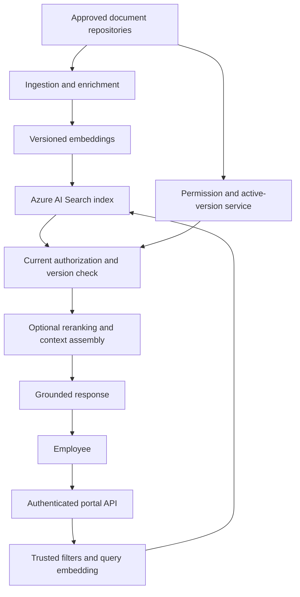
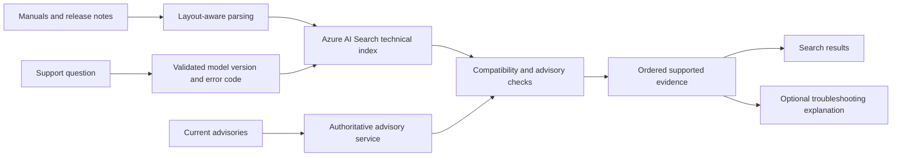

# Enterprise retrieval with Azure AI Search

Azure AI Search is a strong candidate when an application needs a managed search service that combines text retrieval, vector retrieval, structured filters, and relevance ranking within an Azure environment. It is a retrieval component, not a substitute for identity, source ownership, or evaluating generated answers.

The two designs here are an employee knowledge portal and a technical-support assistant. Both use the [OpenSearch chapter](opensearch-retrieval.md) as a comparison: the engineering questions remain similar, but indexing, enrichment, identity integration, and query controls differ.

!!! note "Research and assumptions"

    Primary Microsoft documentation was reviewed September 7, 2026 (UTC). Workloads and architecture recommendations are illustrative. Check the chosen service tier, Region, API version, and whether a capability is generally available or preview before adopting it. Built-in document authorization and the application security-filter pattern are separate approaches.

## 1. Fundamentals and best fit

A search index contains typed fields: searchable text, structured filter fields, identifiers, and vector representations. An application writes prepared documents or uses a supported ingestion/enrichment path, then queries the index for evidence. Source systems remain authoritative for documents, business state, and current permissions.

Microsoft documents hybrid search as a single request executing text and vector retrieval in parallel and merging results with reciprocal rank fusion. Text search uses BM25; vector search supports HNSW and exhaustive nearest-neighbor paths. Optional semantic ranking further reranks textual results. These are distinct stages, not interchangeable names for “semantic search.” [^1]

Use Azure AI Search when the organization values managed search operations, Azure identity/network integration, mixed exact and semantic retrieval, and enrichment close to its existing data platform. It fits employee portals, product manuals, and support search where filters and literal identifiers matter as much as paraphrase matching.

Start with a simpler alternative when the corpus is small and relational state dominates. Consider source-native federation when permissions or freshness cannot safely be projected into an index. Consider a vector-focused service when lexical search and enrichment are secondary and a specific vector-serving model is the main requirement. The right choice depends on measured needs rather than the cloud account already existing.

## 2. Mechanics that change the design

### Schema and evidence units

Define fields explicitly. Separate `document_id` from `chunk_id`; retain a source version, section path, language, and immutable citation location. Put tenant, document status, and applicability dimensions in filterable fields. A vector belongs to a pinned model/preprocessing revision, and a migration must switch query encoding with the indexed representation.

Choose chunks around meaningful units rather than fixed character lengths alone. A troubleshooting table may need row headers repeated; a policy exception may need its parent heading. Keep a manifest linking original documents to projected chunks so shorter revisions and deletions remove obsolete evidence.

### Hybrid retrieval and semantic ranking

A hybrid query combines a text query and one or more vector queries. RRF merges rank positions rather than adding incompatible BM25 and distance scores. Semantic ranking is an additional step over text; the number and quality of upstream candidates constrain what it can improve. Microsoft recommends a suitable vector candidate count when using semantic ranking, but benchmark the end-to-end choice on the actual workload. [^1]

For an exact error code, retain lexical precision. For a conceptual question, semantic candidates may improve recall. A query rewrite should preserve product names, version numbers, and negative constraints. An LLM-generated query plan must be validated against allowed fields and operators rather than executed as arbitrary search syntax.

Filters, facets, and ordering have different meanings. A hard jurisdiction constraint must survive all retrieval branches. Facet counts must be interpreted according to the query's result domain. An explicit sort can override relevance ordering; do not add a business sort and still describe the output as pure hybrid relevance. [^1]

### Document authorization versus filter strings

Microsoft's security-filter documentation describes an application pattern that stores principal identifiers in a filterable field and uses `search.in` to trim results. It explicitly says these identifiers are strings, not authentication or authorization by themselves. It also distinguishes this pattern from built-in ACL support. [^2]

The security boundary is therefore the trusted service that authenticates the caller, resolves current groups, constructs mandatory filters, and prevents direct broad index access. A browser must not choose its own group list. Setting a principal field as non-retrievable is useful for response minimization but does not create field-level security. [^2]

For built-in authorization, validate the exact supported source, identity flow, API, and lifecycle semantics. For the filter pattern, test permission projection and final authorization explicitly. Do not assume either approach reproduces every source system's deny rules and inheritance behavior automatically.

## 3. Design A: employee knowledge portal

Assume 150,000 documents, seven chunks per document, 1,536-dimensional vectors, 12,000 employees, and 35 peak queries per second. An illustrative target is p95 retrieval under 500 ms, with complete answers tracked separately. New content can lag five minutes; sensitive revocation must affect the next request through an authoritative check.

### Ingestion and state

A document registry records owner, source ID, classification, source version, expected chunks, and last successful visibility probe. Each indexed chunk carries tenant, source, version, text, section path, vector revision, coarse group tags, and citation coordinates. Source URIs resolve through an authorized application route instead of exposing permanent storage credentials.

The ingestion pipeline obtains source changes, parses content, validates layout samples, and generates embeddings. Workers use deterministic IDs and record per-item failures. A successful bulk operation is not enough if some items failed. Publish an active version only after its manifest is complete, then remove superseded chunks asynchronously while rejecting them at query time.

Permission changes have a separate fast path. Indexed group tags reduce candidate exposure, but current access is checked before private text is sent to a reranker or generation service. If the architecture uses integrated ranking inside the search service, that processing must itself be inside the approved data-processing boundary; a later check does not retroactively authorize earlier processing.

### Query and answer flow

Authenticate with the organization's identity system, resolve trusted tenant/group context, and validate any user-specified filters. Generate the query vector with the active encoder while preparing lexical retrieval. Search with mandatory constraints, then recheck current access and active source versions. Overfetch within a bounded limit when stale or unauthorized candidates are removed.

For “How do I request equipment while on a temporary contract?”, the application should retrieve the contractor policy for the correct country, not a semantically similar permanent-employee benefit page. Applicability is structured context. If employment category is unknown, ask for it or describe the scope of the available evidence without guessing.

Assemble a bounded context that includes source title, revision, and relevant section. Generate a cited answer and validate that cited IDs belong to the selected evidence. Support-checking evaluation must go beyond citation existence: a source can be real and still fail to justify the claim.

### Failures and recovery

If group resolution fails, fail closed for protected sources. If the encoder fails, a tested lexical-only path can remain useful. If generation times out, return permitted source results. If index queries are partial or time out, do not convert an incomplete result into a confident “there is no policy.” Distinguish insufficient evidence from a verified absence.

Exercise a full rebuild from source snapshots and subsequent changes. Reconcile manifests and deletion generations before switching the application index route. The old route can support rollback only while its permission checks and source-state validation remain current. A rollback must not restore access to revoked documents.

## 4. Design B: technical-support assistant for product manuals

Assume 40,000 manuals and release notes covering 600 product families and 20 languages, with 100 peak support searches per second. Manual changes arrive daily; incident advisories change within minutes. Users ask questions containing model numbers, firmware versions, and error codes. The system produces troubleshooting steps with citations and preserves a search-only experience.

The schema includes manufacturer model ID, product family, language, firmware interval, manual revision, section, step sequence, warning level, and source coordinates. Exact identifiers are normalized without destroying punctuation that has meaning. A multilingual vector model may help retrieve cross-language concepts, but approved instructions and safety warnings must retain their original meaning and locale.

Ingestion separates manuals from live advisories. A manual's vector changes when its technical text changes; an advisory's active flag or affected-version interval should not trigger re-embedding unrelated documents. Preserve table relationships such as model-to-compatible-part rather than flattening all model names and parts into independent arrays.

The request planner extracts a proposed model, firmware version, and error code, then validates them against a product registry. If the user says “X200,” disambiguate product families before retrieving procedures that differ materially. Run exact identifier/error lookup alongside hybrid symptom search. Apply supported-version filters and rerank only within the eligible technical context.

Before returning steps, query active advisories. An emergency warning can override a normally valid manual procedure. The answer explicitly names the applicable model and firmware range, links to the precise section, and distinguishes verified steps from missing diagnostic information. A language model must not invent torque values, electrical limits, or undocumented reset combinations.

If the advisory service is unavailable, withhold procedures that require a current safety check and return general permitted documentation. If a manual parser fails to preserve a table, quarantine the affected section rather than serving a plausible but incorrect extraction. A citation to the original page does not repair a misread table cell.

For privacy, a support session can include customer-specific diagnostics under a separate scope. Do not index those diagnostics into a shared manual corpus automatically. Redacted resolutions need an explicit approval pipeline before they become reusable knowledge. Logs should capture model/error identifiers and stage timing without retaining unnecessary device-owner data.

## 5. Sizing, costs, and workload isolation

Design A's raw vectors require `1,050,000 × 1,536 × 4 = 6.4512 GB` before text, index structures, metadata, replicas, and migration overhead. Use this as a component estimate, then measure the actual index and service limits. An enrichment pipeline can produce far more chunks than a document count suggests.

Budget separately for search capacity, embedding, parsing/OCR or enrichment, semantic ranking where charged, generation, logging, and data transfer. A more expensive retrieval stage can reduce generation cost by supplying fewer and better chunks; measure cost per successful answer. Avoid assuming that every service tier supports the same performance envelope or features.

Benchmark concurrent ingestion and queries, multilingual text, selective group filters, and large manuals. Keep latency distributions by stage, including identity, query embedding, search, current authorization, ranking, and generation. Do not add independent p95 values and call the result an end-to-end percentile.

Protect the service from one large tenant or ingestion burst with quotas and bounded retries. Queue document enrichment separately from serving. Use request deadlines so a slow optional reranker cannot consume the entire answer budget. A degraded lexical path must have its own evaluated quality floor and must retain all mandatory filters.

## 6. Alternatives and decision criteria

| Option | Strong reason to choose | Main trade-off |
|---|---|---|
| Azure AI Search | Managed mixed retrieval in an Azure-centered application | Service-specific query, ingestion, and feature constraints |
| Amazon OpenSearch | Existing AWS/search operations and broad engine controls | More explicit engine and pipeline ownership |
| PostgreSQL plus pgvector | SQL context, transactions, and small eligible subsets | Search resource competition and custom relevance work |
| Dedicated vector service | Vector-serving isolation or specialized query mechanics | Source joins and search-product features need separate evaluation |
| Managed knowledge layer | Supported connectors and authorization meet requirements | Less direct retrieval and ingestion control |
| Federated source search | Permission/freshness projection is unacceptable | Source latency, quotas, and ranking inconsistency |

Choose with an evidence matrix: required source support, access semantics, exact-ID relevance, selective-filter recall, operational recovery, and total cost. A cloud-native integration can simplify networking and identity while still leaving application document authorization unsolved. Treat each boundary explicitly.

## 7. Evaluation and practice

Construct queries for exact codes, paraphrases, outdated firmware, multilingual terms, restrictive groups, missing answers, and contradictory manuals. Compare lexical, vector, hybrid, and hybrid-plus-semantic-ranking paths with identical constraints. Measure retrieval relevance separately from grounded answer quality.

Security tests should inspect results, model payloads, caches, traces, suggestions, and citation endpoints. Include a user changing groups between two requests, a document losing access while still indexed, and an administrator role accidentally used in serving. Test large group memberships rather than only a single principal.

Operational gates include successful partial-ingestion recovery, no stale-generation resurrection, bounded backlog drain, and a verified index-route rollback. Quality gates include correct product/version applicability, claim support, and appropriate abstention. Human review should focus on failures in high-consequence technical instructions rather than only average answer fluency.

For a lab, index a few hundred manual sections with exact error codes and two conflicting revisions. Add a current advisory that invalidates one old step. Demonstrate how the authoritative check changes the answer without waiting for full reindexing. Then compare built-in authorization suitability with the security-filter pattern and explain which identity mechanism the application actually uses.

## Implementation checkpoint: vectorization, filter placement, and bulk results

Azure integrated vectorization combines indexer-driven chunking/embedding with query-time vectorization. Its documentation requires the query vectorizer to match the model used for indexed content. [^3] This can simplify the pipeline, but model migration still needs a controlled corpus and query-configuration switch.

The filter documentation distinguishes prefiltering during shard traversal from postfiltering and a preview strict-postfilter mode. Selective postfilters can produce false negatives; prefiltering can require more traversal work. [^4] For employee search, benchmark the smallest permission scopes explicitly rather than assuming broad-corpus recall represents every employee. Record the chosen filter mode in experiment manifests so later comparisons are meaningful.

Azure's indexing documentation distinguishes an all-success batch from a partial-success response and returns per-document status. [^5] The ingestion worker must inspect each item, retry only appropriate failures, and keep the manifest incomplete until the required documents succeed. Blindly retrying the whole batch can increase load; ignoring individual failures creates silent evidence gaps.

Combine these checks in one integration fixture: ingest a complete document generation, force one chunk write to fail, and verify that the new version remains unpublished. Then finish the missing chunk, activate the generation, and query it under a highly selective group filter. This demonstrates the interaction between ingestion correctness and retrieval recall, which separate happy-path API demos do not establish.

## Related studies

- [R01 · Retrieval with Amazon OpenSearch](opensearch-retrieval.md)
- [R07 · Permission-aware retrieval across multiple sources](federated-retrieval.md)
- [P04 · A secure multi-tenant AI platform](secure-multi-tenant-platform.md)

## References

[^1]: [Microsoft: Hybrid search overview](https://learn.microsoft.com/en-us/azure/search/hybrid-search-overview) — parallel lexical/vector retrieval, RRF, semantic ranking, filters, and sorting.
[^2]: [Microsoft: Security filters for trimming results](https://learn.microsoft.com/en-us/azure/search/search-security-trimming-for-azure-search) — principal-string filter pattern, `search.in`, and distinction from built-in ACL authorization.

[^3]: [Microsoft integrated vectorization](https://learn.microsoft.com/en-us/azure/search/vector-search-integrated-vectorization) — indexing and query encoder alignment.

[^4]: [Microsoft vector filters](https://learn.microsoft.com/en-us/azure/search/vector-search-filters) — filter placement and recall trade-offs.

[^5]: [Microsoft index loading](https://learn.microsoft.com/en-us/azure/search/search-how-to-load-search-index) — batch status and per-document failures.
