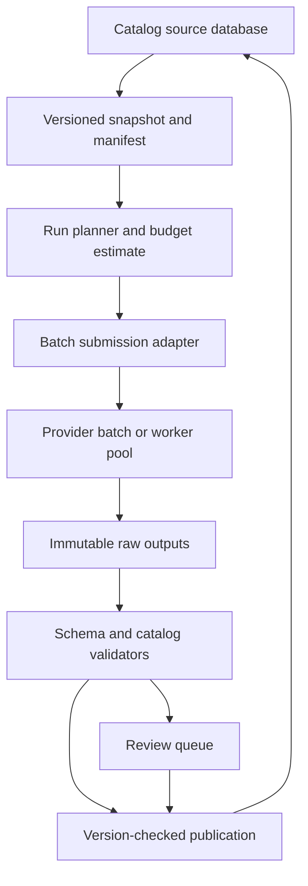
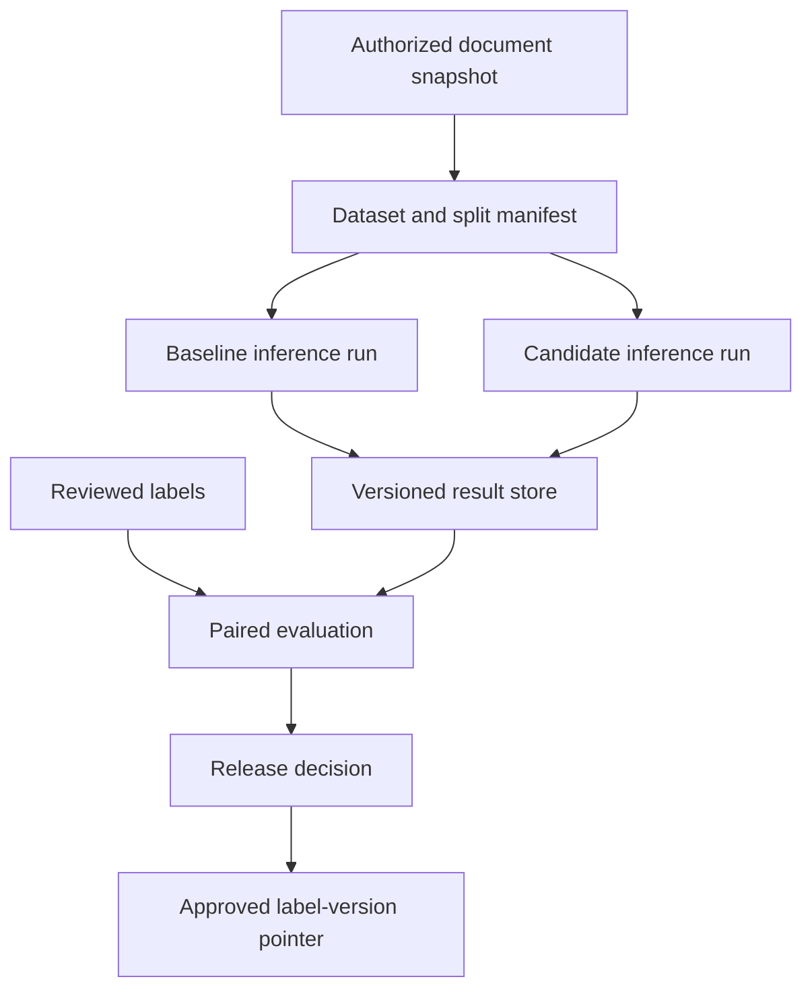

# Durable batch inference platforms

Batch inference processes many independent inputs when users do not need an immediate response. It can make large enrichment, classification, and evaluation jobs economical, but only if the platform can identify every record, resume partial work, control costs, and publish results without corrupting source data.

The essential design is a durable record ledger around model execution. A provider's batch job is one execution mechanism, not the complete workflow. The [OpenSearch example](opensearch-retrieval.md) uses versioned ingestion and idempotent indexing; batch inference needs the same discipline for model-derived records.

!!! note "Scope and evidence"

    Research date: September 7, 2026 (UTC). OpenAI Batch, Amazon Bedrock batch inference, and SQS documentation were read. Workloads, deadlines, and retry budgets below are illustrative. Provider limits, supported endpoints/models, output retention, and pricing should be verified when a job is submitted.

## 1. What makes work batchable

Good batch tasks have independent inputs, bounded output, a clear schema or validation rule, and a deadline that tolerates asynchronous completion. Product categorization, document labeling, embeddings, and offline evaluation often fit. A conversation requiring tool interaction or immediate human clarification generally does not fit a single independent batch record.

OpenAI Batch uses JSONL request files with a unique `custom_id` for each request. Its documentation says output ordering may differ from input ordering, so results must be joined by identity rather than line position. [^1] A successful job-level status also does not imply every record produced a valid application result.

Amazon Bedrock batch inference takes model inputs from S3 and writes outputs to S3. The consulted documentation states that records are processed independently and excludes tool calling and structured output through `response_format` in this batch path. [^2] An application can still ask for a JSON-shaped response and validate it, but that is not the same as a provider-enforced structured-output capability.

A queue of ordinary synchronous inference calls is another batch implementation. It offers control over deadlines and per-record retries, but the application owns concurrency, rate limits, and worker operations. SQS standard queues can deliver a message more than once; AWS explicitly recommends idempotent consumers. [^3]

## 2. The durable data model

Keep dataset, run, record, attempt, and publication identities separate.

| Entity | Important fields |
|---|---|
| Dataset snapshot | immutable manifest, source versions, schema, row count, hash |
| Run | run ID, task/model/prompt versions, policy, budget, deadline |
| Record | stable record ID, input hash, source version, logical status |
| Attempt | provider job/request ID, attempt number, timing, raw output, usage, error |
| Validated result | parsed value, validator version, confidence/review state, evidence |
| Publication | target key/version, accepted result ID, export status |

A record may have several attempts but only one accepted result for a run according to the acceptance policy. Keep raw attempts so a parser fix can reuse output. Use deterministic record IDs derived from stable source identity and version, not an accidental row number in a mutable file.

A source snapshot prevents moving targets. If the source changes while a run executes, either publish results only when the source version still matches or start a new run for changed records. Do not attach yesterday's classification to today's edited text merely because the entity ID stayed the same.

### State machine

A practical logical state machine is `pending → submitted → running → output_received → validated → published`, with `retryable_failed`, `permanent_failed`, `review_required`, and `canceled` branches. Provider state and application state are distinct. A provider job can be complete while the application is still validating or publishing thousands of records.

Use transactional updates or compare-and-set transitions to claim work. A worker lease helps recover from crashes, but a lease expiry does not prove the provider stopped processing. Reconcile recorded provider IDs before submitting replacements when the outcome is ambiguous.

## 3. Retry, cancellation, and backpressure

Retry transient failures with bounded exponential backoff and jitter. Do not retry invalid inputs indefinitely. Separate provider errors, malformed outputs, schema violations, and business-validation failures; each category has a different remedy. A parser bug may require replaying stored outputs, not another model call.

Partial completion is normal. Build retry manifests containing only eligible failed or missing record IDs, keeping the original input/model contract unless an explicit new run changes it. Never assume cancellation retracts outputs that already completed. Reconcile all returned records before deciding which work remains.

Backpressure should reflect provider quotas, spending, validation capacity, and downstream write throughput. Increasing submission rate while validators are failing simply creates a larger expensive backlog. Maintain queue-age and projected-completion metrics for each stage.

Idempotent publication is the key correctness boundary. Even if a record executes twice, publishing it once through a stable target identity can prevent duplicate business effects. This is not a claim of exactly-once model execution; retries may still cost money and produce different text.

## 4. Alternatives and fit

| Option | Prefer when | Main trade-off |
|---|---|---|
| Provider batch API | Large independent jobs with flexible deadlines | Provider-specific lifecycle, limits, and supported features |
| Queue plus synchronous API workers | Fine-grained deadlines and retry control | More orchestration and quota management |
| Self-hosted offline inference | Sustained load and justified GPU operations | Capacity, model/runtime ownership, and utilization risk |
| SQL/rules/classical model | Task is deterministic or simple enough | Less language flexibility, often lower cost and easier validation |
| Human review workflow | Ambiguous or high-impact decisions | Throughput and staffing costs |

Start with rules or existing structured fields when they solve the task. A model should earn its cost through measured quality improvement. Batch is a delivery mode, not a reason to automate consequential decisions without review.

## 5. Design A: catalog enrichment

### Workload and architecture

Assume five million product records need initial category and attribute enrichment, followed by 100,000 changed records daily. Each record averages 500 input tokens and 100 output tokens. Results must be ready within 24 hours for the daily run; publishing must not overwrite newer catalog edits.

### Flow

1. Snapshot source IDs, descriptions, existing attributes, and source versions. Exclude records that deterministic rules already classify confidently under the task policy.
2. Estimate token volume and cost, partition the manifest within current provider limits, and reserve budget. Store each submitted file hash and provider job ID.
3. Process completion events or bounded polling. Download outputs into controlled storage and reconcile expected IDs against returned IDs and errors.
4. Parse and validate category IDs, allowed attributes, units, and evidence. Reject invented specifications and values outside the taxonomy.
5. Route ambiguous or high-impact attributes to review. Accept only results that meet the task's measured quality thresholds.
6. Publish with a source-version check. If the product changed since the snapshot, mark the result stale and enqueue the new version instead of overwriting it.

For example, a product description may mention “compatible with Model X” while the product itself is an accessory. The model must not classify it as Model X. Test these relational traps and preserve source excerpts supporting extracted attributes. A generated marketing sentence is not a reliable source for a technical specification.

### Publication and recovery

Use `(product_id, source_version, enrichment_schema_version)` as the target identity. A publication outbox writes accepted results and emits downstream index updates. If the database write succeeds but the event delivery fails, the outbox can retry without recomputing enrichment.

If one batch shard fails validation at the provider, inspect whether the cause is a single malformed line or a contract-wide error before resubmitting. If output retrieval fails, retry retrieval using the recorded job identity. If the validator changes, revalidate stored output and create a new validation revision.

Keep rejected outputs for a limited controlled period to diagnose taxonomy gaps. A high rate of “unknown category” may indicate a missing business category rather than a weak model. Do not tune prompts to force every record into an unsuitable label.

## 6. Design B: document classification and evaluation backfills

### Workload and architecture

Assume one million historical support documents need topic labels, language, and routing hints. New documents arrive continuously, and a new classifier version must be compared against the old one before activation. The batch output informs routing suggestions; humans retain control over consequential reassignment rules.

### Reproducible runs

Pin dataset split, model, prompt, decoding parameters, and validator. Keep evaluation labels separate from inputs used to construct prompts. Compare baseline and candidate on the same record IDs so differences can be inspected rather than hidden in aggregate averages.

Store predicted label, optional abstention, supporting excerpt, and parse/validation outcome. For multilabel tasks, define whether absence means “not present” or “not evaluated.” A model-generated confidence number needs calibration before it controls automation. Label distributions and source domains can shift over time, so report subgroup metrics.

The release gate checks quality, cost, latency/completion behavior, and policy constraints. A candidate that improves common labels while badly regressing a rare urgent category may fail the gate. Use human review on disagreement samples and maintain an untouched test set.

### Serving the results

Publish a version pointer to an accepted label set rather than updating millions of records in place without rollback. Applications can read the approved label version and source-version compatibility. Incremental jobs fill gaps for new documents while the historical backfill progresses.

If a document is deleted or access changes during the run, publication checks current eligibility. A stored snapshot is not permanent permission to continue processing or serving the content. Maintain deletion tombstones and remove derived labels/evidence according to policy.

### Failure handling

If the candidate run is canceled, keep completed results for evaluation only if policy permits, but do not publish a partially evaluated version as fully approved. If some labels are unsupported by the model or consistently invalid, stop the run early and diagnose rather than paying for the remaining million records.

A provider outage may delay both baseline and candidate. Keep the comparison contract stable; switching only one side to a different deployment confounds the result. If the model changes materially, record a new candidate run and explain the change.

## 7. Capacity and cost

The catalog backfill implies `5,000,000 × 500 = 2.5 billion` input tokens and `5,000,000 × 100 = 500 million` output tokens under the illustrative averages. At ten records/second, processing five million records takes about 5.8 days before retries; at 100 records/second, about 13.9 hours. Provider batch throughput is not necessarily exposed as a fixed rate, so use observed completion data and documented limits.

For a 100,000-record daily run with a 24-hour deadline, the average required completion rate is about 1.16 records/second. Burst submission, provider queueing, validation, and publication still need slack. An average that barely meets the deadline is fragile when a shard fails.

Estimate total cost from accepted and attempted records separately. Include input/output usage, failed attempts, storage, workers, review, and downstream writes. Track cost per accepted record and cost per correct label on reviewed samples. A low token price can be offset by malformed-output retries or poor quality.

Partition by expected token volume as well as record count. One file containing unusually long documents can become a straggler. Bound per-record input and output, detect oversized documents before submission, and route them through a separate task-specific chunking strategy.

## 8. Security and operational evaluation

Use scoped input/output storage locations and service roles. A job should access only its approved dataset, not an entire tenant bucket. Encrypt and control raw outputs because they can repeat sensitive input. Do not place secrets in prompts or job names. Record metadata without copying document bodies into ordinary logs.

Test duplicate queue delivery, duplicate output IDs, missing outputs, out-of-order results, expired jobs, cancellation, worker death, schema changes, and source edits during publication. Reconcile counts: every expected record must have a known terminal or pending state. A dashboard saying “job complete” is insufficient if 2% of rows vanished.

Quality evaluation should include difficult inputs, prompt injection in document text, unsupported labels, empty records, and multilingual data where relevant. Release gates should use exact schema and business checks plus reviewed accuracy. A valid JSON document can still be wrong.

## 9. Practice: defend the design

1. Shuffle output lines and prove the importer joins by record identity.
2. Crash a worker after submission and show that recovery reconciles the existing job.
3. Edit a source record during inference and demonstrate stale publication rejection.
4. Cancel a partially complete run and build a retry manifest without duplicating accepted results.
5. Revalidate stored raw output after a parser fix without paying for inference again.
6. Compare cost per correct accepted record for rules, two model sizes, and human review.

## Implementation review: reconciliation invariants

At every checkpoint, reconcile the dataset manifest against the record ledger. Each expected ID should be pending, active, terminally failed, review-required, or accepted; no ID should disappear because an output file was incomplete. Duplicate output IDs should be quarantined or resolved by an explicit attempt policy, not silently accepted according to whichever line was read last.

Make counts and hashes part of the publication manifest. A consumer can verify the accepted record count, source snapshot, schema version, and result-file checksums before switching its active version. This is especially useful for large backfills where publication spans several objects or database transactions. The active pointer changes only after the manifest is complete.

Define a run's budget stop behavior in advance. Stop new submissions when the remaining allowance cannot cover the next shard's conservative estimate, but continue retrieving and reconciling already submitted work. Canceling application workers does not necessarily cancel provider jobs. Expose in-flight estimated liability separately from settled usage so a paused run does not appear free.

Finally, keep manual retries traceable. An operator should select failed record IDs and a reason through the same run controller, not upload an ad hoc file that bypasses the ledger. If the prompt or model changes, create a new run lineage. This preserves the ability to explain why two versions of the same record received different labels.

For auditability, preserve why a record was skipped. An unchanged input, deterministic-rule success, policy exclusion, and prior accepted result are different reasons. Store the rule or comparison version with that decision. Otherwise a future backfill cannot distinguish intentional exclusions from lost work, and a changing business rule may leave records permanently outside the model-processing path.

## Related studies

- [P01 · Fresh retrieval indexes with Kafka or Amazon Kinesis](streaming-indexes.md)
- [D01 · Document intelligence with Amazon Textract and LLMs](document-intelligence.md)
- [S02 · Self-hosted inference with vLLM or NVIDIA Triton](self-hosted-inference.md)

## References

[^1]: [OpenAI: Batch API](https://platform.openai.com/docs/guides/batch) — JSONL inputs, custom IDs, lifecycle, and result-order semantics.
[^2]: [AWS: Batch inference](https://docs.aws.amazon.com/bedrock/latest/userguide/batch-inference.html) — S3 workflow, independent records, and documented feature limitations.
[^3]: [AWS: SQS at-least-once delivery](https://docs.aws.amazon.com/AWSSimpleQueueService/latest/SQSDeveloperGuide/standard-queues-at-least-once-delivery.html) — duplicate delivery and idempotent-consumer requirement.
