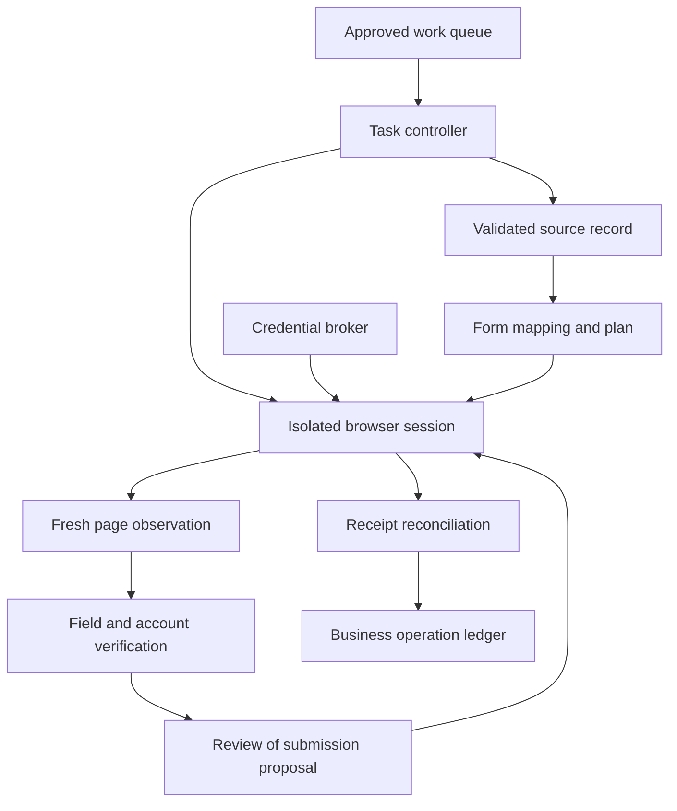
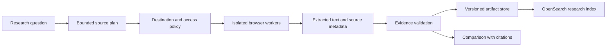

# A browser agent for business tasks

A browser agent observes a page, selects an action, and checks whether the intended change occurred. The browser is useful when a business task has no suitable API, but its visual and interaction state is an unstable interface. A successful click is not the same as a successful business transaction.

This chapter develops a vendor-portal form assistant and a web research assistant. Playwright provides the concrete automation substrate; the model handles bounded interpretation. [OpenSearch](opensearch-retrieval.md) can index approved research artifacts after collection.

!!! note "Scope and evidence — researched September 7, 2026 (UTC)"

    Playwright mechanics are based on official documentation. Browser policies, workloads, and confirmation rules are illustrative application choices. Browser contexts isolate session state; they are not a substitute for operating-system isolation against hostile code or for source-site authorization.

## 1. Foundations and useful mechanics

Playwright browser contexts provide isolated sessions with separate cookies and storage. They are lightweight compared with launching a new browser process for every test, but workloads still need process and tenant isolation appropriate to their risk. [^1]

Authentication state can be saved and reused. Playwright warns that the resulting files can contain sensitive cookies and headers that permit impersonation. Treat them as credentials: encrypt, scope, expire, and keep them out of repositories and ordinary logs. [^2]

Network routing and observation can help control requests and inspect responses. Playwright supports request interception, but its documentation describes service-worker interactions that affect interception visibility. Browser-level routing alone should not be assumed to enforce all network isolation; pair it with the runtime network boundary. [^3]

Use semantic locators, observed page structure, and actionability checks where available. A model may choose a target based on page meaning; deterministic automation should perform the actual interaction and capture the next state. Screenshots help with visual-only content, but should not replace structured fields when the page exposes them.

## 2. When to use a browser

| Task | Browser advantage | Prefer an API when |
|---|---|---|
| Legacy partner portal | Reuses the supported human interface | A documented integration supports the same operation |
| Form preparation | Can inspect labels and validation errors | Bulk structured upload is available |
| Public web research | Renders dynamic content | A source provides a stable data or document endpoint |
| High-volume transaction processing | Usually a poor first choice | API idempotency and throughput are important |
| Tasks involving interactive challenges | Human handoff may be necessary | Do not design around defeating access controls |

The API comparison is about reliability and semantics. An API can expose a transaction ID, idempotency key, and typed error. A browser may expose only a spinner or banner. Use browser automation for the missing integration surface, and keep supported APIs for identity, data preparation, and result verification when possible.

## 3. Observation, action, and verification

Represent execution as a sequence of observations and proposed actions. Each action references a recent observation ID, target, expected precondition, and desired postcondition. Before acting, recheck that the page and target still match. After acting, capture a fresh observation.

Use an action ledger:

| Field | Purpose |
|---|---|
| Run and session | Ownership and lifecycle |
| Observation | URL, page identity, time, relevant accessible state |
| Action | Operation type, target, canonical input, proposal hash |
| Preconditions | Expected account, record, page version, form state |
| Outcome | Confirmed, rejected, uncertain, or needs user |
| Evidence | Receipt, verified record, bounded screenshot reference |

Separate navigation and reading from submitting forms, sending messages, or changing records. The application defines when authorization is sufficient and when a new approval is needed. Approval should cover the concrete transaction—recipient, amount, fields, or record—not a vague instruction to “finish the task.”

A timeout after clicking Submit is an uncertain outcome. The next step is to inspect receipt or destination state, not click again. If the site has no reliable lookup, stop for manual reconciliation rather than risk duplicate submission.

### Locators, frames, downloads, and visual fallback

Playwright locators resolve targets against current page state and support auto-waiting. Prefer roles and accessible names or application-owned test IDs over brittle CSS chains. Strictness is useful: if a locator matches two Submit buttons, an error is better than choosing the first silently. The controller should narrow the target to the intended form and verify its identity. [^4]

For a click, Playwright checks properties including visibility, stability, event reception, and enabled state. These checks answer whether interaction can occur; they do not establish that the selected button has the right business meaning. Forcing a click can bypass useful checks and should not be a generic recovery strategy when a modal or overlay changes the flow. [^5]

Frames create separate document scopes. Use a frame locator or explicit frame selection before locating a field within an embedded document. Record the frame identity and account context so a field named “Amount” in a preview or third-party widget is not confused with the actual transaction form. [^6]

Downloads need an explicit lifecycle. Playwright's guidance starts waiting for the download before the triggering click and saves the completed file deliberately; files associated with a browser context are deleted when that context closes. An agent should preserve required artifacts through the controlled artifact service, validate size and type, and assign a safe storage name rather than trusting a suggested filename as a path. [^7]

Visual fallback is useful for canvas applications or controls without accessible structure. It increases uncertainty: screen scaling, scrolling, animation, overlays, and stale screenshots can move the target. Bind a coordinate action to the exact observation and viewport, then capture a fresh state. For a high-impact submission, require a semantic or destination-state verification even if the click itself used pixels.

A portal adapter can express a precondition such as “one form titled Vendor Request, account ACME-US, request revision 7, submit enabled.” The model may propose a locator, but code evaluates these conditions. If the page navigates between observation and action, discard the proposal and re-observe. This is more reliable than letting a long chain of coordinates execute without intermediate checks.

Test downloads and popups as first-class outcomes. A button may open a new page, generate a report asynchronously, or trigger a download instead of navigating. The controller must know which event it expects and preserve ownership of the new page or artifact. An unexpected event becomes an explicit branch, not an excuse to keep clicking until something looks successful.

## 4. Design A: vendor-portal form processing

Assume 1,000 forms/day across ten approved portals, ten minutes average handling time including pauses, and a peak of 50 concurrent sessions. The assistant prepares purchase-related request forms from already approved source records. It does not decide business eligibility or create payment authority.

### Preparation and state

The source record contains a stable request ID, recipient/vendor identity, approved fields, attachments, and revision. The controller binds the run to a portal account through a credential broker. The model never selects which stored credentials to use.

For known portals, use versioned adapters describing expected pages, field names, and validation rules. The model handles unusual wording or missing information but cannot silently change approved source values to satisfy a form. If the portal requires a field absent from the record, return a specific missing-data task.

### Request flow

1. Acquire a work item with a lease and operation ID. Verify it has not already been submitted.
2. Open a clean session for the intended account. Confirm account and vendor identity from the page before entering data.
3. Read current form structure and map fields to the approved source revision. Apply deterministic formatting for dates, identifiers, currencies, and attachments.
4. Fill fields, then read them back from the page. Verify selects, hidden defaults that affect the transaction, totals, and required attachments.
5. Produce a submission proposal containing exact values, destination, and source revision. Obtain the authorization required by the business process.
6. Immediately before submission, recheck account, record, and visible values. Submit once and record that an external action may have occurred.
7. Capture the receipt and verify the new record through the portal's listing or a supported API. Persist the remote ID and final values.

### Security

Restrict navigation and outbound connections to approved destinations and necessary supporting domains. Revalidate redirects and downloads. Keep authentication state tenant-specific and short-lived. Screenshots, downloaded attachments, and traces may contain private information and need controlled retention.

A malicious banner or uploaded document may instruct the agent to change bank details or navigate elsewhere. Page text is task data. The approved source record and action policy remain authoritative. Browser automation should not possess unrelated account sessions that make a mistaken navigation dangerous.

### Failure and recovery

If a page changes, the adapter stops on an unmet precondition and preserves a bounded diagnostic snapshot. It should not fall back to blind coordinate clicking through a high-impact flow. If authentication expires, hand off to the normal reauthentication path and resume only after account verification.

If a worker crashes after submission, the ledger's uncertain operation is reconciled using source request ID or destination receipt. Leases prevent simultaneous workers from acting on the same queue item, but a lease alone cannot undo an already sent browser request. Recover the business outcome before reallocating the submission step.

## 5. Design B: web research with verifiable extraction

Assume 5,000 research tasks/day, at most eight pages per task, and a two-minute target for a bounded comparison. Sources are public or explicitly authorized. The output is an evidence table with citations and collection times, not a claim of exhaustive coverage.

A source plan specifies required fields and admissible source types. For a product comparison, those might be feature, supported environment, limitation, and observed date. The browser loads each approved source and extracts text with source location, heading, and URL. Dynamic tabs or tables are inspected only when necessary to obtain the requested facts.

Store the observed URL after redirects, fetch time, page title, content hash, and relevant excerpt. Distinguish the source's publication date from the observation date. If a page omits a requested field, record unknown rather than infer absence. If two pages conflict, preserve both observations and explain their applicability.

The extraction model operates on bounded content. Deterministic validation checks required columns, link provenance, numeric units, and whether cited excerpts exist. A separate synthesis step compares evidence. This separation makes it possible to rephrase an answer without browsing again or to refresh one stale source without rebuilding every artifact.

For a logged-in source, recheck whether extracted content may be stored and indexed for the requesting tenant. Search indexing is a derived step with its own ACL and deletion requirements. A publicly reachable URL does not automatically establish that every downloaded artifact may be redistributed.

Unlike the form assistant, the normal path has no submission side effect. That permits higher parallelism and cheaper retry. It still needs network controls because a research page can attempt to send the browser to a private service or leak information through outbound requests.

## 6. Alternatives and trade-offs

| Approach | Best fit | Cost or limitation |
|---|---|---|
| Direct API integration | Stable structured business operations | Integration availability and development effort |
| Deterministic browser automation | Known sites with predictable flows | Maintenance when UI changes |
| Model-guided browser agent | Variable pages requiring interpretation | Higher variance and prompt-injection exposure |
| Human-assisted browser workflow | Sensitive or ambiguous steps | Human availability and queue time |
| Document/API fetching without rendering | Static research sources | Cannot inspect browser-only state |

A hybrid is often strongest: deterministic navigation for known paths, model interpretation for bounded ambiguity, and a reliable verification service for business outcomes. More visual reasoning does not compensate for missing authorization or absent transaction identifiers.

## 7. Capacity, cost, and monitoring

At ten minutes/session, 1,000 daily forms consume roughly 167 browser-session hours/day before retries. Waiting for human review should release unnecessary active resources where sessions can be safely restored; session persistence introduces credential and stale-state concerns that must be handled explicitly.

Budget browser memory, CPU, screenshots, model tokens, retained traces, downloads, and adapter maintenance. Measure cold startup, authentication, page load, interaction, review wait, and verification separately. An apparent model latency problem may actually be a portal that serializes requests per account.

Limit concurrency per portal and account. Excessive parallel sessions can invalidate each other's state or hit source limits. Track UI precondition failures, authentication churn, duplicate-submission prevention, uncertain outcomes, recovery time, and confirmed task success. Click success rate is not a useful business-level service objective.

## 8. Evaluation and exercises

Build a local test portal with delayed responses, duplicate buttons, changed labels, expired sessions, validation errors, and a submission that commits before the connection drops. Evaluate whether the agent fills correct fields and whether the ledger resolves one business record.

Test malicious page instructions, cross-account cookies, misleading confirmation banners, downloads with unexpected types, and redirects to unapproved destinations. Use actual postconditions: a confirmed record ID and matching fields, or a research table whose claims match captured excerpts.

Begin with one portal and one form type. Add model-guided recovery only for known safe variations with measurable benefits over the deterministic adapter.

1. What evidence distinguishes a successful click from a completed submission?
2. Which state must be rechecked after a long review pause?
3. Why is a saved browser authentication file a credential?
4. How does recovery avoid duplicate records after a lost response?
5. When would a direct API eliminate most of this architecture?

## Related studies

- [A02 · Tool-using agents with LangGraph or an agents SDK](tool-using-agents.md)
- [A03 · An MCP tool gateway for enterprise applications](mcp-tool-gateway.md)
- [A05 · A coding agent with isolated execution](coding-agent-sandboxes.md)

## References

[^1]: [Playwright: Browser contexts](https://playwright.dev/docs/browser-contexts) — session isolation and context behavior.
[^2]: [Playwright: Authentication](https://playwright.dev/docs/auth) — saved authentication state and credential sensitivity.
[^3]: [Playwright: Network](https://playwright.dev/docs/network) — request observation, interception, and service-worker considerations.

[^4]: [Playwright: Locators](https://playwright.dev/docs/locators) — semantic targeting and strictness.
[^5]: [Playwright: Auto-waiting](https://playwright.dev/docs/actionability) — actionability checks.
[^6]: [Playwright: Frames](https://playwright.dev/docs/frames) — frame-scoped targeting.
[^7]: [Playwright: Downloads](https://playwright.dev/docs/downloads) — event waiting, saving, and context cleanup.
