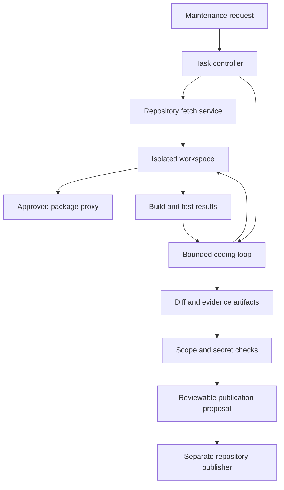
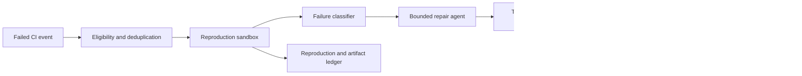

# A coding agent with isolated execution

A coding agent needs to inspect a repository, change files, run tools, and evaluate feedback. Repository contents and build scripts are executable, potentially untrusted input. The core architecture therefore separates the model's planning loop from an isolated workspace and separates producing a patch from publishing it.

This study develops repository maintenance and automated repair of failing changes. The output is a reviewable patch with evidence. [OpenSearch](opensearch-retrieval.md) can help retrieve documentation or code context, but the checked-out repository and verified test results remain authoritative.

!!! note "Scope and evidence — researched September 7, 2026 (UTC)"

    Isolation mechanics are sourced from Docker, gVisor, and Firecracker documentation. The workloads, runtime policies, and workflows are proposed designs. No runtime is assumed to eliminate all escape risk. Benchmark compatibility and isolation against the exact host, kernel, image, and runtime configuration.

## 1. What an execution sandbox provides

A sandbox is a controlled execution environment with explicit filesystem, process, network, credential, and resource boundaries. It is not merely a new directory. A Git worktree separates files but does not isolate processes, network access, or secrets from the host.

Docker uses operating-system mechanisms including namespaces and control groups; its security guidance also emphasizes daemon access and capabilities. Sharing the host kernel is an important boundary to understand when running untrusted builds. Do not mount the host Docker socket into an agent workspace as a convenient way to build containers. [^1]

gVisor implements a Linux-like application kernel in userspace and provides the `runsc` OCI runtime. This intercepts application system calls and reduces direct interaction with the host kernel, with compatibility and system-call overhead trade-offs. It is not a full hardware virtual machine. [^2]

Firecracker is a virtualization technology for microVMs using KVM. Its small device model and microVM boundary suit isolated workloads, but adopting it requires an image lifecycle, host management, networking, scheduling, and observability around the virtual machine monitor. Product website startup figures are not assumed for these end-to-end designs. [^3]

## 2. Best fit and poor fit

| Task | Why isolated execution helps | Remaining challenge |
|---|---|---|
| Dependency updates | Build scripts and package hooks execute code | Supply-chain access and version compatibility |
| Test-driven bug repair | Repeated code/test feedback is needed | Reproduction quality and weak tests |
| Repository maintenance | Files can be changed in a disposable checkout | Scope control and meaningful review |
| Pure code explanation | Execution may be unnecessary | Accurate context selection |
| Production administration | Repository sandbox is insufficient | Separate scoped operational tools |

Use the smallest capability set that can complete the task. A static analysis job need not have outbound network access. A dependency update may need an approved package proxy but not unrestricted internet. A build requiring private dependencies needs narrowly scoped retrieval credentials, not the user's full development environment.

## 3. Control and execution planes

The control plane authenticates the user, chooses the repository revision, creates a task, allocates a sandbox, accounts for budget, and decides whether a patch may leave the environment. The execution plane runs the model-selected commands and tools under resource limits.

Keep repository credentials outside the sandbox whenever possible. A source-fetch service can materialize a fixed commit and strip unnecessary credential configuration. An artifact service exports only declared outputs. Publishing uses a separate service whose authority is unavailable to build scripts.

The model receives command results, file excerpts, and patch summaries. It does not directly receive the host environment. Tool contracts impose working-directory scope, execution time, output size, and process limits. A path allowlist alone is not sufficient if a command can create symlinks or invoke another interpreter; filesystem isolation must enforce the boundary beneath the tool interface.

### State model

| Record | Purpose |
|---|---|
| Task | Requested change, acceptance criteria, tenant, budget |
| Workspace | Repository, base commit, image digest, runtime policy |
| Attempt | Patch hash, commands, test environment, duration |
| Artifact | Diff, logs, test report, dependency manifest |
| Publication proposal | Exact head/base commits, destination, approval state |

Record process exit status separately from output text. A test program printing “passed” is not proof of a successful test run. Store which command ran, its exit code, actual test count where available, and artifact provenance.

## 4. Design A: repository maintenance assistant

Assume 500 requested maintenance tasks/day, an average twenty-minute sandbox lifetime, and a peak of 60 concurrent jobs. The first release supports dependency updates and small API migrations in approved repositories. Each task has a 30-minute execution limit and two repair attempts after the initial change.

### Flow

1. Resolve the requested repository and base commit under user authorization. Persist the exact input before allocating compute.
2. Start a sandbox from a pinned image and materialize the repository. Disable inherited host credentials and mount only necessary task inputs.
3. Reproduce baseline checks. If the baseline fails, distinguish that failure from the requested maintenance and report whether it prevents evaluation.
4. The agent reads local conventions, identifies impacted code, and changes only the task's scope. Repository instructions are context for work, not authority to access host secrets.
5. Dependency installation uses an approved proxy with bounded package scopes and recorded lockfiles. Treat installation scripts as code running inside the sandbox.
6. Run relevant checks, inspect failures, and permit bounded repair attempts. Avoid weakening tests merely to obtain a green result.
7. Export the patch, test results, image digest, and dependency changes. Inspect for accidental secrets, large generated files, unrelated edits, and missing evidence.
8. The publisher creates the authorized review artifact from the exact exported patch. A later approval binds to that patch revision.

### Filesystem and network design

Use an ephemeral writable workspace and a read-only base image. Mount no user home directory, SSH agent, cloud metadata credentials, or host control socket. Limit CPU, RAM, process count, disk, and command duration. Enforce outbound policy through the environment's network boundary, not only a list of approved shell commands.

A shared package cache is efficient but can become a cross-tenant channel or poisoning source. Prefer immutable content-addressed objects, verify checksums according to the package ecosystem, and separate private artifacts by tenant. Cache hits must not expose another tenant's package names or credentials.

### Recovery

If a sandbox dies, recreate from the base commit plus the last exported patch checkpoint. Never claim tests passed after a restore unless they ran on the restored patch. If the publisher times out, reconcile the destination branch or review ID before issuing another creation request.

If the default branch advances, the exported patch may need rebasing and fresh checks. Approval of the prior patch does not establish that a conflict resolution is equivalent. Preserve the old evidence and attach a new revision rather than rewriting the audit history.

## 5. Design B: automated repair of failing CI changes

Assume 2,000 CI failures/day but admit only 100 failures/day whose logs and scope meet eligibility rules. Many failures are infrastructure problems, flaky tests, or missing secrets; blindly sending all of them to a repair agent wastes capacity and encourages irrelevant edits.

The event identifies repository, commit, failing job, environment image, and log artifact. Eligibility rejects protected or out-of-scope repositories and deduplicates repeated events for the same failure signature. A reproducibility worker reruns the failure without model changes. If it does not reproduce, label it nondeterministic and stop automatic repair or route to a dedicated flake investigation.

The agent receives a bounded context: failing tests, nearby implementation, relevant build configuration, and a reproduction command. It may inspect more within scope, but it cannot change the job definition to bypass required checks. Changes to tests or build policy require explicit justification and an appropriate review path.

Independent validation recreates a fresh sandbox from the base commit and candidate patch. This catches accidental dependencies on untracked files, cached state, or a modified environment. Run the targeted reproduction plus the repository's required checks appropriate to the change. “The failing test passes” is insufficient if it was deleted, skipped, or no longer discovered.

The final proposal reports whether the failure reproduced initially, what behavior changed, which checks ran, and remaining limitations. The merge path stays with the repository's existing rules. This design's strongest product boundary is producing a supported patch, not autonomously optimizing a success metric such as percentage of green builds.

### Distinct failure modes

A malicious repository can emit instructions in test logs. Treat logs as observations. A package can fork processes or exhaust disk; runtime limits should terminate the task and preserve a bounded diagnostic artifact. A test requiring a secret cannot justify injecting broad production credentials. Supply a scoped test fixture or identify the evaluation blocker.

A repair that passes only on one model-generated test has weak evidence. Use existing regression behavior, independently specified fixtures, and code review. Tests generated from the same mistaken hypothesis can reinforce the mistake.

## 6. Runtime alternatives

| Runtime | Useful starting case | Trade-off |
|---|---|---|
| Hardened container | Trusted internal repositories with moderate isolation needs | Shared-kernel boundary and daemon configuration |
| gVisor sandbox | Container tooling with reduced host-kernel exposure | Compatibility and syscall-heavy overhead [2] |
| Firecracker microVM | Stronger VM boundary for untrusted workloads | VM image, host, networking, and scheduler ownership [3] |
| Managed execution service | Team wants hosted isolation and lifecycle management | Verify tenant boundaries, egress, retention, quotas, and cost |
| Local developer worktree | Trusted interactive work | File separation only; not a hostile-code sandbox |

Do not select solely from boot-time benchmarks. Include repository checkout, image warming, dependency installation, test duration, cleanup, and escape-response operations. The most isolated runtime is not useful if the application quietly remounts broad host access for compatibility.

### How the isolation layers differ

A container normally shares the host kernel while constraining process views and resources through operating-system mechanisms. Image layers make environment distribution convenient, but image immutability does not prevent a writable container from executing malicious code. A privileged container or host control socket can undo the intended boundary. [^1]

gVisor inserts its Sentry application kernel between the workload and the host. The architecture documentation describes a restricted Sentry and a Gofer companion for filesystem access. This changes which host interfaces the application can reach directly. It also means unusual kernel features or syscall-heavy workloads need compatibility and performance tests; “Linux executable” is not enough to assume identical behavior. [^4]

A microVM has a guest kernel and virtualized CPU/device boundary. Firecracker's design describes KVM vCPU execution, host-backed block devices and networking, and production containment through its jailer. The platform must configure those surrounding resources; the VMM alone is not a complete hosted sandbox service. [^5]

The startup path therefore differs. Containers reuse an existing host kernel and image layers; a microVM needs a guest kernel, root filesystem, and VM configuration; a syscall sandbox needs its runtime plus a compatible workload environment. Warm pools and snapshots can reduce startup but create lifecycle questions: which credentials or tenant data were captured, which clocks and entropy sources must refresh, and which writable disks are reused? Treat a warmed environment as tainted after tenant work until cleanup is verified.

For the maintenance design, benchmark checkout, package install, compilation, and test execution on each candidate. Native compilation may emphasize CPU and filesystem throughput; integration tests may require network features; browser tests may have different process and shared-memory needs. Record unsupported features rather than broadening privileges silently to make the benchmark pass.

For the CI-repair design, independent validation should start from a clean image and base commit even if warm infrastructure accelerates launch. Reusing the exact modified workspace can hide undeclared files and environment changes. Exported patches should be sufficient to reproduce the result elsewhere.

A useful decision record states the assumed adversary, protected assets, host exposure, allowed egress, credential delivery, escape response, and cleanup mechanism. It also states operational cost: kernel/runtime patching, image updates, capacity placement, and debugging. That makes the choice reviewable instead of reducing it to “containers are fast” or “VMs are secure.”

## 7. Capacity, cost, and observability

Five hundred tasks at twenty minutes each require about 167 sandbox-hours/day before retries and validation. If each uses two virtual CPUs and 4 GiB RAM, average resource consumption follows from actual active time, while peak capacity must support admitted concurrency and failure headroom. Fresh independent validation adds another environment and should be included in the budget.

Track setup time, dependency time, agent reasoning, test time, idle time, and cleanup separately. Improve base images and immutable caches before increasing model autonomy to compensate for slow environments. Queue by tenant and task class so a large migration cannot monopolize all sandboxes.

Measure cost per accepted patch, baseline reproduction rate, irrelevant changes, flaky validation, leaked artifacts, timeout termination, and cleanup success. Retention should preserve useful evidence without indefinitely retaining private repositories and secrets accidentally printed in logs.

## 8. Evaluation and practice

Use a benchmark of real bounded maintenance tasks with known acceptance criteria and withheld tests. Report task success and patch quality, not only compilation rate. Test hostile repository behaviors in a controlled environment: attempted metadata access, host-path traversal, outbound exfiltration, fork bombs, and malicious package hooks.

Crash the controller after exporting a patch and before publication; verify one review artifact is produced after reconciliation. Delete the sandbox and ensure no credentials or writable volumes remain attached to the next tenant's task.

A useful lab starts with a tiny repository containing one reproducible bug. Run the agent in a restricted environment, export a diff, apply it in a fresh environment, and rerun independent checks.

1. What makes a Git worktree insufficient as a sandbox?
2. Which network destinations are necessary for this particular task?
3. How can a test run pass while providing no evidence for the requested change?
4. What happens when a patch is rebased after approval?
5. Which component can publish, and why can build scripts not invoke it?

## Related studies

- [A02 · Tool-using agents with LangGraph or an agents SDK](tool-using-agents.md)
- [A01 · Durable AI workflows with Temporal or AWS Step Functions](durable-workflows.md)
- [P04 · A secure multi-tenant AI platform](secure-multi-tenant-platform.md)

## References

[^1]: [Docker Engine: Security](https://docs.docker.com/engine/security/) — namespaces, control groups, capabilities, and daemon attack surface.
[^2]: [gVisor: What is gVisor?](https://gvisor.dev/docs/) — application-kernel architecture, OCI runtime, and compatibility trade-offs.
[^3]: [Firecracker project](https://firecracker-microvm.github.io/) — microVM architecture and virtualization purpose.

[^4]: [gVisor: Architecture introduction](https://gvisor.dev/docs/architecture_guide/intro/) — Sentry, Gofer, and host interaction.
[^5]: [Firecracker: Design](https://github.com/firecracker-microvm/firecracker/blob/main/docs/design.md) — vCPU, networking, storage, and containment architecture.
