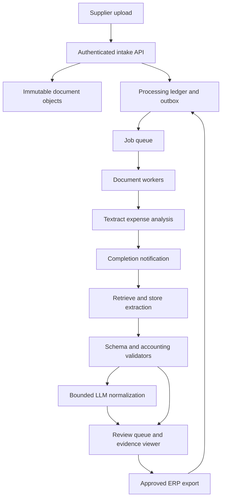
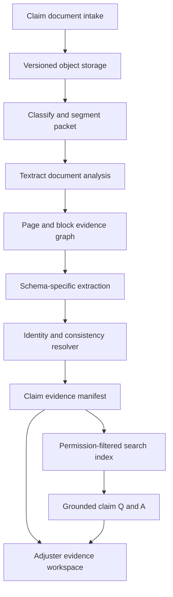

# Document intelligence with Amazon Textract and LLMs

Document intelligence turns files into evidence-backed business records. OCR is one stage: an invoice pipeline must also identify the right document, preserve layout, associate values with the right labels, validate amounts, resolve duplicates, and let a reviewer correct uncertain results. An LLM can interpret ambiguous content, but should not become the accounting system or silently authorize a payment.

This study follows the [OpenSearch retrieval example](opensearch-retrieval.md): understand the technology, establish its limits, then design two applications. Here the authoritative asset is the original document and the reviewed extraction record. A search index, if used, is a derived view.

!!! note "Scope and evidence"

    Research date: September 7, 2026 (UTC). AWS documentation in the references was consulted for service mechanics. Architectures, capacities, thresholds, and field schemas below are illustrative design recommendations, not deployed results. Check current Region, format, language, quota, and feature support before implementation. A model confidence score is not a calibrated probability that a business record is correct.

## 1. What Textract contributes

Amazon Textract extracts text and structured information from documents. Its APIs include text detection, document analysis, expense analysis, identity-document analysis, and lending-document analysis. Document analysis can request structures such as forms and tables; other capabilities include queries, signatures, and layout. Specialized APIs and generic analysis produce different response structures and should be selected for the task rather than treated as interchangeable. [^1][^2]

The basic document-analysis output is a collection of **blocks** with IDs, types, geometry, confidence, and relationships. A page contains lines and words; a table links to cells; form keys and values are associated through relationships. A robust parser traverses this graph instead of flattening the response into an arbitrary list of strings. Geometry supports a reviewer UI that highlights the location of an extracted value. Keep the original block response so a parser defect can be repaired without paying to run OCR again. [^2]

Synchronous APIs suit supported small interactive inputs. Asynchronous APIs support longer processing flows: start a job, persist its identifier, receive completion notification, and retrieve results, including all response pages. AWS describes S3 input, SNS notifications, and SQS or Lambda integration for asynchronous processing. Completion notification is a signal to retrieve and validate results, not proof that your application's downstream database has been updated. [^3]

Queries let an application ask targeted questions about a document. Expense analysis returns normalized summary fields and line-item structures. Its output includes page numbers and expense identities. The application should validate multipage assembly and line-item continuity against its own documents rather than assume that successful processing proves a complete business record. [^4]

An LLM adds a different capability: interpreting extracted evidence against a domain schema, normalizing descriptions, identifying inconsistencies, or explaining missing fields. Prefer deterministic parsing for dates, arithmetic, enumerations, and identifiers wherever it works. The LLM should return typed proposals with evidence locations and an explicit missing/ambiguous state.

## 2. Best fit, poor fit, and alternatives

| Situation | Recommended starting point | Reason |
|---|---|---|
| Scanned invoices with changing vendor layouts | Expense extraction plus validators and review | Reuses specialized extraction while retaining financial controls |
| Insurance intake packets containing forms, letters, and tables | Classification, document analysis, and bounded LLM normalization | Multiple structures require explicit evidence assembly |
| Born-digital PDFs with good text layers | Native PDF extraction first, OCR fallback | Avoids unnecessary OCR and often preserves exact characters |
| Fixed machine-readable EDI or XML feeds | Schema validation and deterministic ingestion | Images and language models add cost without useful uncertainty reduction |
| Low-volume highly unusual handwritten records | Evaluate OCR and vision-model candidates against a reviewed sample | Language, handwriting, and layout quality may dominate the architecture |
| Documents that must remain on disconnected devices | Local parsing/OCR and local review | A cloud API does not meet the deployment requirement |

Alternatives include Azure AI Document Intelligence, Google Document AI, open-source OCR such as Tesseract, domain-specific extraction services, and direct multimodal model processing. This chapter does not assert feature parity among them. Compare candidates on the same field-level test set, preservation of coordinates, table reconstruction, language support, deployment boundary, and reviewer workload.

Direct vision prompting can be flexible when documents vary widely. Its output still needs provenance, schema checks, and repeated-run evaluation; plausible JSON is not evidence of correct extraction. Local OCR can improve deployment control and avoid per-call service dependence, but you own model deployment, document preprocessing, scale, and operational recovery. Native PDF parsing is an important baseline, especially for generated invoices.

Choose Textract when AWS integration and its supported document structures fit measured needs. Do not choose it solely because the application already uses an LLM: extraction quality, total review cost, and data policy are the relevant decisions.

## 3. Common document representation

Separate four layers: uploaded asset, extracted evidence, normalized proposal, and accepted business record. An accepted record can change through a tracked correction without rewriting the original evidence.

| Record | Important fields |
|---|---|
| Asset | `tenant_id`, `asset_id`, immutable object version, SHA-256, media type, upload actor |
| Processing run | `run_id`, input hash, parser version, API/features, job ID, started time, status |
| Evidence | page, block ID, bounding box, raw text, extraction confidence |
| Proposed field | field path, proposed value, evidence IDs, model/prompt version, validation errors |
| Review decision | reviewer, timestamp, previous/proposed/accepted values, reason |
| Business record | stable record ID, accepted revision, export status, external transaction ID |

A content hash catches identical files, but two scans of the same invoice can have different bytes. Business duplicate detection therefore also uses supplier identity, invoice number, amount, currency, and date. Such a match should flag potential duplicates rather than discard documents automatically when legitimate duplicates or corrected invoices are possible.

Document identity and page identity are distinct. A packet can contain several invoices, and one invoice can span several files. Keep segmentation decisions explicit, with confidence and reviewer override. Preserve page ordering and record whether pages were missing or inserted. If a file is replaced, create a new immutable version and invalidate downstream proposals from the previous version.

## 4. Design A: accounts-payable invoice intake

### Requirements and architecture

Assume 20,000 invoices per day, averaging three pages, with a fivefold arrival burst after supplier batch uploads. The teaching target is 90% of clean documents ready for review or export within five minutes. No extraction component may initiate payment. Uncertain supplier, currency, amount, or duplicate status must enter review.

### Ingestion and extraction flow

1. Authenticate the uploader and bind the upload to a tenant before issuing an upload capability. Check file type and size and perform malware screening before processing. Store the original with immutable version identity.
2. In one database transaction, create the asset record and an outbox event. Publish the event to the queue. This prevents a successful upload from silently lacking a processing job.
3. A worker claims a lease on the processing run and starts an appropriate extraction job. Store the provider job ID before treating the submission as complete. Where a supported idempotency token exists, derive it from the run identity; still reconcile ambiguous submissions.
4. The completion consumer deduplicates notifications, retrieves all output pages, writes raw output to controlled storage, and marks extraction complete only after storage succeeds.
5. Parse summary fields and line items into an internal schema. Preserve the raw value beside normalized values. Decimal arithmetic, currency-specific rounding, date interpretation, and tax rules belong in deterministic code.
6. Use the LLM only for bounded gaps such as mapping a supplier's description to an internal category or identifying which evidence supports a missing purchase-order reference. Reject unsupported values and expose them for review.
7. A reviewer accepts or corrects the proposal. Export using an ERP idempotency key linked to the accepted revision. Record the external response and reconcile any ambiguous timeout before retrying.

An ERP acknowledgment is not a payment acknowledgment. Approval stages, segregation of duties, and external payment policies remain in the financial application. The extraction system only submits the reviewed artifact its integration is authorized to submit.

### Validation and human review

Check `sum(line net amounts) + taxes + shipping - discounts` against the invoice total using the document's currency and a documented rounding tolerance. Cross-check supplier identity against an approved registry, not a model-generated bank account. A new bank detail triggers the existing supplier-change workflow. Treat conflicting invoice dates and ambiguous decimal separators as review cases.

Review priority should combine field importance, validation failures, document novelty, and observed error rates. A low-confidence noncritical description can be cheaper to accept than a high-confidence but incorrect bank account. Do not use a single threshold across every field. Maintain calibration sets by supplier layout and scan quality, and sample apparently clean documents to estimate errors outside the review queue.

The reviewer sees the original page with highlighted evidence, the proposed field, failed checks, and related duplicate candidates. Editing a total should rerun dependent arithmetic. Preserve disagreement rather than overwriting it in logs: these corrections are essential evaluation data.

### State and recovery

Use states such as `received → extracting → validating → review_required → accepted → exporting → exported`, with explicit `retryable_failure` and `permanent_failure` outcomes. A retry creates a new attempt under the same logical run; it does not create another invoice. A lease expiry allows recovery after worker death, but a provider job may still be running. Check its recorded identity before starting replacement work.

If notification delivery is delayed, a reconciler inspects old active jobs. If extraction is complete but normalization failed, restart from stored raw output. If the ERP response is lost, query by integration reference before resubmission. Keep poison documents in a bounded failure queue with an actionable error category; indefinite retries consume money and hide operational work.

## 5. Design B: insurance document intake and evidence assembly

### Requirements and architecture

Assume 5,000 intake packets daily, averaging 25 pages across scanned forms, correspondence, and estimates. The output is a claim evidence packet for a human adjuster, not an automated coverage or settlement decision. Different document types have different access and retention requirements. The target is a usable first packet within ten minutes, with late documents incrementally attached.

### Why this needs a different design

An invoice usually produces one structured business record. An insurance packet produces a collection of assertions from sources that can disagree: an incident date on a form may differ from a letter; an estimate may be revised; a name can appear as claimant, witness, or repair vendor. Flattening all pages into one model prompt encourages false reconciliation.

Classify and segment first, but retain uncertainty. A low-confidence boundary sends the relevant page interval to review rather than arbitrarily assigning pages to the previous document. Run extraction per document type and attach every assertion to the source page and run. Normalize identifiers using exact matches and verified claim context; fuzzy matching can propose candidates but must not silently merge people.

Store assertions as `(subject, field, value, source_document_version, evidence_span, extractor_version, review_status)`. Keep the approved claim view separately. Contradictions remain queryable. When a newer estimate arrives, mark the old one superseded according to workflow rules without deleting its historical provenance.

The assistant retrieves authorized evidence and answers questions such as “Which documents mention the incident date?” It should identify disagreements with citations. It should not reinterpret policy coverage or infer missing medical facts from a plausible narrative. Tool permissions remain separate from the evidence, even if an uploaded document contains imperative text.

### Incremental updates and access

Each packet has a manifest of active document versions. A new upload adds a document or supersedes an explicitly identified predecessor. Derived indexes use manifest versions to avoid answering from a half-rebuilt packet. Query-time access checks should occur before external reranking or generation. Access to one claim does not imply access to every document class associated with it.

A deletion operation must reach raw documents, OCR responses, structured assertions, search chunks, caches, and reviewer exports according to the applicable retention policy. The system must track completion and exceptions rather than treating deletion from the search index as complete erasure. Legal and organizational retention requirements need an approved policy supplied to the application; the architecture does not invent one.

## 6. Capacity and economics

The invoice example processes `20,000 × 3 = 60,000 pages/day`. Spread over an eight-hour business window, that is about 2.08 pages/second before bursts, retries, and packet variability. A fivefold burst represents approximately 10.4 pages/second; required concurrent jobs depends on measured job duration and pages per job, not simply the daily average.

Estimate the entire pipeline: document storage, OCR features/pages, queue and worker time, LLM input/output, review minutes, ERP integration, and retained evidence. Different Textract APIs/features have different charging models; use current pricing for the chosen combination. [^5] Reprocessing can be a major cost, so version each stage and reuse earlier outputs when inputs and extraction settings are unchanged.

A useful operational equation is:

`cost per accepted document = total extraction + inference + operations + review cost / accepted documents`

Report review time by error class. A cheaper OCR call that doubles reviewer effort may be more expensive overall. Conversely, using a large LLM to normalize already-correct deterministic fields adds cost and another error surface. Bound output sizes and send only needed evidence to the model; large documents do not require every page in every prompt.

Queue-age objectives matter more than average worker CPU. Track oldest job, time in each state, provider throttling, output retrieval failures, and review backlog separately. Scaling extraction faster can worsen the reviewer queue. Plan release rates according to downstream capacity and business deadlines.

## 7. Security, evaluation, and release

Use private storage and scoped workload roles; prevent one tenant's job from reading another tenant's object. Encrypt traffic and storage, minimize temporary copies, and scrub sensitive text from ordinary logs. Document instructions are untrusted data. Neither a scanned QR code nor a sentence saying “approve this invoice” should produce a tool call outside the validated workflow.

Build a gold set with scanned and digital files, rotated pages, multi-page tables, duplicate submissions, missing pages, amended invoices, handwriting, multiple languages, and conflicting values. Evaluate exact field accuracy, numerical accuracy, table row/column reconstruction, evidence-location accuracy, and document segmentation separately. Report critical-field errors even when aggregate accuracy is high.

Compare native parsing, OCR-only rules, OCR plus LLM, and direct vision extraction on the same held-out documents. Measure human minutes and incorrect straight-through exports, not only JSON validity. Test notification duplication, worker death after provider submission, output pagination, permission revocation, and ambiguous ERP timeouts. Release gates should include no known critical-field regression and successful recovery drills, with thresholds selected from business risk and measured error costs.

## 8. Practice: defend the design

1. Build a 50-document fixture set with field labels and page coordinates. Which fields justify automatic acceptance?
2. Demonstrate that replaying an upload and completion event cannot create two ERP records.
3. Show how a corrected parser reuses stored OCR results without another extraction call.
4. Explain how the system represents two conflicting incident dates without inventing one answer.
5. Remove a document and verify that its extraction, index entries, and caches disappear according to policy.
6. Compare cost per reviewed invoice before and after adding the LLM. Which measurable errors did it remove?

## Related studies

- [D02 · Multimodal retrieval over text, tables, and images](multimodal-retrieval.md)
- [S03 · An asynchronous batch inference platform](batch-inference.md)
- [P02 · An evaluation and observability platform for AI](evaluation-observability.md)

## References

[^1]: [AWS: How Amazon Textract works](https://docs.aws.amazon.com/textract/latest/dg/how-it-works.html) — extraction API families and processing model.
[^2]: [AWS: Amazon Textract analysis](https://docs.aws.amazon.com/textract/latest/dg/how-it-works-analyzing.html) — structures, blocks, and analysis features.
[^3]: [AWS: Asynchronous operations](https://docs.aws.amazon.com/textract/latest/dg/api-async.html) — S3 inputs, completion notification, and retrieval workflow.
[^4]: [AWS: Analyzing invoices and receipts](https://docs.aws.amazon.com/textract/latest/dg/invoices-receipts.html) — expense fields, page provenance, and specialized response structure.
[^5]: [AWS: Amazon Textract pricing](https://aws.amazon.com/textract/pricing/) — obtain current feature-specific cost inputs.
