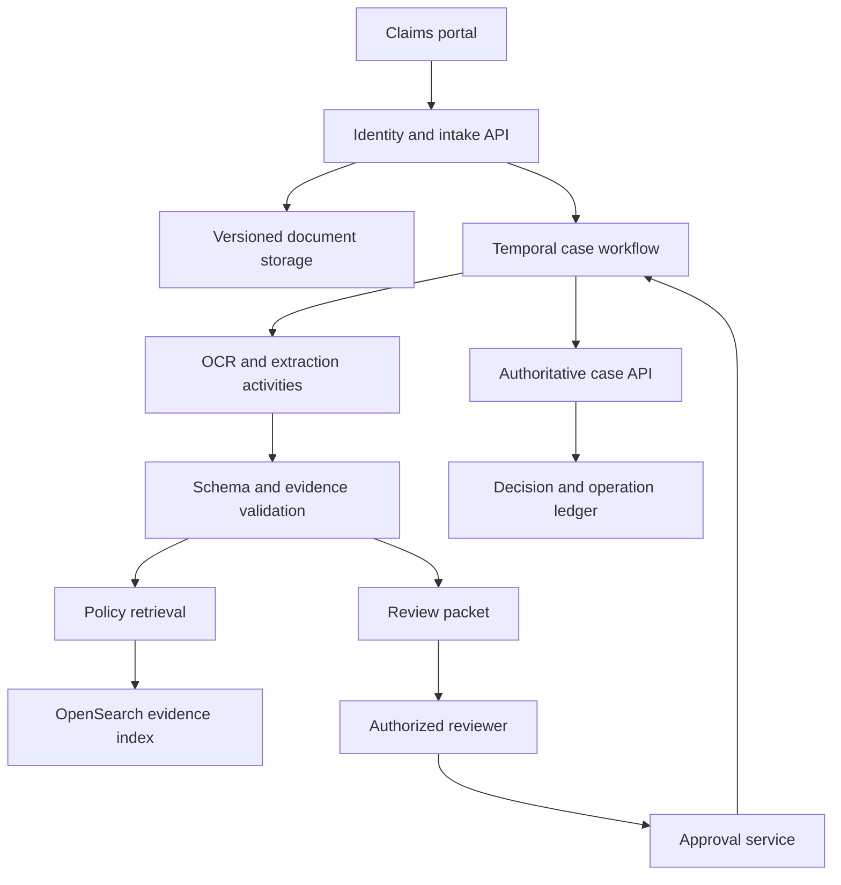
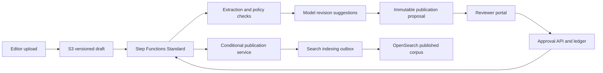

# Durable AI workflows with Temporal or AWS Step Functions

An AI workflow becomes a distributed-systems problem when it must survive a process crash, wait for a reviewer, or remember whether an external action already happened. A model can interpret a document; it should not be the only place that remembers whether a claim was submitted. Durable orchestration separates uncertain interpretation from explicit business state.

This study develops claims intake and document approval. It follows the [OpenSearch retrieval study](opensearch-retrieval.md): choose a technology from requirements, describe the mechanisms, and test the failure boundaries.

!!! note "Scope and evidence — researched September 7, 2026 (UTC)"

    Product capabilities below are grounded in the primary documentation in References. Architectures, workloads, limits, and acceptance targets are illustrative proposals, not measured deployments. Select the exact SDK, service integration, Region, and deployment version before implementation. Durable execution does not make an external side effect transactional.

## 1. What durable orchestration provides

A workflow is a state machine whose progress outlives the worker process. Its state includes completed steps, pending work, timers, and received decisions. The orchestrator dispatches executable work to workers and records outcomes. Model inference, OCR, database calls, and external APIs are activities or tasks around that state machine.

Temporal reconstructs workflow progress by replaying recorded event history against workflow code. Workflow code must obey deterministic constraints; external work belongs in activities. Its execution model includes timers, signals, child workflows, and continuation into a new run. This is distinct from saving a conversation transcript and asking a model what to do next. [^1]

AWS Step Functions expresses orchestration in Amazon States Language. Standard workflows support long-running execution and persisted state transitions; Express targets short, high-volume execution. AWS documents different execution semantics for Standard, asynchronous Express, and synchronous Express. Standard supports callback and job-wait patterns that Express does not. [^2]

The application still needs an authoritative business ledger. Orchestrator status answers “which step is pending?” The ledger answers “what claim decision is effective?” Keeping those questions separate makes reconciliation and customer support possible when one system is unavailable.

## 2. Best fit, poor fit, and reasons to choose it

| Situation | Reason to use durable orchestration | Simpler alternative to test |
|---|---|---|
| A case waits hours for review | Waiting is explicit persisted state | Database state machine and scheduled worker |
| Several remote services participate | Retries and compensation need coordination | Queue consumer for one independent operation |
| Worker deployments interrupt execution | Progress must resume safely | Restartable batch job with checkpoints |
| Customers need a status timeline | Steps and deadlines are first-class | Job table for a small linear process |
| A model chooses among approved branches | Business rules can bound the choice | Ordinary synchronous handler for one inference |

A single classification API rarely needs a workflow platform. Do not put every token or retrieval call in a separate workflow state merely because you can. State granularity should correspond to recovery or audit boundaries. An orchestrator also cannot rescue an undefined business process: someone must decide who may approve, when approval expires, and what happens after a supplier refuses a reversal.

Choose Temporal when code-centric orchestration, long-lived processes, and portability across infrastructure are important enough to justify worker and platform ownership. Choose Step Functions when AWS integration and managed orchestration fit the team's operating model. A queue plus a transactionally updated job table remains credible for a small bounded workflow.

## 3. Important mechanics

### Determinism and model decisions

A workflow must not make a fresh model call every time its history is replayed. Put inference in an activity, store the accepted structured result, and branch on that recorded result. Record input hashes, prompt and model identifiers, parser version, and the policy version that interpreted the model output. A new model deployment applies to new inference work according to an explicit rollout policy; it must not silently rewrite the meaning of an old decision.

A model output might be `document_type=repair_invoice` and a list of extracted fields. Trusted code validates schema, currency, date ranges, document references, and required fields. Confidence is an input to routing, not a substitute for validation. Unsupported or contradictory evidence becomes a review task.

### Retry taxonomy

Separate transport failures, business rejections, malformed output, and uncertain external outcomes. Retry a transient model rate limit with jitter and a deadline. Route an invalid policy number for correction. Do not repeatedly regenerate a payment request until it happens to pass validation. An activity that times out after sending a remote request has an unknown outcome, not necessarily a failed outcome.

Use stable operation keys such as `tenant:claim:revision:submit`. The destination should atomically associate that key with its result. If it cannot, maintain an operation ledger and reconcile through the destination's lookup interface before reissuing the request. A local ledger alone cannot atomically prevent duplication in an unrelated remote system.

### Human review and callbacks

Step Functions callback tasks pause until a token is returned with success or failure; integrations and permissions constrain where this pattern is available. Tokens are sensitive capabilities and should stay behind an authenticated approval service. [^3] In a Temporal design, an authenticated service can deliver a signal or update to the workflow; the service must validate the reviewer and case revision before delivery.

An approval record should contain reviewer identity, proposal hash, source revision, decision, expiration, and reason. Approving revision 4 must not approve revision 5 after another document arrives. Race the review against a durable deadline and use a compare-and-set operation so timeout and approval cannot both win.

### Compensation and cancellation

Compensation is a new business action, not a rollback of time. Canceling a reserved appointment may release a slot; canceling a sent email cannot unsend it. Define compensation per step, including who owns manual exceptions. Cancel outstanding inference and workers where possible, but treat cancellation requests separately from confirmed termination and confirmed remote reversal.

### History, messages, and deployment compatibility

Temporal's workflow-definition documentation distinguishes deterministic workflow logic from changes that alter the command sequence during replay. Use its documented versioning or patching mechanisms when changing paths followed by existing histories. A source-code deployment that compiles successfully can still be incompatible with an old running workflow. [^4]

Signals, Queries, and Updates serve different interaction needs. A signal delivers asynchronous input; a query reads workflow state; an update supports tracked state-changing interaction with a result. Choose the mechanism based on the caller's need for acknowledgment and validation, and keep external authentication in the ingress service. [^5]

For long activities, heartbeats can report progress and participate in timeout and cancellation handling. Temporal documents that activities need to heartbeat to receive cancellation through this mechanism. Checkpoint enough external progress to resume safely, but do not assume the heartbeat itself commits a remote business transaction. [^6]

A practical deployment test loads representative histories, runs replay with the candidate code, and separately exercises new activity code against destination contracts. Keep old workers available through a supported routing/versioning strategy when necessary. Bound history growth for repeating processes and use continuation deliberately, carrying the minimal business state and stable operation identifiers into the next run.

## 4. Design A: claims intake and assessment preparation

### Requirements and workload

Assume 20,000 incoming cases/day, six documents per case, a tenfold morning burst, and a one-hour target for preparing a review packet. Twenty percent require a reviewer who may respond within two business days. The system prepares evidence and recommendations; an authorized case service owns the decision and any disbursement.

The interesting scaling variable is document processing concurrency, not the number of cases sleeping in review. At an average 120,000 documents/day, a tenfold burst is roughly fourteen documents/second. If processing holds a worker slot for 30 seconds, that burst requires about 420 concurrent slots before headroom. These are sizing assumptions to benchmark, not a Temporal capacity claim.

### State and data model

| Record | Essential fields |
|---|---|
| Case | Tenant, case ID, current revision, status, owner, deadline |
| Document | Immutable object reference, hash, source revision, parser version |
| Extraction | Field values, evidence locations, validation findings, model configuration |
| Review | Proposal hash, case revision, reviewer, expiry, decision |
| Operation | Stable key, destination, requested action, outcome state, remote receipt |

Keep large documents outside workflow history. Store immutable references and minimal derived state. Encrypt sensitive objects and control history, logs, and operator-console access independently. An object reference is useful only while its retention and authorization policy allow the workflow to retrieve it.

### Request and data flow

1. Intake authenticates the caller, allocates a case revision, and persists document references before starting work. An outbox reconciles a successful database commit with a failed workflow-start request.
2. The workflow fans out bounded document processing. Each activity writes results under a deterministic case/document/version key.
3. Validation identifies missing pages, inconsistent amounts, unsupported fields, and duplicate documents. It does not interpret absence of extraction as evidence that a field is absent.
4. Retrieve the applicable policy version through OpenSearch, preserving authoritative source references and effective dates. Recheck access before sending evidence to a model; the search index does not determine the effective case policy.
5. Generate a review packet with facts, evidence, unresolved questions, and a recommendation. Persist the artifact hash before notifying the reviewer.
6. Accept review only for the current revision. A new document invalidates the old proposal and creates a new review requirement.
7. Submit the approved decision through a scoped case API with an idempotency key. Persist the receipt, reconcile the business ledger, and close the workflow.

### Failure and recovery

A worker crash after object upload but before completion reporting can leave an orphan artifact. Content-addressed writes and a reconciliation sweep avoid duplicate logical results. A policy search outage leaves the case waiting for evidence rather than authorizing a recommendation from memory. If the decision API times out after accepting a request, move to `outcome_unknown` and query its receipt endpoint.

A daily reconciler compares intake records, open workflows, review tasks, and terminal decisions. It detects cases whose workflow never started, reviews whose proposal is obsolete, and decisions that committed while orchestration reporting failed. Reconciliation is part of the architecture, not an exceptional operator script.

## 5. Design B: controlled document publication

Assume 5,000 documents/week, three review roles, revision cycles lasting several days, and a requirement that only the approved artifact becomes visible. Step Functions Standard is a candidate because the workflow combines managed AWS tasks and long callback waits. The application retains the approval ledger beyond any service-history retention period it requires.

The model proposes edits and flags missing sections; it cannot directly mutate the published object. Build a proposal from a specific input version, render it, and store its checksum. Reviewers approve that checksum with role-specific authority. Legal review, editorial review, and content ownership are independent records; whether they are sequential or parallel is a business policy versioned with the workflow.

Publication uses a conditional update of the document's active-version pointer. It verifies the proposal hash, required approvals, expected previous version, and current authority. If another publication won the race, the stale proposal is rejected. An outbox requests indexing after publication commits. If indexing fails, the document can be published but temporarily undiscoverable; the UI and operations ledger should show that distinction.

Rollback restores an authorized previous version through the same publication service and emits another indexing event. It does not delete history to make the system appear as though a bad version never existed. The search consumer checks version sequencing so a delayed old event cannot restore a superseded publication.

Keep callback tokens in the backend. The browser receives an opaque review ID and submits a decision through normal authentication. A reviewer can reject a proposal without exposing workflow internals. If a token expires, the approval service records the failed delivery and reconciles against workflow state rather than repeatedly replaying a completed approval.

This design differs from claims processing: the atomic business boundary is a publication pointer, so exactly which bytes were approved matters more than narrative completeness. Its recovery target is preservation of the last approved public version, not automatically finishing every old draft.

## 6. Alternatives and trade-offs

| Choice | Strength | Cost or limitation to investigate |
|---|---|---|
| Temporal | Workflow logic in application code; durable process model | Replay-compatible deployment, worker ownership, history growth |
| Step Functions Standard | Managed state machine and AWS integrations | Integration constraints, transition volume, AWS coupling |
| Step Functions Express | Short high-volume orchestration | Different execution semantics and no callback wait pattern [2] |
| Queue plus relational job table | Small operational surface for a linear process | Timers, review races, retries, and recovery become application code |
| Agent graph checkpointing | Natural fit for conversational state and tool loops | Checkpointing alone does not solve external side-effect reconciliation |

Neither platform turns several external services into one transaction. Neither decides whether a model recommendation is correct. The meaningful comparison is implementation and operating cost under the same failure tests, not the number of lines in a happy-path demo.

## 7. Capacity, economics, and observability

Budget for model tokens, extraction, worker compute, orchestration, durable state, object storage, audit retention, and repeated attempts. Track cost per completed case alongside cost per attempt. Reviewer delays increase pending-state count but need not occupy active compute; badly designed polling does.

Measure queue age separately for extraction, model work, review, and destination submission. Apply separate concurrency limits so a model outage cannot consume all worker slots. Use scheduled capacity or autoscaling from backlog age and measured service time. Set retry budgets across the whole case so nested retries do not multiply silently.

Useful service objectives include intake durability, time to review-ready, age of uncertain outcomes, and time to reconcile publication with search. A workflow success count is insufficient if the downstream action never committed. Carry case ID, workflow ID, revision, and operation key through traces without recording entire private documents.

## 8. Evaluation and exercises

Test orchestration separately from model quality. Use deterministic fake activities to inject crashes before and after each external boundary. Replay representative histories against candidate workflow code. Test duplicate intake, duplicate callbacks, reviewer revocation, proposal changes, expired deadlines, and lost destination responses.

For extraction, measure field accuracy and evidence support by document class. For routing, measure inappropriate automatic routing and unnecessary review. Assess reviewer corrections without treating all acceptance as proof of correctness. A release should preserve the ledger invariants even when the model fails every call.

Build a lab with three synthetic documents, a workflow worker, an approval endpoint, and an idempotent fake publication service. Stop the worker after remote commit but before acknowledgment. The acceptance condition is one published version and a reconciled receipt after recovery.

Defend these design changes:

1. A reviewer approves while a new document arrives. Which transaction determines the winner?
2. A remote API has neither idempotency nor receipt lookup. What manual boundary replaces automatic retry?
3. A workflow waits six months while its code changes. How will old execution paths remain runnable?
4. Search indexing fails after publication. What does the user see, and which system owns truth?
5. Which steps can be retried safely, and which require compensation or outcome reconciliation?

## Related studies

- [A02 · Tool-using agents with LangGraph or an agents SDK](tool-using-agents.md)
- [A03 · An MCP tool gateway for enterprise applications](mcp-tool-gateway.md)
- [P01 · Fresh retrieval indexes with Kafka or Amazon Kinesis](streaming-indexes.md)

## References

[^1]: [Temporal: Workflow execution](https://docs.temporal.io/workflow-execution) — execution, replay, event history, and workflow primitives.
[^2]: [AWS: Choosing workflow type](https://docs.aws.amazon.com/step-functions/latest/dg/choosing-workflow-type.html) — Standard and Express execution semantics, duration, billing dimensions, and integration differences.
[^3]: [AWS: Service integration patterns](https://docs.aws.amazon.com/step-functions/latest/dg/connect-to-resource.html) — request-response, job waiting, callback tokens, and permissions.

[^4]: [Temporal: Workflow definition](https://docs.temporal.io/workflow-definition) — determinism, workflow-code changes, and versioning.
[^5]: [Temporal: Workflow message passing](https://docs.temporal.io/encyclopedia/workflow-message-passing) — Signals, Queries, and Updates.
[^6]: [Temporal: Activity execution](https://docs.temporal.io/activity-execution) — activity execution, heartbeats, and cancellation.
