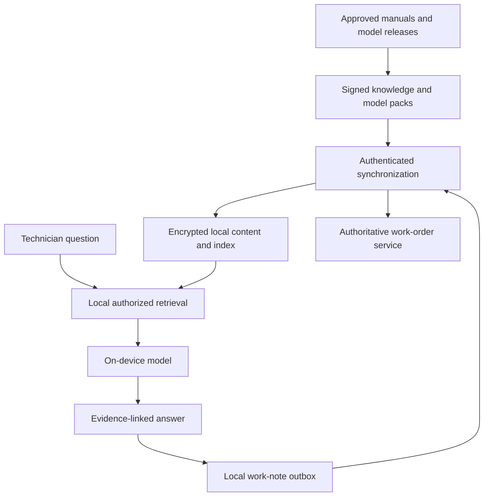
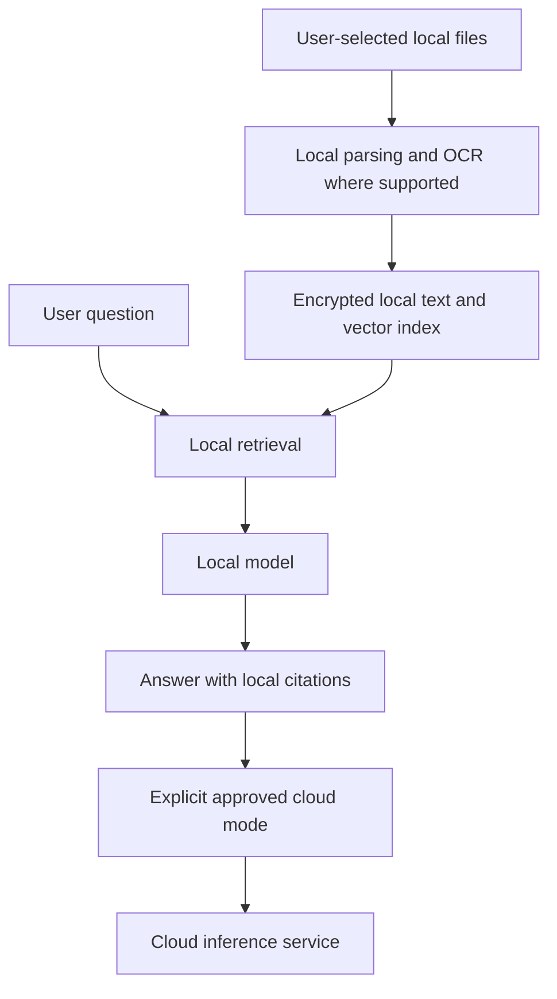

# Edge and on-device AI applications

On-device AI moves inference closer to the user or physical process. It can improve offline behavior, reduce network dependence, and keep some data local. It also constrains memory, energy, model size, update strategy, and hardware compatibility. “Runs locally” is a deployment fact, not proof of privacy or acceptable performance.

The [OpenSearch example](opensearch-retrieval.md) uses a cloud retrieval service. An edge application may instead maintain a small local knowledge index, synchronize approved content, and use cloud inference only through an explicit policy. The same source-version, authorization, and evidence principles still apply.

!!! note "Scope and evidence"

    Research date: September 7, 2026 (UTC). ONNX Runtime mobile/quantization documentation, LiteRT documentation, and the llama.cpp repository were consulted. Device classes, model sizes, latency targets, and energy budgets below are illustrative. Hardware acceleration and operator support must be verified on actual target devices and pinned runtime versions.

## 1. The available building blocks

ONNX Runtime Mobile supports running compatible ONNX models in mobile applications and documents platform-specific execution providers and optimization considerations. A model that works on a desktop CPU is not automatically accelerated on every phone: operator support, graph partitioning, precision, and device capability matter. [^1]

ONNX Runtime's quantization documentation distinguishes dynamic and static quantization, describes calibration-related workflows, and discusses accuracy debugging. Quantization changes numerical representation; it is not a universal promise of speedup on all hardware or unchanged quality. [^2]

LiteRT is Google's on-device inference runtime family, with APIs and acceleration paths for supported edge deployments. Its overview describes deployment across device types and hardware acceleration. Choose a supported runtime/model path and benchmark it rather than assuming every model can use every accelerator. [^3]

llama.cpp provides local LLM inference with supported backends and quantization formats, commonly using GGUF model files. Its repository documents supported platform/build options. It is a useful candidate for local language-model deployments, but app packaging, model licensing, secure updates, and lifecycle management remain application responsibilities. [^4]

These tools occupy overlapping but different spaces. ONNX Runtime and LiteRT serve broader model types; a local LLM runtime focuses on generation. Use the simplest runtime that supports the task and target hardware well.

## 2. What changes at the edge

### Memory and execution

Budget for model weights, activations, KV cache for generative models, runtime workspace, input buffers, the application, and the operating system. A file that fits in storage may not fit in available runtime memory. Long context and multiple simultaneous requests can exceed memory even when the model loads successfully.

Keep concurrency small and deliberate. Many mobile applications need one active generation, not a server-style request pool. Cancel work when the user leaves the screen. Avoid keeping a large model resident indefinitely if it harms the rest of the application; measure cold-start versus memory-pressure trade-offs.

### Energy and thermal behavior

A short benchmark on a cool device can overstate sustained performance. Measure repeated sessions, background load, low-battery mode, charging, and thermal throttling. An accelerator may improve energy efficiency, but unsupported operators can fall back to CPU and erase the expected benefit.

Measure useful task completion, not only tokens/second. A small model that generates quickly but needs several retries can use more energy and frustrate users. Bound output length and offer concise task-specific responses. For a field workflow, deterministic extraction or classification may be more useful than an unrestricted local chatbot.

### Offline state and synchronization

Offline applications need a local source of truth for user actions and a synchronization protocol. Model output should be stored as a proposal with source/model versions, not silently merged into authoritative cloud records. Use stable operation IDs, an outbox, and explicit conflict resolution.

A local knowledge pack has a manifest: content version, document IDs, expiry/review date, permissions, model/embedding compatibility, and signature. The app must explain when information is outdated or unavailable offline. Cloud revocation cannot instantly reach a disconnected device, so define offline access duration and encrypted-storage policy explicitly.

## 3. Cloud fallback is a product decision

A fallback changes data location, latency, availability, and cost. Establish which data classes may leave the device, what redaction is required, and whether the user must opt into that mode. The application should not silently upload private documents because the local model ran out of memory.

Route by task and capability: local extraction/classification for supported inputs, cloud analysis for approved complex tasks, and an unavailable state where neither is suitable. Keep the interface honest about which mode is active. A local-first design can still leak data through telemetry, crash dumps, synchronization, or cloud embedding calls if those paths are ignored.

Use compatible representations for local retrieval. If a cloud embedding model builds the index, the offline query encoder must produce the same vector space; a different local model cannot query it meaningfully just because dimensions match. Often a dedicated local encoder and separately built knowledge pack are simpler.

## 4. Fit and alternatives

| Approach | Good fit | Main trade-off |
|---|---|---|
| Fully on-device inference | Offline tasks and strict local processing | Device capacity, model quality, and update complexity |
| Local-first with explicit cloud escalation | Mixed easy/hard tasks and variable connectivity | Two execution paths and data-policy complexity |
| Nearby edge server | Shared site equipment and stronger local compute | Local network/server operations and failure domain |
| Cloud-only application | Strong connectivity and large-model needs | Network dependence, remote processing, and recurring cost |
| Rules or compact specialist model | Narrow detection/extraction tasks | Less flexibility, often better efficiency and testability |

On-device AI is valuable for field work, accessibility, personal document tools, and disconnected sites. It is a poor default for tasks that need a huge current corpus or large-model reasoning beyond the device's measured capability. A local search UI plus well-designed forms may outperform a small chatbot for many operational tasks.

## 5. Design A: offline field-service assistant

### Workload and architecture

Assume 5,000 technicians using managed tablets, with up to eight hours offline. Each tablet holds approved manuals for its assigned equipment, a compact retrieval encoder, and a local generation or extraction model. The illustrative target is a relevant procedure page within one second and a short grounded explanation within five seconds on the supported device class.

### Content and model flow

1. The server prepares a knowledge pack for the technician's authorized equipment scope. Include original source versions and local retrieval representations built with the packaged encoder.
2. The device verifies signature, integrity, compatibility, and available storage before staging the pack. Activate it atomically only after validation.
3. A question retrieves local evidence filtered by equipment model and active pack version. Exact error codes and part numbers need lexical matching alongside vectors.
4. The local model explains only the retrieved approved material and provides page citations. If a required procedure is absent or expired under policy, the app says so and provides the available offline workflow.
5. Work notes remain user-reviewed proposals. Synchronization sends stable operation IDs and source versions to the work-order API when connectivity returns.

The local database stores pack manifest, asset identity, document version, index version, model release, user session capability, and pending operations. Separate user notes from downloaded content so a pack replacement does not erase unsynchronized work.

### Safety and freshness

A local model should not invent missing maintenance steps or override an approved procedure. Display the actual procedure and warnings, especially when action consequences matter. If a document is known to be withdrawn before disconnection, remove or block it. If the device has been offline beyond the permitted access/freshness window, follow the defined degraded mode.

Offline revocation is a real limitation. A server cannot instantly revoke access on an unreachable device. Managed-device encryption, short-lived offline capabilities, remote wipe when reconnected, and bounded offline windows can reduce exposure, but they do not remove that physical constraint.

### Recovery and synchronization

Use dual slots or an equivalent atomic activation scheme for model/content updates. If the new package fails to load or crashes during a smoke test, retain the last known-good release. Downloads should resume by verified chunks or restart safely, with storage cleanup after activation.

The outbox retries work-note synchronization with stable IDs. If the work order changed while offline, present a conflict or merge according to field-level rules. A model-generated summary must not overwrite another technician's factual updates automatically. Preserve both versions until resolved.

If local generation fails, retrieval and source viewing can remain available. This is a valuable degradation path: the user still has the approved manual even when the model cannot answer.

## 6. Design B: private personal document assistant

### Workload and architecture

Assume a desktop/mobile app indexing 10,000 personal notes and PDFs per user, with occasional image attachments. Most questions concern a small local corpus. The product promises local processing for the default mode and offers a separately enabled cloud option for supported tasks.

### Local data handling

Index only user-selected locations and supported file types. Track file identity, content hash, modification time, and source path or platform file handle. File moves should update references without unnecessarily recomputing embeddings; content edits invalidate derived chunks. If a file is deleted or access is revoked by the platform, remove its index entries and cached answers.

Store model and embedding versions with the index. A new encoder requires a separate rebuild and coordinated query switch. Keep the old index usable until the new one is complete if storage allows. For a small corpus, lexical search may be sufficient and should remain a baseline.

Local citations must reopen the correct file and location through the platform's permitted file-access mechanism. A generated path is not a trusted file reference. Validate citation IDs against retrieved records, and never let model text request arbitrary filesystem reads.

### Cloud option and privacy

The cloud mode should show what will be sent: selected snippets or files, rather than silently uploading the whole local index. Apply the user's saved policy and task-specific selection. Keep cloud conversation state and local-only history distinct where necessary so a later cloud request does not inherit previously private content accidentally.

Telemetry can report timings, model release, and error codes without document text. Crash reports and debug logs require the same care. Do not describe the app as private merely because the main model is local while embeddings or OCR are secretly remote.

### Resource management and failure

Schedule indexing with battery/thermal and foreground-use constraints. Let users pause or limit indexing. A large first-time import should report progress and remaining files, not make the app appear frozen. Corrupt PDFs or extreme image dimensions should fail in bounded parsing workers without crashing the entire application.

If the device cannot run the chosen model, offer a supported smaller model or retrieval-only mode. Cloud fallback requires the explicit policy already described. A model update should have integrity checks, compatibility metadata, rollback, and clear storage requirements.

## 7. Capacity and economics

An illustrative 3-billion-parameter model at four bits per weight has a nominal 1.5 GB of weight values before quantization metadata and runtime overhead. Activations and generation KV cache add memory. This estimate does not mean any phone with 1.5 GB free can run it successfully.

For 100,000 local text chunks with 384-dimensional float32 vectors, raw vector values occupy about 153.6 MB before index metadata and text. Quantization or a smaller representation may reduce storage, but test retrieval quality and runtime support. Original PDFs and images can dominate the footprint.

Measure cold load, warm first token, output rate, peak resident memory, energy per task, and sustained performance over a realistic session. Test representative low/mid/high device classes and report unsupported devices explicitly. A benchmark on a developer workstation is not evidence for mobile performance.

Cost shifts from API calls toward packaging, downloads, device storage, support, and release validation. Large model updates across 5,000 devices can consume substantial bandwidth; delta delivery is useful only with reliable integrity and rollback. A nearby site server can be a good compromise when tablets cannot meet the task but local networking is reliable.

## 8. Security and evaluation

Sign model/content packages and verify hashes before activation. Protect local secrets with platform facilities and restrict file access to granted scopes. Treat models and parsers as part of the attack surface: malformed inputs, custom model code, and untrusted packages need controlled handling. Keep dependencies and runtime builds patchable.

Evaluate the exact quantized model on the target runtime and devices. Compare extraction accuracy, retrieval recall, grounded-answer quality, and abstention against a stronger baseline. Include low-memory conditions, thermal throttling, airplane mode, interrupted downloads, expired knowledge packs, and synchronization conflicts.

Test that local-only mode makes no content-bearing network requests. Inspect telemetry and crash paths as well as inference. Verify deletion across local indexes, caches, previews, and synchronized copies according to the product policy. Demonstrate that a failed update rolls back without losing user notes.

## 9. Practice: defend the design

1. Measure the same task on three device classes after 20 minutes of sustained use.
2. Show how an offline query uses a compatible encoder and knowledge-pack version.
3. Explain the exact limit of revocation while a device is disconnected.
4. Interrupt a model update and prove the old release remains usable.
5. Edit a work order in two places and demonstrate conflict handling on reconnect.
6. Verify that local-only mode sends no document content through telemetry or fallback.

## Implementation review: capability negotiation

At startup, build a device capability profile from observed runtime support, available memory/storage, and the packaged model's requirements. Do not rely only on a marketing device name. Select a tested execution path and record whether operations fall back to CPU. If the profile changes under memory pressure, degrade deliberately instead of repeatedly crashing and restarting inference.

Separate model compatibility from content compatibility. A knowledge pack can be current but unusable with the installed encoder; a model can load while the local index belongs to a different embedding space. Activation should validate the complete bundle and retain a clear error state when only part of an update arrived.

Test synchronization with long offline periods and clock changes. Use server-assigned versions and stable operation IDs for conflict resolution rather than trusting device wall time alone. Expiry UX should explain that content needs refresh without deleting unsynchronized user notes. This keeps freshness controls from causing data loss in the exact conditions where the user most needs offline reliability.

## Related studies

- [S02 · Self-hosted inference with vLLM or NVIDIA Triton](self-hosted-inference.md)
- [D03 · A real-time voice assistant](realtime-voice.md)
- [P04 · A secure multi-tenant AI platform](secure-multi-tenant-platform.md)

## References

[^1]: [ONNX Runtime: Mobile](https://onnxruntime.ai/docs/tutorials/mobile/) — mobile deployment and execution-provider considerations.
[^2]: [ONNX Runtime: Quantize ONNX models](https://onnxruntime.ai/docs/performance/model-optimizations/quantization.html) — quantization methods and accuracy/performance considerations.
[^3]: [Google: LiteRT overview](https://ai.google.dev/edge/litert/overview) — on-device runtime and supported acceleration paths.
[^4]: [ggml-org: llama.cpp](https://github.com/ggml-org/llama.cpp) — local LLM runtime, backends, and model-format support.
