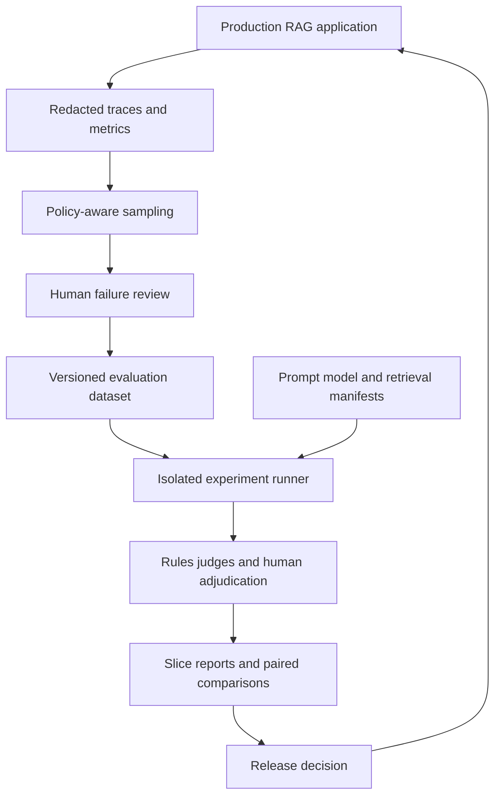
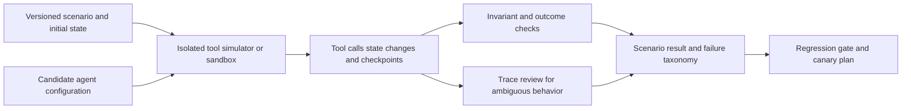

# An evaluation and observability platform for AI

An AI evaluation platform connects a proposed change to evidence about quality, safety, latency, and cost. Observability explains what happened in a run; evaluation judges whether that behavior was acceptable. Neither a trace viewer nor an average model-judge score is enough to decide that a release is better.

This chapter develops a RAG quality platform for the [OpenSearch assistant](opensearch-retrieval.md) and an agent regression platform. The goal is a repeatable decision process with versioned datasets, interpretable metrics, human review, and operational feedback.

!!! note "Research and assumptions"

    Primary LangSmith, OpenTelemetry, and OpenAI documentation was reviewed September 7, 2026 (UTC). Workloads and release thresholds are illustrative. OpenAI's current Evals guide announces a platform deprecation; this chapter therefore keeps the evaluation architecture portable rather than recommending a new dependency on that platform. Verify current provider availability before implementation.

## 1. What the platform owns

The platform owns dataset versions, run manifests, evaluator versions, experiment execution, result storage, review workflows, and release evidence. It does not own the definition of business success by itself: product and domain owners must specify what a correct task outcome means.

LangSmith distinguishes offline evaluation on curated datasets from online evaluation of production interactions, and supports code rules, human review, model judges, and pairwise comparison. These are complementary methods with different evidence limits. [^1]

OpenAI's Evals documentation describes defining a task, running test inputs, and analyzing results, but currently states that its Evals platform is being deprecated, with read-only and shutdown dates in late 2026. Preserve datasets and scoring contracts independently of a hosted UI. [^2]

OpenTelemetry provides a standard ecosystem for traces and metrics; its GenAI semantic-convention landing page now points to a separate convention repository. Pin the instrumentation schema you actually use rather than assuming attribute names are permanently stable. [^3]

## 2. The evidence model

Every experiment needs a manifest containing application commit, prompt revision, model/provider identifier, retrieval configuration, embedding revision, corpus snapshot or source versions, tool schema, dataset version, evaluator version, and execution settings. Without these, a changed score may be impossible to explain or reproduce.

A dataset example contains an input, task context, expected behavior or rubric, relevant source IDs where applicable, access scope, slice labels, and provenance. A reference answer is one useful representation, but many tasks have several valid outputs. Store expected constraints and outcomes rather than overfitting to one phrasing.

An evaluation result stores raw observations, deterministic checks, judge output, human adjudication, failure category, latency/cost, and the evaluator revision. Keep “not evaluated,” “evaluator failed,” and “application failed” separate. A timeout in the judge must not be recorded as a passing application response.

### Three kinds of checks

Deterministic checks cover properties such as schema validity, required fields, citation ID membership, forbidden tool calls, and budget limits. They are cheap and reproducible but cannot fully judge factual support or usefulness.

Model judges can score claim support, relevance, or pairwise preference at scale. They are fallible and can be biased by verbosity, ordering, style, and their own model family. Calibrate them against human labels and report agreement by slice. A judge explanation is not independent proof that its score is correct.

Human review handles ambiguity, domain correctness, and adjudication. Reviewers need the question, evidence, rubric, and relevant trace context, not only the final answer. Use blind ordering for comparisons where possible and record disagreements rather than forcing an artificial consensus.

## 3. Sampling and statistical discipline

A useful dataset covers common tasks, high-impact rare cases, and known regressions. Split by source document, customer, task family, or time where leakage is possible. Randomly splitting near-duplicate conversations can make an experiment look better because the test set contains the training examples in slightly different words.

Report quality by slices: language, tenant size, query type, source freshness, tool count, and authorization scenario. An overall average can improve while a small but important group regresses. Keep a stable holdout for release decisions and a separate development set for rapid iteration.

For stochastic systems, run repeated trials where variance matters. Compare paired results on the same examples and inspect confidence intervals or bootstrap intervals appropriate to the metric. Do not interpret a tiny score increase on twenty questions as a reliable product improvement. Choose sample sizes from the decision's risk and expected effect, not an arbitrary round number.

Online sampling must account for selection bias. Users who click thumbs-down are not a random sample, and successful-looking conversations may hide silent abandonment. Sample a baseline of ordinary traffic, enrich with failures, and label the sampling scheme so aggregate metrics are not misleading.

## 4. Design A: RAG quality and release platform

Assume 100,000 production questions per day, a 2,000-question curated suite, 20 candidate configurations per week, and 1% baseline trace sampling plus all selected failures. The platform must compare lexical, vector, hybrid, and reranked retrieval while keeping access constraints identical. Raw private content is retained only where approved.

### Trace and dataset state

A RAG trace records identity-check outcome, retrieval route, candidate IDs and ranks, source versions, permission rejection counts, reranking configuration, selected context IDs, model revision, token usage, latency, and final citation IDs. Full text is optional and separately access-controlled. A trace ID should not become an unrestricted path to private source material.

The dataset stores approved question/context fixtures with expected relevant documents, forbidden documents, and answerability labels. Keep exact-ID queries, paraphrases, conflicting versions, missing evidence, and selective tenant filters. Include source deletion and permission revocation scenarios as stateful fixtures, not just static question-answer pairs.

### Experiment flow

The runner creates an isolated application configuration and a fixed corpus/access snapshot. It runs the same examples through each retrieval candidate, recording raw retrieval and final answers. Deterministic checks verify that forbidden evidence never reaches the model, citations refer to selected sources, and output schemas are valid.

Retrieval evaluators measure recall@k, nDCG, exact-ID success, and diversity. Answer evaluators measure claim support, completeness, and abstention. These layers diagnose different failures: a correct passage missing from retrieval needs a different fix from a model ignoring a retrieved exception.

For “Can this contractor export reports?”, the test includes the contractor policy, an attractive but unauthorized administrator document, and the expected applicability rule. A model answer that happens to say “no” after seeing unauthorized evidence still fails the security gate. Correct final wording does not excuse a broken information boundary.

### Release gates

Define non-negotiable constraints separately from quality trade-offs. Unauthorized content in tested model payloads or an invalid action is a blocking failure. A small latency increase may be acceptable if task success improves within the cost budget. Do not average a severe security failure into a high overall score.

A proposed release passes the stable holdout, critical slices, and operational load checks, then enters a limited canary. Compare production task outcomes and drift indicators before broad rollout. Keep the previous configuration available, but ensure rollback does not restore obsolete corpus or permission behavior.

### Failure and recovery

If the judge provider is unavailable, deterministic checks and human review can continue; the release remains pending where judge evidence is required. If tracing fails, serving should normally continue with a bounded local buffer or dropped nonessential telemetry, while alerting on lost visibility. Do not allow an observability outage to exhaust the application's memory.

Dataset corruption or accidental private-data ingestion requires version withdrawal and downstream lineage inspection. Experiments already run on that data should be marked affected. A dataset edit must create a new version rather than silently changing the meaning of historical reports.

## 5. Design B: agent regression and tool-safety platform

Assume an operations assistant with ten tools, 300 multi-step scenarios, and 15 releases per month. Some scenarios require human approval, some must stop without action, and some involve transient tool failures. The evaluator must judge state transitions and side effects, not only the final response.

### Scenario model

A scenario defines initial business state, user instruction, available tools, allowed actions, required approval points, fault schedule, and expected terminal state. For a refund workflow, the correct outcome may be “prepare a proposal and wait,” not “refund succeeded.” The evaluator must distinguish authorization from task completion.

Tool simulators implement realistic schemas, errors, and state transitions. A success response changes simulated state; a timeout may represent either no effect or an uncertain effect, depending on the scenario. This forces the agent to handle idempotency and verification rather than learning that every timeout is safely retryable.

Use a real sandbox for behaviors a simulator cannot represent faithfully, such as code execution or filesystem changes. Keep network access and credentials scoped to the test. Production replay must not repeat external side effects; replace action tools with safe adapters or recorded outcomes.

### Execution and scoring

Run the candidate from the same initial state, capturing each tool call, arguments, policy decision, checkpoint, and resulting state. Check invariants after every step: no cross-account access, no action before approval, no duplicate payment, bounded tool calls, and no use of untrusted text as instructions.

Score task outcome separately from efficiency and explanation quality. An agent that reaches the correct final state after an unauthorized intermediate action fails. An agent that safely stops because required evidence is unavailable may pass, even if it did not complete the requested business operation.

Human reviewers inspect ambiguous paths and new failure classes. A model judge can summarize traces or flag likely issues, but deterministic state assertions should decide properties that can be computed exactly. Do not ask a language model to guess whether a database balance changed correctly when the simulator can compare it directly.

### Fault injection and recovery

Inject rate limits, malformed tool output, expired credentials, partial writes, and process restarts after checkpoints. Verify that resumption does not repeat irreversible actions. Test cancellation and budget exhaustion: a bounded agent should explain the stop state and preserve useful work rather than loop until the provider rejects it.

If the runner crashes, resume or restart from an explicit scenario snapshot. Mark incomplete runs as incomplete. Store enough deterministic seed/configuration information to reproduce simulator behavior, while recognizing that hosted model output may remain nondeterministic.

## 6. Platform choices and trade-offs

| Approach | Best fit | Trade-off |
|---|---|---|
| LangSmith or similar evaluation platform | Integrated traces, datasets, experiments, and review | Vendor data boundary, cost, and portability need review |
| OpenTelemetry plus owned storage/runners | Existing observability platform and custom evaluation needs | More UI, dataset, and scoring engineering |
| Provider-specific evaluation service | Supported model workflow and acceptable lifecycle | Availability, export, and deprecation risk |
| Lightweight versioned files and scripts | Small team and bounded application | Manual review and reporting become harder at scale |

Start with a portable dataset format and explicit evaluator contracts even when adopting a hosted platform. Trace portability does not automatically imply dataset or experiment portability; retain source manifests and scoring logic separately.

## 7. Capacity and economics

A 2,000-example suite across four variants and three repetitions creates 24,000 application runs before judge calls. If each answer is graded by two models, evaluation inference can exceed serving cost for a small product. Use cheap deterministic checks first, targeted suites during development, and broader runs for release candidates.

Storage grows with trace payload size and retention. Candidate IDs and timing metadata are much smaller than complete prompts and documents. Retain raw content only where it is necessary and approved, with restricted review access. Sampling controls cost but must preserve enough ordinary traffic to detect broad regressions.

Measure cost per evaluated scenario, reviewer minutes per failure, judge disagreement, and time from production issue to regression fixture. A platform that produces many scores but no actionable diagnosis is not delivering useful evidence.

## 8. Practice: defend the release

Create a RAG suite with one relevance regression, one permission leak, and one unanswerable question. Show how retrieval and answer metrics separate the failures. Calibrate a model judge against human labels and identify cases where verbosity changes its preference.

Then build an agent scenario with an uncertain tool timeout after a side effect. Verify that the agent checks state before retrying. Explain why final-answer quality cannot detect the duplicate action. Finally produce a release report with paired comparisons, slice failures, cost/latency, and unresolved evidence gaps rather than a single green score.

## Implementation checkpoint: dataset versions and judge calibration

LangSmith documents dataset versioning, tags, filtered views, splits, and export. [^4] Pin the exact version used for each experiment; comparing a new model on today's expanded dataset with yesterday's baseline on an older dataset confounds model quality with test-set changes. Rerun the baseline when the dataset changes.

Its evaluation concepts distinguish component-level criteria, reference-based and reference-free evaluation, and different online/offline targets. [^5] A production trace without a reference answer can still support schema checks and targeted review, but it should not be reported as equivalent to a fully labeled correctness test.

OpenAI's evaluation guidance warns against unrepresentative datasets and automated metrics that are not calibrated against human evaluation. [^6] Treat that as a methodological principle independent of any hosted platform. Build a judge calibration set containing concise correct answers, verbose unsupported answers, valid abstentions, and superficially convincing citation errors.

For pairwise judging, swap answer order and measure preference stability. For rubric scoring, inspect disagreement around the release threshold. If a judge cannot reliably distinguish the failures that matter, use it for triage and retain human adjudication for the gate. Store the judge prompt, model, and rubric revision in the run manifest so a judge upgrade is itself an evaluated change.

The separate OpenTelemetry GenAI repository covers spans, metrics, events, MCP, and provider conventions. [^7] Use the supported convention version for interoperability, with application-specific fields for source generations and policy outcomes. Do not force private content into telemetry merely because a schema permits recording it.

## Related studies

- [A07 · Multi-agent task coordination](multi-agent-coordination.md)
- [P03 · A feedback and model-adaptation pipeline](feedback-model-adaptation.md)
- [S01 · A multi-provider LLM gateway](llm-gateway.md)

## References

[^1]: [LangSmith evaluation](https://docs.langchain.com/langsmith/evaluation) — offline/online workflows and evaluator types.
[^2]: [OpenAI: Working with evals](https://platform.openai.com/docs/guides/evals) — evaluation workflow and current platform deprecation notice.
[^3]: [OpenTelemetry GenAI conventions landing page](https://opentelemetry.io/docs/specs/semconv/gen-ai/) — current move to the dedicated convention repository.

[^4]: [LangSmith dataset management](https://docs.langchain.com/langsmith/manage-datasets) — versioning splits and export.

[^5]: [LangSmith evaluation concepts](https://docs.langchain.com/langsmith/evaluation-concepts) — evaluation targets and references.

[^6]: [OpenAI evaluation best practices](https://platform.openai.com/docs/guides/evaluation-best-practices) — representative data and human calibration.

[^7]: [OpenTelemetry GenAI conventions repository](https://github.com/open-telemetry/semantic-conventions-genai) — current convention scope.
