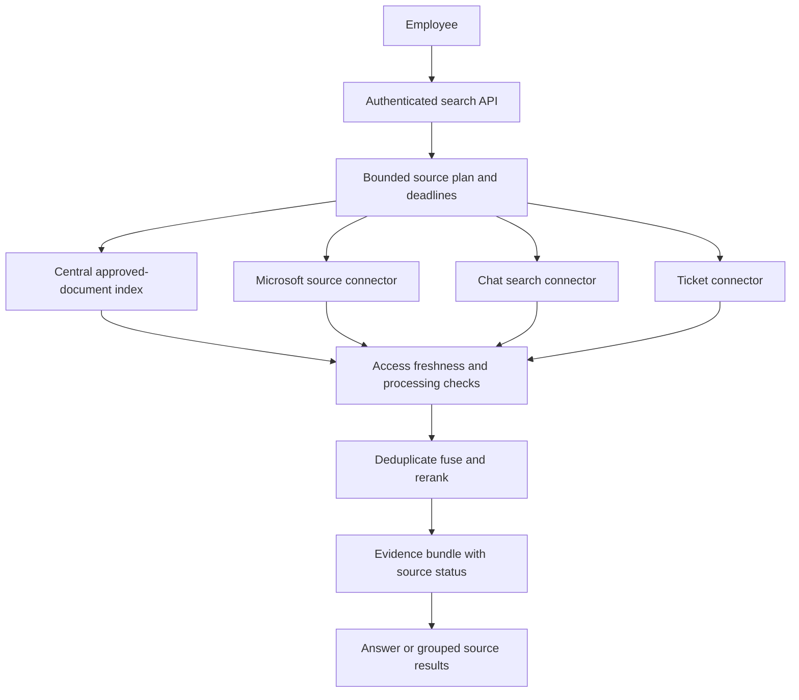
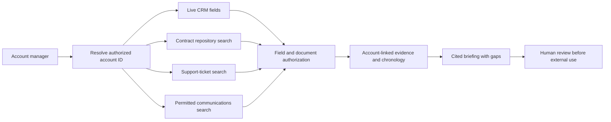

# Permission-aware retrieval across multiple sources

An enterprise assistant rarely has one clean corpus. Knowledge lives in document repositories, chat, CRM records, tickets, and transactional systems, each with its own permissions and freshness rules. The central design decision is which material to copy into an index, which to search in place, and how to combine evidence without broadening access.

This chapter develops company-wide search and customer-account research. It extends the [OpenSearch design](opensearch-retrieval.md) from a single derived index to a mixed architecture with source-native retrieval and explicit completeness boundaries.

!!! note "Research and assumptions"

    Primary Microsoft Graph, Slack, and Azure Search documentation was reviewed September 7, 2026 (UTC). Workloads and proposed control mechanisms are illustrative. Source APIs differ by token type, scope, tenant policy, and version; a connector that can authenticate is not automatically authorized to return every document to every user.

## 1. Central index, federation, or both

A central index copies selected source content into a retrieval system. It offers consistent ranking, lower serving latency, and freedom to choose chunking and embeddings. It also creates a second permission and retention boundary, and it must handle updates, deletions, and revocations.

Federated retrieval queries source services at request time. It can preserve source-native search and current permissions, but inherits latency, quotas, query-language differences, and partial outages. It may not expose enough text or metadata for high-quality cross-source ranking. Source-native search can itself be eventually updated, so federation is not a universal guarantee of immediate content freshness.

A hybrid design centralizes stable approved knowledge and federates volatile or sensitive records. For example, approved manuals can live in OpenSearch while account entitlements come from CRM and private messages are searched with the user's delegated context. The application describes which sources were consulted rather than implying a complete enterprise answer.

Microsoft Graph Search supports several Microsoft 365 content types and external items, with permission requirements varying by entity and scenario. Its overview is a capability map, not a guarantee that one generic token works across every source. [^1]

Slack's `search.all` documentation describes user-token behavior, pagination, source-specific response groups, and error handling. It also notes that user search filters can affect results. These details illustrate why a connector needs a tested source contract rather than merely a common `search(query)` wrapper. [^2]

## 2. The connector contract

Define a typed interface containing more than text and score. Each connector returns source identity, object ID, version or observation time, evidence location, content classification, authorization context, pagination/completeness state, and a source-specific error classification.

| Contract field | Why it matters |
|---|---|
| `source_id`, `object_id`, `fragment_id` | Stable deduplication and citation identity |
| `source_version`, `observed_at` | Freshness and replay explanation |
| `authorization_scope` | Evidence of the context used, without exposing credentials |
| `content`, `title`, `location` | Retrieval and citation payload |
| `rank`, `score_type` | Ranking without pretending raw scores are comparable |
| `has_more`, `truncated`, `status` | Honest completeness and partial-failure handling |
| `retention_class`, `allowed_processing` | Controls on caching, logging, and model exposure |

Credentials never enter the model prompt. The connector obtains short-lived or otherwise approved credentials through a server-side credential broker. A model can request “search tickets for account X,” but application policy selects the account, connector, and permitted fields.

### Ranking across sources

Raw scores from different services are not directly comparable. Use rank fusion, a calibrated source-aware ranker, or separate grouped results. A source with 1,000 chat messages should not overwhelm one authoritative policy document simply because it returned more hits.

Retrieve bounded candidates per source, deduplicate canonical objects, and keep provenance when the same document appears in several systems. Prefer an authoritative current policy over a copied chat excerpt, while retaining the excerpt when it adds context. Rerank only after all candidates have passed access and processing-policy checks.

### Permission and freshness boundaries

For centralized content, indexed ACL strings are coarse filters. Microsoft's security-filter pattern explicitly treats principal IDs as strings, not authentication; the trusted application must construct and enforce them. [^3]

For federation, use the user's permitted context where the API supports it and test whether the source actually trims results as required. Some APIs require application permissions and separate access checks. A broad service token must not become a shortcut when delegated authorization fails.

Permission checks must occur before evidence enters an external reranker, LLM, cache, or trace store. If a source can only perform broad search and the organization prohibits that intermediate exposure, the connector is not suitable for the chosen architecture. Filtering after generation is too late.

## 3. Design A: company-wide search and answers

Assume 10,000 employees, four source families, 200,000 approved documents in a central index, and 30 peak questions per second. A proposed budget is 1.5 seconds for evidence retrieval and six seconds for complete answers. Some sources are optional for a given question; required sources determine whether an answer can be considered complete.

### Source registration and ingestion

A source registry lists owner, permitted content types, identity mechanism, freshness expectations, processing restrictions, and connector health. Centralized documents pass an approval/classification pipeline before parsing and embedding. Their index records source versions and access tags; permission changes and deletions flow separately from content updates.

Federated sources do not automatically become a persistent corpus. Store only the metadata and excerpts allowed by their retention policy. A transient response cache can still contain sensitive data and needs explicit TTL, access scope, and deletion handling. Citation links resolve through source authorization rather than a permanently public copy.

### Request flow

The application authenticates the user, resolves their organization, and classifies the information need into a bounded plan. A benefits-policy question can search the approved-policy index first; an incident-history question may require tickets and chat. The plan is constrained by allowed sources and a maximum fan-out, not an open-ended agent loop.

Issue independent source calls concurrently with per-source deadlines and rate-limit budgets. Propagate cancellation when the overall request deadline expires. Collect partial statuses explicitly: success with no results, timeout, access denied, truncated results, and source unavailable are different outcomes.

Validate access and active versions, then fuse ranks and remove duplicate passages. Build an evidence bundle containing source IDs, observation times, and completeness notes. Generate only claims supported by that bundle. For “Did anyone approve the exception?”, failure to search the approval system must not become “No one approved it.”

### User experience under partial failure

A source-results view can show completed sources immediately while optional ones continue within a bounded deadline. If a required source fails, return an incomplete-search explanation and available permitted evidence. Do not silently retry with broader credentials or ask the model to fill gaps from general knowledge.

If the user asks a direct policy question and the authoritative policy source succeeds, a chat timeout may be irrelevant. If they ask for all communications about an incident, that same timeout materially limits completeness. The query plan should encode required versus optional sources so the answer logic can distinguish these cases.

### Recovery and operations

Maintain per-connector circuit breakers and concurrency limits. Retry transient failures with jitter within the request budget; queue background rechecks only when the product actually supports asynchronous follow-up. Respect source-specific retry guidance rather than multiplying retries across several layers.

Test token expiration, source schema changes, pagination, renamed objects, and deleted content. A connector health check should include a permitted known document and a denied document, not just an HTTP 200. Record source-level latency and result counts without copying all private text into logs.

## 4. Design B: customer-account research assistant

Assume 2,000 account managers, 300,000 accounts, and 8,000 research requests per day. The assistant combines CRM records, support tickets, approved contracts, and recent account communications into a cited briefing. Financial commitments and current contract terms require authoritative reads; historical notes can tolerate modest lag.

### Identity and joins

Resolve the account through a canonical registry rather than a name-only search. Subsidiaries, renamed customers, and similar organization names can otherwise cause cross-account leakage. Connector queries use approved account mappings and allowed contact domains, but domain membership alone is not proof that a message belongs to the account.

The evidence model records canonical account ID, source object ID, relationship type, event date, observation time, and confidence/review state for inferred links. Contract facts and CRM fields are marked authoritative; a salesperson's note is an assertion with provenance. Do not collapse these into an undifferentiated summary.

### Request flow

Authenticate the account manager and verify access to the selected account. Read current CRM fields and contract status first. Search tickets and communications with source-specific authorization. Join evidence by canonical account and explicit references, then order events by their actual event date rather than ingestion time.

For “Prepare me for the renewal call,” the briefing separates current contract terms, unresolved support issues, recent customer statements, and missing information. It should not turn a draft email offering a discount into an approved commercial commitment. Quote or cite disputed assertions rather than smoothing them into a single narrative.

Generation receives only the fields needed for the briefing. Payment details, personal contact data, and unrelated customer records are excluded unless the task explicitly requires them and policy permits processing. The briefing can be reviewed internally; sending it externally remains a separate authorized action.

### Failure and stale data

If CRM is unavailable, the assistant can prepare a historical activity summary but must not claim current renewal value or account ownership. If contracts cannot be searched, it should not infer terms from support notes. If communications are incomplete because of pagination or source filters, state that the communication review was partial.

Cache account research by user/access scope, account ID, source revisions, and a short freshness window. Revalidate contract and CRM fields when reopening a cached briefing. A role change or account reassignment invalidates access even when the summary text has not changed.

## 5. Trade-offs and alternatives

| Approach | Main advantage | Main cost |
|---|---|---|
| Central index | Uniform ranking and predictable serving | Data duplication, ACL synchronization, and deletion responsibility |
| Pure federation | Source-native access and less persistent copying | Tail latency, quotas, and inconsistent search semantics |
| Hybrid | Place each source according to freshness and control needs | More explicit routing and completeness logic |
| Managed connector platform | Reduced connector implementation work | Must verify exact permission and retention semantics |
| Source links without synthesis | Lower generation risk and clear provenance | More user effort to combine evidence |

A common interface is valuable only if it preserves source differences. Do not normalize away truncation, permission errors, or freshness metadata in pursuit of a clean API. Those differences determine whether an answer is safe and complete.

## 6. Capacity and cost

If a request fans out to four sources, 30 user requests per second can create up to 120 source calls per second before pagination and retries. Budget by source quota and user distribution, not just application QPS. A single large customer can exhaust a source's shared tenant quota.

The critical path is roughly authentication plus the slowest required source plus policy checks, ranking, and generation. Optional sources should not always determine tail latency. Measure end-to-end distributions and deadline cancellation; a timed-out HTTP request that continues running still consumes quota.

Costs include connector development and maintenance, credential infrastructure, central index storage, parsing/embedding, source API limits or charges, reranking, generation, and operational support. A federated design can save storage while increasing request-time cost. A central index can save API calls while increasing permission and retention engineering.

## 7. Evaluation and release gates

Build a matrix of users, groups, accounts, sources, and allowed/denied documents. Test access at every downstream boundary, including logs and cached summaries. Add revocation, guest access, account reassignment, source timeout, truncated pagination, and stale central-index cases.

Evaluate retrieval recall per source and cross-source answer correctness. Measure whether the assistant distinguishes authoritative facts from informal discussion and whether it reports incomplete searches accurately. A no-result response is correct only when the required search completed under the intended scope.

Run connector contract tests against a controlled fixture set whenever APIs or permissions change. Track source coverage and failure rates separately from answer satisfaction. A fluent summary built from only one functioning source can otherwise look healthy while the federation is failing.

## 8. Practice: defend the federation

Create two sources with overlapping documents and different permissions. Search as two users, then revoke one document between requests. Demonstrate that the cache and reranker cannot see stale unauthorized content. Inject a timeout in the source required to answer a completeness question and show how the response changes.

Explain which source is authoritative for each claim in an account briefing. Compare centralizing that source with searching it live, including deletion, quota, and latency costs. Finally show how a connector reports pagination and user-filter effects without disguising partial results as a complete enterprise search.

## Implementation checkpoint: delegated identity and source quotas

Microsoft Graph distinguishes delegated permissions used with a signed-in user from application permissions used without one. Application permissions can grant broad organizational access; the required authorization design depends on the actual API scenario. [^4] Record the permission type per connector operation instead of assuming the entire connector has one universal security mode.

A delegated call can simplify user-scoped access where supported. An application-permission call may be appropriate for approved background indexing, but its results still need the application's end-user authorization boundary. Never replace a failed delegated call with a broad application call as an automatic availability fallback.

Slack documents HTTP 429 responses with a `Retry-After` interval, and rate-limit scope can be specific to a method, app, and workspace. [^5] Model connector budgets at that scope. A global circuit breaker can unnecessarily disable healthy workspaces, while unrestricted per-request retries can repeatedly exceed the same shared quota.

For a useful load test, run several users in one workspace and another user in a separate workspace. Exhaust one method's budget and verify that the application reports that source as temporarily incomplete without broadening credentials or blocking unrelated sources. Record the retry deadline in connector state and skip calls that cannot finish within the request budget. This turns rate limiting into an explicit product behavior rather than an unpredictable tail-latency spike.

## Related studies

- [R01 · Retrieval with Amazon OpenSearch](opensearch-retrieval.md)
- [A03 · An MCP tool gateway for enterprise applications](mcp-tool-gateway.md)
- [P04 · A secure multi-tenant AI platform](secure-multi-tenant-platform.md)

## References

[^1]: [Microsoft Graph Search overview](https://learn.microsoft.com/en-us/graph/search-concept-overview) — supported search entities and permission-dependent scenarios.
[^2]: [Slack `search.all`](https://docs.slack.dev/reference/methods/search.all/) — token behavior, result groups, pagination, and errors.
[^3]: [Microsoft security-filter pattern](https://learn.microsoft.com/en-us/azure/search/search-security-trimming-for-azure-search) — trusted application filtering versus authentication.

[^4]: [Microsoft Graph permissions](https://learn.microsoft.com/en-us/graph/permissions-overview) — delegated and application access.

[^5]: [Slack Web API rate limits](https://docs.slack.dev/apis/web-api/rate-limits/) — 429 handling and quota scope.
