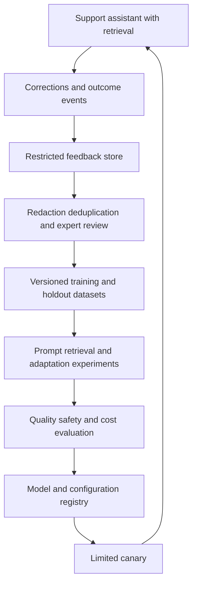
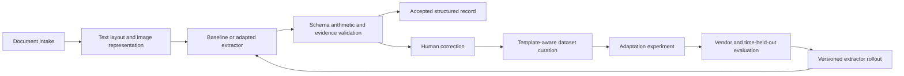

# A feedback and model-adaptation pipeline

A model-adaptation pipeline turns observed failures into tested changes. The first decision is whether the model needs training at all. Missing source material calls for better retrieval; inconsistent formatting may need a schema or prompt; stable domain behavior may justify supervised fine-tuning; subjective output preferences may justify preference optimization.

This chapter develops a domain-specific support model and a specialized extraction model. It builds on the [OpenSearch retrieval example](opensearch-retrieval.md): retrieval remains the place for current, attributable knowledge even when the generation model is adapted.

!!! note "Research and assumptions"

    Primary OpenAI guidance, the LoRA and DPO papers, and Hugging Face documentation were reviewed September 7, 2026 (UTC). Workloads and training proposals are illustrative. OpenAI's current fine-tuning guides state that its platform is winding down and is unavailable to new users; they are used here for method concepts and availability caution, not as a recommendation to start a new training dependency there.

## 1. Diagnose the failure before choosing the intervention

A user correction is evidence about an interaction, not automatically a training example. It may reflect stale source data, a retrieval miss, an ambiguous task, an interface problem, or a preference that should apply only to one customer. Start with a failure taxonomy and an explicit hypothesis about what a change will improve.

| Observed failure | First intervention to test |
|---|---|
| Correct policy never retrieved | Ingestion, chunking, filters, or ranking |
| Correct evidence retrieved but ignored | Prompt, context structure, or model behavior |
| Invalid JSON or missing required fields | Structured output and deterministic validation |
| Consistent domain-specific response pattern is weak | High-quality supervised examples, then adaptation if needed |
| Several valid outputs differ in preferred style | Preference data with a clear rubric |
| Current factual value is wrong | Authoritative lookup or retrieval refresh, not memorization |
| Unauthorized action | Application policy/tool boundary, not training alone |

Supervised fine-tuning teaches from input/desired-output demonstrations. DPO uses preferred and non-preferred responses for the same prompt. The current OpenAI method guides describe these data shapes and emphasize evaluation, while also announcing their platform's wind-down. [^1] [^2]

LoRA freezes base weights and trains low-rank adaptation matrices, reducing the trainable parameter set. Its original paper reports results for specific experiments; those results do not guarantee your task's quality, memory use, or serving performance. [^3]

DPO's paper derives a preference-optimization objective that avoids fitting a separate reward model in the described formulation. That does not remove the need for good preference labels, held-out evaluation, or control of distribution shift. [^4]

## 2. Feedback is a data product

A useful feedback record links the original request, application configuration, retrieved evidence, answer, user correction, task outcome, and permission/consent state. Keep the original and corrected output distinct. A thumbs-up is a weak signal; a reviewed correction with a source-supported rationale is stronger.

Separate raw feedback from approved training data. The raw zone is access-controlled and retention-limited. A curation pipeline removes irrelevant personal information, checks source rights, deduplicates examples, validates labels, and assigns failure categories. Model-generated labels are proposals until the chosen quality process approves them.

Record dataset lineage: source interaction IDs, transformation code, reviewer, rubric revision, and exclusion reasons. A dataset card or equivalent documentation explains intended use, collection, limitations, and evaluation scope. Training data should be reviewable as a versioned artifact, not an opaque export from production logs.

### Leakage and representativeness

Split by customer, document family, template, or time where examples are correlated. Near-duplicate tickets in train and test can produce misleading gains. Keep a stable test set out of prompt tuning, retrieval tuning, and training selection. If failures from the test set become training data, retire that test version and create a new holdout.

Feedback is biased toward users who respond and cases the current system exposes. Include a baseline sample of ordinary traffic and targeted difficult cases. Report performance by language, customer segment, product version, and document type. A model can improve on the common slice while becoming worse on the users most likely to need help.

### Label quality

For supervised data, the desired output must be correct under the supplied evidence and task constraints. Do not train an answer that depends on facts absent from the input unless the task intentionally requires stable model knowledge. For preference pairs, both outputs should correspond to the same input and the preference should follow a clear rubric.

A preferred answer should not win merely because it is longer, more confident, or more agreeable. Include examples where abstention, asking a necessary question, or declining an unauthorized action is the correct behavior. Review disagreements to refine the rubric rather than hiding them with majority voting alone.

## 3. Training and release state

Use explicit stages: `collected`, `eligible`, `curated`, `dataset_frozen`, `experimented`, `evaluated`, `approved`, `canary`, and `retired`. Each model artifact links to its base model, tokenizer, training method, hyperparameters, dataset version, code revision, and evaluation report.

Keep the base model and a prompt-only baseline in every comparison. Evaluate whether retrieval improvements solve the same problem at lower cost. An adapted model that needs fewer prompt tokens may be valuable even without a large accuracy gain, but measure total serving cost and regressions.

A model deployment pointer should be independently reversible from data ingestion. Rollback changes model routing, not the source-of-truth policy or permission checks. Training cannot become the only enforcement mechanism for tool access, output schema, or business constraints.

## 4. Design A: domain-specific support model

Assume 200,000 support conversations per month, 5,000 reviewed corrections, and a curated initial dataset of 3,000 high-quality examples. The application answers product questions using current retrieved documentation and prepares drafts for support agents. The goal is better troubleshooting structure and fewer unsupported claims, not memorizing today's product policy.

### Feedback and data model

Each record includes product/version, question type, source evidence IDs, original draft, reviewed draft, correction category, and final support outcome when available. Personal account details are removed unless necessary and permitted for the training purpose. A review event identifies who approved the example and which rubric they used.

The curation team separates retrieval failures from generation failures. If the correct manual section was never retrieved, fix the corpus or ranker before using the corrected answer as a model demonstration. Otherwise the model may learn to produce a plausible answer without evidence, masking the original retrieval defect.

### Experiment flow

Start with a stronger prompt and context format that labels source authority, product version, and missing facts. Compare it with improved retrieval under the same held-out questions. Only then test supervised adaptation for stable behaviors such as concise diagnostic steps, explicit uncertainty, and source-grounded explanations.

If style remains the main issue, collect preference pairs under a clear support rubric. A preferred response might be shorter while preserving every required warning; a rejected response might repeat irrelevant history. Keep factual correctness and authorization as hard gates, not subjective style dimensions that can be traded away.

Training inputs should resemble serving inputs, including retrieved context and tool schemas where applicable. A model trained on clean standalone questions can regress when deployed with long noisy retrieval context. Include realistic irrelevant passages and missing-evidence cases, while avoiding unnecessary duplication of private source material.

### Serving and rollout

The serving path still authenticates, retrieves current evidence, validates applicability, and enforces tool policy. The adapted model produces a draft; deterministic checks validate schema and citation IDs, and support agents review external messages according to the workflow. The model cannot approve a refund because it saw many approved-refund examples.

Canary by account or agent cohort, with stable assignment and clear rollback criteria. Measure unsupported claims, correction rate, task completion, latency, and cost per resolved case. Customer satisfaction alone can favor agreeable but incorrect answers, so pair it with factual and policy checks.

### Failure and recovery

If training fails, retain the baseline and the frozen dataset; do not broaden permissions or skip quality gates to obtain a model artifact. If a canary regresses on a critical slice, route back to the prior configuration and inspect the failure category. If a source example is later found ineligible, mark affected dataset/model lineage and follow the organization's retraining or retirement policy.

Deleting a training row does not reliably remove its influence from already trained weights. Avoid promising selective forgetting unless a validated method exists. Minimize sensitive training data up front and maintain artifact lineage so affected models can be identified and replaced where necessary.

## 5. Design B: specialized document extraction model

Assume 500,000 business documents per month across invoices, service reports, and order forms. The application extracts a fixed schema with evidence coordinates and routes uncertain cases to human review. There are 20,000 reviewed document examples, but layouts and vendors change over time. The goal is accurate fields and lower review effort.

### Data and labels

Store original document identity, parser/OCR revision, page coordinates, target schema, reviewed values, and field-level provenance. A label for total amount must link to the relevant page region, not only a normalized number. Preserve “not present” separately from zero and from unreadable content.

Split by vendor/template and time. If nearly identical invoice layouts appear in both training and test, the evaluation may measure memorization of templates rather than general extraction. Maintain a novel-layout slice and a low-quality-scan slice. Reviewers should distinguish OCR errors from model extraction errors.

### Choosing the intervention

First improve deterministic parsing and schema validation. A model cannot infer a missing digit reliably from bad OCR simply because it has been fine-tuned. For stable extraction patterns, supervised examples can teach field selection and normalization. LoRA or another parameter-efficient method may be attractive for an open-weight model when the team can operate training and serving; verify model license and hardware requirements separately.

The adapted model outputs structured fields plus evidence references. Application code checks types, required fields, currency consistency, line-item arithmetic, and allowed normalization rules. A valid JSON object is not necessarily a correct extraction, so source-support checks remain necessary.

### Review and active learning

Route cases to review based on validated uncertainty signals and failure rules, not solely the model's self-reported confidence. Sample some auto-accepted records too; otherwise the system never discovers confident errors. Prioritize diverse new layouts and recurring failure clusters instead of labeling many duplicates of one easy vendor.

Human corrections become candidates for a future dataset, not immediate online weight updates. Freeze a dataset, train an experiment, evaluate it, and release deliberately. This preserves reproducibility and prevents a single mistaken correction from changing production behavior instantly.

### Failure and rollback

If a new model misreads a high-value field, revert the model route and reprocess affected records identified by lineage. Keep accepted business records versioned so corrections are auditable. A model rollback cannot undo downstream payments or accounting actions automatically; those systems need their own correction workflow.

If OCR changes, reevaluate the extractor even when model weights are unchanged. The input distribution has changed. If a document is unreadable or outside the supported schema, route it to review rather than generating a complete-looking record from assumptions.

## 6. Alternatives and trade-offs

| Intervention | Prefer when | Trade-off |
|---|---|---|
| Prompt and schema changes | Behavior is mostly correct and constraints are expressible | Can increase prompt complexity and token cost |
| Retrieval improvement | Errors come from missing, stale, or wrong evidence | Requires corpus and relevance work |
| Supervised fine-tuning | Stable task behavior has reliable demonstrations | Dataset quality, training cost, and drift management |
| Preference optimization | Subjective quality has consistent pairwise judgments | Label bias and reward-proxy failures |
| Parameter-efficient adaptation | Open-weight model and operational control fit | Training/serving integration and artifact compatibility |
| Human review and rules | High-consequence or low-volume edge cases | Ongoing review cost and latency |

Fine-tuning can compress stable behavior into weights; it is usually a poor replacement for frequently changing factual retrieval. A larger base model may solve the problem without training, while a smaller adapted model may reduce serving cost. Compare complete systems, including review effort and operational ownership.

## 7. Capacity, cost, and evaluation

Budget for data curation, expert review, training experiments, evaluation inference, artifact storage, and serving. Human labeling can dominate model-compute cost. Track useful examples per review hour and the number of duplicated or rejected records, not just dataset size.

For support, evaluate claim support, appropriate abstention, instruction following, citation correctness, and correction rate. For extraction, evaluate field precision/recall, exact normalized value accuracy, evidence-coordinate correctness, document-level success, and review workload. Report critical fields separately; an average over many easy fields can hide a dangerous total-amount regression.

Use paired comparisons against the baseline and confidence intervals appropriate to the metric. Evaluate by time, customer, language, product version, vendor, and template novelty. Run safety and authorization regressions even if the training goal is merely tone or formatting.

Production monitoring should detect input drift, output distribution changes, review-rate spikes, and cost regressions. Drift is a signal to investigate, not an automatic instruction to retrain. The right fix may be a parser update, a new retrieval source, or a revised business rule.

## 8. Practice: defend the adaptation

Take fifty reviewed failures and classify their root causes before proposing training. Build a prompt/retrieval baseline and show which failures remain. Create a small clean demonstration set and a genuinely separate holdout, then explain how you prevent near-duplicate leakage.

For preference data, present two responses and justify the preferred one with a rubric that does not reward unsupported confidence. For extraction, introduce a new vendor layout and an OCR error, then show how the review path catches them. Finally trace a disallowed source example through datasets and model artifacts and explain the limits of deleting data after training.

## Implementation checkpoint: adapter artifacts and dataset documentation

Hugging Face's PEFT guide explains that LoRA adapter weights can remain separate or be merged into a base model, and that serving behavior depends on this choice. [^5] Do not assume every adapter deployment has identical latency or portability. Record the exact base-model revision, tokenizer, adapter configuration, and whether the serving artifact is merged.

A small adapter is not a complete standalone model. Recovery and reproducibility require access to the compatible base weights and runtime. If several customer-specific adapters share one serving fleet, verify routing and cache identity so one customer's adapter cannot be applied to another customer's request. This is an application isolation requirement, not a property guaranteed by parameter efficiency.

Hugging Face dataset cards document dataset content, intended context, potential bias, and metadata such as license and language. [^6] Use an equivalent internal card even when data never leaves the organization. Include collection scope, permitted training purpose, excluded sensitive fields, split rules, known gaps, and reviewer rubric.

Before approving an experiment, have a reviewer follow one output back through the model artifact, dataset version, curation transformation, and original permitted source. If that chain cannot be reconstructed, the training pipeline is not ready for reliable correction or retirement. This lineage check is especially valuable when a later source restriction or label error affects several model generations.

## Related studies

- [P02 · An evaluation and observability platform for AI](evaluation-observability.md)
- [R08 · Long-term memory for AI applications](long-term-memory.md)
- [S03 · An asynchronous batch inference platform](batch-inference.md)

## References

[^1]: [OpenAI supervised fine-tuning guide](https://platform.openai.com/docs/guides/supervised-fine-tuning) — demonstration-based adaptation, evaluation guidance, and current platform availability notice.
[^2]: [OpenAI DPO guide](https://platform.openai.com/docs/guides/direct-preference-optimization) — preference-pair data and current platform availability notice.
[^3]: [Hu et al.: LoRA](https://arxiv.org/abs/2106.09685) — low-rank adaptation method and experiment-specific evidence.
[^4]: [Rafailov et al.: Direct Preference Optimization](https://arxiv.org/abs/2305.18290) — preference-optimization formulation.

[^5]: [Hugging Face PEFT LoRA guide](https://huggingface.co/docs/peft/main/en/conceptual_guides/lora) — adapter and merged-model deployment.

[^6]: [Hugging Face dataset cards](https://huggingface.co/docs/hub/datasets-cards) — dataset context limitations and metadata.
