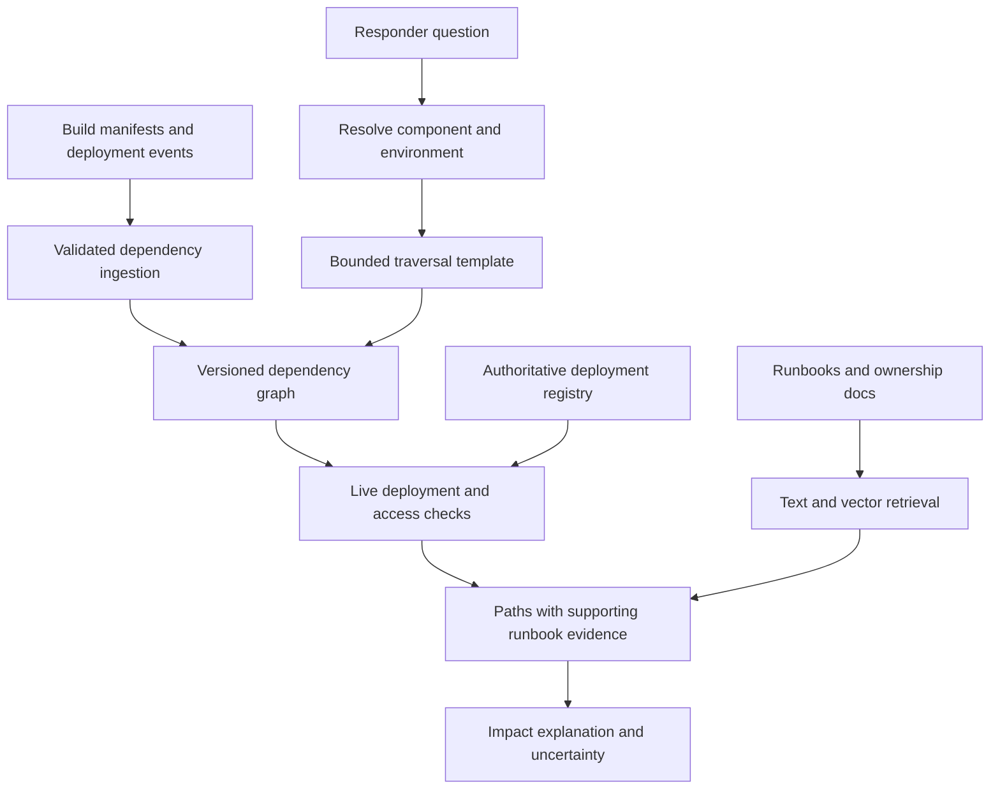
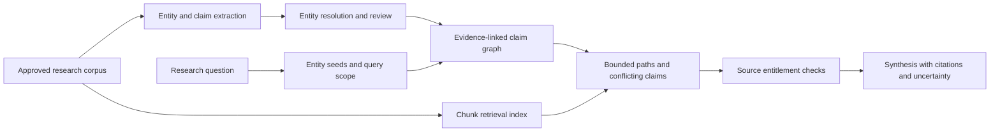

# GraphRAG with Neo4j or Amazon Neptune

GraphRAG is useful when an answer depends on explicit relationships: which services depend on a component, which supplier connects two organizations, or how a finding relates to its supporting evidence. Vector similarity finds related passages; graph traversal follows modeled relationships. Combining them can improve questions that require both, at the cost of building and maintaining a trustworthy graph.

This chapter develops a dependency-impact assistant and a relationship-based research assistant. The [OpenSearch retrieval design](opensearch-retrieval.md) remains the simpler baseline for passage lookup. A graph must earn its additional extraction, modeling, and operational cost.

!!! note "Research and assumptions"

    Primary Neo4j, AWS, and Microsoft GraphRAG documentation was reviewed September 7, 2026 (UTC). The diagrams and workloads are proposed teaching designs. Neo4j Cypher, Neptune openCypher, and Neptune product variants are not assumed interchangeable. No throughput or accuracy improvements are claimed without application-specific evaluation.

## 1. What GraphRAG means

GraphRAG is a family of architectures, not a single database feature. A system may retrieve entities by vector similarity and expand their neighborhoods, execute a constrained relationship query, or summarize communities of connected entities. It can use a graph database, a graph represented in relational tables, or precomputed graph artifacts.

Microsoft's GraphRAG library distinguishes local search over extracted graph information plus source chunks, global search over community reports using map-reduce, and other retrieval modes. Its global mode is explicitly resource-intensive. This is different from simply storing embeddings on graph nodes and calling ANN search. [^1]

Neo4j supports vector indexes over graph properties; current documentation describes version-dependent capabilities and a preferred `SEARCH` clause in newer versions. Earlier procedure examples should not be copied without checking the deployed version. ANN still approximates neighbors and does not establish relationship truth. [^2]

Amazon Neptune supports openCypher for property-graph queries, but AWS warns that current Neo4j Cypher has diverged from the openCypher specification. Portability requires checking supported syntax and semantics. [^3]

## 2. When a graph adds value

Use a graph when the domain has meaningful typed relationships and users ask questions about paths, dependencies, shared neighbors, or coverage across connected evidence. Good candidates include software/service dependencies, ownership, supply chains, research entities, and policy applicability chains.

A graph is a poor default for a small FAQ collection where answers live in one paragraph. It also performs poorly when entity resolution is unreliable, relationships are mostly invented by an extractor, or the source changes faster than the graph can be maintained. More structure can create more convincing errors if the structure is wrong.

Distinguish three questions:

| Question | Likely retrieval approach |
|---|---|
| “What does error E142 mean?” | Exact lexical lookup plus supporting passage |
| “Which customer-facing services depend on the affected library?” | Typed graph traversal with version and environment constraints |
| “What themes connect this research corpus?” | Evidence-backed aggregation or community-summary approach, with broader cost and completeness caveats |

The graph does not remove the need for text. Edges should lead back to evidence, and an answer should show the relevant path and source, not merely a confident verbal interpretation of connectivity.

## 3. Model claims, not just entities

A useful schema includes entities, relationships, source evidence, and validity intervals. An edge such as `DEPENDS_ON` or `SUPPLIES` should record provenance, observed time, effective time, source revision, and whether it came from an authoritative system or model extraction.

Do not merge two companies simply because their names are similar. Entity resolution needs stable source IDs, aliases, candidate matching, and human review for ambiguous cases. A false merge can connect many unrelated claims and contaminate every subsequent traversal. Preserve unresolved entities rather than forcing a match to maximize graph density.

For extracted knowledge, represent a claim separately from the entity pair where uncertainty matters. `Claim(subject, predicate, object, source, extraction_revision, review_state)` makes contradictory sources visible. A confidence score can help route review; it is not a calibrated guarantee of truth unless validated as such.

Temporal modeling matters. A service may have depended on a library last month but not today; a supplier relationship may be announced but not effective. Store valid-time intervals separately from ingestion timestamps. The answer's time scope must match the graph query and source evidence.

### Retrieval plan

A robust request flow is: identify candidate entities, resolve ambiguity, select a bounded query template, traverse permitted relationships, retrieve supporting passages, and synthesize a cited answer. An LLM may propose entity names or a query intent, but the application validates relation types, depth, result limits, and allowed properties.

Do not execute unrestricted model-generated Cypher. Even read-only queries can be expensive or disclose broad graph structure. Use parameterized, allowlisted patterns and timeouts. Authorization must apply to nodes, edges, and evidence; a hidden entity can leak through a visible path length or count.

### Controlling expansion

High-degree nodes can explode the search space. An organization linked to every document, or a common dependency used by thousands of services, needs explicit traversal limits and domain-specific pruning. Bound path length, permitted relation types, temporal scope, and number of returned paths. Report truncation instead of implying complete coverage.

Vector seeding introduces another failure mode: if the correct entity is absent from the seed set, traversal cannot recover it. Include exact identifier lookup and alias matching before ANN. Evaluate entity-resolution recall separately from graph-query correctness.

## 4. Design A: dependency-impact assistant

Assume 25,000 deployable services, two million versioned dependency edges, 200,000 runbook sections, and 20 peak investigations per second during an incident. The desired answer identifies potentially affected production services within an illustrative two-second evidence budget. Deployment state changes continuously; stale graph state must be visible to responders.

### State and ingestion

Nodes represent services, deployed artifacts, libraries, teams, and environments. Prefer artifact/version nodes over a timeless service-to-library edge when answering vulnerability impact. Edges include `DEPLOYS`, `CONTAINS`, `CALLS`, and `OWNED_BY`, with source manifest, revision, and validity period.

Build manifests and deployment events are authoritative inputs. Documentation may enrich ownership or operational notes but should not silently overwrite dependency facts. The ingestion coordinator rejects older source generations and closes validity intervals for removed relationships. A missing manifest is a coverage gap, not evidence of no dependencies.

Runbooks are indexed separately using OpenSearch, Neo4j vector capabilities, or another measured retrieval layer. The graph stores evidence IDs and approved links. Keeping text retrieval separate can make sense when rich lexical search is already available; colocating vectors can reduce joins when the workload is simpler. Benchmark the end-to-end path instead of assuming one deployment is always faster.

### Request flow

For “What is affected by library L version 3.2 in production?”, resolve the exact package ecosystem and version. Apply a validated vulnerability/version rule, then traverse from affected artifact versions to deployed services and bounded downstream callers. Filter by environment and user access at every stage.

Check the returned deployment IDs against the current registry before presenting current impact. Retrieve relevant runbook sections and owner information. The response distinguishes directly affected services, potentially impacted dependents, and unknown coverage. It shows the path explaining each conclusion and the observation time.

This assistant proposes investigation targets; it does not automatically restart services or roll back deployments. Any operational action uses a separate tool policy and explicit authorization. A runbook's instructions do not authorize execution merely because they were retrieved.

### Failure behavior

If live deployment verification fails, present graph observations as dated evidence, not confirmed current state. If a graph query hits its expansion limit, return the explored scope and ask for a narrower environment or component. If a dependency source is delayed, display coverage and lag by source.

Recovery rebuilds graph versions from retained manifests and deployment events, then reconciles active intervals. Test a delayed removal event and a duplicated deployment event. The invariant is that a replay cannot restore a dependency already superseded by a higher source generation.

## 5. Design B: relationship-based research assistant

Assume 250,000 public and licensed research documents, 1.5 million candidate entities, and six million extracted claims. Users investigate relationships among organizations, technologies, and published findings. There are 5,000 questions per day, and thorough answers can tolerate several seconds of retrieval. Licensed content has source-specific access restrictions.

### Claims and provenance

Every extracted relation links to exact text spans and an extraction revision. Separate `reported_by`, `authored_by`, and `supports` relationships: an organization mentioned in a paper did not necessarily author or validate its conclusions. Preserve negation and uncertainty from the source rather than converting “may partner with” into a definite partnership edge.

Entity-resolution review prioritizes high-impact merges, such as names shared by many documents or organizations with subsidiaries. A reversible merge ledger preserves original IDs. If a merge is later rejected, derived claims and summaries can be recomputed rather than remaining permanently entangled.

Community summaries, if used, are derived evidence products with their own source membership and generation revision. They should not become untraceable facts. A deleted or unlicensed source can invalidate a summary even if its raw text is no longer directly returned.

### Query flow

For “Which battery manufacturers share research partners on solid-state electrolytes?”, resolve manufacturers and the scientific topic, traverse only relevant relationship types, then retrieve the passages establishing each partnership and topic link. Distinguish current collaborations from historical coauthorship. The response can include a comparison table and graph paths with dates.

For broader thematic questions, use a deliberately different retrieval mode. A global community-summary pass may improve corpus-wide coverage but costs more and can lose detail. Compare it with a well-designed lexical/vector baseline and sampling strategy. Do not promise an exhaustive answer when extraction coverage or source access is incomplete.

Permissions are enforced before synthesis and before any external reranking. A public entity connected through a licensed private document does not make that relationship public. Cache keys include source entitlement scope and graph revision. Avoid returning counts that reveal hidden relationships.

### Failure and correction

When two sources conflict, preserve both claims with dates and provenance. If an extraction is disputed, mark it under review and remove it from authoritative answer paths. Reprocessing should update dependent summaries and embeddings, not just the visible edge.

If the graph is unavailable, passage retrieval can remain useful for direct questions, but the interface must not imply that relationship coverage was checked. If extraction jobs fail, monitor the unprocessed portion of the corpus. A sparse graph can look reassuringly simple while omitting the most important relationship.

## 6. Neo4j, Neptune, and alternatives

| Option | Prefer when | Trade-off |
|---|---|---|
| Neo4j | Property-graph development and supported graph/vector integration fit the team | Version/edition capabilities and operating model need explicit selection |
| Amazon Neptune | Managed AWS graph service and supported query languages fit | Verify openCypher differences and distinguish Neptune product capabilities |
| PostgreSQL relationships | Traversals are shallow and relational context dominates | Recursive or complex graph workloads may become harder to tune |
| OpenSearch plus application joins | Most questions are passage retrieval with limited relationship enrichment | Application owns joins, path limits, and relationship consistency |
| Microsoft GraphRAG artifacts | Extracted graph and community-summary retrieval match broad research questions | Extraction and summary cost, provenance, and update complexity |

A graph database does not validate extracted claims. A managed deployment does not solve ontology design. Conversely, a simple graph in tables may be enough for two-hop relationships. Choose the least complex structure that measurably improves the questions users actually ask.

## 7. Capacity, quality, and operations

Size by nodes, edges, properties, indexes, and source evidence, not by document count alone. A high-degree graph can be expensive even with relatively few nodes. Measure fan-out distributions and worst-case query templates. Text embeddings and extracted claims introduce separate storage and rebuild costs.

For the research design, extraction cost scales with source tokens and the number of model passes; community summaries add another pipeline. Budget for re-extraction after ontology or prompt changes. A graph update may invalidate many derived summaries, so track dependency lineage rather than rebuilding blindly or leaving stale summaries indefinitely.

Evaluate entity resolution precision/recall, relation correctness, temporal applicability, evidence support, and question-level task success. Compare graph-assisted answers against a hybrid text baseline on questions labeled as direct lookup, local relationship, multi-hop, or global synthesis. Average improvement can hide regression on simple queries.

Security evaluation includes hidden nodes, hidden edges, restricted evidence, and count/path leakage. Operational tests include high-degree expansion, malformed query intents, source deletion, merge reversal, and restore from authoritative inputs. Observe query-plan latency, traversal limits, extraction backlog, and graph/source version mismatch.

## 8. Practice: defend the graph

Start with a small dependency graph whose ground truth is known. Add one ambiguous package name, one stale deployment, and one unauthorized service. Demonstrate exact resolution, bounded traversal, and live-state validation. Then compare the result with an OpenSearch-only answer to show precisely what the graph adds.

For research, extract claims from twenty documents and manually audit every relationship. Introduce a false entity merge and trace all affected answers. Explain how you reverse it, invalidate summaries, and preserve provenance. Finally justify the chosen query language and deployment without assuming Neo4j and Neptune accept identical queries.

## Implementation checkpoint: graph identity and derived artifacts

Neo4j supports property uniqueness constraints, including composite combinations. [^4] Use a supported constraint for the canonical identity appropriate to each node type, such as tenant plus source-system entity ID. This prevents duplicate ingestion identities; it does not prove that two differently identified entities are the same real-world organization.

Keep entity-resolution decisions separate from storage uniqueness. A merge should record the source IDs, reviewer or rule, and revision. If an ambiguous name is later resolved differently, the system must be able to undo the merge and identify affected paths. Constraints protect a data invariant, while resolution is a domain inference with evidence and uncertainty.

Microsoft GraphRAG's indexing documentation describes an LLM-driven pipeline with configurable inputs/outputs and embeddings written to a configured vector store. [^5] Treat those outputs as versioned derived artifacts. Changing extraction prompts, ontology, or source scope can change entities, relationships, and summaries even when the database software is unchanged.

Before a graph release, compare not only answer scores but also graph-change statistics: new merges, removed entities, changed relation types, unsupported claims, and high-degree nodes. Sample the largest changes for review. A sudden increase in graph connectivity may indicate improved coverage or an extraction failure that linked many unrelated entities; the metric alone cannot decide which. Preserve the prior artifact revision long enough to diagnose the difference and perform a controlled rollback.

## Related studies

- [R01 · Retrieval with Amazon OpenSearch](opensearch-retrieval.md)
- [R08 · Long-term memory for AI applications](long-term-memory.md)
- [A04 · Natural-language analytics over SQL](natural-language-sql.md)

## References

[^1]: [Microsoft GraphRAG query overview](https://microsoft.github.io/graphrag/query/overview/) — local, global, DRIFT, and basic retrieval modes.
[^2]: [Neo4j vector indexes](https://neo4j.com/docs/cypher-manual/current/indexes/semantic-indexes/vector-indexes/) — version-specific vector support and query limitations.
[^3]: [AWS: Accessing Neptune with openCypher](https://docs.aws.amazon.com/neptune/latest/userguide/access-graph-opencypher.html) — language support and compatibility distinctions.

[^4]: [Neo4j constraints](https://neo4j.com/docs/cypher-manual/current/constraints/managing-constraints/) — property and composite uniqueness.

[^5]: [Microsoft GraphRAG indexing](https://microsoft.github.io/graphrag/index/overview/) — pipeline outputs and vector-store boundary.
