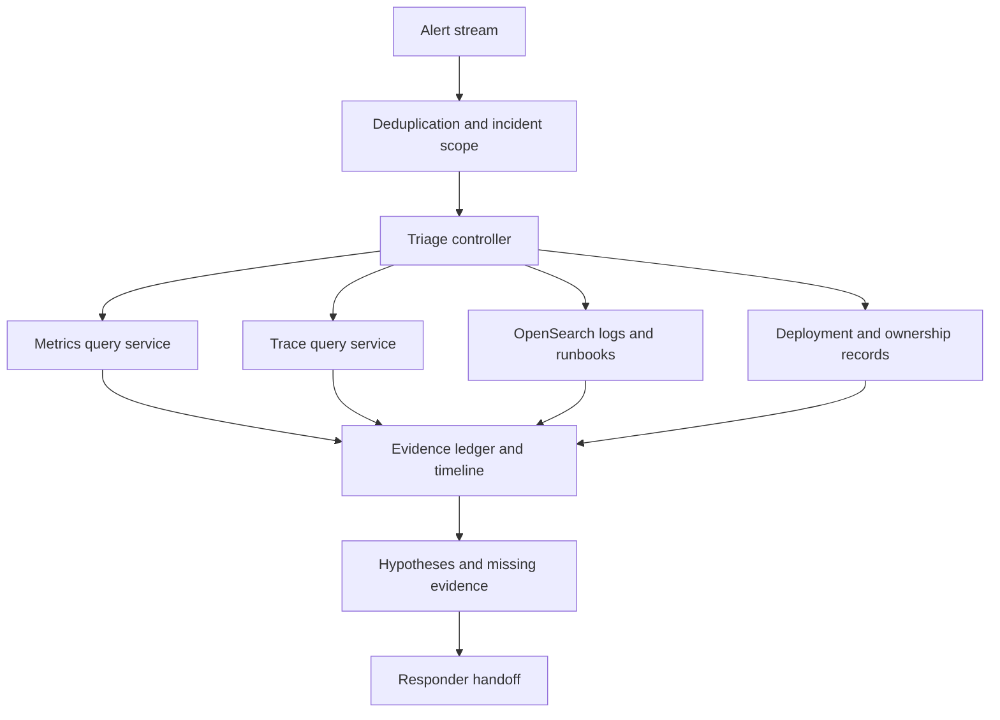
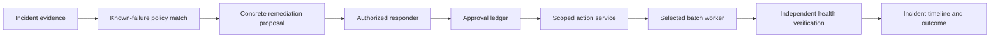

# An incident-triage copilot

An incident copilot assembles a timeline, retrieves relevant runbooks, compares hypotheses, and prepares a supported handoff. Its value comes from reducing the time responders spend collecting context. It should not confuse missing telemetry with healthy systems or turn a plausible explanation into an established root cause.

This chapter develops a read-only triage assistant and a controlled remediation workflow. [OpenSearch](opensearch-retrieval.md) provides retrieval over logs, runbooks, and prior incident artifacts where appropriate; metrics and traces remain available through their native systems.

!!! note "Scope and evidence — researched September 7, 2026 (UTC)"

    Observability and incident-management concepts are grounded in OpenTelemetry and Google's SRE documentation. Workloads, confidence rules, and action policies are proposed designs. Recommendations are hypotheses until verified against the affected system.

## 1. Foundations

OpenTelemetry describes traces, metrics, and logs as distinct observability signals. Traces represent operations across a request path, metrics capture numerical measurements over time, and logs record events. Correlation is valuable, but not every deployment supplies complete identifiers or consistent timestamps. [^1]

Google's SRE incident-management guidance emphasizes explicit roles, coordination, communication, and a working record. An AI assistant should support those responsibilities rather than create a parallel command structure. The incident commander and responders retain the decision process. [^2]

A triage system needs evidence provenance: source, query, time interval, observation time, resource scope, sampling, and completeness. A graph showing zero errors is ambiguous if ingestion stopped. A log search returning no results may mean the wrong service name, retention gap, permission denial, or genuine absence.

## 2. Best fit and poor fit

| Situation | Useful assistance | Boundary |
|---|---|---|
| Alert with scattered context | Assemble changes, symptoms, and runbooks | Preserve uncertainty and timestamps |
| Repeated known failure mode | Retrieve prior evidence and checklist | Verify current applicability |
| Multi-service incident | Build a shared timeline and dependency view | Correlation is not causation |
| Novel high-impact outage | Organize hypotheses and missing evidence | Human incident command remains central |
| Autonomous broad production repair | Poor starting point | Requires narrow actions and independent verification |

Start with read-only triage when telemetry and ownership data are available. If service names, deployment IDs, and timestamps are inconsistent, improve those foundations before expecting a model to infer them reliably.

## 3. Evidence and hypothesis model

| Record | Fields |
|---|---|
| Incident | ID, severity, affected scope, commander, status, revision |
| Observation | Source query, interval, timestamp, freshness, completeness, result reference |
| Change | Deployment/configuration ID, owner, time, affected resources |
| Hypothesis | Claim, supporting evidence, contradicting evidence, proposed test |
| Action proposal | Target, operation, preconditions, authority, rollback, verification |
| Outcome | Remote receipt, observed effect, uncertainty, follow-up |

Separate observations from interpretations. “Error rate rose at 10:04” is an observation if backed by a query. “Deployment X caused the rise” is a hypothesis until a test or stronger evidence supports it. Model confidence scores are not calibrated incident probabilities unless an evaluation establishes that interpretation.

A checkpointed graph is one implementation option for the diagnostic controller, but persisted state must refer to immutable evidence and does not establish causal correctness. [^3]

Maintain a canonical incident timeline in UTC with original source timestamps retained. Track clock skew and ingestion delay. A late log can change the inferred order of events; the system should revise its timeline explicitly rather than preserve an outdated narrative for consistency.

### Sampling, labels, and delayed telemetry

Trace sampling changes what absence means. Head sampling decides early whether to retain a trace; tail sampling can use information available after spans arrive, such as errors or latency. Neither should be treated as an unbiased complete inventory without understanding the configured policy. A few slow sampled traces demonstrate possible slow paths, not the exact proportion of all requests taking them. [^4]

Metrics labels also shape feasibility. Prometheus guidance warns against unbounded high-cardinality labels such as user IDs or email addresses. Keep incident correlation IDs in logs or traces where appropriate rather than creating a metric series for every request. The copilot should query approved metric dimensions and avoid constructing arbitrary label combinations that multiply series. [^5]

The OpenTelemetry log model distinguishes event `Timestamp` from `ObservedTimestamp`. Preserve both where available to reason about ingestion delay. Align metrics, traces, logs, and deployment events to a common incident interval while retaining their native resolution and uncertainty. A one-minute metric bucket and a millisecond log event cannot establish a precise causal ordering by themselves. [^6]

Collector buffering and retry affect freshness and loss. OpenTelemetry documents sending queues, persistent storage, and circumstances where data loss can still occur. Query collector health and backend ingestion delay when evidence suddenly disappears; durable buffering is not proof that every event is already searchable. [^7]

### Worked evidence walkthrough

Suppose checkout p95 latency rises from 300 ms to 2 seconds at approximately 10:04 UTC. Deployment `checkout-42` began at 10:02. Database connection utilization also rises, and a subset of sampled traces shows long waits before acquiring a connection. Two hypotheses are plausible: the deployment increased connection demand, or an unrelated database slowdown caused connection accumulation.

The initial packet records the metric interval, deployment start and completion, sampled trace IDs, pool configuration, and database evidence availability. It should not state that the deployment caused the incident merely because it preceded the alert. A missing database metric is recorded as missing, not normal.

A discriminating next test compares request-normalized connection demand and pool-wait time between old and new deployment instances during the overlapping rollout interval, provided traffic allocation and instance labels make that comparison meaningful. If only new instances show increased demand under similar traffic, the deployment hypothesis gains support. If both groups degrade together while database execution time rises, the database hypothesis becomes stronger. Differences in traffic mix or sampling can invalidate either inference and must be stated.

The next observation may show that a new request path opens additional connections but database execution time remains stable. The copilot can now propose a targeted investigation of that path and cite the evidence. It still should not call this a final root cause before responders validate the mechanism. If a rollback is considered, that is a separate authorized operational proposal with its own preconditions and verification plan.

This walkthrough illustrates why evidence contracts matter: a summary that drops deployment cohorts, sampling policy, and query intervals can turn a useful comparison into a confident but unsupported narrative.

## 4. Design A: read-only triage and handoff

Assume 10,000 alerts/day deduplicated into 300 candidate incidents, 50 concurrent investigations at peak, and a two-minute target for an initial evidence packet. Each investigation has a bounded query budget and supports one selected service or incident scope.

### Request flow

1. Normalize the alert, identify service and time interval, and attach an incident ID. Deduplicate by explicit rules; similar wording alone should not merge unrelated failures.
2. Resolve service ownership, deployment identifiers, and access scope. Restrict all queries to the authorized incident context.
3. Fetch a small baseline: error and latency metrics, selected traces, recent deployments, and relevant runbooks. Query in parallel where sources are independent.
4. Record observation completeness, time windows, and source errors. Avoid flooding responders with raw telemetry.
5. Construct a timeline and a small set of hypotheses, each with supporting and contradicting evidence and a discriminating next test.
6. Return a handoff containing known facts, affected scope, changes, unknowns, and source links. Mark the packet preliminary if essential telemetry is unavailable.
7. Refresh only when new evidence or a responder request warrants it. Preserve prior versions so changing conclusions are auditable.

### Retrieval design

Index runbooks with service, owner, environment, version, effective date, and review status. Retrieve using the current service and symptom context, then check that commands and dependencies apply to the deployed version. Prior incident similarity is a lead, not proof of identical cause.

For logs, use structured fields and time filters before broad semantic search. Preserve exact error signatures and identifiers. Summaries should refer back to bounded source queries so responders can inspect the original evidence. Avoid embedding sensitive request payloads merely because they appear in logs.

### Failure behavior

A telemetry outage becomes an explicit observation about evidence availability. The assistant should not mark an incident resolved because queries return empty data. If model inference fails, provide the collected timeline and source links without speculative synthesis.

A runaway investigation can stress the very systems responders need. Enforce query timeouts, result caps, and per-source concurrency. Prefer an observability read path designed for incident traffic and protect source systems from broad repeated scans.

## 5. Design B: controlled remediation for a known failure

Assume a narrow class of batch-worker failures with a documented, reversible recovery action. The assistant may propose restarting one worker after verifying a specific failed state. It cannot restart a cluster, change networking, or widen permissions. Twenty such proposals/day is the illustrative initial scale.

The policy match uses deterministic conditions over evidence: selected worker ID, failed job state, runbook version, excluded conditions, and recent action history. A model can explain why the evidence appears relevant, but code checks eligibility. If conditions do not match, return to diagnosis.

The proposal identifies target, exact operation, expected current state, reason, risks, rollback or recovery path, and verification interval. Approval binds to this proposal hash and expires. Immediately before execution, the action service rechecks resource state and responder authority.

A stable operation ID prevents duplicate logical requests where the destination supports idempotency. If the action response is lost, reconcile operation status or current worker state before retrying. The incident ledger distinguishes requested, accepted, running, verified, failed, and uncertain.

### Verification

Use a read path independent from the action response. Confirm the intended worker restarted, the target job resumed or reached the expected state, and relevant error/latency indicators improved over an appropriate interval. A successful restart API response does not prove the incident is resolved.

Define stop conditions: unexpected target state, repeated action, worsening indicators, verification timeout, or new contradictory evidence. Stop automatic progression and return a precise exception to responders. Do not escalate automatically to broader actions because the narrow repair failed.

### Recovery and communication

Cancellation after approval but before dispatch prevents the action. Cancellation after dispatch requires outcome reconciliation. The system should report what it knows without implying reversal. Update the incident record through the designated communication path and preserve the responder's command structure.

This design differs from read-only triage because it adds a business-critical side-effect boundary. A durable workflow can manage approval waits and recovery, as described in [durable workflows](durable-workflows.md), but it does not determine whether the remediation is appropriate.

## 6. Alternatives and trade-offs

| Approach | Best fit | Limitation |
|---|---|---|
| Static runbooks and dashboards | Known operational procedures | Manual context gathering |
| Search over incident history | Finding related cases | Similarity can mislead |
| Read-only AI triage | Heterogeneous evidence and summaries | Hallucination and evidence-quality risk |
| Deterministic auto-remediation | Narrow, well-understood failures | Limited applicability |
| Agent-guided remediation | Variable diagnosis with bounded actions | More complex authorization and recovery |

The strongest early comparison is against an improved dashboard and runbook workflow. An assistant that saves time only because existing links are missing may not need elaborate agent planning. Measure responder outcomes, not the number of hypotheses generated.

## 7. Capacity, cost, and operational safety

Three hundred incidents with twelve diagnostic calls each imply 3,600 calls/day before refreshes and retries. Peak demand matters more than the mean because incidents are correlated. A regional outage can trigger many investigations simultaneously against degraded telemetry backends.

Use incident-level deduplication and shared immutable evidence where access permits. Reserve query and token budgets, cap refresh frequency, and prioritize high-severity incidents without starving ordinary operations. A shared query result must include its time window and freshness so it is not reused as current evidence indefinitely.

Cost includes telemetry query scans, model tokens, trace/log retention, indexed runbooks, and responder review. Monitor cost per useful handoff, time to first supported hypothesis, query failure rate, unsupported claims, repeated reads, and action verification failures.

A copilot needs its own health signals and degraded mode. During a control-plane outage, responders should still reach dashboards, runbooks, and incident records directly. Do not make the assistant the only way to operate the system.

## 8. Evaluation and exercises

Replay historical incidents with evidence limited to what was available at each time. A model that sees the postmortem during triage evaluation has future knowledge and an unfair advantage. Separate retrieval of prior incidents from the target incident's later conclusions.

Evaluate timeline correctness, evidence completeness, unsupported causal claims, useful next tests, responder time saved, and missed critical facts. For remediation, test wrong resource IDs, stale approvals, duplicate requests, lost responses, failed rollback, and false-positive health signals.

Use synthetic incidents with telemetry gaps and clock skew. The assistant should identify uncertainty rather than confidently infer a clean sequence. Human reviewers should judge whether the packet improves decisions, with source evidence visible.

Build a lab containing metrics, logs, and deployment events for two plausible causes. Require the system to state both hypotheses and select a test that distinguishes them. Add a remediation service that commits but drops its response; verify recovery produces one action and an honest timeline.

1. What evidence would disprove the leading hypothesis?
2. How do you distinguish no errors from no telemetry?
3. Why does a successful restart not establish incident resolution?
4. Which queries might worsen the outage, and how are they bounded?
5. How do you evaluate triage without leaking the final postmortem?

## Related studies

- [A02 · Tool-using agents with LangGraph or an agents SDK](tool-using-agents.md)
- [A03 · An MCP tool gateway for enterprise applications](mcp-tool-gateway.md)
- [P02 · An evaluation and observability platform for AI](evaluation-observability.md)

## References

[^1]: [OpenTelemetry: Signals](https://opentelemetry.io/docs/concepts/signals/) — traces, metrics, logs, and related observability concepts.
[^2]: [Google SRE: Managing incidents](https://sre.google/sre-book/managing-incidents/) — incident roles, coordination, communication, and working records.
[^3]: [LangGraph: Persistence](https://docs.langchain.com/oss/python/langgraph/persistence) — an implementation option for checkpointed diagnostic state; business action reconciliation remains application logic.

[^4]: [OpenTelemetry: Sampling](https://opentelemetry.io/docs/concepts/sampling/) — head and tail sampling and their trade-offs.
[^5]: [Prometheus: Metric and label naming](https://prometheus.io/docs/practices/naming/) — label cardinality guidance.
[^6]: [OpenTelemetry: Logs data model](https://opentelemetry.io/docs/specs/otel/logs/data-model/) — event and observation timestamps.
[^7]: [OpenTelemetry Collector: Resiliency](https://opentelemetry.io/docs/collector/resiliency/) — buffering, persistence, and data-loss conditions.
