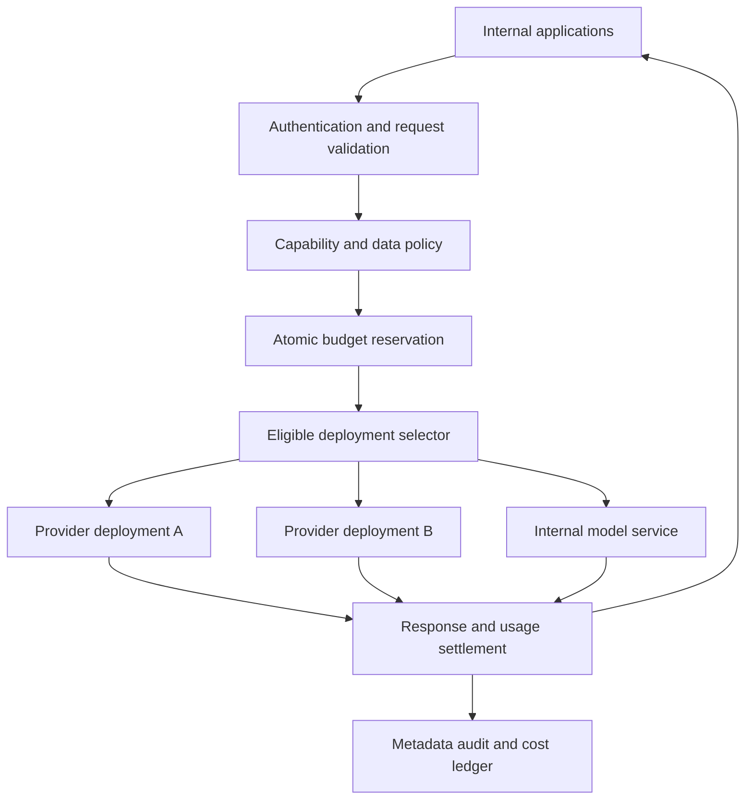
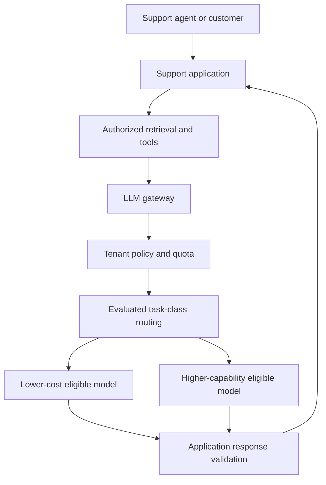

# LLM gateways: routing, budgets, and provider failure

An LLM gateway is the policy and reliability boundary between applications and model providers. It authenticates callers, selects eligible model deployments, enforces budgets, translates supported request shapes, and records usage. It should make application behavior more predictable without pretending that every model has identical capabilities.

The [OpenSearch retrieval design](opensearch-retrieval.md) uses generation as one component after authorized evidence selection. A gateway can serve that generator and many other applications, but retrieval permissions and business authorization still belong to their respective services.

!!! note "Scope and evidence"

    Research date: September 7, 2026 (UTC). LiteLLM routing documentation and Amazon Bedrock inference documentation were consulted. Architecture, policies, workload estimates, and thresholds are illustrative. Routing compatibility and residency rules must be checked against exact deployments; API-shape compatibility is not behavioral equivalence.

## 1. What belongs in the gateway

A useful gateway provides caller identity, approved model aliases, request validation, admission control, quota/budget reservation, eligible-route selection, bounded retries, circuit breaking, streaming transport, usage accounting, and audit metadata. These functions are easier to enforce centrally than by copying provider SDK logic into every application.

Keep business tools and domain workflows outside it. The gateway can validate that a response conforms to a declared interface, but should not decide whether an invoice is approved or a user can access a document. Applications need explicit policies for those actions.

LiteLLM documents routing across deployments, routing strategies, retries, fallbacks, and cooldown behavior. These are implementation capabilities, not a guarantee that automatic fallback is safe for every request. A production configuration must constrain fallback groups by capability, policy, and evaluated quality. [^1]

Amazon Bedrock inference profiles can route requests across Regions according to the profile type. Its documentation distinguishes geographic and global routing behavior and associated policy considerations. Treat a profile's eligible Regions as part of the data-placement decision; do not assume an inference profile remains in the caller's single Region. [^2]

## 2. A model alias is a contract

An alias such as `support-answer-standard` should identify a capability contract rather than merely the cheapest model today. The contract can include input modalities, context/output limits, tool schema support, structured-output behavior, streaming requirements, approved data classes, permitted Regions, latency class, and evaluation suite version.

A route registry stores deployment ID, provider, model/version, capability set, location policy, price-table version, health state, and tested application contracts. Route changes are reviewed configuration releases with rollback. A model that accepts the same JSON may differ in tool selection, refusal behavior, tokenization, or supported schema constraints.

Normalize common request fields, but retain explicit provider extensions when the application needs them. Silently dropping an unsupported parameter is dangerous: ignoring a schema constraint or tool-selection setting changes behavior. Reject incompatible requests clearly or require an application-approved downgrade path.

### Admission and budgets

Requests consume several resources: concurrent slots, input tokens, output tokens, provider rate quota, and money. Reserve an estimated upper bound before dispatch, then settle from actual usage where available. Long streaming requests can hold reservations; release them on completion or a reconciled terminal state.

A token count may be estimated before routing because tokenizers differ. Use conservative bounds and record the estimation method. If actual usage is unavailable after a broken connection, mark the settlement provisional and reconcile rather than reporting zero cost. Budget enforcement must account for simultaneous requests; a read-then-write balance check is insufficient.

### Retries and streaming

Classify failures: validation, authentication, policy denial, provider throttling, transient transport, provider server error, and unknown outcome. Retry only eligible failures under a total deadline and bounded attempt budget. Honor provider retry guidance where available and use jitter to avoid synchronized retry storms.

Once tokens have been delivered, transparently switching providers can splice incompatible continuations. Prefer failing the stream with a resumable application-level state or requiring an explicit regeneration. A retry before the first delivered token is simpler, but may still incur provider cost or duplicate a tool proposal. The gateway must not execute tools merely because it forwards tool-call events.

A circuit breaker should be scoped narrowly enough to avoid disabling all models because one deployment fails. Separate health from quota exhaustion and policy exclusion. A healthy route can still be ineligible for a sensitive request.

## 3. Best fit and alternatives

| Approach | Good fit | Trade-off |
|---|---|---|
| Direct provider SDK in one service | Small application with one provider | Simpler path, but duplicated policy appears as apps grow |
| Shared application SDK | Common conventions without another network hop | Updates and enforcement depend on every caller adopting them |
| Central LLM proxy/gateway | Multiple teams, budgets, approved routes, shared telemetry | Another production dependency and policy control plane |
| Managed provider routing | Approved models within one provider ecosystem | Less cross-provider control; check location and capability semantics |
| API management plus small adapter layer | Existing authentication/rate infrastructure | LLM streaming, token accounting, and capability mapping still need work |

A gateway pays off when several applications need consistent policy or provider abstraction. For one prototype, a complex routing platform may cost more to operate than it saves. Do not put a gateway in the path solely to log prompts: sensitive content often should not be retained at that layer.

## 4. Design A: internal multi-team AI platform

### Workload and architecture

Assume 20 teams, 50 applications, and 200 peak requests/second. Requests include embeddings, short classification, and streamed assistance. Teams have monthly budgets and different data classifications. The objective is policy enforcement and auditable usage, with an illustrative gateway overhead target below 50 ms excluding provider time.

### Request flow

1. Authenticate a workload identity and resolve application/team policy. Do not trust a caller-supplied tenant name as proof of identity.
2. Validate the declared model alias and request shape. Determine the data class from trusted application configuration plus permitted explicit context; a model should not decide its own data policy.
3. Filter routes by modality, schema/tool support, location, and policy. If no eligible route exists, reject clearly rather than silently routing elsewhere.
4. Reserve budget and concurrency capacity. Select a healthy eligible deployment using the application's latency/cost policy and current quota state.
5. Forward the request with a stable gateway request ID and attempt ID. Stream data with backpressure; do not buffer an entire long response unnecessarily.
6. Settle usage and emit metadata events. Return the actual deployment/version in trace metadata so quality changes can be investigated.

Keep a request ledger with logical request ID, caller, contract version, selected routes/attempts, reservation, terminal status, usage source, and trace reference. Store prompt content only where specifically justified and authorized, with redaction and retention; normal operations often need hashes, sizes, and error categories rather than raw prompts.

### Configuration and failure

Use a versioned route/policy snapshot that can be distributed to stateless gateway replicas. Validate changes before activation and canary them on suitable traffic. If the control plane is unavailable, continue with a recent signed/validated snapshot only within an explicit freshness policy. Do not invent permissions from an empty cache.

If the budget store fails, choose an explicit behavior by workload: reject costly new requests or allow a small preallocated emergency allowance. A blanket fail-open policy defeats spending controls. Keep reservations partitioned or otherwise coordinated to avoid replica races and hot keys.

Provider outage recovery uses only routes allowed by the application contract. A restricted application may deliberately have no fallback. The user-facing outcome should be a clear temporary failure, not an undisclosed data-placement change.

## 5. Design B: customer support SaaS with model tiers

### Workload and architecture

Assume 2,000 customer tenants and 80 peak streamed requests/second. Most questions use retrieved customer knowledge; some require tool proposals. Tenants purchase different service tiers and may have dedicated approved deployments. The system needs predictable per-tenant behavior and protection against one tenant consuming shared capacity.

### Routing policy

Route based on an application-defined task class, not an unrestricted model judgment about whether it deserves more money. For example, approved FAQ synthesis can use a lower-cost route; complex tool planning may require a stronger evaluated route. Any classifier has errors, so measure routing regret and allow bounded escalation when response validation fails.

Escalation must preserve tenant policy and total budget. If the first model already streamed an answer, replacing it with another response needs an explicit product interaction. Prefer validating nonstreamed structured substeps before exposing the final streamed narrative. Do not retry a tool execution when only the model's explanation failed.

Each tenant policy specifies eligible aliases, burst rate, concurrency, spend limit, maximum context/output, and data-location rules. Fair scheduling or per-tenant queues prevent a noisy tenant from monopolizing shared deployments. Dedicated capacity can coexist with shared overflow only if overflow is explicitly permitted.

### Quality and state

The application retains conversation state, retrieval evidence, and tool action ledger. The gateway sees the request contract and returns model output plus usage; it does not independently rebuild conversation history. This prevents hidden prompt changes at the gateway from breaking evidence or authorization assumptions.

A response record includes prompt-template version, evidence-set digest, route contract, actual model, validator result, and user-visible outcome. These fields support comparison after a routing change. The cost ledger records every attempt, including failed or escalated ones, so “cheap model” routing is evaluated on total cost per resolved issue.

### Failure and recovery

If a provider starts returning malformed structured output, route health alone will not catch it. Application validators emit a quality signal; the platform can disable that contract/deployment combination while keeping other uses available. A canary rollback should restore both route and prompt compatibility.

If the client disconnects, cancel upstream generation when supported and mark the outcome accordingly. Usage may still accrue. Keep budget settlement separate from whether the user saw the answer. If a retry occurs, preserve the logical request identity but record a new attempt for cost and debugging.

## 6. Capacity and economics

At 200 requests/second and a mean eight-second service time, Little's Law suggests approximately `200 × 8 = 1,600` in-flight requests in steady state. This estimate requires a stable system and representative mean; heavy tails and bursts require additional headroom. Streamed requests may consume little CPU while holding sockets, memory buffers, and provider concurrency.

Size connection pools, file descriptors, memory per stream, and backpressure behavior. Limit queued bytes for slow clients. The gateway should not become an unbounded buffer between a fast provider and a stalled browser. Separate embedding/batch workloads from interactive generation so large background calls do not exhaust every slot.

Cost per successful task includes every attempt, escalation, cached response where permitted, gateway infrastructure, and operational overhead. Record input/output usage separately and version the price table used for estimates. Avoid presenting estimated charges as settled invoices.

Budget formulas should include worst-case output and retries. A request with a small prompt and unconstrained output can consume more than expected. Daily or monthly limits need atomic accounting across replicas and a documented treatment of in-flight reservations at period boundaries.

## 7. Security and evaluation

Protect provider credentials in a secret system and scope them to appropriate deployments. Rotate independently from application identities. Prevent arbitrary upstream URLs or unapproved model names from turning the gateway into an open proxy. Validate file references and prevent internal-network fetches through provider-adapter features.

Test capability compatibility, structured outputs, tool-call events, streaming cancellation, timeout handling, quota errors, and data-location exclusions. A provider migration needs the application's quality suite, not only an HTTP smoke test. Evaluate final task success and safety/policy compliance under the exact route configuration.

Run failure drills for budget-store outage, stale configuration, simultaneous quota exhaustion, provider throttling, partial stream failure, and usage records arriving late. Verify that fallback never crosses policy boundaries and that duplicate settlement events cannot double-charge an internal ledger.

Track request success, p95 time to first token, inter-token stalls, retries, circuit states, budget denials, estimated-versus-settled usage, and quality regressions by contract. Avoid one global success rate that hides a failing tenant or model family.

## 8. Practice: defend the design

1. Define a model alias contract and identify two models that are not safe substitutes despite similar APIs.
2. Demonstrate atomic budget reservation under 100 simultaneous requests.
3. Break a stream after 20 tokens and show the user-visible and accounting behavior.
4. Prove fallback cannot violate a tenant's location policy.
5. Compare total task cost before and after introducing a “cheap-first” router.
6. Disable a deployment for one failing capability without taking unrelated applications offline.

## Implementation review: accounting and control-plane consistency

Separate the operational request log from the financial usage ledger. The request log can tolerate sampling for ordinary success traces; the usage ledger cannot silently drop billable attempts. Use stable event IDs and idempotent settlement so replayed usage events do not double-count. Preserve provider-reported usage, local estimates, and later adjustments as distinct fields. This lets finance reconcile without rewriting the technical history of a request.

A route decision should record the policy snapshot and price-table version used at admission. If policy changes while a request is streaming, define whether the existing request completes or is canceled; new requests must use the new policy. Emergency revocation may require immediate cancellation, while an ordinary cost update need not interrupt a user mid-answer. These are explicit control-plane semantics rather than accidental cache behavior.

Avoid routing oscillation. A deployment that briefly recovers can be probed with limited traffic before receiving the full load. Use a controlled recovery state and observe both transport success and application quality. Combining global retries, local retries, and provider SDK retries can multiply attempts unexpectedly; choose one responsible retry layer or calculate the complete bound.

For debugging, expose an authorized request trace with logical request ID, attempt IDs, route exclusions, queue time, first-token time, and settlement state. This is more useful than a raw prompt dump for most incidents and reduces unnecessary sensitive-data retention. A caller should be able to distinguish “no policy-eligible route” from “all eligible routes unavailable” because the remedies are different.

Keep emergency overrides time-bounded and attributable. An incident operator may temporarily reduce traffic or disable a failing route, but an override should not silently broaden data access or remove a tenant budget. Record the actor, reason, previous policy, and automatic expiry. Review override use after recovery so temporary operational decisions do not become undocumented permanent behavior.

## Related studies

- [S02 · Self-hosted inference with vLLM or NVIDIA Triton](self-hosted-inference.md)
- [S03 · An asynchronous batch inference platform](batch-inference.md)
- [P04 · A secure multi-tenant AI platform](secure-multi-tenant-platform.md)

## References

[^1]: [LiteLLM: Load balancing and routing](https://docs.litellm.ai/docs/proxy/load_balancing) — deployment routing, retry/fallback configuration, and cooldown behavior.
[^2]: [AWS: Cross-Region inference](https://docs.aws.amazon.com/bedrock/latest/userguide/cross-region-inference.html) — inference-profile routing scope and policy considerations.
