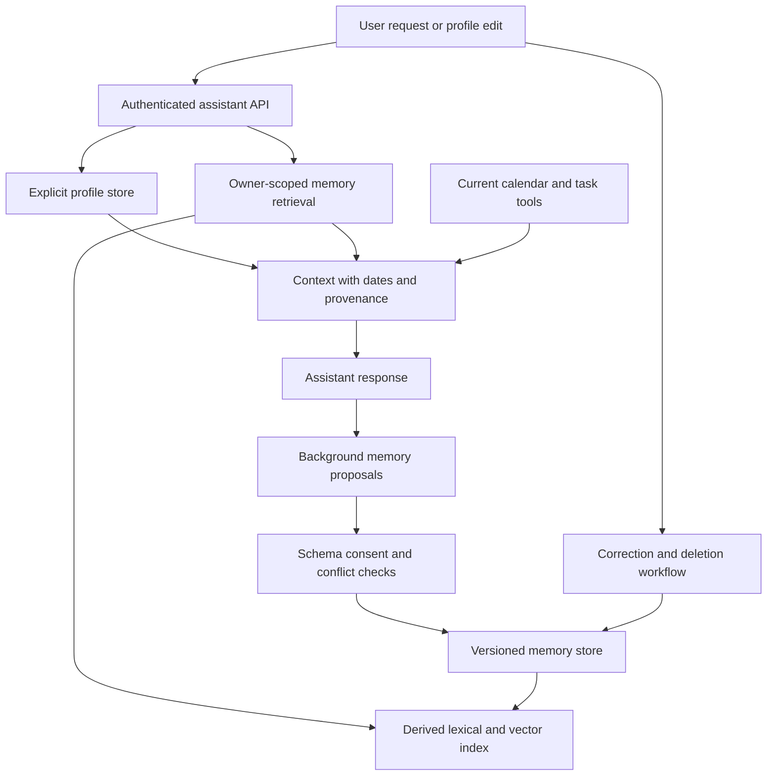
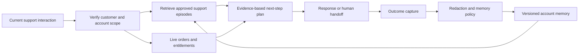

# Long-term memory for AI applications

Long-term memory lets an application reuse selected facts, preferences, and prior outcomes across conversations. Its hardest problem is not vector search. It is deciding what deserves to be remembered, who owns it, when it becomes stale, and how a correction or deletion changes every place that memory can influence behavior.

This chapter develops a personal assistant and a persistent customer-service assistant. [OpenSearch retrieval](opensearch-retrieval.md) can serve as a memory retrieval component, but a search index alone is not a memory policy or an authoritative user profile.

!!! note "Research and assumptions"

    LangGraph's primary memory and persistence documentation was reviewed September 7, 2026 (UTC). Framework capabilities are cited; storage schemas, consent rules, retention windows, and workloads below are proposed application designs. No framework namespace or memory abstraction is assumed to provide end-user authorization automatically.

## 1. Separate conversation state from durable memory

Short-term state supports the current interaction: messages, tool results, pending steps, and a resumable workflow. Long-term memory stores selected information across interactions. LangGraph distinguishes thread-scoped checkpointers from stores for cross-thread application data. An in-memory checkpointer does not survive a process restart. [^1]

Its memory guidance also distinguishes semantic facts, episodic experiences, and procedural instructions, and discusses foreground versus background writes. These are useful design categories, not a requirement to store every conversation in all three forms. [^2]

A practical application uses several stores deliberately:

| State | Example | Authority and lifecycle |
|---|---|---|
| Conversation checkpoint | Current booking workflow | Thread-scoped, resumable, retained according to product policy |
| Explicit profile | Preferred language | User-editable authoritative field |
| Episodic record | Previous troubleshooting steps | Dated evidence with source and outcome |
| Inferred preference | Possible preference for short answers | Provisional, reviewable, and easy to discard |
| Retrieval index | Embedding of a memory item | Derived representation, rebuilt or deleted with the source |
| Tool authorization | Permission to send a message | Separate current policy; never inferred from a memory |

Do not confuse remembering an earlier action with permission to repeat it. A previous purchase or email send does not authorize a future one. Similarly, a remembered preference is not a system instruction and must not override current user intent.

## 2. Where memory helps and where it hurts

Memory helps when users return to a task, repeat stable preferences, or need continuity across channels. It can reduce repetitive questions, preserve accepted corrections, and make support more coherent. It is less useful for one-off factual lookup, where fresh retrieval from authoritative sources is often enough.

Memory can harm quality when stale facts override current context, summaries erase uncertainty, or accidental inferences become permanent identity claims. Storing more is not necessarily better. A compact explicit profile and a few relevant episodes often outperform an unbounded transcript dump.

Begin with a product-level memory contract: which categories may be stored, how they are captured, how users inspect them, when they expire, and which tasks may use them. Sensitive or high-consequence facts should have stricter confirmation and freshness rules than harmless presentation preferences. Avoid collecting information merely because a model can extract it.

## 3. Memory lifecycle and data model

A memory item should contain owner/tenant identity, item ID, type, content, source interaction, created time, valid-time interval if relevant, revision, status, confidence or review state, sensitivity category, and retention deadline. Embedding lineage and dependent cache IDs belong in a separate manifest.

Use explicit states such as `proposed`, `active`, `superseded`, `expired`, and `deleted`. A background extractor creates proposals; trusted application logic validates schema and policy before activation. An explicit user correction can supersede an active item with a new revision while retaining only the audit material required by policy.

For a profile field, use a canonical key such as `preferred_language`; for episodes, retain separate dated records. Do not merge “I am in London this week” into a permanent home location. The source wording and temporal qualifier are essential to correct retrieval.

### Foreground versus background writes

Foreground writes provide immediate read-after-write behavior for important explicit updates but add latency. Background extraction reduces response time and can consolidate several turns, but creates lag and race conditions. LangGraph's documentation describes both approaches; the application must choose their semantics. [^2]

A good split is to save explicit profile edits transactionally in the request path and process inferred episodic memories asynchronously. Background workers carry the source generation and reject stale writes. If the user deletes a conversation before extraction completes, the delayed job must not recreate its memories.

### Retrieval and context assembly

Retrieve explicit profile fields by key, not by semantic similarity. Retrieve episodes with structured owner/time/task filters plus lexical or vector search. Rank by relevance, recency where appropriate, source reliability, and current status. Similarity alone can surface an obsolete preference more strongly than its correction.

Keep memory separate from authoritative live facts. A support memory saying “customer has premium plan” should not replace a current entitlement lookup. Context assembly labels memory as prior user-provided information and includes dates when they matter. The model should be able to say that a remembered fact may need confirmation.

### Deletion and correction

Deletion is a workflow across the authoritative item, vector index, summaries, caches, checkpoints, traces, and backups under the product's retention policy. A tombstone or deletion generation prevents delayed jobs and restores from resurrecting deleted material. Define what “forget” means and make the user-facing behavior match that definition.

Do not promise immediate removal from every backup unless the storage process actually supports it. The proposed designs block deleted items from serving immediately and track downstream erasure separately. If a restored backup contains old items, replay the deletion ledger before serving traffic.

## 4. Design A: a personal planning assistant

Assume 100,000 users, an average of 80 active memory items per user, 50 peak requests per second, and multiple devices per account. The assistant remembers explicit preferences and selected task episodes, while live calendar and booking state remain authoritative tools. A proposed retrieval budget is 150 ms before model generation.

### State and write path

The profile contains a narrow set of user-editable fields, such as preferred language and default units. Episodes record completed planning tasks, selected constraints, and outcomes. Temporary travel context has an expiry date. The application avoids storing raw credentials, full calendar contents, or every incidental statement as memory.

An explicit “remember that I prefer morning appointments” request writes a profile preference with source provenance. An inferred preference from several bookings remains provisional until the product's policy permits activation or the user confirms it. A single unusual appointment should not overwrite a stable explicit preference.

Concurrent devices use revision checks. If one device updates a preference while a background worker processes an older conversation, the older job cannot replace the newer revision. Conflicts are resolved according to source authority: explicit user edits outrank model inferences, and current instructions outrank remembered defaults.

### Request flow

Authenticate the user, read relevant explicit fields, and retrieve a small number of task-related episodes. For “Plan next week's exercise sessions,” use current calendar availability and current constraints, with remembered preferences as suggestions. Do not infer a medical limitation from a past casual remark or turn it into a permanent profile fact.

Assemble context with clear provenance and dates. The assistant can say “You previously preferred mornings; I used that as a starting point.” If current instructions conflict, follow the current request and offer to update the stored preference when appropriate. Memory should reduce friction without making the user argue with their past self.

A booking action remains separately authorized. The memory “usually book the same gym” does not authorize spending money or reserving a slot. Tool policy validates the actual destination, time, cost, and user instruction at execution time.

### Failure and forgetting

If memory retrieval fails, continue with the current conversation and ask only for essential missing information. Do not block all assistance because personalization is unavailable. If a profile write fails, say it was not saved rather than pretending the preference will persist.

The user can inspect active items, correct them, and request deletion. The deletion handler increments a generation, blocks serving, cancels pending extractors where possible, and queues index/cache cleanup. A device reconnecting with an old offline profile must merge against that generation instead of restoring deleted fields.

## 5. Design B: persistent customer-service assistant

Assume 500,000 customer accounts, ten million dated support episodes, 200 peak conversations per second, and service across chat and email. The assistant remembers approved troubleshooting history and customer communication preferences. Current account entitlements, order state, and refund eligibility remain authoritative services.

### Memory schema

An episode records issue category, product/version, steps attempted, observed outcome, agent review state, source ticket, and event date. Distinguish “customer says reboot did not help” from “telemetry verified reboot completed.” Store a link to the original ticket rather than copying unnecessary personal details into every episode.

Communication preferences are explicit fields with customer control. Operational facts such as payment status or refund approval are not durable conversational memories; they are current business records. If a memory references them, it records the historical observation and cannot authorize a present transaction.

### Request flow

Verify the customer's identity and account access before retrieving history. Shared devices and household accounts require careful scope: one person's conversation should not automatically become another person's memory. Retrieve episodes matching the current product and issue, then check whether the underlying ticket remains accessible.

For “The connection still drops,” the assistant can avoid repeating already attempted steps, but should confirm whether the environment has changed. A failed troubleshooting step from an old firmware release may be worth retrying only if a current procedure explains why. The response distinguishes prior attempts from current evidence.

A human handoff includes a concise cited history with unresolved facts and current state, not an overconfident narrative. The receiving agent can correct an episode; that correction creates a new revision and invalidates derived summaries. Quality review should inspect whether summaries preserve uncertainty and customer wording.

### Retention and recovery

A closed account triggers the configured retention workflow. Legal or operational retention requirements, if any, belong in the product policy and storage design rather than being invented by the assistant. Serving access can be revoked immediately while archival retention is handled under that policy.

If the memory store is unavailable, use the current ticket and live account services. If the live entitlement service fails, memory cannot substitute for it. If an episode is found to contain another customer's data, quarantine it, trace dependent summaries and caches, and correct the source linkage before reactivation.

## 6. Storage options and trade-offs

| Option | Good fit | Trade-off |
|---|---|---|
| Relational profile and episode store | Explicit fields, revisions, ownership, and corrections | Semantic retrieval needs an additional index or extension |
| PostgreSQL plus pgvector | Moderate memory retrieval with relational policy | Search shares database resources |
| OpenSearch or dedicated vector index | Larger episodic retrieval and hybrid relevance | Derived state needs deletion and version synchronization |
| Framework checkpointer and store | Agent-state integration and cross-thread abstractions | Application still owns policy, authorization, and lifecycle |
| Full transcript only | Simple archival continuity | High token cost, stale context, and weak correction semantics |

A vector database is useful for finding relevant episodes, but a structured store is usually better for “what is the user's current preferred language?” Keep the authoritative item separate from its retrieval representation so changing embedding models does not change the remembered fact.

## 7. Capacity, economics, and evaluation

Eight million 768-dimensional float32 memory embeddings require `8,000,000 × 768 × 4 = 24.576 GB` of raw vector values before index, text, metadata, and redundancy. Most requests should not retrieve every memory type. Key lookups for profiles and bounded episodic retrieval reduce both latency and prompt cost.

Costs include extraction calls, repeated consolidation, embedding, storage, retrieval, context tokens, and deletion operations. Background memory generation can become more expensive than the main interaction if every turn is repeatedly summarized. Process incremental evidence and measure the value of retained items.

Evaluate memory precision, useful recall, contradiction resolution, temporal correctness, and the rate of unnecessary remembered facts. Test whether current instructions override stale preferences and whether deleted items can reappear through summaries or restored checkpoints. Track task success with and without memory rather than assuming personalization always helps.

Security tests cover cross-account access, shared devices, guessed memory IDs, stale cache keys, and background workers with excessive privileges. Operational tests cover concurrent edits, delayed extraction, index outages, backup restoration, and deletion replay. A successful delete API response is not sufficient evidence that the item can no longer influence answers.

## 8. Practice: defend what the system remembers

Build an explicit profile and a small episode collection. Add a temporary location, a stable preference, and an uncertain inference. Show how each is retrieved differently. Correct the preference while an older extraction job is pending and demonstrate that the correction wins.

Then delete the source conversation and trace its memories, embeddings, summaries, and caches. Restore an old snapshot and prove the deletion ledger prevents resurrection. Finally explain which remembered facts may guide a suggestion and which can never replace current tool authorization or business state.

## Implementation checkpoint: namespaces, checkpoints, and research limits

LangGraph stores organize items under application-defined namespaces and keys; backends can differ in ordering and retrieval behavior. [^3] Build the namespace from authenticated identity and task scope, then enforce access in the storage adapter. A namespace tuple supplied by the model is not a security boundary.

Checkpointers persist graph state and intermediate writes through a separate interface. [^4] Deleting a long-term memory item therefore does not automatically remove copies from saved conversation state. The lifecycle design must enumerate both stores and checkpoint retention, as well as summaries and traces derived from them.

The Generative Agents paper studies an architecture that records experiences, synthesizes reflections, and retrieves memories in a simulated social environment. [^5] It is useful evidence for an architectural idea, not proof that storing complete personal histories is appropriate or that the same approach improves a customer-service application. The product needs its own privacy, utility, and error evaluation.

Compare three memory policies in a small experiment: explicit profile only, profile plus reviewed episodes, and a broader automatically extracted collection. Measure task success, stale-memory errors, unnecessary personal-data retention, and user correction effort. If the broader policy adds little value, keep the narrower one. The objective is useful continuity with controllable state, not the maximum number of facts the system can accumulate.

## Related studies

- [A02 · Tool-using agents with LangGraph or an agents SDK](tool-using-agents.md)
- [P03 · A feedback and model-adaptation pipeline](feedback-model-adaptation.md)
- [P04 · A secure multi-tenant AI platform](secure-multi-tenant-platform.md)

## References

[^1]: [LangGraph persistence](https://docs.langchain.com/oss/python/langgraph/persistence) — checkpointers, stores, and durable versus in-memory persistence.
[^2]: [LangGraph memory overview](https://docs.langchain.com/oss/python/langgraph/memory) — memory categories, namespaces, and foreground/background writes.

[^3]: [LangGraph stores](https://docs.langchain.com/oss/python/langgraph/stores) — namespaces and item retrieval.

[^4]: [LangGraph checkpointers](https://docs.langchain.com/oss/python/langgraph/checkpointers) — state persistence and intermediate writes.

[^5]: [Park et al.: Generative Agents](https://arxiv.org/abs/2304.03442) — memory and reflection architecture in a simulation study.
