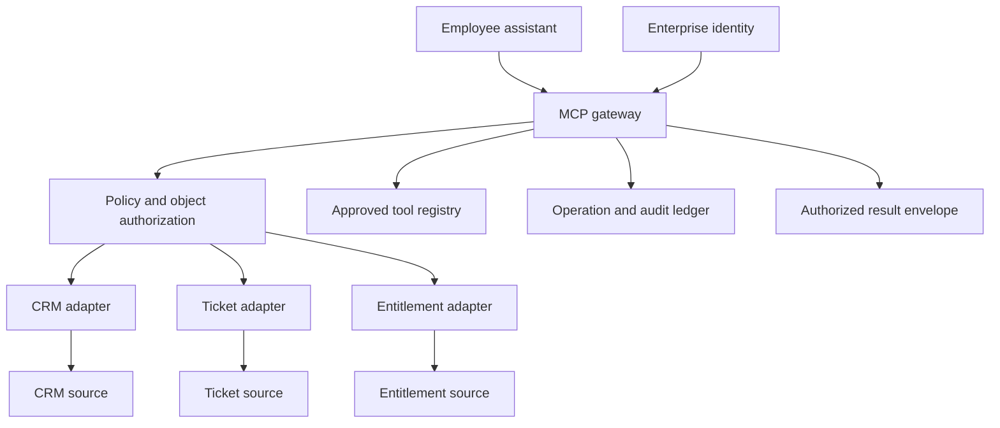
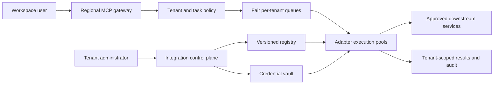

# An MCP tool gateway for enterprise applications

An enterprise assistant may need CRM records, tickets, and internal APIs without receiving every system's credentials. A tool gateway centralizes discovery, identity checks, policy, execution limits, and audit records. Model Context Protocol (MCP) provides a standard interface for clients and servers; the gateway supplies the enterprise-specific control plane around it.

This chapter develops an employee case assistant and a SaaS customer workspace. [OpenSearch](opensearch-retrieval.md) can retrieve background documentation, while MCP tools obtain current records and execute explicitly authorized operations.

!!! note "Scope and evidence — researched September 7, 2026 (UTC)"

    The protocol discussion is pinned to the MCP July 28, 2026 specification, which the official latest endpoint identified during this research. Its per-request protocol differs materially from the initialization/session model in November 25, 2025 and earlier revisions. Verify the revision and extension support actually implemented by each client and server. Workloads and gateway policies are illustrative. MCP compatibility does not certify a server's security or business semantics.

## 1. Protocol concepts and useful features

An MCP host manages the user-facing application; clients connect to servers that expose capabilities. For tools, the server advertises a tool list with names, descriptions, and input schemas, and the client invokes a selected tool. Results can include structured and unstructured content. Optional annotations describe behavior but must not be trusted merely because they appear in a tool declaration. [^1]

MCP also separates tools from resources and prompts. A gateway should retain those distinctions rather than treating every returned text block as an instruction. A resource is content to inspect; a prompt is a reusable interaction template; a tool invokes functionality. Their availability is not equivalent to permission to use every underlying object.

For HTTP-based transports, the pinned authorization specification describes OAuth-based authorization, protected-resource metadata, and tokens issued for the target resource. Transport authorization is optional in the general protocol, so an enterprise deployment must explicitly require the controls its threat model needs. Local process transports have a different credential and process trust boundary. [^2]

The security guidance discusses confused deputies, token passthrough, SSRF, and session attacks. A gateway must validate audience and caller identity and avoid forwarding an incoming bearer token to an unrelated downstream service. [^3] An application handle is not an authorization decision; the current core protocol has no implicit protocol-level session.

## 2. Best fit and poor fit

Use a gateway when several assistants need the same business tools, permission checks should be consistent, or tool owners need controlled rollout and auditing. It is especially useful when upstream systems have different authentication models and resource-level permissions.

A single application calling two stable internal APIs may not need MCP or a dedicated gateway. A conventional typed API can be easier to operate. Do not add a gateway solely to rename existing endpoints: it becomes another availability dependency and can create a large concentration of credentials and privileges.

| Need | Gateway value | Remaining responsibility |
|---|---|---|
| Shared tool discovery | Approved catalog and versioned schemas | Verify actual downstream behavior |
| Per-user enterprise access | Common identity and policy checks | Source-specific authorization |
| Audit of model actions | Standard operation ledger | Meaningful business receipts |
| Multiple client implementations | Protocol interoperability | Negotiation and compatibility testing |
| Tenant-specific integrations | Credential binding and scoped routing | Isolation throughout storage and execution |

## 3. Gateway mechanics

### Registry and discovery

Maintain an approved registry rather than connecting automatically to arbitrary server URLs supplied by a model. Each entry records owner, endpoint, transport, protocol version, tool names, schema hash, data classification, operation class, timeout, and supported authentication. Discovery exposes only tools appropriate to the caller and task.

A catalog snapshot should be pinned to a run. A changed schema triggers validation and rollout instead of silently changing arguments midway through an approved operation. Description changes matter too: they influence model behavior and deserve review. Name tools by domain, such as `tickets.read_case`, to avoid collisions across servers.

### Identity and authorization

Resolve tenant and subject from validated credentials. Authenticate the client application independently when needed. Compute the effective authority as the intersection of user rights, application rights, task scope, and tool policy. The model cannot widen it through arguments.

Downstream access may use delegated user tokens where supported or narrowly scoped service credentials plus explicit object checks. In the latter design, the gateway must not imply it has reproduced all source permissions merely by filtering on a customer ID. Verify the source's permission semantics, including shared records, team membership, ownership changes, and field-level restrictions.

### Execution contract

Normalize arguments, validate schema and complexity, then produce an operation record before execution. For writes, bind authorization or approval to canonical arguments and resource versions. Return a typed envelope containing status, receipt, observation time, source, partial-result flags, and retriable classification.

A timeout after a write must return an uncertain state. MCP request IDs correlate messages; they are not automatically business idempotency keys. The gateway or destination must define stable action keys and reconciliation behavior. Retry policy belongs to the tool contract, not a generic “retry all errors” middleware.

### Current transport and compatibility mechanics

The July 28, 2026 revision uses per-request protocol version, identity, and capabilities; it has no initialization negotiation handshake. The versioning documentation calls November 25, 2025 and earlier revisions legacy and explains interoperability across the two eras. A gateway must explicitly support the deployed era rather than assuming every MCP server begins with `initialize`. [^4]

For current Streamable HTTP, a server exposes one POST endpoint. Each request has its own POST, and the response is one JSON object or an SSE stream scoped to that request. The revision removes the old GET stream and protocol-level sessions. Servers validate Origin to address DNS-rebinding risk; local deployment should not unintentionally expose the endpoint on every interface. Closing a response SSE stream signals cancellation in this transport. [^5]

For stdio, the client launches a subprocess and exchanges newline-delimited JSON-RPC on standard input/output. Diagnostic logging belongs on stderr, not protocol stdout. Cancellation uses a notification referencing the request ID because there is no separate per-request HTTP stream to close. Local process access and inherited environment variables are part of the security boundary. [^6]

Application state must be explicit. A browser tool can return a browser-context handle, and subsequent tools include that handle as an argument. The gateway binds the handle to tenant, user/task scope, lifetime, and allowed operations; possession alone should not grant cross-tenant access. Current tools documentation describes explicit handles for state spanning calls. [^1]

For dual-era support, test version rejection, legacy initialization, extension advertisement, reconnect behavior, and cancellation separately. Keep transport adapters from changing business operation IDs: a request retried over a new HTTP connection is still the same intended write if its business key says so. Conversely, reusing a JSON-RPC ID does not make two writes idempotent. Protocol cancellation asks execution to stop; it cannot retract an already committed downstream action.

## 4. Design A: employee case-resolution assistant

Assume 3,000 employees, 50 peak tool calls/second, and three sources: CRM, ticketing, and an internal entitlement service. A typical task asks for a case summary and a draft response. Sending the response is a distinct authorized action.

### Data model

| Record | Fields |
|---|---|
| Tool definition | Namespace, schema hash, owner, operation class, limits |
| Connection | Tenant, source, credential reference, permitted scopes, expiry |
| Invocation | Run, subject, tool version, canonical argument hash, policy decision |
| Outcome | Attempt ID, remote receipt, status, error class, timestamps |
| Approval | Proposal hash, subject, approver, target version, expiry |

Keep secrets in a dedicated credential store; the ledger contains references and nonsecret metadata. Audit access itself needs authorization because resource IDs, arguments, and error messages can reveal customer data.

### Request flow

1. The assistant requests tools for a case-resolution task. The gateway authenticates the employee and exposes the approved read tools.
2. `read_case` verifies source access before returning permitted fields. The result includes a case version and observation time.
3. CRM and entitlement reads run in parallel only after resolving a verified customer relationship. A matching email string alone is insufficient to join unrelated identities.
4. The assistant drafts an answer from source-backed facts. The response is saved as a draft artifact with provenance.
5. If the employee requests sending, the gateway validates the recipient, body hash, case version, and explicit action authorization.
6. The ticket adapter submits with a destination idempotency key where supported. It returns the remote message ID, which an independent read can verify.

If ticket sending times out, the assistant reports that delivery is being reconciled. It should not ask the model to invent a new key and send again. A source outage produces a partial summary with missing fields; cached entitlements must not be used beyond the application's allowed authorization freshness.

### Failure isolation

Give each adapter its own concurrency pool and circuit breaker. A slow CRM should not block ticket reads. Enforce response size before a large attachment reaches the model. Redact sensitive fields in the adapter where semantics are known, then apply output checks as an additional layer. Record whether fields were omitted so the model does not interpret redaction as absence.

## 5. Design B: customer-configured SaaS workspace

Assume 2,000 tenants, 100 shared tools, and 20 tenants with dedicated integrations. Most tenants share gateway compute; larger tenants require isolated credentials and execution pools. The system allows customer administrators to enable vetted integrations, not upload arbitrary server code into the shared gateway.

Provisioning validates destination ownership, authentication, requested scopes, and tool schema against policy. Store a tenant-specific connection binding and activate it only after a test call with the expected identity. Do not allow a model to swap a connection reference to another tenant's integration.

On each invocation, the gateway resolves the connection from trusted tenant configuration. The model may supply a business record ID but not the credential ID or arbitrary network destination. A network proxy enforces approved hosts and rejects private-network destinations where they are outside scope. Redirects and DNS resolution need the same checks as the initial URL.

The operation ledger is partitioned by tenant and run. A global operational dashboard uses aggregated measurements without exposing arguments or returned records. Tenant deletion disables connections first, cancels pending work, revokes credentials, then purges artifacts according to retention policy. A late callback must not restore a deleted tenant's data.

For a tenant that needs a custom server, place it in an isolated worker environment with restricted egress and no shared gateway secrets. Admit its tools through the same versioned registry. Isolation reduces the effect of server compromise but does not make its descriptions trustworthy or its outputs instruction-authoritative.

This architecture favors stronger central control at the expense of onboarding flexibility. Direct client-to-server connections reduce gateway concentration but distribute credential handling, policy, and audit logic across every client.

## 6. Alternatives and trade-offs

| Option | Prefer when | Main trade-off |
|---|---|---|
| MCP gateway | Multiple agent clients need controlled common tools | Central availability and credential concentration |
| Direct MCP connections | Few trusted servers and capable clients | Repeated policy and audit implementation |
| Conventional API gateway | Existing REST/gRPC consumers dominate | Agent discovery and tool semantics need adapters |
| Embedded SDK integrations | One application owns all integrations | Tight release coupling and duplicated connectors |
| Workflow service | Business process order is fixed | Less dynamic discovery; stronger prescribed sequencing |

MCP is an interface standard, not a replacement for API authorization or data governance. A conventional gateway may coexist with an MCP frontend. Choose where each policy is authoritative so duplicated checks do not drift into contradictory behavior.

## 7. Capacity, cost, and recovery

At 50 requests/second and a measured average downstream latency of 800 ms, approximately 40 operations are in flight before headroom. This Little's Law estimate applies to a stable workload and does not account for burst queues or tail latency. Size pools from measured distributions and destination quotas.

Charge and limit by expensive dimensions: calls, returned bytes, external API units, active connections, and audit storage. Reserve tenant budget before sending work. Pagination must have a total result cap, not only a per-page limit. A model can otherwise turn a cheap list tool into a full database export.

Monitor policy denials, scope changes, tool-schema drift, source-specific latency, unknown write outcomes, token-refresh failures, and per-tenant queue age. Logs should make it possible to answer who requested an operation, why it was allowed, what version executed, and what the destination confirmed.

On restart, reconcile operations marked sent but unacknowledged. For reads, retry if still useful within the deadline. For writes, use destination receipts or a manual exception queue. A network retry without a business reconciliation rule can duplicate external actions.

## 8. Evaluation and exercises

Build contract tests per tool with unauthorized records, malformed parameters, partial responses, timeouts, and schema changes. Add protocol compatibility tests against selected client/server versions. Test that one tenant cannot discover another tenant's connection or retrieve its cached results.

Red-team malicious tool descriptions and outputs, audience-mismatched tokens, arbitrary URLs, stale sessions, oversized pagination, and revoked users. Validate that audit and tracing paths obey the same boundaries as normal responses. A passing protocol handshake says little about these controls.

Build a lab with two fake tools: read a ticket and append a note. Simulate a note write whose acknowledgment is lost. The gateway should reconcile a single receipt rather than append a duplicate note.

1. Which identity does the downstream service see, and how are user permissions preserved?
2. Why is a tool annotation insufficient to authorize a write?
3. What changes when a tenant supplies its own server?
4. Which fields must be bound to approval so a later call cannot broaden it?
5. How does the gateway distinguish authentication success from access to one CRM record?

## Related studies

- [A02 · Tool-using agents with LangGraph or an agents SDK](tool-using-agents.md)
- [P04 · A secure multi-tenant AI platform](secure-multi-tenant-platform.md)
- [A01 · Durable AI workflows with Temporal or AWS Step Functions](durable-workflows.md)

## References

[^1]: [MCP July 28, 2026: Tools](https://modelcontextprotocol.io/specification/2026-07-28/server/tools) — discovery, schemas, results, and untrusted annotations.
[^2]: [MCP July 28, 2026: Authorization](https://modelcontextprotocol.io/specification/2026-07-28/basic/authorization) — HTTP authorization model and resource-scoped tokens.
[^3]: [MCP July 28, 2026: Security best practices](https://modelcontextprotocol.io/specification/2026-07-28/basic/security_best_practices) — confused deputies, token passthrough, SSRF, and session security.

[^4]: [MCP July 28, 2026: Versioning and compatibility](https://modelcontextprotocol.io/specification/2026-07-28/basic/lifecycle) — per-request versioning and legacy interoperability.
[^5]: [MCP July 28, 2026: Streamable HTTP](https://modelcontextprotocol.io/specification/2026-07-28/basic/transports/streamable-http) — POST, request-scoped SSE, Origin, and cancellation.
[^6]: [MCP July 28, 2026: stdio](https://modelcontextprotocol.io/specification/2026-07-28/basic/transports/stdio) — subprocess transport, framing, and cancellation.
