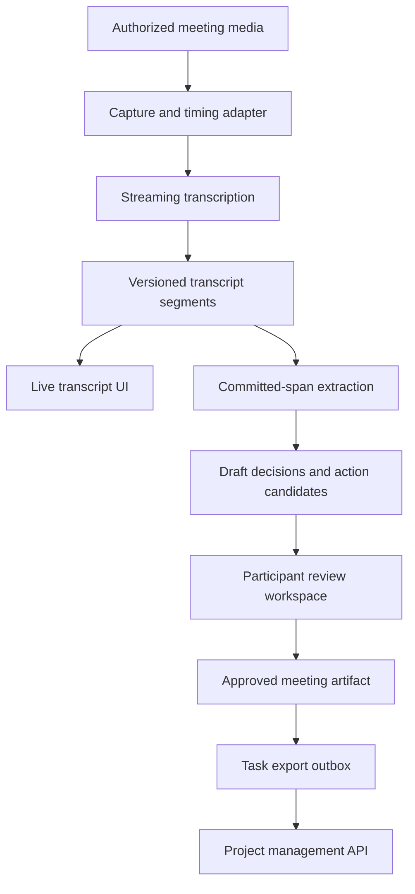
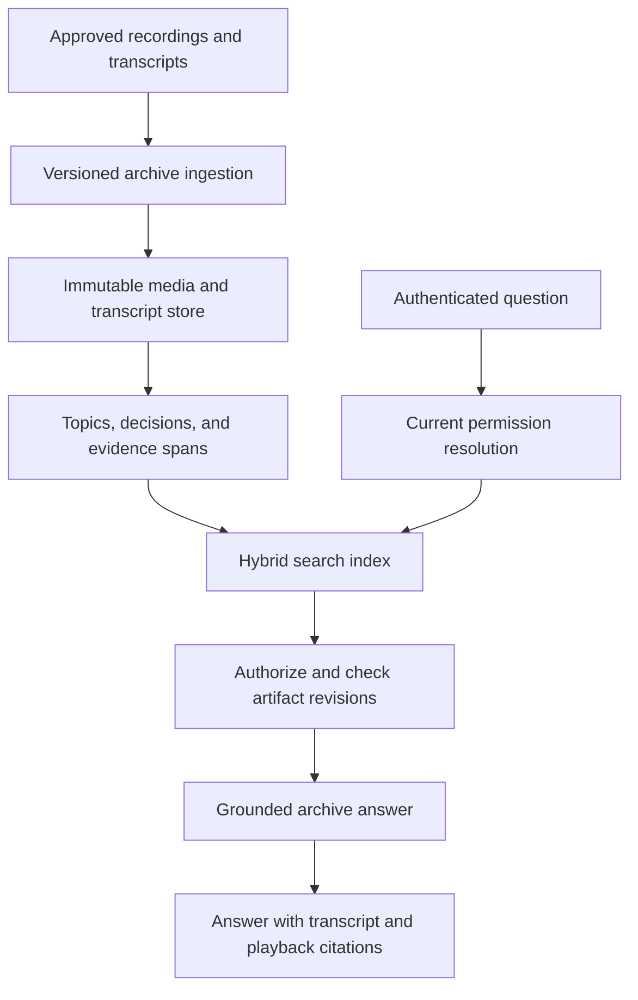

# Meeting intelligence: transcripts, decisions, and action items

A meeting-intelligence system converts evolving audio into a durable record of what was said, what was decided, and what someone actually agreed to do. Its hardest problems are attribution, revisions, consent, and evidence. A fluent summary can still assign the wrong owner, turn a suggestion into a decision, or expose a private conversation through search.

Like the [OpenSearch retrieval example](opensearch-retrieval.md), this design separates source evidence, derived indexes, authorization, and generation. The transcript is itself derived from audio and may be corrected; summaries and action items need another layer of provenance.

!!! note "Scope and evidence"

    Research date: September 7, 2026 (UTC). Amazon Transcribe documentation was consulted for streaming, speaker partitioning, and provisional-result behavior. Workloads and quality gates are illustrative. Recording and retention policy must come from the organization and product requirements; this chapter does not supply legal advice or assume that joining a meeting grants recording permission.

## 1. The processing layers

**Capture** records or receives authorized media with timestamps and participant/session context. Separate audio channels, when available, can provide stronger attribution than inferring speakers from a mixed recording. Preserve the capture source and timing information; a participant display name alone does not prove who spoke.

**Transcription** produces words and time spans. Amazon Transcribe supports streaming transcription using HTTP/2 and WebSockets, with service-specific audio requirements. A streaming design must feed audio at a suitable real-time pace and handle the connection's lifecycle rather than uploading arbitrary chunks as if they were independent files. [^1]

**Diarization** partitions speech by speaker label. Amazon Transcribe's speaker partitioning output includes labels and timing information. Labels such as `spk_0` identify a speaker cluster, not a verified person. Mapping a cluster to a participant is an additional application step and can remain unknown. [^2]

**Evidence assembly** converts committed transcript segments into topic intervals, decisions, questions, and candidate actions. **Review and publication** turns these candidates into an approved meeting artifact. **Retrieval** makes authorized artifacts discoverable without discarding their source and revision relationships.

These layers should be independently replayable. A corrected speaker assignment need not require reprocessing the original audio, while a corrected ASR model may require rebuilding dependent artifacts.

## 2. Live transcripts are changing data

Amazon Transcribe emits partial results that can change as more speech arrives; `IsPartial` marks whether a segment is complete. Stabilization reduces how much already emitted text can change, trading some accuracy for quicker stable display. [^3] A live summary must therefore track transcript revisions instead of concatenating every event.

Use a segment record such as:

`(meeting_id, segment_id, revision, start_ms, end_ms, speaker_cluster, text, is_final, source_run)`

A partial update replaces the previous revision of that segment. A final segment becomes eligible for durable extraction. If the transcript is later corrected, create a new revision and invalidate affected derived spans. Time offsets should reference the media timeline, not wall-clock receipt time, which can vary with buffering.

A live transcript can display tentative text, but external action creation should wait for reviewed committed evidence. “I could take this” followed by “actually, Maya should own it” demonstrates why premature extraction fails. Even a final ASR segment may not contain the final decision; the conversation can reverse it later.

## 3. Decisions, commitments, and summaries

A decision record should contain proposition, status, evidence spans, who confirmed it if known, and any scope or condition. Distinguish `proposed`, `agreed`, `deferred`, and `reversed`. A summary should preserve unresolved disagreement rather than choosing the most confident-sounding speaker.

An action candidate needs description, owner status, due-date status, evidence, and review state. Use `owner_unassigned` when no one committed. Keep “next week” as raw evidence and resolve it only with the meeting date/timezone and an explicit interpretation. If the meeting provides no due date, do not generate one because a project-management API requires it.

Long meetings need hierarchical processing. Extract evidence within overlapping topic intervals, merge candidates by identity and meaning, then build a final summary from those candidates and selected transcript spans. Overlap reduces boundary losses but can produce duplicates. Deduplication should retain all supporting evidence and distinguish repeated emphasis from a new commitment.

Speaker attribution deserves a separate confidence field from transcription confidence. The words may be correct while the speaker is wrong. The reviewer UI should let a participant correct a cluster assignment, then preview which decisions and actions change before republishing.

## 4. Fit and alternatives

| Approach | Best fit | Main limitation |
|---|---|---|
| Meeting platform's native transcript and summary | Simple adoption within one platform | Integration, revision, and access behavior must match organizational needs |
| Managed transcription plus custom artifact pipeline | Domain-specific outputs and cross-platform workflows | You own attribution, review, and downstream synchronization |
| Local/offline transcription | Controlled deployment or disconnected recordings | Hardware, model operations, and quality validation become local responsibilities |
| Human notes with AI cleanup | Low meeting volume and high nuance | Incomplete source evidence and manual effort |
| Search over transcript only | Evidence discovery without automatic commitments | Users still synthesize decisions and follow-ups |

Meeting intelligence is useful for searchable project history, accessible transcripts, reviewed action tracking, and finding the exact discussion behind a decision. It is a poor basis for silently scoring employees, inferring emotions, or treating uncertain speaker labels as identity proof. Those are different applications with materially different requirements.

Choose a custom pipeline when approved artifact schemas, correction propagation, permission boundaries, or integrations justify it. Do not rebuild meeting capture if the platform already provides reliable authorized recordings and transcripts that meet your needs.

## 5. Design A: live project meeting copilot

### Workload and architecture

Assume 300 concurrent meetings at peak, averaging eight participants and 45 minutes. Live captions should update within an illustrative two-second target; reviewed notes should be ready within five minutes of meeting end. The assistant shows candidates during the meeting but does not create external tasks without the meeting workflow's explicit approval.

### Flow and state

1. Create a meeting session with organizer, participant permissions, capture policy, and intended retention. Start capture only when the approved flow allows it.
2. Ingest timestamped audio and publish ordered segment updates. The client updates segments by ID and revision so reconnecting does not duplicate captions.
3. Run candidate extraction on committed windows with a short overlap. Each candidate points to evidence segments and includes extraction/prompt versions.
4. Maintain a draft artifact that can be updated as later conversation clarifies or reverses an earlier statement. Mark draft items clearly and avoid presenting them as completed tasks.
5. At meeting end, finalize transcription, reconcile candidates across the full meeting, and request review through the normal application UI.
6. Publish an approved revision. An outbox worker exports approved tasks with stable integration IDs. Record external task IDs and the artifact revision that created them.

Store meeting state as `scheduled`, `capturing`, `finalizing`, `review_ready`, `published`, or `failed`, with capture and extraction substates. A meeting can have a usable transcript even if action extraction failed. Expose that partial success instead of hiding all output behind one failure flag.

### Corrections and external synchronization

If a reviewer changes an action owner before export, only the accepted revision is sent. If a published action is later corrected, show a proposed external update rather than silently overwriting changes made in the project-management tool. Store an export revision and external version where supported; conflicts require reconciliation according to the integration policy.

A repeated export event must not create another task. Use `(meeting_id, action_id)` as a logical idempotency identity and maintain an export ledger. An API timeout can mean the task was created but the response was lost. Query by the stable integration reference where possible before retrying.

### Failure behavior

If streaming transcription disconnects, retain authorized buffered audio within a bounded policy and resume or run a post-meeting repair pass. Mark gaps in the transcript. Do not imply complete notes when minutes of audio are missing. A reconnect starts a known media interval so overlapping segments can be deduplicated.

If the extraction model is unavailable, captions continue and candidates can be generated later. If the meeting ends abruptly, finalization uses the last known capture boundary and flags the abnormal end. If the task tool is unavailable, approved artifacts remain visible with export status; retrying export does not rerun the language model.

## 6. Design B: searchable organizational meeting archive

### Workload and architecture

Assume 100,000 recorded meetings with an average one-hour duration, plus 1,000 new meetings daily. Users ask “Why did we defer the migration?” and need the source discussion, not merely a summary. Access can differ between participants, project teams, and organizational groups, and can change after publication.

### Index design and retrieval

Index transcript windows with meeting title, date, project, speaker labels where permitted, topic, and source offsets. Index approved decisions as separate objects linked to their evidence. A decision record can retrieve more precisely than a large transcript chunk, while the full span lets the user verify nuance.

Use hybrid retrieval for exact project names and semantic questions. Search within current permissions before reranking or model input. Expand candidate spans to include nearby context, especially when a phrase such as “let's do that” refers to the previous speaker. Avoid extracting a decisive sentence while omitting the later reversal.

The answer should distinguish a meeting's stated decision from the current project state. “The team deferred it on May 3” does not establish that it remains deferred today. If the application needs current status, consult the authoritative project system through a separate tool and cite that source separately.

### Access and sharing

Membership in a meeting's original invite list is one possible policy input, not a universal access rule. Use the organization's approved artifact permissions. A user can have access to the approved notes while raw audio remains restricted. Retrieval must not expand from an authorized summary into unauthorized transcript or media.

Derived artifacts inherit or explicitly receive policies at creation; the policy service remains authoritative. Track ACL versions in cache keys and purge or invalidate results on revocation. Citation URLs should be short-lived and authorized when opened. A public link to a stored recording can defeat otherwise correct query filtering.

### Revision and deletion

A transcript correction produces a new artifact revision with affected-span invalidation. Re-extract relevant decisions, rebuild associated chunks, and mark old cached answers stale. Preserve audit history under the retention policy, but do not continue serving superseded text as current.

Deletion is a graph traversal through recording, channels, transcript revisions, clips, summaries, embeddings, search records, exports, and caches. Maintain a deletion manifest and completion status. External exports may require a separate authorized integration operation; do not claim local deletion removed copies already distributed elsewhere.

## 7. Capacity and cost

At 300 concurrent meetings, media concurrency is the primary live load. If each lasts 45 minutes, `300 × 45 = 13,500` concurrent-session minutes represent one full cohort; this is not the daily volume unless the arrival pattern matches. Measure arrival rate and session duration distributions to size stream workers and provider quotas.

For the archive, `100,000 × 60 = 6,000,000 audio minutes`. A full retranscription is a major migration. Preserve raw service output and use stage-specific versions so changes to summary prompts do not force audio reprocessing. Prioritize active projects or recent meetings when a complete backfill cannot meet the available budget.

If a transcript averages an illustrative 150 words/minute, a one-hour meeting has about 9,000 words before metadata. Long-context summarization costs depend on tokenizer and model, but repeated full-transcript prompts for each action are clearly wasteful. Extract windows once, then reuse evidence-linked candidates.

Cost includes capture, transcription, retained audio, artifact inference, search, review, and integrations. Report cost per published meeting and per useful retrieved answer. A high automatic-summary rate is not valuable if participants rewrite every action item. Queue age, review backlog, transcript gaps, and integration failures need separate dashboards.

## 8. Evaluation and release

Create a reviewed corpus with overlapping speakers, weak microphones, domain terms, uncertain owners, conditional commitments, reversed decisions, and multiple people with similar names. Measure word error rate and diarization separately. For business artifacts, measure decision precision/recall, action precision, owner accuracy, due-date accuracy, and evidence support.

False commitments are often more harmful than missed candidates. Choose thresholds accordingly and use abstention or review for ambiguous ownership. Evaluate summaries for omitted disagreement and scope qualifiers, not only topical coverage. Test long meetings where an early proposal is reversed much later.

Run end-to-end drills for partial transcript revisions, duplicate events, capture gaps, permission revocation, corrected speaker mapping, and export timeouts. Verify that a user's access to a summary does not expose restricted audio. Keep a release canary with reviewed outputs and monitor corrections by error type after rollout.

## 9. Practice: defend the design

1. Show how one speaker-label correction updates every affected action without retranscribing audio.
2. Produce an action candidate whose owner is explicitly unknown rather than guessed.
3. Simulate a late reversal and prove the final summary preserves the actual decision.
4. Replay task export events and demonstrate one external task per approved action.
5. Answer a historical status question without confusing it with the current project state.
6. Trace a deletion across audio clips, transcript revisions, search, and caches.

## Implementation review: artifact lineage

Represent derivation as a small graph: media interval → transcript revision → extracted candidate → approved artifact revision → external export. Each edge records the producing run and evidence range. When a transcript correction touches an interval, traverse its dependent candidates rather than rebuilding every artifact blindly. A new summary can cite the corrected span while historical approved revisions remain separately auditable under the retention policy.

Keep human edits distinct from generated text. Re-running extraction should produce proposed changes, not overwrite a carefully corrected action owner. A three-way comparison between the previous generated candidate, the accepted human revision, and the new candidate can identify conflicts. The review UI should show those conflicts explicitly and preserve who made the accepted decision.

Archive search should also distinguish an artifact's creation time from the meeting time and the time a decision became effective. A note published a week later can describe an earlier conversation; sorting only by publication date can mislead historical questions. Store all relevant timestamps and expose their meaning in citations. This is particularly useful when a decision is reversed in a later meeting and the user asks what was known at a specific point.

## Related studies

- [D03 · A real-time voice assistant](realtime-voice.md)
- [D05 · Video understanding and retrieval](video-retrieval.md)
- [R08 · Long-term memory for AI applications](long-term-memory.md)

## References

[^1]: [AWS: Streaming transcription](https://docs.aws.amazon.com/transcribe/latest/dg/streaming.html) — supported streaming transports and audio-stream requirements.
[^2]: [AWS: Partitioning speakers](https://docs.aws.amazon.com/transcribe/latest/dg/diarization.html) — speaker labels and timing structures.
[^3]: [AWS: Streaming and partial results](https://docs.aws.amazon.com/transcribe/latest/dg/streaming-partial-results.html) — evolving transcript segments, finality, and stabilization.
