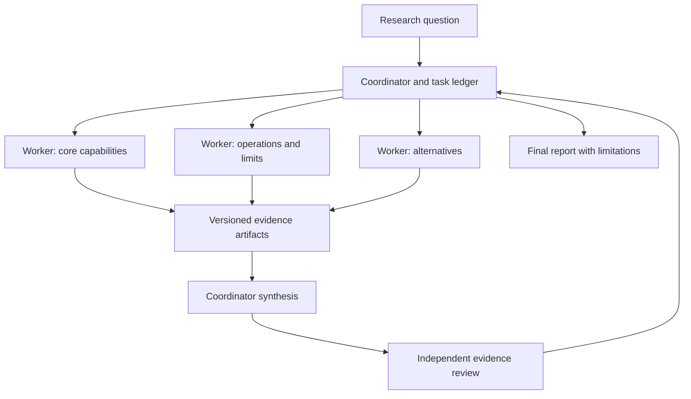
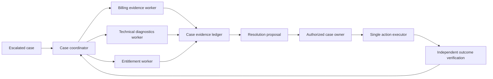

# Multi-agent task coordination

Multiple agents can investigate independent questions in parallel or separate proposing from reviewing. They also duplicate context, increase cost, create conflicting edits, and make completion harder to assess. The first design question is whether the work decomposes into useful independent outputs that a coordinator can verify.

This study develops a research-and-review workflow and complex support resolution. It extends the [bounded tool-agent design](tool-using-agents.md); [OpenSearch](opensearch-retrieval.md) remains a shared evidence source with per-agent access constraints.

!!! note "Scope and evidence — researched September 7, 2026 (UTC)"

    Framework mechanics and practitioner observations are sourced below. The coordination protocol, workloads, and acceptance criteria are proposed designs. Vendor case studies describe their own systems and do not establish that multiple agents outperform one agent on every task.

## 1. What changes when there are several agents

An agent is a reasoning loop with its own context, tools, and budget. A coordinator creates bounded tasks, tracks dependencies, receives artifacts, reconciles conflicts, and produces the final result. A worker may be a full agent, a deterministic tool, or a small model classifier; not every subtask needs the same machinery.

Anthropic's multi-agent research account describes a lead agent delegating research to parallel workers and highlights coordination, evaluation, and token use as practical challenges. Its reported benefits are workload-specific and should motivate a controlled experiment rather than a universal architecture rule. [^1]

LangGraph's graph model provides state, edges, reducers, and super-step execution for coordinating branches. A reducer determines how concurrent updates combine; appending two worker results is different from allowing both to overwrite the final answer. [^2] Persisted checkpoints can support recovery, but the application still needs task ownership and side-effect reconciliation. [^3]

## 2. Where specialization helps

| Work decomposition | Potential benefit | Warning sign |
|---|---|---|
| Independent source investigations | Parallel retrieval and diverse evidence | Workers search the same sources repeatedly |
| Proposal and independent review | Different acceptance responsibility | Reviewer simply paraphrases proposer |
| Domain-specific support checks | Smaller relevant context and tool scope | Each worker needs the entire conversation |
| Concurrent edits in separate modules | Parallel implementation | Ownership overlaps or integration is undefined |
| Tightly sequential reasoning | Usually little benefit | Coordinator spends more effort explaining than solving |

Prefer one agent when context is tightly coupled or the task is small. Prefer deterministic fan-out when the subtasks are known queries; the workflow/agent distinction in the practitioner guidance is a useful baseline. [^4] Multiple agents are justified when measured quality or latency improvement exceeds coordination overhead and additional resource use.

Separate role labels from actual independence. Three agents using the same prompt and sources can produce correlated errors. A reviewer needs independent criteria and access to evidence, not merely a different job title.

## 3. The coordination contract

Every delegated task should include an objective, scope, inputs, output schema, acceptance checks, budget, deadline, and ownership. “Research everything about databases” is not a bounded assignment. “Compare filtering and recovery for this workload using these source classes, returning a cited evidence table” is.

### State model

| Record | Fields |
|---|---|
| Parent task | Goal, global budget, deadline, acceptance criteria |
| Child task | Owner, scope, dependencies, lease, attempt, state |
| Artifact | Immutable URI, schema, version, evidence references |
| Message | Sender, recipient, task revision, sequence, type |
| Decision | Accepted/rejected artifact, rationale, reviewer |
| Action | Designated executor, operation key, authorization, receipt |

Use states such as queued, running, blocked, succeeded, failed, canceled, and superseded. “Succeeded” means an artifact passed its contract, not that the worker stopped generating text. A task may finish with an explicit limitation that the coordinator must account for.

### Budgets and cancellation

Allocate a global budget, reserve portions before dispatch, and reconcile actual usage. Giving every worker the parent's full budget multiplies exposure. Limit worker count and delegation depth. A child should request a scope change rather than recursively spawning unrestricted work.

Cancellation must propagate to tools and compute where possible. Record the difference between requested and confirmed cancellation. A worker may have sent an external action before cancellation arrived; its outcome still needs reconciliation. Only one designated executor should perform a shared side effect.

### Messages and artifacts

Prefer immutable artifacts with concise completion messages over repeatedly copying full transcripts. Include evidence IDs and assumptions so summaries can be checked. Worker output is untrusted input to the coordinator: instructions contained in retrieved text or a worker artifact cannot grant authority.

A coordinator should reject stale results when their task revision no longer matches the current plan. Preserve superseded artifacts for audit where appropriate, but do not merge them into a revised answer silently.

### A concrete handoff and merge policy

The following is an illustrative contract for one research worker:

```json
{
  "task_id": "retrieval-review/operations",
  "revision": 2,
  "scope": "recovery, consistency, and operational limits",
  "excluded_scope": ["pricing recommendation", "final vendor choice"],
  "deadline_seconds": 180,
  "budget": {"source_reads": 8, "model_calls": 5},
  "output": {
    "claims": [],
    "sources": [],
    "assumptions": [],
    "unknowns": [],
    "completion": "complete_or_partial"
  }
}
```

Each claim contains a stable ID, text, source IDs, applicability, and a classification as verified fact or design inference. The worker returns an artifact hash and task revision. The coordinator validates the schema, checks referenced sources exist, and applies acceptance criteria. A worker that reaches its deadline returns the useful partial artifact plus the missing questions.

Merge by responsibility, not arrival order. The operations worker owns operational findings; the alternatives worker owns its comparison evidence. If both discuss the same capability, the coordinator compares source version and applicability rather than overwriting one field with the last message. A genuine contradiction becomes a small reconciliation task with a reserved budget or an explicit unresolved issue.

For code-writing workers, assign distinct files or modules and define an integration owner. A shared repository is not a conflict-resolution protocol. If work must overlap, use separate branches or patch artifacts and let the integration owner resolve conflicts with tests. Workers should not revert another worker's changes merely to restore their expected environment.

A deadline policy can distinguish required and optional branches. Required evidence missing at the hard deadline makes the parent partial or blocked; optional evidence can be omitted with disclosure. The coordinator should not extend every deadline automatically, because that defeats the user's latency and cost constraints. A late result after finalization creates a possible revision, not a silent mutation of the delivered artifact.

Use sequence numbers or equivalent deduplication for completion messages and durable task state for leases. After coordinator restart, inspect accepted artifacts and active leases before redispatch. If two attempts finish, accept at most one for the current task revision unless an explicit comparison step chooses otherwise. This avoids duplicate synthesis and inconsistent accounting.

Finally, define an escalation path for scope mismatch. A worker discovering that its question depends on another domain sends a concise dependency request with the necessary fact. It does not assume ownership of the other worker's entire task. This preserves useful parallelism while keeping the coordinator's integration problem bounded.

## 4. Design A: research with independent review

Assume 1,000 complex research requests/day, three research workers per admitted request, and one review pass. Each worker has eight source reads and a three-minute deadline. The coordinator reserves a separate budget for synthesis and verification instead of consuming it all on search.



### Decomposition

The coordinator resolves the user's objective and constraints, then assigns distinct evidence responsibilities. For a retrieval-system decision, one worker studies query features, another operations and consistency, and another alternatives under the same workload. All receive common assumptions so they do not compare incompatible scales or security requirements.

Workers return claims, evidence excerpts, source identifiers, observed dates, applicability, unknowns, and recommendations separated from facts. They do not each write the entire report. This reduces duplicate effort and makes contradictions visible at the artifact level.

### Data flow

1. Authenticate the request and identify permitted private and public sources.
2. Create three child tasks with nonoverlapping scope, shared definitions, and reserved budgets.
3. Workers retrieve evidence through scoped tools. Private-source access is checked for each worker's delegated authority.
4. Validate artifact schemas and source provenance before synthesis. Missing evidence fields make the artifact incomplete.
5. The coordinator builds a decision table, explicitly reconciling contradictions in versions, deployment options, and workload assumptions.
6. A reviewer checks high-impact claims against original evidence, tests whether the comparison answers the question, and identifies unsupported conclusions.
7. The coordinator performs one bounded correction cycle and returns the final report or a qualified partial result.

### Recovery and quality

A slow worker can be replaced after its lease expires, but results are deduplicated by child task and attempt. The first accepted artifact wins only after validation; a later better artifact requires a deliberate revision. If one worker fails, the final report may omit that dimension with a clear limitation rather than conceal the gap.

The reviewer should not know which recommendation the coordinator “prefers” when independently assessing source support. Shared evidence remains necessary, but independent acceptance criteria reduce agreement bias. A majority vote over unsupported claims is not evidence.

This design gains parallelism only across source investigations. Synthesis remains a dependency after evidence is available. End-to-end time is approximately planning plus the slowest required worker plus synthesis and review, not the sum of worker times. Tail latency and correction cycles can erase the apparent gain.

## 5. Design B: complex support resolution

Assume 500 escalated cases/day involving billing records, technical diagnostics, and account entitlements. Three specialists gather evidence; only one case coordinator communicates externally or submits a business action. Target ten minutes for a review-ready resolution proposal.



The billing worker can read approved invoice fields but cannot issue a credit. The diagnostics worker can inspect the selected service and time interval but cannot restart production. The entitlement worker resolves current access status without exposing unrelated customer records. Their capabilities are narrow and enforced by tools.

The case coordinator receives structured findings rather than raw exports. Each includes observation time, source version, uncertainty, and recommended next information. It reconciles temporal conflicts: a billing status from yesterday may not explain today's access failure. If specialists refer to different accounts, the coordinator resolves identity before drawing conclusions.

A resolution proposal contains the factual summary, unresolved issues, proposed customer communication, and any action with exact target and preconditions. The case owner reviews the concrete proposal. The single executor submits it using a stable operation key and captures the receipt. Specialists never independently “help” by issuing the same action.

### Concurrency and ownership

The case ledger uses optimistic concurrency on case revision. New customer information increments the revision and can invalidate a pending proposal. Worker artifacts from the old revision remain historical evidence but cannot automatically authorize the new resolution.

When one worker finds a fact that changes another's task, send a structured update with the relevant case revision. Avoid a shared free-form chat in which every agent reacts to every message. A small number of targeted dependencies is easier to reason about and less expensive.

### Failures

If billing is unavailable, the system can still prepare technical findings but should not promise a credit. If action submission times out, the executor owns reconciliation and the coordinator reports uncertainty. If a worker leaks an out-of-scope field into its artifact, artifact validation and downstream access controls should prevent broader distribution and record the incident.

Unlike the research design, support resolution has a live business record and external consequences. The coordination objective is an auditable, consistent proposal and one verified action path, not maximal parallelism.

## 6. Alternatives and trade-offs

| Pattern | Prefer when | Cost |
|---|---|---|
| Single bounded agent | Task context is tightly coupled | Less parallel exploration |
| Deterministic fan-out | Known independent queries | Limited adaptive investigation |
| Coordinator and specialists | Distinct domains or source scopes | Scheduling, artifact contracts, synthesis |
| Peer collaboration | Research or distributed planning warrants it | Harder ownership and termination |
| Independent reviewers | Error detection matters more than speed | Added latency and correlated-error risk |

A hierarchy gives one place to resolve conflicts but can make the coordinator a bottleneck. Peer systems reduce central planning but need stronger protocols for agreement and side effects. Choose the simplest topology that satisfies the task's actual dependencies.

## 7. Capacity and economics

Three workers do not mean a threefold speedup. If planning, synthesis, and review are 40% of the original task, even perfectly parallelizing the remaining 60% across three workers yields an idealized total of 60% of the original duration, before overhead. This is an illustrative decomposition, not a benchmark.

Budget tokens for duplicated instructions, private contexts, tool results, messages, synthesis, and review. Store evidence once and pass references where the runtime allows. Deduplicate shared source reads carefully: reuse must preserve access and freshness boundaries.

Measure useful evidence per worker, duplicated reads, coordination tokens, accepted artifacts, stale-result rejection, critical-path duration, and cost per verified task. A worker utilization graph can look impressive while total task success declines because integration is poor.

## 8. Evaluation and practice

Run the same held-out tasks with one agent, deterministic fan-out, and the multi-agent design under equal total budgets. Evaluate quality, latency, and cost separately. For research, check coverage and source support. For support, check account identity, factual consistency, action correctness, and customer-visible outcomes.

Inject late results, duplicate completion messages, failed leases, canceled workers, contradictory evidence, and coordinator restart. Test that exactly one executor owns each external operation. Preserve state-machine invariants even when every worker returns malformed output.

Build a lab with three workers that inspect separate synthetic evidence files. Deliberately make one file outdated and one worker fail. The coordinator should produce a report that identifies the time conflict and missing dimension.

1. Which parts of this task are actually independent?
2. What prevents every worker from spending the entire parent budget?
3. How do you reject a valid-looking result for an obsolete task revision?
4. What makes the reviewer meaningfully independent?
5. Which component alone may execute a shared external action?

## Related studies

- [A02 · Tool-using agents with LangGraph or an agents SDK](tool-using-agents.md)
- [A01 · Durable AI workflows with Temporal or AWS Step Functions](durable-workflows.md)
- [P02 · An evaluation and observability platform for AI](evaluation-observability.md)

## References

[^1]: [Anthropic: How we built our multi-agent research system](https://www.anthropic.com/engineering/multi-agent-research-system) — workload-specific experience with parallel research and coordination.
[^2]: [LangGraph: Graph API](https://docs.langchain.com/oss/python/langgraph/graph-api) — state updates, reducers, and graph execution.
[^3]: [LangGraph: Persistence](https://docs.langchain.com/oss/python/langgraph/persistence) — persisted execution state.
[^4]: [Anthropic: Building effective agents](https://www.anthropic.com/engineering/building-effective-agents) — workflow decomposition and simpler-agent baselines.
