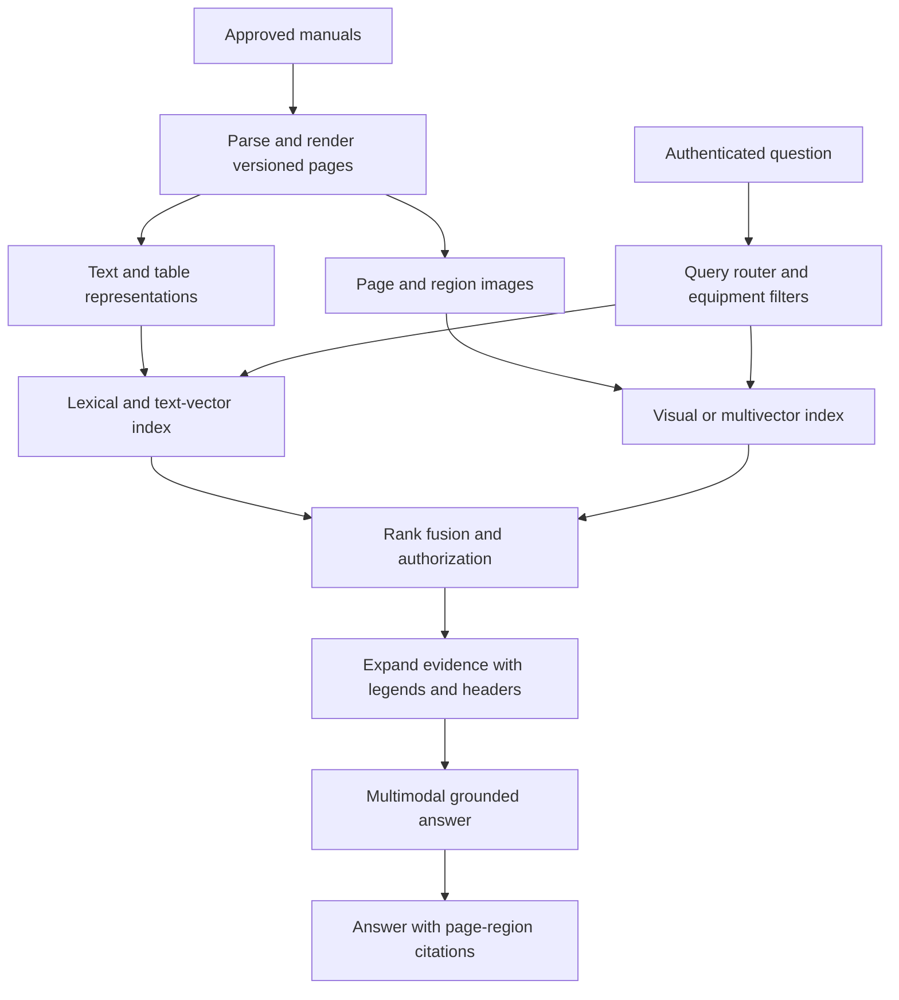
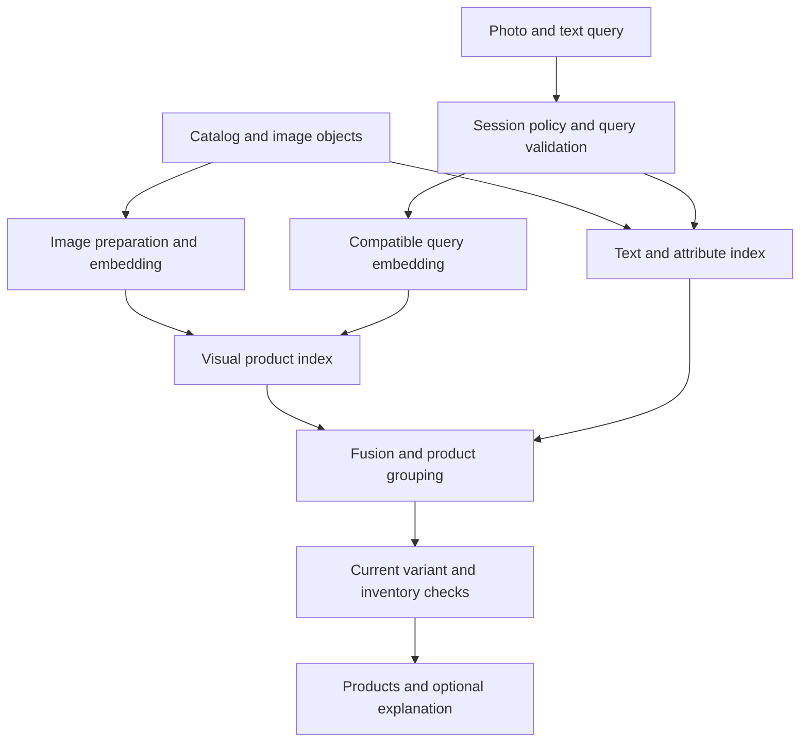

# Multimodal retrieval over text, tables, and images

A manual's answer may live in a paragraph, a wiring diagram, or the intersection of a table row and column. A product query may arrive as a photograph with a few words. Multimodal retrieval preserves these different kinds of evidence and finds the right objects before a model explains them.

The central choice is **which representations to index**, not which vector database to buy. The [OpenSearch chapter](opensearch-retrieval.md) supplies a useful serving pattern: lexical retrieval, vector retrieval, filters, fusion, authorization, and generation. This chapter extends the evidence representation and ranking stages.

!!! note "Scope and evidence"

    Research date: September 7, 2026 (UTC). Primary papers and model documentation were consulted. Capacities and thresholds are illustrative. Published benchmark findings motivate experiments; they do not predict production results on your manuals or catalog. Pin the model, processor, image rendering, vector dimensions, and distance function together.

## 1. Three representation strategies

**Extract and describe.** Parse text and tables; run OCR on diagrams; generate captions for images. Index these descriptions as text. This reuses conventional search, is easy to inspect, and can preserve exact identifiers. It loses visual information that the caption omitted and can amplify hallucinated descriptions. A caption is a derived representation, never the original evidence.

**Joint text-image embeddings.** Use compatible text and image encoders trained to place related content in a shared space. CLIP demonstrates contrastive training of image/text pairs; a text query can rank images without first converting every image into prose. Amazon Titan Multimodal Embeddings G1 is a managed example supporting text, image, and combined search representations. Its documented text-input limits differ substantially from long-text embedding models; do not pass whole manuals through an image-search embedding API. [^1][^2]

**Page-level multivector retrieval.** Represent a document page by many vectors and score interactions between query and page representations. ColPali studies this approach using rendered document pages and late interaction. It can preserve visual layout and text relationships that OCR pipelines discard, but requires a suitable multivector scoring path and a different storage/latency analysis from one-vector-per-chunk search. The paper's results apply to its evaluated benchmarks. [^3]

A practical application can combine all three. An exact part number benefits from lexical search even when a joint embedding finds visually similar parts. A page-level retriever can propose the right page while structured table extraction provides precise cells for the final answer.

## 2. Mechanics that determine correctness

### Tables are relationships, not bags of words

Preserve table identity, title, header paths, row labels, units, footnotes, and coordinates. A cell containing `25` is useless without knowing whether it is temperature, torque, or a model number. For multirow headers, materialize the full header path. For tables split across pages, link continuations explicitly and retain uncertainty when headings are missing.

Create a searchable table summary and row-level representations where useful, but retain the original table and page image. A result should resolve to the exact row/column region. Arithmetic should operate on validated structured cells, not numbers copied from a generated summary. When the source includes both maximum and recommended settings, preserve those qualifiers in the representation.

### Crops, pages, and parent objects

Choose retrieval granularity from the question. An entire product image may dilute a small component. A tight crop may omit a critical warning or legend. Store parent-child links between document, page, region, image, and table. Candidate retrieval can find a region; context construction can expand it to include the legend and nearby explanatory text.

Image rendering affects model input. Record resolution, orientation, color handling, crop coordinates, and processor version. Re-rendering a PDF with a different renderer can change embeddings even when the file hash is unchanged. Protect raw assets and authorize derived thumbnails as carefully as text chunks.

### Fusion and modality routing

Text BM25 scores, cosine similarities, and late-interaction scores are not directly comparable. Fuse ranks or calibrate scores on a labeled set. Use a bounded router to choose retrieval branches: text-only question, photo-only query, or mixed query. Keep mandatory tenant and eligibility filters on every branch.

Do not allocate the entire context to visually similar images. Deduplicate by source object, encourage modality diversity when it helps the question, and rerank using the actual query plus evidence. A multimodal reranker may be more expensive than a text cross-encoder; measure whether it improves failures that matter. It cannot recover evidence absent from all candidate sets.

## 3. Best use cases and alternatives

| Option | Good fit | Main cost or limitation |
|---|---|---|
| Text extraction plus ordinary hybrid search | Mostly prose, exact identifiers, existing search stack | Visual relationships can be lost |
| Caption/OCR enrichment | Images have describable concepts; explainability matters | Caption omissions and errors become retrieval errors |
| Shared text-image embedding | Visual product discovery, text-to-image search | Similar appearance does not establish exact identity or technical equivalence |
| Page multivector retrieval | Visually rich manuals, slides, reports | More vectors and specialized scoring; page evidence still needs grounding |
| Direct multimodal long-context prompting | Small corpus or one uploaded document | Repeated input cost, latency, and context-selection limits |
| Structured SQL/catalog lookup | Exact dimensions, quantities, specifications | Requires reliable normalized data; complements visual retrieval |

Choose multimodal retrieval when evaluation shows relevant visual or layout evidence is missing from a text pipeline. For a small prose-only FAQ, it adds little. For precise engineering constraints, combine visual discovery with approved structured specifications. For image similarity, avoid promising that matching color or silhouette proves compatibility, authenticity, or safety.

## 4. Design A: engineering manual assistant

### Requirements and architecture

Assume 100,000 manuals, averaging 40 pages, with diagrams on 30% of pages and tables on 20%. These groups can overlap. Peak demand is 30 questions/second. The teaching target is evidence selection within two seconds and every technical claim linked to a page or table region. Manuals are versioned by equipment model and revision; obsolete procedures must not silently outrank current ones.

### Ingestion and state

Keep a manifest containing `(manual_id, revision, equipment_family, effective_date, status, source_hash)`. Build derived page objects with stable IDs, extract tables, render pages, and generate representation-specific embeddings. A page can have several index records; all point to the same immutable source revision.

Track states per representation: text extraction may succeed while a page render fails. Mark the manual searchable under an explicit capability policy rather than calling ingestion complete when only one branch succeeded. A manifest records coverage: pages parsed, pages rendered, tables extracted, and branches available. This allows the UI to explain when visual evidence is unavailable.

Promote a new manual revision only after required representations are ready. Query-time active-revision checks prevent mixed old and new content during index refresh. If a revision is withdrawn, block it in the manifest immediately and reconcile index deletion asynchronously. Permission checks occur before evidence is sent to a hosted vision model.

### Request flow

1. Authenticate the engineer and resolve allowed equipment families and document groups. Obtain the equipment model from a trusted asset record or ask for it when ambiguous.
2. Preserve exact part numbers and fault codes. Search lexical text while preparing the compatible semantic query representations.
3. Retrieve text chunks, table candidates, and visual pages under the same revision/permission constraints. Apply branch-specific candidate budgets established by evaluation.
4. Fuse and verify active source versions. Expand a selected diagram to include its legend and adjacent warnings. Expand a table cell to include header path, units, and footnotes.
5. Ask the answer model to cite evidence IDs from this bounded set. Require explicit uncertainty when the diagram is illegible or the requested model is absent.
6. Validate cited IDs and render clickable regions. For numerical answers, compare generated values against extracted cells or route to a reviewed structured-data tool.

For example, “What torque applies to bolt B on model X?” requires exact model filtering, identifying B in the diagram, finding the corresponding row, and retaining the unit and condition. A visually similar diagram from model Y is a hard failure even if the wording is fluent. The evaluation set must include these near-miss models.

### Failure and recovery

If visual retrieval is down, a text-only fallback is acceptable only for question classes whose text baseline meets the requirements. It should not confidently answer diagram-dependent questions. If a table parser fails, return the page for inspection or use a bounded visual extraction path with review. If the source viewer cannot authorize a citation, withhold it and its answer evidence.

Rebuild derived representations from immutable files and versioned processors. A model migration gets a new index/namespace; switch query encoders with the matching document representations. Keep the old route during rollback, including permission and deletion updates. Embeddings from different model versions must not share an undifferentiated nearest-neighbor space.

## 5. Design B: visual product discovery

### Requirements and architecture

Assume two million active products with four images each, 100 peak searches/second, and shopper queries such as a photo plus “something similar, in blue, under $100.” Search finds candidates; inventory and catalog services establish current purchasability. User photos may contain bystanders or home interiors, so retain only what the product flow needs.

### Representation and ranking

Index each product image separately with `product_id`, `variant_id`, `image_role`, market, status, and embedding version. Group results by product to avoid showing four nearly identical images as four products. A hero image, detail crop, and packaging photo may serve different query intents; record these roles and evaluate whether all should receive equal ranking weight.

Encode a photo and text using the model's supported combined-input approach, or retrieve them separately and fuse. Do not average arbitrary vectors from unrelated text and image models. Explicit constraints such as price, size, and market remain structured filters. A request for “blue” may be visual preference or a hard catalog constraint; product UX should establish the intended meaning.

Resolve product/variant relationships before checking availability. A blue image must not inherit stock from a red variant. Retrieve extra candidates within a bounded deadline to replace products that fail live eligibility. Explain similarity using available attributes; avoid inventing fabric composition from a photograph.

### Privacy and abuse boundaries

Use short-lived upload references, constrain file types and decoded image sizes, and strip unnecessary metadata. Where a crop UI exists, let the shopper choose the object region before embedding. Do not let arbitrary uploaded image URLs cause the backend to fetch internal network resources. Delete temporary originals, crops, and query embeddings according to a documented session policy.

A visual match must not automatically identify a person, infer sensitive personal attributes, or establish product authenticity. This design is about item discovery. Separate those materially different use cases and evaluate whether they belong in the product at all.

### Recovery behavior

If query embedding fails, preserve any text query and offer lexical browsing. If live stock checks fail, return noncommittal discovery results without an availability promise, according to the product policy. If the catalog marks a product withdrawn, an authoritative filter should block it even while image indexes are catching up.

Duplicate image uploads are common; use hashes to reuse processing within permitted data boundaries. Shared supplier imagery can legitimately appear under several products, so deduplication must not collapse distinct catalog identities. Track image rights and retention independently of the search record.

## 6. Sizing, latency, and cost

For the manual example, four million pages with one 1,024-dimensional float32 vector each require `4,000,000 × 1,024 × 4 = 16.384 GB` of raw vector values. This excludes graph indexes, metadata, text, replicas, and images. A multivector representation with 128 vectors/page, each 128-dimensional float16, instead represents `4,000,000 × 128 × 128 × 2 = 131.072 GB` of raw values. These are illustrative representation sizes, not ColPali configuration claims.

Image storage can dominate. At an assumed 300 KB per rendered page, four million page images consume roughly 1.2 TB before replicas and alternate resolutions. Retain full resolution where evidence needs it; generate smaller serving derivatives with provenance rather than sending giant pages to every query.

Budget for parsing, rendering, OCR, image/text embedding, index build, candidate retrieval, reranking, vision-model input, and reprocessing on model changes. Image-heavy model calls have provider-specific accounting; use measured request usage, not a text-token approximation. Query crops and page counts should be bounded by both quality and cost.

Measure end-to-end latency with parallel branches and realistic selective filters. Slow visual branches need deadlines; waiting indefinitely for a marginal improvement harms the whole request. Record which branches contributed the final evidence to discover expensive paths that rarely help.

## 7. Evaluation and production readiness

Build query strata for prose, tables, charts, diagrams, photo similarity, exact IDs, and mixed questions. Label correct source objects and required evidence regions. Page recall alone can hide failure to locate the right cell. Report retrieval recall, ranking quality, region accuracy, hard-constraint violations, citation support, and abstention.

Compare text-only, caption-enriched, joint-embedding, and multivector systems on the same documents and authorization rules. Include adversarial near-duplicates: revised torque tables, similar-looking parts, inverted diagrams, changed units, and products differing only by variant. Evaluate OCR errors independently from retrieval errors.

Exercise permission revocation, withdrawn revisions, failed render stages, partial reindexing, missing object thumbnails, and cache invalidation. Test low-resolution mobile photos and unusual aspect ratios rather than only clean catalog images. Accept an added modality when it materially improves a relevant query class within the latency and cost budget.

## 8. Practice: defend the design

1. Index 200 pages with prose, diagrams, and tables. Which failures survive a strong text-only baseline?
2. Show how a table answer preserves row label, column header, unit, and footnote.
3. Compare page-level and region-level retrieval for a tiny component in a large diagram.
4. Explain why visual similarity cannot establish a replacement part's compatibility.
5. Simulate a model migration and demonstrate that query/document vector spaces never mix.
6. Delete one product image and trace removal through indexes, crops, and query caches.

## Related studies

- [D01 · Document intelligence with Amazon Textract and LLMs](document-intelligence.md)
- [D05 · Video understanding and retrieval](video-retrieval.md)
- [R03 · Retrieval with a dedicated vector database](vector-databases.md)

## References

[^1]: [Radford et al.: Learning Transferable Visual Models From Natural Language Supervision](https://arxiv.org/abs/2103.00020) — CLIP and contrastive image/text representation learning.
[^2]: [AWS: Titan Multimodal Embeddings G1](https://docs.aws.amazon.com/bedrock/latest/userguide/titan-multiemb-models.html) — managed text/image embedding use cases and model-specific input/output limits.
[^3]: [Faysse et al.: ColPali](https://arxiv.org/abs/2407.01449) — page-image multivector retrieval, late interaction, and benchmark methodology.
