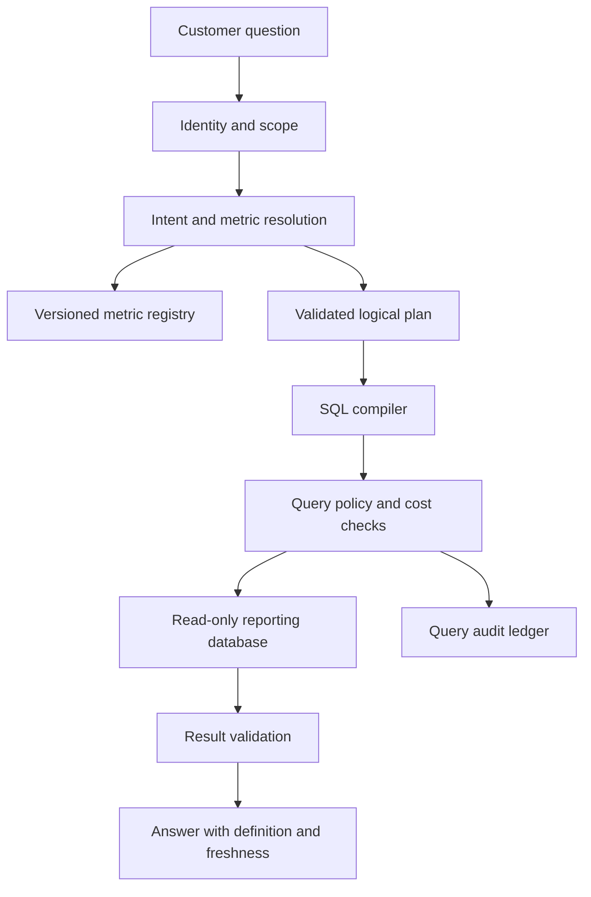
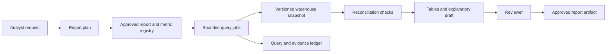

# Natural-language analytics over SQL

A natural-language analytics assistant translates a business question into a governed query and explains the result. The hard part is usually deciding what the question means: “revenue” might mean booked, recognized, collected, gross, or net. Correct SQL syntax can still produce a misleading business answer.

This chapter develops a SaaS metrics assistant and a controlled reporting copilot. PostgreSQL provides the concrete execution and authorization example; [OpenSearch](opensearch-retrieval.md) can retrieve metric documentation, but the database or warehouse computes the numbers.

!!! note "Scope and evidence — researched September 7, 2026 (UTC)"

    PostgreSQL mechanics are grounded in its current documentation. The semantic layer, query compiler, workloads, and release targets are proposed designs. Validate behavior against your deployed database version and role configuration. This chapter concerns system design, not financial-reporting or accounting advice.

## 1. What the system actually does

Separate five stages: interpret the question, resolve governed metrics, produce a logical plan, compile and execute a query, and explain the result. A model can assist interpretation and produce a candidate plan. Code must enforce allowed relations, tenant boundaries, cost limits, and output handling.

Prefer a constrained intermediate representation for common metrics:

```json
{
  "metric_id": "net_subscription_revenue",
  "metric_version": "v3",
  "grain": "month",
  "dimensions": ["plan"],
  "time_range": {"start": "2026-01-01", "end_exclusive": "2026-07-01"},
  "filters": [{"field": "market", "op": "eq", "value": "US"}]
}
```

The example is an illustrative application schema. Tenant identity comes from the authenticated session and is deliberately absent as a model-selectable authority field. The compiler chooses approved joins and expressions. If free-form SQL is necessary, parse it with a real dialect-aware parser and combine validation with database privileges; string matching is insufficient.

## 2. Best places to use it

| Workload | Why it fits | Key constraint |
|---|---|---|
| Repeated SaaS KPI questions | Governed definitions can cover many phrasings | Tenant and date semantics |
| Analyst exploration | Natural language accelerates an initial query | Analyst inspection and query provenance |
| Operational reporting | Current aggregates answer bounded questions | Freshness and workload protection |
| Unmodeled enterprise data lake | Usually poor initial fit | Ambiguous joins and definitions dominate |
| Decisions requiring a certified report | Copilot can prepare evidence | Existing review and sign-off remain authoritative |

Choose this architecture when the business can define metrics and provide representative questions with expected results. Start with fixed dashboards when questions are stable. A general chatbot over schema descriptions is a poor substitute for data modeling.

## 3. SQL mechanics that matter

PostgreSQL row-level security applies policies to rows once enabled; absent policies produce default deny for normal access. Superusers and `BYPASSRLS` roles bypass it, and table owners normally do too unless forced. The assistant's execution role must be designed and tested accordingly. [^1]

`statement_timeout` aborts a statement exceeding its configured time. Read-only transactions prevent changes to non-temporary tables, but they are not a complete security sandbox. Limit privileges and callable functions in addition to choosing read-only execution. [^2]

`EXPLAIN` exposes the planner's chosen plan and estimates. `EXPLAIN ANALYZE` actually executes the statement; it must not be used as a harmless preflight for arbitrary generated SQL. Planner estimates help detect obvious problems but are not guaranteed runtime or billing forecasts. [^3]

Other important design concepts are join cardinality, null handling, time zones, decimal arithmetic, slowly changing dimensions, and snapshots. These are often more consequential than prompt wording. A one-to-many join between orders and adjustments can multiply revenue unless the query aggregates at the intended grain first.

## 4. The semantic contract

Maintain a versioned metric registry containing:

| Field | Example purpose |
|---|---|
| Metric ID and definition | Stable business meaning and display name |
| Formula and grain | Approved calculation and row unit |
| Allowed dimensions | Supported grouping and filters |
| Join paths | Keys, cardinality, and temporal conditions |
| Time semantics | Event time, timezone, fiscal calendar, inclusive/exclusive bounds |
| Freshness | Source watermark and expected delay |
| Access policy | Roles, tenants, restricted dimensions |
| Owner and version | Accountability and reproducibility |

A metric definition is executable configuration reviewed like code. Documentation retrieved from OpenSearch can explain it but cannot silently override the compiler's registry. When the user asks an unsupported metric, ask for a definition or return a clear limitation rather than guessing.

Define how canceled orders, refunds, duplicate events, late data, and currency conversion enter each metric. A reproducible answer needs a metric version, source snapshot or watermark, and canonical query parameters. “This month” is resolved against a stated timezone and as-of time.

### Worked translation: meaning before SQL

Consider “Show monthly US subscription revenue by plan for the first half of 2026.” The registry resolves this to the earlier `net_subscription_revenue` plan only if the organization has defined revenue here as invoice-line amount minus linked adjustments, allocated to the invoice timestamp. If it means recognized revenue, the same wording requires a different metric and dataset. Resolve that distinction before generating SQL.

Assume this illustrative reporting schema: `invoice_lines(tenant_id, line_id, invoiced_at, plan_id, market, amount)` and `adjustments(tenant_id, line_id, amount)`. Each line has one invoice timestamp and plan; multiple adjustments can reference a line. Amounts use one already-normalized reporting currency, and timestamps are stored as `timestamptz`. The compiler might produce:

```sql
WITH adjustment_totals AS (
    SELECT tenant_id, line_id, SUM(amount) AS adjustment_amount
    FROM reporting.adjustments
    WHERE tenant_id = $1
    GROUP BY tenant_id, line_id
), line_values AS (
    SELECT l.invoiced_at, l.plan_id,
           l.amount - COALESCE(a.adjustment_amount, 0) AS net_amount
    FROM reporting.invoice_lines AS l
    LEFT JOIN adjustment_totals AS a
      ON a.tenant_id = l.tenant_id AND a.line_id = l.line_id
    WHERE l.tenant_id = $1
      AND l.market = $2
      AND l.invoiced_at >= $3::timestamptz
      AND l.invoiced_at < $4::timestamptz
)
SELECT date_trunc('month', invoiced_at AT TIME ZONE 'UTC') AS month,
       plan_id, SUM(net_amount) AS net_revenue
FROM line_values
GROUP BY 1, 2
ORDER BY 1, 2;
```

This is a teaching example, not a production query ready for every schema. Its parameters are tenant from trusted identity, market `US`, start `2026-01-01T00:00:00Z`, and exclusive end `2026-07-01T00:00:00Z`. The metric's defined reporting timezone is UTC. A different calendar changes both bucket calculation and interval boundaries.

Preaggregating adjustments preserves one row per invoice line before summing. Directly joining two adjustment rows to a line would repeat the invoice amount. Including tenant in both join keys prevents accidental cross-tenant matches when line IDs are only tenant-unique. Row-level security remains an additional boundary rather than an excuse to omit correct joins.

The example intentionally allocates all included adjustments back to the invoice month. If adjustments must instead appear in their posting month, this query is semantically wrong even if every total is arithmetically correct. A production registry must specify adjustment effective dates, reporting snapshot, and treatment of later corrections. It must also define whether a plan label reflects the invoice-time plan or today's plan name.

Validation checks the expected six-month interval, allowed dimension, reporting currency, and result grain. A fixture with a $100 line and two $10 adjustments should yield $80, not $180. Another fixture places a timestamp exactly at July 1: it must be excluded. A third uses the same line ID in another tenant and proves isolation. These tests target meaning and join behavior, not a particular SQL string.

The answer renderer receives the result plus the metric contract. It can state “net invoice-line revenue under definition v3,” identify the UTC interval and watermark, and explain omitted months if the application has not explicitly filled them with zero. It should not relabel the metric as cash received or infer why a plan's value changed.

## 5. Design A: multi-tenant SaaS metrics assistant

Assume 5,000 customer organizations, 10,000 questions/day, 30 governed metrics, and 40 peak queries/second. The initial product supports monthly and daily aggregates over an analytical replica or derived reporting store. Target five seconds for ordinary answers and cap execution at ten seconds; these are proposed service targets.



### Request flow

1. Authenticate the user and resolve tenant, permitted metrics, timezone, and budget.
2. Interpret the request into a metric ID, time interval, dimensions, and filters. Ask a targeted clarification if meaning materially changes the result.
3. Validate the plan against the registry. Reject unsupported joins and dimensions before SQL exists.
4. Compile parameterized SQL. Identifiers come from trusted mappings; values use bound parameters. Binding values does not make arbitrary generated table names safe.
5. Execute under a narrowly privileged role in a transaction with local timeout and tenant context. Ensure connection-pool reuse cannot leak a previous tenant's context.
6. Validate result shape, row cap, data types, and freshness. Decimal monetary values remain decimals; avoid converting them through floating-point formatting that changes totals.
7. Generate an explanation from the actual returned rows and metric metadata. Display the definition, interval, as-of watermark, and query reference.

### Data model and isolation

Store a query run with subject, tenant, normalized plan, registry version, compiled-query hash, database snapshot/watermark, duration, result hash, and completion state. Cache keys include these semantics plus authorization scope. A shared cache keyed only by the user's sentence is unsafe and often wrong even without a privacy breach.

Prefer preaggregated reporting tables where the metric contract permits. Index common tenant/time predicates. Separate analytical capacity from transactional traffic if queries can consume significant CPU or I/O. Replication lag must be visible: the assistant should not label a replica answer as real time merely because the query just ran.

### Failure and recovery

A timeout yields a bounded failure, not an automatically widened query. The assistant may suggest a shorter range or coarser grain. If execution succeeds but generation fails, show the table and metric definition without a narrative. If the registry is unavailable, do not reconstruct definitions from model memory.

A failed connection can leave transaction state uncertain; discard or reset the connection before reuse. A tenant revocation invalidates pending response delivery and cached visibility. Negative tests should inspect generated SQL, database results, model payloads, logs, and exported files.

## 6. Design B: reproducible reporting copilot

Assume a reporting team prepares 200 recurring packets/month from a warehouse refreshed nightly. The system produces draft reports with fixed definitions and a review trail. It favors reproducibility and reconciliation over low-latency exploration.



The report plan names required tables, periods, dimensions, and reconciliations. For example, a subscription movement report reconciles opening balance plus additions minus removals with closing balance under one approved definition. The design does not invent the accounting rule; it encodes the organization's reviewed rule.

Run all constituent queries against an appropriate consistent snapshot or a warehouse version the platform can actually preserve. Capture the snapshot identity and source watermark. If the platform cannot provide cross-query consistency, explicitly identify that limitation and use a materialized reporting dataset before claiming the packet is internally consistent.

The model writes commentary only after numerical checks complete. It receives computed values, definitions, and anomaly flags. It must distinguish “the value fell” from “the value fell because of a pricing change.” Causal explanations require additional evidence; correlation in a table is insufficient.

Reviewers approve an immutable artifact containing tables, query references, definitions, and explanatory text. Changing a source snapshot or metric version creates a new artifact revision. A “rerun” must specify whether it reproduces the old snapshot or refreshes with new data.

Sensitive small cohorts may require suppression or restricted access according to the organization's policy. The query service enforces that before handing rows to the model. Removing names alone may not prevent identification through rare combinations of attributes.

Failure handling differs from the SaaS assistant: a failed reconciliation blocks the report packet rather than falling back to an approximate narrative. An unavailable model can still produce validated tables for manual commentary. The critical outcome is a trustworthy draft with visible exceptions.

## 7. Alternatives and trade-offs

| Approach | Best fit | Trade-off |
|---|---|---|
| Constrained semantic plan and compiler | Repeated governed business questions | Limited expressiveness; metric modeling effort |
| Free-form SQL with validation | Skilled analyst exploration | Larger attack and correctness surface |
| BI dashboards | Stable questions and certified definitions | Less conversational flexibility |
| Search over precomputed reports | Document-centric questions | Cannot safely invent new aggregations |
| Analyst-authored saved queries | Small trusted catalog | Manual expansion when requirements change |

The semantic compiler reduces the range of possible mistakes but cannot correct bad source data or a flawed metric definition. Free-form generation may accelerate exploration while still requiring analyst inspection. Evaluate both against the same question set; syntax success alone is not meaningful business accuracy.

## 8. Capacity and economics

Forty concurrent arrivals per second do not imply forty database connections. With a measured mean query duration of two seconds, a stable workload needs roughly eighty in-flight query slots before headroom. A reporting database may support far fewer expensive scans; queue and limit based on measured query cost classes.

Cost comes from scans, warehouse compute, retained results, model tokens, retries, and human corrections. A narrow preaggregate can reduce both query latency and model context. A `LIMIT 100` restricts output but does not necessarily prevent a large scan or expensive join. Enforce date bounds, approved dimensions, execution time, and concurrency together.

Track answer latency by interpretation, queue, execution, and generation. Monitor rejected plans, ambiguous questions, wrong metric choices, scanned volume where available, and timeout rates. Avoid logging raw confidential result sets by default; audit IDs and hashes often suffice for operational tracing while authorized review storage retains evidence.

## 9. Evaluation and practice

Create fixtures with refunds, duplicates, nulls, zero denominators, late events, timezone boundaries, and many-to-many joins. For each question, record the expected semantic plan and numerical result. Multiple SQL strings can be equivalent; exact string matching should not determine correctness.

Test both allowed and denied queries under the actual execution role, including owner and `BYPASSRLS` mistakes. Exercise connection-pool reuse across tenants. Test that explanatory text cannot change a number, omit a required caveat, or claim a causal explanation absent from evidence.

Build a lab with three tables and five governed metrics. Include a deliberately misleading join that doubles totals. The compiler should select the reviewed grain and the fixture should expose the incorrect alternative.

1. What does “last month” mean at a timezone boundary?
2. Why can read-only credentials still permit damaging resource consumption?
3. How do you reproduce an answer after a metric definition changes?
4. Why is `EXPLAIN ANALYZE` unsafe as a universal validation step?
5. Which checks distinguish correct SQL from a correct business answer?

## Related studies

- [R02 · Retrieval with PostgreSQL and pgvector](postgres-pgvector.md)
- [R06 · GraphRAG with Neo4j or Amazon Neptune](graphrag.md)
- [P02 · An evaluation and observability platform for AI](evaluation-observability.md)

## References

[^1]: [PostgreSQL: Row security policies](https://www.postgresql.org/docs/current/ddl-rowsecurity.html) — policy behavior, default deny, owner and privileged-role bypass.
[^2]: [PostgreSQL: Client connection defaults](https://www.postgresql.org/docs/current/runtime-config-client.html) — statement timeout and transaction defaults.
[^3]: [PostgreSQL: Using EXPLAIN](https://www.postgresql.org/docs/current/using-explain.html) — planner estimates and actual execution with ANALYZE.
