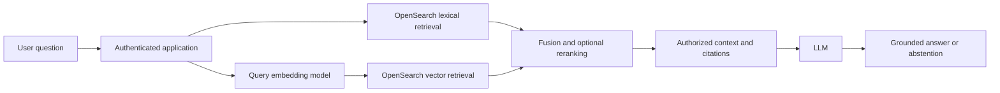
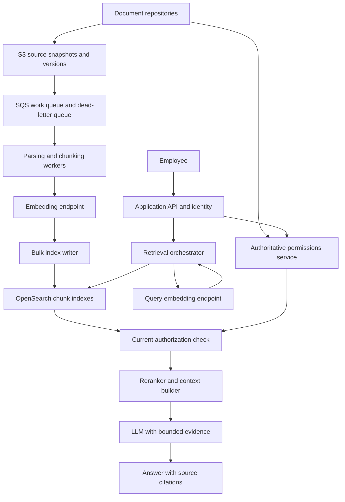
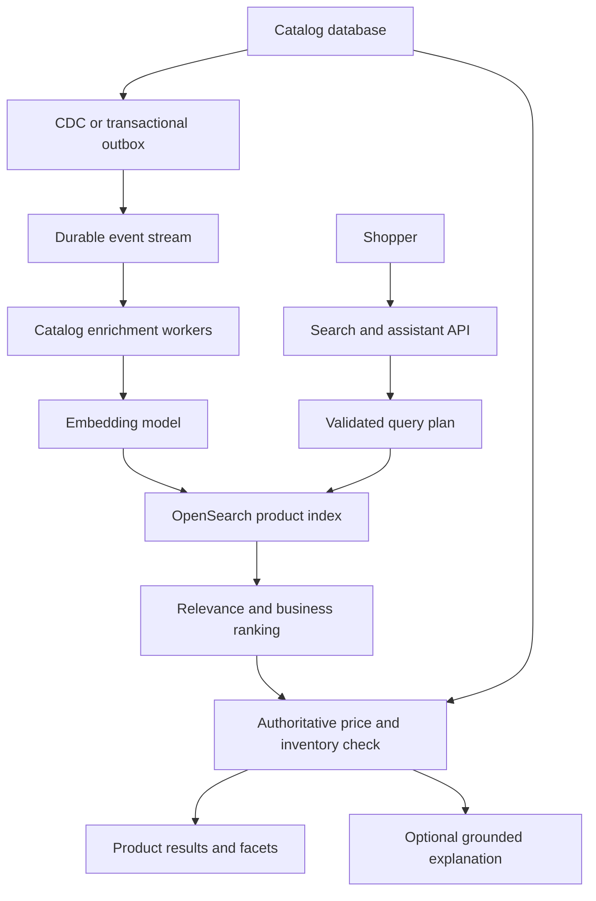

# Retrieval with Amazon OpenSearch

Amazon OpenSearch is a strong candidate when an AI application needs **keyword search, semantic retrieval, structured filters, and aggregations over the same corpus**. Its value is the combination: exact product codes and error messages need lexical matching, natural-language questions benefit from embeddings, and both must respect business rules and permissions.

This chapter develops two designs: an internal knowledge assistant and a product-discovery assistant. It covers the OpenSearch concepts needed to design and operate them, rather than cataloging every API. Familiarity with [retrieval and data](../concepts/retrieval-and-data.md) helps.

!!! note "Scope and evidence"

    These are proposed architectures, not deployed systems or benchmark results. Workload sizes, thresholds, and candidate counts below are teaching assumptions. References link to AWS and OpenSearch documentation; upstream OpenSearch features do not automatically have parity with every AWS engine version, Region, or Serverless collection type. Verify support for your selected deployment before implementation.

## 1. What OpenSearch is—and what it does in an AI application

**OpenSearch** is an Apache-2.0-licensed search and analytics engine built on Apache Lucene. It indexes JSON documents and exposes HTTP APIs for ingestion, queries, aggregations, and administration. OpenSearch Dashboards provides a UI for exploration and operations. The project originated as a fork of Elasticsearch and Kibana; current APIs, plugins, and licensing should not be assumed interchangeable.

**Amazon OpenSearch Service** is AWS's managed offering. With provisioned domains, you choose an engine version and infrastructure configuration; AWS handles parts of provisioning, replacement, backups, and maintenance. **Amazon OpenSearch Serverless** exposes collections and manages underlying capacity. Self-managed OpenSearch is a third option with greater control and greater operational responsibility. [1][2]

OpenSearch retrieves candidate evidence. An embedding model produces vectors; a reranker can improve the candidate ordering; an LLM synthesizes an answer from the selected evidence. These are separate responsibilities, even when an integration hides some boundaries.

OpenSearch is a **derived search index** in these designs. Documents remain in their authoritative repositories or S3; catalog records remain in the transactional database. It is not a replacement for transactional joins, inventory correctness, or the application's permission system.

## 2. Where it fits best

| Workload | Why OpenSearch fits | What still needs another component |
|---|---|---|
| Enterprise RAG over policies, manuals, tickets, and runbooks | Hybrid relevance, metadata filters, source highlighting | Parsing, identity, authorization, answer generation |
| Product discovery and shopping assistants | Exact brand/SKU matching, semantic intent, facets, numeric filters | Authoritative price, stock, checkout, and recommendations policy |
| Support and incident assistants | Error-code search plus semantic similarity over runbooks and past incidents | Live telemetry tools, incident state, action approvals |
| Large document search with optional summaries | Mature text analysis, pagination, aggregations, ranking controls | Source storage and a generation layer where useful |
| Search and observability in one technology ecosystem | Search and analytics capabilities can reuse team expertise | Separate workload capacity when dashboards or ingestion threaten retrieval latency |

Choose it when the application needs a search engine and your team can operate or consume one. Start elsewhere when a small corpus already lives in PostgreSQL, SQL relationships dominate, retrieval is purely vector-oriented, or transactional freshness is essential. A managed service reduces infrastructure work; it does not remove relevance engineering or data-quality work.

## 3. Core mechanics and features

### Documents, mappings, shards, and replicas

An **index** contains documents with a mapping: the types and indexing behavior of fields. A **primary shard** owns a partition of an index. A **replica shard** holds a copy that can serve searches and provide redundancy. Queries fan out to relevant shards, then a coordinating node combines results. More shards can increase parallelism but also coordination, memory, and small-shard overhead. Replicas improve availability and may improve read throughput; they consume storage and indexing resources.

Use explicit mappings for production retrieval:

| Field type | Example | Design consequence |
|---|---|---|
| `text` | Chunk body, product description | Analyzed into tokens for full-text search |
| `keyword` | Tenant ID, SKU, language, ACL group ID | Exact filters and aggregations; avoid analyzing identifiers |
| Numeric / date / boolean | Price, modified time, active flag | Range constraints, sorting, and lifecycle rules |
| `knn_vector` | Embedding of a chunk or product | Dimension, metric, engine, and index settings must match the embedding design |
| `nested` | Array of product variants | Preserves relationships within each object, at extra indexing/query cost |

Uncontrolled dynamic fields can create mapping explosion. Keep metadata bounded, avoid one field per customer, and prevent arbitrary source attributes from becoming indexed fields. Changing an existing field's type or embedding dimension generally calls for a new index and reindexing.

### Lexical search: inverted indexes and BM25

An inverted index maps terms to matching documents. Text analyzers tokenize and may lowercase, stem, or apply synonyms. BM25 ranks lexical matches using term frequency, document length, and how rare a term is in the corpus.

Lexical retrieval excels at `ERR_AUTH_401`, a policy title, or an exact model number. It may miss paraphrases with little word overlap. Choose analyzers for the language and domain; retain a `keyword` representation for identifiers. Synonyms can improve recall but can also broaden queries incorrectly. Boost titles and identifiers only after evaluating the effect.

### Dense vector retrieval and ANN

An embedding model maps text into a fixed-dimensional vector. Nearest-neighbor search retrieves nearby vectors using a compatible distance or similarity metric. The document and query embeddings must use compatible model versions and preprocessing. A vector from a different model is not interchangeable merely because its dimension matches.

Exact nearest-neighbor search scores all eligible vectors and can be useful for small filtered subsets. Approximate nearest-neighbor search (ANN) trades some recall for speed. HNSW navigates a graph of vectors; increasing graph/search effort can improve recall while increasing memory, build cost, or latency. Engine support and tunable parameters differ across versions and deployments. [3]

Vector search understands paraphrases better than literal matching, but similarity does not establish truth, authorization, or logical relationships. A semantically similar outdated policy is still a bad answer. Quantization and disk-oriented vector options can lower memory cost, with recall and latency trade-offs that must be measured on the actual corpus.

### Hybrid retrieval, fusion, and reranking

Hybrid retrieval combines lexical and vector candidates. Raw BM25 scores and vector similarities have different scales; do not simply add them. OpenSearch search pipelines can normalize and combine scores. Rank-based fusion is another approach, implemented in a supported engine feature or in the application. [4]

A portable application-side option is reciprocal rank fusion:

`RRF(document) = sum over result lists of 1 / (constant + rank_in_list)`

A document absent from a list contributes zero. A constant such as 60 is a starting point, not a universal best value. Retrieve, for example, 50 lexical and 50 vector candidates, deduplicate by chunk ID, fuse the rankings, then rerank the best 30 with a cross-encoder. Pass perhaps 6–10 diverse chunks to the LLM. Tune all these counts with quality, context size, and latency measurements.

A reranker evaluates the query and candidate text together. It can improve relevance at the cost of another inference call and cannot recover a relevant document that retrieval never found. Deduplicate overlapping chunks and limit repeated chunks from one document before filling the context window.

### Filters, facets, and other useful capabilities

Filters constrain retrieval by tenant, entitlement, locale, time, document state, or price. Apply mandatory constraints to **both** lexical and vector branches. For ANN, filter placement matters: retrieving globally and filtering the top results afterward can return too few authorized candidates. Use supported efficient filtering within vector retrieval and test selective filters against an exact-search reference. [5]

Aggregations power facets and counts; highlighting helps show why text matched. Search pipelines organize processing. Bulk APIs improve ingestion throughput. Aliases support index migrations on compatible deployments. Index State Management can automate lifecycle operations. Dashboards, logs, metrics, and security controls support operations. ML connectors and neural-search integrations can invoke models, but introduce their own credentials, network paths, quotas, and model/version dependencies.

Sparse neural retrieval is another option: learned weighted terms can improve semantic matching while retaining sparse-index behavior. It is distinct from dense embeddings; support for sparse models and pipelines must be checked separately.

## 4. Choosing an AWS deployment

| Decision | Provisioned OpenSearch Service domain | OpenSearch Serverless |
|---|---|---|
| Resource model | Domain with configured nodes, storage, shards, and replicas | Collection with AWS-managed underlying capacity |
| Control | More direct version, topology, and supported tuning choices | Less infrastructure tuning; workload-specific collection behavior |
| Scaling | Plan capacity, resizing, shard layout, and recovery headroom | Capacity scales within service limits and configured caps; still load-test bursts |
| Billing drivers | Instances, attached storage, transfer, and optional features | OpenSearch Compute Units (OCUs), storage, transfer, and optional features |
| Security | IAM/resource policies, network controls, fine-grained access controls where configured | IAM permissions plus data-access, network, and encryption policies |
| Compatibility | AWS supports a defined subset of upstream versions/features | Supported APIs and features depend on collection type and service capabilities |
| Good starting case | Sustained workloads needing predictable tuning and established search operations | Teams prioritizing managed capacity and accepting the collection feature set |

Serverless is not automatically cheaper for small or idle workloads: examine minimum/baseline capacity, redundancy configuration, shared capacity behavior, and current regional pricing. Provisioned capacity is not automatically cheaper either; include idle headroom, upgrades, and engineering time. Obtain estimates from the current pricing page rather than treating example prices as durable facts. [2][6]

For a production provisioned domain, consider a supported multi-AZ deployment, dedicated cluster-manager nodes, and replicas sized to survive failure. Verify the exact Multi-AZ with Standby requirements for the chosen configuration. For Serverless, choose the collection type and redundancy settings appropriate to the retrieval workload. Validate required vector fields, hybrid processing, aliases, update/delete operations, and refresh behavior before selecting it.

Applications should sign AWS requests with SigV4 using workload roles and temporary credentials. The signing service differs: `es` for provisioned domains and `aoss` for Serverless. Keep endpoints private where required. Encrypt data at rest and in transit, use least-privilege roles, and avoid routing user requests directly to a broadly privileged cluster endpoint. Authentication to AWS does not itself enforce each end user's document entitlements. [7]

Amazon Bedrock Knowledge Bases can manage parts of ingestion and retrieval with a supported OpenSearch backend. It can reduce custom plumbing, but check backend compatibility, metadata-filter behavior, supported transformations, and control over ranking. A custom retrieval API is useful when you need explicit authorization, fusion, reranking, or freshness semantics. [8]

## 5. Design A: permission-aware enterprise knowledge assistant

### Requirements and starting assumptions

Employees ask questions about policies, engineering runbooks, and support knowledge. Answers must cite accessible source passages and abstain when evidence is insufficient.

Assume one million source documents, averaging eight chunks each; 50 peak queries/second; a target of p95 retrieval below 400 ms and p95 complete answers below five seconds. These are budgets to test, not promises. Assume normal content updates should appear within five minutes. **Access revocations must take effect at the authorization boundary immediately**, even if the index lags.

### Architecture

S3 holds recoverable source snapshots, SQS absorbs ingestion spikes, and workers isolate expensive parsing and embedding from the serving path. ECS/Fargate workers are one option for long parsing jobs; Lambda can serve bounded jobs that fit its runtime limits. Choose compute based on document size and processing time.

### Ingestion: source to searchable chunk

1. Read the source ID, source version, modification time, tenant, and permissions. Land the content and a manifest in S3 so the index can be rebuilt.
2. Parse text, using OCR where necessary. Preserve headings, tables, page numbers, and source offsets. Quarantine malformed files rather than indexing empty text as a success.
3. Chunk by document structure, beginning with roughly 400–800 tokens and limited overlap. Evaluate table handling and whether each chunk retains enough context to stand alone.
4. Embed with a pinned model and preprocessing version. Cache embeddings by content hash plus model version, subject to tenant and data-retention rules.
5. Bulk-index deterministic chunk IDs. Inspect individual bulk-item failures, retry transient failures with backoff, and send permanent failures to a dead-letter queue.
6. Track successful indexing separately from search visibility. Refresh governs when writes become searchable; avoid forcing a refresh for every chunk.

Use document-version sequencing or a per-document ingestion coordinator to stop out-of-order events from resurrecting old content. An update that reduces a document from ten chunks to six must remove the four obsolete chunks. Deletion events require tombstones, index deletion, cache invalidation, and source-retention handling; track delete completion explicitly.

For stricter consistency, keep an authoritative manifest of the active source version and reject obsolete candidates during context construction. This prevents partial multi-chunk updates from mixing versions, though it can temporarily reduce recall while new chunks become searchable. OpenSearch does not provide a multi-document transaction for replacing an entire source document's chunks.

### Chunk schema

| Field | Purpose |
|---|---|
| `tenant_id`, `doc_id`, `chunk_id` | Identity, routing/filtering, deterministic writes |
| `source_version`, `content_hash` | Stale-write detection and reproducibility |
| `title`, `body`, `section_path` | Lexical search and context reconstruction |
| `embedding`, `embedding_model_version` | Semantic retrieval and migration auditing |
| `allowed_group_ids`, `acl_version` | Coarse candidate filtering; current permissions still checked |
| `source_uri`, `page_number`, `start_offset` | Verifiable citations |
| `language`, `updated_at`, `is_deleted` | Relevance constraints and lifecycle handling |

The source URI should be an approved repository link, not an unrestricted URL taken from document text. The citation resolver should enforce authorization too.

### Query path and authorization

1. Authenticate the employee. Resolve tenant and group membership from trusted identity services, never from user-supplied filter fields.
2. Normalize the query, retaining exact IDs and error codes. Generate a query embedding with the matching model. Treat optional query rewriting as a measured feature: it can accidentally drop constraints.
3. Run lexical and vector retrieval concurrently, applying tenant, entitlement, active-state, and language constraints in each branch.
4. Fuse candidates, then check current document access and active source version **before sending text to an external reranker or LLM**. Overfetch within a bounded budget when this removes candidates. Abstain if adequate authorized evidence cannot be obtained.
5. Rerank, deduplicate, and build a bounded context with stable citation IDs. Ask the model to answer from the evidence and explicitly report missing support.
6. Validate that cited IDs came from the selected evidence. Citation validity alone does not prove entailment; evaluate whether the cited passage actually supports the claim.

The current authorization check closes the gap between immediate revocation and eventual index refresh. If authorization is unavailable, fail closed. Avoid cross-user answer caches unless keys and access checks include tenant, current entitlement state, source version, and model configuration. Avoid logging raw private chunks; traces and evaluation datasets need their own access controls.

Treat retrieved text as untrusted input. It may contain instructions to reveal secrets or call tools. Keep tool execution behind application policy and authorization; a relevant passage must not grant privileges.

### Tenant isolation and failure handling

A shared index is economical but depends on correct filtering and has noisy-neighbor risks. Per-tenant indexes offer lifecycle and tuning isolation at the cost of shard/index overhead. Separate domains or collections can provide stronger resource/security boundaries at higher cost. Tenant routing may reduce shard fan-out but is an optimization, not authorization.

| Failure | Intended behavior |
|---|---|
| Embedding endpoint unavailable | Use an evaluated lexical-only fallback; label reduced retrieval capability |
| Reranker timeout | Use the authorized fused ranking if its quality is acceptable |
| OpenSearch timeout or partial shard failure | Retry within the deadline; inspect partial-result indicators; abstain if evidence is insufficient |
| Permission service unavailable | Fail closed; do not use stale authorization to return private content |
| Source ingestion delayed | Surface freshness where relevant; alert on lag and reconcile source/index counts |
| LLM unavailable | Return authorized source results if the product supports search-only behavior |

Bound retries, propagate request deadlines, and use circuit breakers. Automatic fallback is appropriate only when the degraded path has been evaluated for the same security and user requirements.

## 6. Design B: product discovery with a conversational assistant

### Requirements and starting assumptions

A shopper asks: “Find waterproof hiking shoes under $150 in my size, suitable for wet trails.” Assume two million products, 200 peak searches/second, and a p95 search-results target below 300 ms before conversational explanation. Catalog descriptions may lag by minutes; price and inventory require authoritative checks before a purchase promise or checkout.

OpenSearch fits because the same request combines semantic intent, lexical attributes, numeric constraints, availability, and facets. A vector-only lookup is insufficient for sizes, SKUs, and hard price limits.

### Architecture

Use a transactional outbox or CDC so a committed catalog change cannot silently miss index publication. Consumers should be idempotent and reject older product versions. Update price/stock metadata independently of embeddings; changing a price should not require paying to re-embed the product description. Actual update mechanics must be validated for the selected AWS collection/domain.

### Model products and variants deliberately

Index searchable product text, brand, category, structured attributes, market, lifecycle status, and an embedding. Model variants as nested objects or separate variant documents depending on query patterns. Flattening arrays of sizes and stock flags can falsely match a size that is out of stock because another size is available.

A product-level document reduces duplicate results and supports product-level ranking. Variant documents simplify some availability filters but require grouping by parent product. Embeddings should emphasize stable descriptive content; put rapidly changing price and stock into filterable fields.

### Query planning and retrieval

Translate the request into an allowlisted internal plan: semantic text “waterproof hiking shoes for wet trails,” maximum price 150, currency and market, and size. If size or currency is unknown, resolve it from an authorized profile or ask the shopper; do not silently guess.

An LLM may propose this plan, but application code validates fields, operators, ranges, and complexity. Do not execute arbitrary model-generated OpenSearch DSL. Product and market eligibility constraints are added by trusted application code.

Run hybrid search with the hard constraints. Exact SKU queries should favor identifier lookup over semantic expansion. Fuse relevance, optionally rerank, then apply explicit business rules such as diversity or a documented popularity boost. Track whether these rules reduce relevance or unfairly crowd out new products.

Compute facets over the intended filtered lexical/browse result set using a deliberate query strategy. Counts over only an ANN candidate pool describe that pool, not the entire catalog. Keep facets independent of optional LLM generation so product search remains usable when inference is slow.

Before showing a definitive price or availability claim, check the relevant variants against the authoritative service, drop invalid candidates, and fetch replacements within a deadline. Revalidate at checkout because stock can change again. If that service is unavailable, avoid guaranteeing availability or enabling an unverified purchase flow.

The assistant explains retrieved attributes with product links. It must not invent waterproof ratings, warranties, or certifications. Search results can render first while an explanation streams later. A useful product can omit generation entirely for navigational or exact-ID searches.

### How this differs from the knowledge assistant

| Concern | Enterprise knowledge | Product discovery |
|---|---|---|
| Retrieval unit | Evidence chunk with a source location | Product or variant |
| Correctness boundary | Current permissions and supported factual claims | Hard constraints, current price, and variant availability |
| Ranking objective | Relevant, authoritative, diverse evidence | Relevant products, diversity, and measured business value |
| Freshness response | Reject revoked/obsolete evidence | Validate volatile fields against source systems |
| Useful degraded experience | Authorized source links | Search results without generated explanation |

## 7. Capacity, latency, and cost

Size vectors from **chunks**, not source-document count. For the enterprise example:

`1,000,000 documents × 8 chunks × 1,024 dimensions × 4 bytes = 32.768 GB`

That is about 30.5 GiB of raw float32 vector values for one logical copy. It excludes HNSW structures, text, stored JSON, metadata, segment overhead, replicas, and transient merge/reindex space. One replica doubles the logical vector copies before those additional costs. Compression changes the calculation. Raw vector size is neither a RAM requirement nor a complete disk estimate.

Benchmark representative documents, chunk distributions, tenant filters, and concurrent ingestion. Measure native vector memory separately from JVM pressure where applicable. Test cold caches and node/AZ failure, not just a warm idle cluster. Too many shards create fan-out overhead; too few constrain placement and recovery. Choose shard layout from measured shard size, throughput, and rebuild time, rather than a universal shard-count rule.

A request's critical path is approximately:

`identity + max(lexical retrieval, query embedding + vector retrieval) + authorization + fusion/rerank + generation`

This assumes lexical work can overlap query embedding. A single server-side hybrid request may have a different path. Instrument actual stages; do not add independent p95 values and call that the end-to-end p95. Token count and model choice often dominate answer latency even when retrieval is fast.

Include these cost buckets in the decision:

- Search capacity, storage, replicas/redundancy, snapshots, and network transfer.
- Parsing/OCR, embedding the initial corpus, incremental embeddings, and full model migrations.
- Query embeddings, reranking, LLM input/output tokens, and retries.
- Queues, worker compute, logs, evaluation runs, and operational ownership.

Reindexing may temporarily require old and new indexes at once. Retain headroom for recovery and ingest bursts. Cache query embeddings when appropriate; cache results only with correct entitlement and freshness boundaries. Shorten context by improving retrieval before simply choosing a larger context window.

## 8. Trade-offs and alternatives

| Option | Prefer it when | Trade-off relative to OpenSearch |
|---|---|---|
| PostgreSQL + pgvector | Data already lives in Postgres; SQL joins and transactions matter; workload fits measured capacity | Often a simpler initial architecture. Hybrid ranking and search analysis require deliberate implementation; search load may compete with transactions |
| Elasticsearch / Elastic Cloud | Existing Elastic expertise or required Elastic features/integrations | Similar search heritage; compare current licensing, managed features, vector behavior, and migration compatibility directly |
| Dedicated vector services such as Pinecone | Managed vector retrieval is the main need | May simplify vector operations; compare lexical/hybrid features, filters, consistency, isolation, and cost rather than assuming they are absent |
| Qdrant, Weaviate, or Milvus | Vector-centered requirements and a matching deployment/feature model | Different indexing, hybrid, and operational choices; benchmark your filter selectivity and scale |
| Amazon Kendra | Managed enterprise document search and connectors are the priority | More opinionated retrieval with less engine-level control; compare connector coverage, relevance controls, and current pricing |
| Bedrock Knowledge Bases with a supported backend | Managed RAG orchestration meets ingestion and retrieval requirements | An orchestration choice that can use OpenSearch, not a direct engine replacement; assess customization and backend limits |
| Graph database plus retrieval | Answers require explicit multi-hop relationships and provenance | Adds modeling and traversal complexity; often complements text/vector search |
| S3 plus a local exact vector index | Small prototypes or offline evaluation | Cheap and transparent, but serving, permissions, updates, resilience, and scaling become application work |

OpenSearch's main trade-off is breadth versus operational complexity. It offers a mature search toolkit, but mapping, shard layout, relevance, ingestion correctness, and vector tuning remain engineering responsibilities. It provides near-real-time search visibility rather than a transactional guarantee across all source changes. Combining analytics, heavy ingestion, and latency-sensitive retrieval on shared capacity can create interference.

There is no universal winner at a fixed document count. Compare the same corpus and query set under the same latency, freshness, and security requirements. For a small existing Postgres application, start by testing pgvector and full-text search. For a rich catalog search product or a team already operating OpenSearch, hybrid retrieval may justify using OpenSearch immediately.

## 9. Evaluation and production readiness

Build a labeled query set before tuning. Include exact IDs, paraphrases, ambiguous requests, multilingual queries, stale sources, selective tenant filters, denied documents, missing answers, and conflicting evidence. Hold out queries so ranking experiments do not overfit the development set.

| Layer | What to measure |
|---|---|
| Ingestion | Source-to-search lag, parse failures, dead-letter age, missing/deleted chunks, version mismatches |
| Retrieval | Recall@k, nDCG@k, exact-ID success, ANN recall against exact search, performance by filter selectivity |
| Security | Unauthorized content in results, reranker/LLM payloads, caches, logs, and citations; revocation tests |
| Answers | Claim support, citation correctness, completeness, and abstention on unanswerable queries |
| Serving | End-to-end and per-stage p50/p95/p99, timeouts, partial results, queueing, rate-limit failures |
| Product value | Task success and user correction rate; for commerce, conversion alongside relevance and constraint violations |
| Economics | Cost per successful task, per query, and per indexed/updated document |

Compare BM25-only, vector-only, hybrid, and hybrid-plus-reranker using identical access constraints. Keep a lexical baseline: embeddings should earn their cost. A release must pass negative authorization tests; a finite test suite is necessary evidence, not proof of perfect security.

For an embedding migration, build a versioned index, replay source snapshots and subsequent changes, validate quality and permissions, and switch an alias where supported or an application routing pointer otherwise. Switch query embedding configuration with index routing so old and new vector spaces are never mixed. Retain the old path for rollback and reconcile deletions on both paths while they coexist.

Exercise restore/rebuild procedures, ingestion backlog recovery, model outages, capacity limits, and permission-service failures. Define recovery time and acceptable data-loss objectives; snapshots alone do not establish either.

## 10. Practice: defend the design

Begin with a small local lab: a few hundred documents, explicit tenant metadata, and 30–50 labeled queries. Implement BM25 first, then vector retrieval, fusion, and reranking. Use a local OpenSearch instance to study engine behavior; it does not validate AWS service limits or production capacity. Before deploying to AWS, verify feature parity and set a spending budget.

Defend these changes to the design:

1. Why does BM25 retrieve an exact error code that embeddings miss?
2. What happens if a user's document access is revoked between indexing and answering?
3. Why can a vector post-filter return three results when ten were requested?
4. How do you prevent a delayed update event from restoring a deleted document?
5. What changes when the embedding model's dimensions change?
6. Which parts of a shopping answer can rely on the search index, and which need a live read?
7. Under what measured conditions would you replace OpenSearch with PostgreSQL plus pgvector?
8. What remains usable when the embedding model, reranker, or LLM is unavailable?

## References

1. [AWS: What is Amazon OpenSearch Service?](https://docs.aws.amazon.com/opensearch-service/latest/developerguide/what-is.html) — managed service scope and concepts.
2. [AWS: What is Amazon OpenSearch Serverless?](https://docs.aws.amazon.com/opensearch-service/latest/developerguide/serverless-overview.html) and [Serverless vector search](https://docs.aws.amazon.com/opensearch-service/latest/developerguide/serverless-vector-search.html) — collections, operating model, and current limitations.
3. [OpenSearch: Vector search](https://docs.opensearch.org/latest/vector-search/) and [k-NN methods and engines](https://docs.opensearch.org/latest/mappings/supported-field-types/knn-methods-engines/) — algorithms, metrics, and engine-specific configuration.
4. [OpenSearch: Hybrid search](https://docs.opensearch.org/latest/vector-search/ai-search/hybrid-search/index/) and [normalization processor](https://docs.opensearch.org/latest/search-plugins/search-pipelines/normalization-processor/) — combining lexical and semantic relevance.
5. [OpenSearch: Filtering in k-NN search](https://docs.opensearch.org/latest/vector-search/filter-search-knn/index/) — filtering strategies and recall behavior.
6. [AWS: OpenSearch Service pricing](https://aws.amazon.com/opensearch-service/pricing/) — obtain current regional cost inputs.
7. [AWS: Fine-grained access control](https://docs.aws.amazon.com/opensearch-service/latest/developerguide/fgac.html) and [Serverless data access control](https://docs.aws.amazon.com/opensearch-service/latest/developerguide/serverless-data-access.html) — distinct authorization models.
8. [AWS: Amazon Bedrock Knowledge Bases](https://docs.aws.amazon.com/bedrock/latest/userguide/knowledge-base.html) — managed RAG capabilities and supported integrations.
