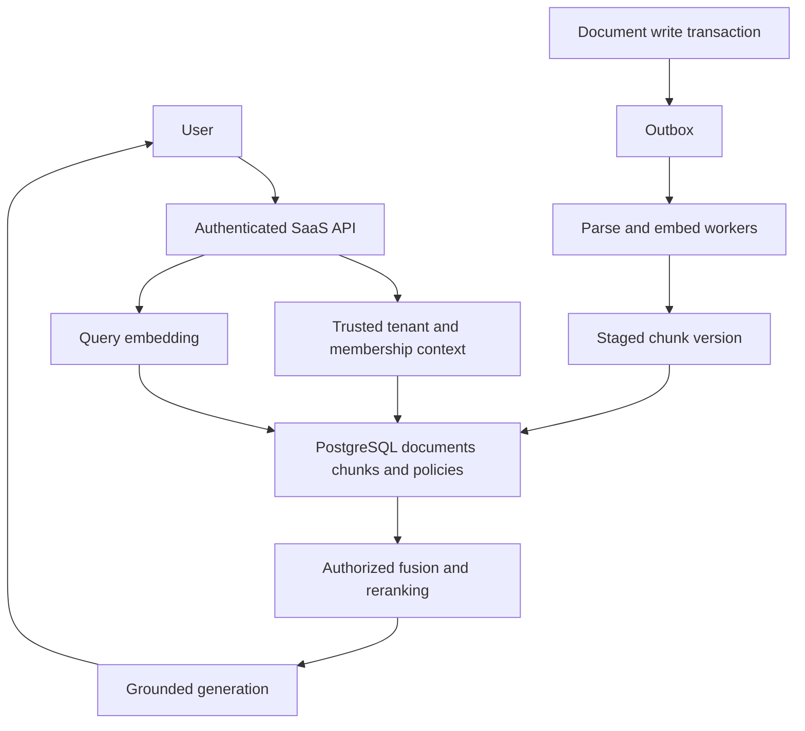
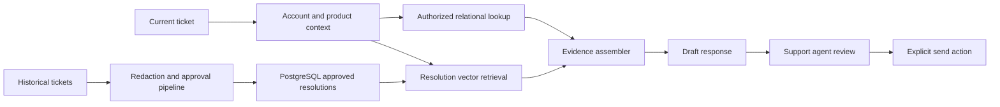

# Retrieval with PostgreSQL and pgvector

PostgreSQL with pgvector is a strong starting point when an AI feature belongs inside an existing relational application. It lets the retrieval service combine similarity with tenant membership, document state, and business relationships without synchronizing all those facts into a second search platform. The important decision is whether the measured retrieval workload can share the database's resource and availability budget.

This study follows the [OpenSearch retrieval design](opensearch-retrieval.md), using a SaaS knowledge assistant and a customer-support copilot. OpenSearch remains the comparison for richer search behavior and independently scaled retrieval.

!!! note "Research and assumptions"

    Research checked September 7, 2026 (UTC) against the primary references below. Product capabilities are cited; architectures, capacities, thresholds, and examples are proposed teaching designs, not benchmark results. Pin the PostgreSQL and extension versions supported by your hosting provider before implementing SQL or tuning settings.

## 1. Fundamentals and the decision boundary

pgvector adds vector types, distance operators, and approximate indexes to PostgreSQL. Exact search is the default; HNSW and IVFFlat offer approximate alternatives. Queries remain SQL, so vectors can sit beside source text and relational identifiers. The extension documents several vector representations and metrics; the usable dimension and index combinations depend on the representation. [^1]

The database retrieves evidence; it does not decide whether that evidence supports an answer. Parsing, embeddings, reranking, prompt construction, and generation remain separate application responsibilities. A vector is also a model-specific representation. Two embeddings with the same dimension but different training or preprocessing are not a common search space.

Use this architecture when most documents belong to a tenant or account, eligible subsets are small, and the team already operates PostgreSQL well. It is particularly attractive when document visibility changes in the same database transaction as application state. A small internal assistant can begin with exact distance over filtered rows and acquire an ANN index only after measurements justify one.

A poor fit is a large search platform requiring independently scaled ingestion, sophisticated language analysis, broad facets, or a retrieval failure domain separate from checkout and billing. PostgreSQL can still participate as the source of truth in that design. The choice is not an ideological argument about vector databases: it is a resource-isolation and product-capability decision.

## 2. Mechanics that affect architecture

### Exact search, HNSW, and IVFFlat

An exact filtered scan is a useful correctness reference. HNSW navigates a graph; IVFFlat partitions vectors into lists and probes a subset. Their build, memory, and query-effort trade-offs differ. Approximate searches can return fewer qualifying rows when filters eliminate candidates. pgvector documents iterative scans and bounded scan controls to mitigate this, rather than guaranteeing that every ANN query returns the requested count. [^1]

The design implication is to benchmark the actual tenant distribution. A query for a customer owning 500 of ten million rows is different from one searching half the table. Increasing ANN effort globally may waste resources when a B-tree-filtered exact scan would be cheaper. Use representative `EXPLAIN (ANALYZE, BUFFERS)` investigations in an isolated environment, recording plans and row counts alongside latency.

Do not hide every query behind one generic prepared statement without checking how the planner behaves across tiny and huge tenants. A bounded application routing rule can choose a verified exact path for small eligible sets and an ANN path for broad search. Keep both paths under identical authorization policy.

### Hybrid retrieval

A practical baseline combines PostgreSQL full-text search with vector ranking in the application. PostgreSQL supplies text-search documents, queries, ranking, and indexing facilities. These are not a promise that its built-in ranking is the same as OpenSearch BM25. [^3]

Retrieve two authorized lists, deduplicate stable chunk IDs, then fuse ranks. For example, use `sum(1 / (60 + rank))` as a starting reciprocal-rank-fusion rule, followed by a reranker on a bounded shortlist. Keep exact identifier lookup separate: a ticket number should not compete with semantic paraphrases. Choose analyzers, stemming, and title weighting from labeled queries, not from an assumption that vectors replace lexical search.

### Transactions and asynchronous embeddings

A PostgreSQL transaction can atomically publish the active version pointer and completed chunks. It cannot include an external embedding request in a useful distributed atomic commit. The recommended boundary is therefore: commit source content and an outbox event; compute embeddings outside the transaction; write a staged version; activate it with a conditional transaction if it is still current.

If version 12 finishes embedding after version 13, reject its activation. A deletion increments a source generation and writes a tombstone, so delayed workers cannot reactivate the old document. Retain an ingest manifest listing expected chunk IDs and completion state. Transactional storage simplifies final publication but does not remove pipeline sequencing.

### Row security and pooling

PostgreSQL row-level security can enforce policies for ordinary database roles; table owners normally bypass policies, and superusers and `BYPASSRLS` roles do so as well. These exceptions matter when configuring application credentials. [^2]

Use a narrowly privileged serving role, trusted tenant context, and explicit tests under the real role. With pooled connections, establish request context inside a transaction and clear it on completion. Never accept a tenant session setting from arbitrary user SQL. A worker writing embeddings needs a different role from a user-facing reader. Administrative bypass credentials do not belong in the request path.

## 3. Design A: a multi-tenant SaaS knowledge assistant

Assume 4,000 tenants, 300,000 documents, six chunks per document, 768-dimensional float32 embeddings, and 40 peak retrieval requests per second. Most tenants have fewer than 1,000 documents, but five are much larger. An illustrative target is p95 retrieval below 250 ms at expected load, with answer generation measured separately. Content freshness may lag two minutes; permission revocations must affect new requests immediately.

### State and ingestion

Use `documents(tenant_id, document_id, active_version, deleted_at, acl_revision)` and `chunks(tenant_id, document_id, source_version, chunk_id, body, section_path, embedding, embedding_revision)`. Membership lives in relational tables. A separate manifest records parsing version, source hash, expected chunk count, and ingestion state. Composite keys include tenant identity, preventing accidental ID collisions between customers.

The upload handler stores the original in approved object storage, creates the source row, and inserts an outbox record in the same transaction. Workers parse headings and tables, create deterministic chunk IDs, and attach page or section locations. Embeddings are cached by tenant, content hash, model, and preprocessing revision. The cache must follow the source retention policy.

Workers insert chunks for an unpublished version. A final transaction validates the manifest and updates the document's active pointer using a compare-and-set condition. Queries join only the active version. Old chunks become cleanup work; they never become alternate evidence simply because their similarity is high. An update reducing ten chunks to four therefore has a clear publication boundary.

### Request flow

1. Authenticate the user and resolve their tenant and current memberships through trusted application state.
2. Classify obvious document IDs and exact error codes into deterministic lookup paths. Embed ordinary language with the active corpus model.
3. Retrieve lexical and vector lists constrained by tenant, active source version, and access policy. Route small eligible sets to the measured exact path where appropriate.
4. Merge the candidates and rerank only authorized text. Cap chunks per document and total context tokens.
5. Generate a cited answer; validate citation identifiers against the selected context and return an explicit lack-of-evidence response where necessary.

For a user asking “Can contractors export billing reports?”, a semantically similar administrator policy is not sufficient. The selected evidence must apply to the user's product plan and the relevant role. Store those applicability dimensions separately from free text and include them in the validated retrieval plan.

### Failure and recovery

If embeddings fail, keep the old active version or offer an evaluated lexical path against current text, clearly tracking which behavior is used. If the final activation transaction fails, retry idempotently rather than re-embedding. If a read replica lags, it may miss new material or see old permission state; use an authoritative permission check or route strict-sensitive reads to the primary. Replica use is a consistency choice, not a free scaling switch.

Protect transactional traffic with connection limits, query deadlines, and separate worker concurrency. When retrieval saturates, shed optional generation or queue requests rather than exhausting the database connection pool. Run restore drills covering source objects, manifests, and embeddings together; a recovered database with missing source objects cannot rebuild citations correctly.

## 4. Design B: customer-support copilot with relational context

Assume two million historical tickets, 200,000 approved resolution articles, and 60 agents simultaneously drafting responses. Tickets contain private customer data; only approved, redacted resolutions may be shared across accounts. Agents need account-specific contract and product-version context. The objective is accurate drafts with source links, while sending a reply remains an explicit support action.

The schema separates `customer_tickets` from `approved_resolutions`. A resolution records source provenance, supported product versions, approval state, reviewer, and retirement date. The embedding describes the technical symptom and accepted fix, not customer names or account identifiers. Contract entitlements remain normalized account records and are read authoritatively.

On each request, validate that the agent can access the ticket and account. Read the current product version, service plan, and incident state. Retrieve approved resolutions filtered to compatible versions; search the customer's own tickets under a separate access branch. Label those evidence types explicitly so the model does not mistake another customer's exceptional concession for general policy.

For “the export endpoint returns error E142 after upgrade,” perform literal error-code lookup and semantic symptom retrieval. Join candidates to supported release ranges and retired-fix status. A technically relevant resolution for a retired release should be shown as historical evidence only if the product intentionally permits it. Prefer a current verified fix over a popular obsolete answer.

The draft contains claim-to-source links and a separate list of missing facts. Do not permit retrieved ticket text to issue instructions to tools. The send endpoint independently checks account access, destination, and the final human-approved message. Retrieval authorization does not authorize outbound communication.

If the account service is unavailable, the assistant can return approved generic troubleshooting with a warning that account-specific eligibility was not verified. It should not invent a service-credit promise. If old tickets fail redaction, quarantine them; successful embedding is not approval for reuse. If an article is retracted, revoke its active status transactionally and invalidate related draft caches.

## 5. Sizing, operations, and economics

For Design A, raw vectors occupy `1,800,000 × 768 × 4 = 5.5296 GB` in decimal units before row, index, text, replication, and transient build overhead. That is a lower-bound component, not a memory estimate. Measure database size, ANN index size, cache hit rate, WAL volume, and vacuum behavior on representative updates.

A corpus rewrite can compete with foreground transactions through I/O and WAL even when query traffic is low. Throttle embedding writes and build new indexes with explicit operational headroom. Keep the old embedding revision searchable until the new corpus passes evaluation; switch query model and corpus revision together. Two active copies temporarily increase cost.

Budget for managed database compute and storage, replicas, backups, object storage, parser workers, embedding calls, reranking, generation, and engineering ownership. Measure cost per successful support task rather than only vector-query cost. Saving a separate service may be worthwhile; scaling the primary solely for search may erase that saving.

Use time-series dashboards for query latency by tenant size, connection waits, lock waits, replica lag, ingest backlog, manifest failures, and source-to-active lag. Alert on zero-result spikes for selective tenants because ANN filtering failures can masquerade as normal unanswerable questions.

## 6. Alternatives and trade-offs

| Option | Prefer when | Trade-off to test |
|---|---|---|
| PostgreSQL exact search | Eligible sets are small and SQL context dominates | Linear scoring cost as eligible sets grow |
| PostgreSQL with ANN | Existing relational application needs measured semantic retrieval | Recall under selective filters and contention with writes |
| OpenSearch | Rich lexical search, facets, and separate retrieval capacity matter | A derived index needs CDC and permission freshness controls |
| Dedicated vector database | Vector throughput or operational isolation dominates | Relational joins and authoritative state remain elsewhere |
| Managed RAG | Standard ingestion and orchestration match requirements | Less direct control over publication, permissions, and ranking |

Keeping everything in one database reduces synchronization boundaries while enlarging the blast radius of a database incident. Separating retrieval adds distributed consistency work while allowing independent scaling. Measure both costs with the same corpus and access constraints.

## 7. Evaluation and practice

Create an evaluation set covering exact codes, paraphrases, tiny tenants, dominant tenants, revoked membership, conflicting versions, and missing answers. Compare filtered exact retrieval, ANN, lexical-only, and hybrid. Record recall against exact results separately from human relevance: exact vector neighbors are not automatically relevant evidence.

Release gates should include no unauthorized chunks reaching rerankers or model payloads, acceptable retrieval quality in every tenant-size band, and bounded latency while ingestion runs. Human reviewers score whether citations support each proposed fix and whether contract constraints are respected. Averages must not hide failures for small customers.

Practice with two tenants and several hundred documents. Introduce a delayed embedding job, delete its document, and prove it cannot reactivate. Then revoke a pooled-connection user's membership and verify the next user cannot inherit context. Finally add an ANN index and explain any changed result count using the measured plan.

Defend these questions: When is exact retrieval cheaper? Which database role can bypass RLS? What happens if the embedding model changes dimension? How do you restore source provenance? At what observed traffic does a separate retrieval service become worth its synchronization cost?

## Implementation checkpoint: transaction and replica semantics

PostgreSQL's isolation documentation explains that Read Committed uses a statement-level snapshot; successive statements can observe different committed state. A multi-statement retrieval pipeline must therefore decide whether it needs one stable snapshot or deliberately wants a fresh final authorization read. Stronger isolation can introduce transaction retries and does not make an external model call part of the database transaction. [^4]

For the SaaS design, keep the database transaction short: retrieve identifiers and permitted evidence under a documented consistency rule, then release the connection before slow generation. If access can change during generation, define whether a final response check is required for the product's revocation promise. Holding a long transaction open across a model call is usually a poor substitute for a clear authorization protocol.

PostgreSQL's standby documentation distinguishes asynchronous log shipping, streaming replication, and standby reads. Replica freshness and failover data-loss behavior depend on configuration. [^5] A read replica can isolate some retrieval load, but it does not automatically provide current membership state. Measure replay lag and choose which checks stay on the authoritative path.

Before deployment, write a short consistency contract: which source revision a question may use, where access is verified, which reads may use replicas, and how uncertain failover affects serving. Run a test that changes document access between retrieval and response construction. The expected result should follow that contract, rather than depending accidentally on connection timing.

## Related studies

- [R01 · Retrieval with Amazon OpenSearch](opensearch-retrieval.md)
- [P01 · Fresh retrieval indexes with Kafka or Amazon Kinesis](streaming-indexes.md)
- [P04 · A secure multi-tenant AI platform](secure-multi-tenant-platform.md)

## References

[^1]: [pgvector repository and reference documentation](https://github.com/pgvector/pgvector) — types, operators, indexes, filtering, and iterative scans.
[^2]: [PostgreSQL row security policies](https://www.postgresql.org/docs/current/ddl-rowsecurity.html) — policy behavior and bypass roles.
[^3]: [PostgreSQL full-text search](https://www.postgresql.org/docs/current/textsearch.html) — lexical retrieval building blocks.

[^4]: [PostgreSQL transaction isolation](https://www.postgresql.org/docs/current/transaction-iso.html) — statement snapshots and retry considerations.

[^5]: [PostgreSQL warm standby](https://www.postgresql.org/docs/current/warm-standby.html) — replication and standby-read semantics.
