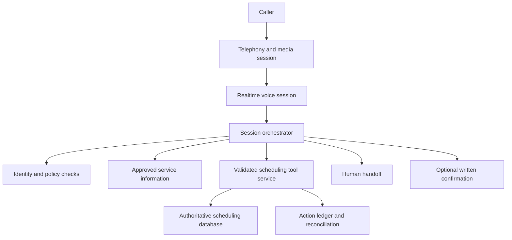
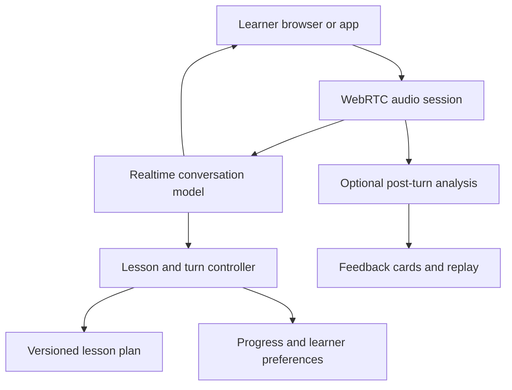

# Real-time voice assistants

A voice assistant is a streaming state machine. The system has to decide when a person has finished speaking, start responding quickly, stop when interrupted, and keep tool actions consistent even when the audio connection breaks. A fast language model cannot compensate for a long endpointing delay or a client that continues playing canceled speech.

The [OpenSearch study](opensearch-retrieval.md) separates retrieval, authorization, and generation. Keep that separation here: voice changes the interaction channel, not the authority of retrieved content or model-generated tool calls.

!!! note "Scope and evidence"

    Research date: September 7, 2026 (UTC). OpenAI Realtime and Amazon Transcribe documentation were read for streaming behavior. Numerical latency and capacity budgets below are illustrative requirements. Transport, codec, session duration, feature support, and pricing depend on the selected service and model; verify them when implementing.

## 1. Two major architectures

A **cascaded pipeline** streams speech to text, sends a stabilized utterance to an LLM, and converts the response to speech. This makes transcript handling, text moderation, retrieval, and component substitution explicit. Its stages introduce latency and may lose prosody or other information absent from text. Partial transcription can revise earlier words, so downstream actions must distinguish provisional from committed utterances.

An **audio-native conversation** exchanges audio with a model through a realtime session. OpenAI Realtime documents WebRTC, WebSocket, and SIP connection methods. These support different deployment arrangements: browser/mobile media, server-mediated events, and telephony integration. The right transport depends on the client and control requirements, not on a universal assumption that one is always faster. [^1]

Audio-native models can simplify conversational exchange, but your application still owns authentication, session policy, tool execution, playback state, and recovery. A transcript is useful for inspection and accessibility, yet should not be assumed to be a perfect representation of what the audio model heard or said.

## 2. The mechanics that matter

### Turn detection

Voice activity detection identifies speech boundaries. OpenAI documents silence-based `server_vad` and semantic turn detection. Silence thresholds trade responsiveness against cutting off pauses; semantic turn detection uses a model's estimate that the speaker has finished. Support and configuration differ between conversation and transcription sessions, so pin a supported API/model combination. [^2]

Endpointing is part of user-perceived latency. A 300 ms model response is still slow if the system waits two seconds after every utterance. Conversely, aggressive endpointing fragments hesitant speech and forces corrections. Evaluate different languages, speech rates, background noise, and users who pause while finding a word. Include push-to-talk as a useful product option, not merely a debugging aid.

### Partial transcripts and commitment

Amazon Transcribe streaming returns incremental results with an `IsPartial` indicator. Partial-result stabilization can reduce changes in already emitted words at a possible accuracy cost. Word/item stability is distinct from segment completion. [^3] A UI can show tentative text immediately; a purchase or booking action should depend on a committed, validated intent.

For a cascaded system, assign `utterance_id`, result ID, revision, start/end media offsets, and finality. Updating a provisional transcript replaces that revision. It must not append repeated text or spawn another tool action. Speculative retrieval may start on partial text, but its results should be discarded if the committed intent differs.

### Barge-in and playback

When a user interrupts, stop client playback promptly, cancel generation as appropriate, and reconcile conversation context with what was actually heard. OpenAI's conversation documentation distinguishes transport behavior: WebRTC/SIP can handle server-side output-audio tracking, while WebSocket clients must manage playback and appropriate truncation themselves. [^4]

Maintain separate offsets for generated, received, queued, and played audio. The server generating a sentence does not mean the user heard it. If an interrupted response said “I booked Tuesday” only in an unplayed tail, conversation history should not treat that statement as communicated. Business action state remains independent: truncating speech does not undo a completed booking.

### Tools and side effects

A tool call is a proposal. Validate its arguments, check user authority, and execute through the same business APIs used by nonvoice clients. Bind it to a stable action ID. Speech restarts, reconnects, and repeated model requests must not duplicate the action. Distinguish `proposed`, `confirmed`, `submitted`, `succeeded`, and `unknown` outcomes.

Long tools need a conversational strategy: a short acknowledgment, progress only when meaningful, and a truthful result after completion. Avoid filling silence with a success claim. If a timeout leaves the outcome unknown, reconcile by action ID before retrying. Voice latency pressure does not justify weakening transaction semantics.

## 3. Where to use it and what to compare

| Choice | Strong fit | Main trade-off |
|---|---|---|
| Audio-native realtime model | Natural back-and-forth conversation | Session/event coupling and provider-specific audio behavior |
| STT → text LLM → TTS | Auditable text workflows and component control | More buffering and stage boundaries |
| Push-to-talk assistant | Noisy environments or explicit turn control | Less conversational, but simpler endpointing |
| Menu/DTMF plus narrow speech intents | Repetitive transactional telephony | Limited open-ended interaction |
| Text chat with optional dictation | Tasks requiring visual confirmation or long references | Lower hands-free convenience |

Voice is valuable for hands-free tasks, accessibility, language practice, and natural contact-center interaction. It is a poor sole interface for reviewing dense tables, comparing many options, or verifying long identifiers. Add a visual or text confirmation channel where the task benefits from one. Sensitive credentials should use an appropriate secure flow rather than spoken repetition into logs.

Compare candidates on interruption accuracy, completed-task success, accent/noise performance, tool correctness, and total call cost. Word error rate is useful for STT but insufficient for a voice application: a minor error in a booking date can matter more than several harmless filler-word errors.

## 4. Design A: appointment scheduling by phone

### Workload and architecture

Assume 2,000 calls/day, six-minute average duration, and 100 concurrent calls at the busiest interval. The target is first audible response within 1.2 seconds after a committed user turn for ordinary questions. Scheduling operations may take longer and need explicit progress. The assistant can look up availability and book through authorized APIs; it cannot override scheduling policy.

### Conversation flow

1. Establish a media session and disclose the assistant/recording behavior according to the product's approved policy. Record the session policy version and whether audio retention is enabled.
2. Verify identity to the level required for the requested operation. Looking up public opening hours needs different authority from changing an existing booking.
3. Retrieve approved service information and available slots. Read times with the relevant timezone, date, and location; do not assume “next Friday” is unambiguous.
4. Collect required fields and present a concise confirmation. Persist the user's confirmed intent as an action proposal with a stable identifier.
5. Submit the booking with concurrency control. If a slot was taken meanwhile, fetch alternatives and explain that outcome. A previously returned availability list is not a reservation.
6. Speak the confirmed result from the scheduling API and, if authorized by the product flow, send written confirmation. If audio delivery fails, preserve the successful action and resume from its result rather than booking again.

A session row stores caller connection identity, authenticated user, language, policy version, current conversation state, last committed utterance, and last heard response offset. The action ledger stores booking intent, confirmation evidence, idempotency key, external reference, and status. Keep sensitive fields out of ordinary telemetry; reference controlled records instead.

### Disconnects and human handoff

A dropped call does not necessarily cancel an in-flight booking. On reconnect, retrieve the action state and report the actual outcome after authentication. If the outcome is unknown, reconcile before inviting another attempt. If an agent takes over, transfer a concise factual state summary and action statuses, not only a generated conversation summary.

Handoff should trigger on explicit user request, repeated understanding failure, unsupported actions, or policy conditions. The handoff queue is part of the system's capacity planning. A voice assistant that keeps callers in a loop when humans are unavailable needs a defined callback or alternate channel.

### Reliability boundaries

Run a session owner with a lease or route events consistently to a session actor. Sequence incoming events and deduplicate tool requests. A replacement owner restores committed state but should not replay stale audio buffers. Keep provider session details separate from business state so a provider reconnect or change does not erase action history.

If retrieval is down, answer only narrow questions backed by safe static configuration or transfer. If tools are down, avoid collecting excessive sensitive data that cannot be used. If TTS fails after an action succeeds, show or send the authoritative result through an already authorized channel rather than attempting the action again.

## 5. Design B: interactive language tutor

### Workload and architecture

Assume 500 concurrent practice sessions at peak, each averaging 15 minutes. The system gives conversational practice and optional feedback on selected utterances. Learners can pause, replay, use text captions, or disable recording. There are no external business actions; personalization and feedback quality dominate.

### Why this design differs

A tutor benefits from natural turn taking, but immediate correction can interrupt learning. Separate the conversational response from post-turn analysis. The realtime path continues the exercise; a lower-priority job analyzes a committed utterance and produces one or two focused feedback items. Associate feedback with the exact utterance and lesson objective.

Do not treat an STT transcript mismatch as proof of pronunciation error. Audio quality, accent variation, and the recognizer's own mistakes can explain it. Evaluate pronunciation feedback with appropriately qualified review and express uncertain feedback as a suggestion. Let the learner replay the relevant audio and dismiss an incorrect correction.

A lesson controller defines permitted activities, difficulty, and completion conditions. The model can choose language within those bounds but should not overwrite learning history directly. Progress updates use structured observations, such as completed exercise IDs and user-approved practice goals, with model/prompt versions. Avoid storing broad sensitive inferences about the learner.

### Interruption and feedback state

If the learner interrupts to ask “What does that word mean?”, cancel the pending exercise response and start a clarification turn. Keep the lesson checkpoint so the original exercise can resume. If a delayed feedback job returns after the lesson changed, attach it to the original utterance instead of inserting it into the active conversation.

Client playback controls need their own state. Replaying an old assistant utterance should not create a new model turn. Muting audio should stop playback without implying the user agreed with what was said. Provide captions with clear provisional/final handling and a text mode for poor network conditions.

### Cost and abuse controls

Enforce per-session and per-account duration budgets on the server. Silence should not create unbounded background processing. Detect disconnected clients and terminate abandoned sessions. Rate-limit session creation and tool-free feedback jobs separately. Use age-appropriate product policy where applicable; the architecture should apply explicit account settings instead of guessing age from voice.

## 6. Latency, capacity, and cost

Measure latency from the user finishing an utterance to first audible output, then decompose it into endpointing, network, model or pipeline time, tool time, and playback buffering. An illustrative 1.2-second budget might allocate 350 ms to endpointing, 150 ms to network/buffering, and 700 ms to first model/audio output. Real distributions will overlap and vary; use traces instead of simply adding vendor medians.

For 100 simultaneous calls, a raw mono PCM stream at 24 kHz and 16 bits is `24,000 × 2 = 48,000 bytes/second` per direction, or 4.8 MB/second across 100 incoming streams before protocol overhead. Actual negotiated codecs and services differ. The example is a network-sizing calculation, not a required Realtime format.

Cost drivers include telephony minutes, audio/model usage, STT/TTS where separate, context growth, tool calls, retained recordings, and post-call analysis. Idle sessions and repeated long context can be expensive. Summarization/checkpointing must preserve tool outcomes and critical user facts; test it before truncating conversation history aggressively.

Record p50/p95 turn latency, interruption stop time, false endpoint rate, reconnect rate, tool latency, unknown-action outcomes, and cost per completed task. Track session concurrency rather than only HTTP requests/second. Admission control should reject or queue new sessions before existing calls become unusable.

## 7. Security and evaluation

Keep long-lived provider credentials on trusted servers; use the selected provider's supported client-session authorization mechanism. Bind a session to a user and policy, restrict tools by operation, and validate all arguments. Audio from the user or retrieved material is input data, not permission to bypass the tool service.

Retain recordings only under the product's stated policy and access controls. Deletion must include transcripts, audio derivatives, feedback clips, and caches where required. Redact secrets from observability, and treat voiceprints or identity inference as separate sensitive features rather than incidental metadata.

Build conversation tests with pauses, accents, code switching, background speech, packet loss, interruption during dates, changed intent, and repeated requests. Include “cancel” while a booking is in flight, disconnect after success, and duplicate tool events. Measure task completion and accidental actions with human review; generated transcripts alone cannot establish what the caller actually heard.

## 8. Practice: defend the design

1. Demonstrate that barge-in stops playback and removes only the unheard conversation tail.
2. Measure endpointing latency separately from model latency on ten speaking styles.
3. Disconnect after booking submission and prove reconnect cannot create a duplicate.
4. Show how an unstable transcript changes without generating repeated actions.
5. Compare cascaded and audio-native designs on the same task set and network conditions.
6. Define which session facts survive context summarization and test the failure cases.

## Implementation review: event ordering and deadlines

Treat media events and business events as separate streams joined by session and action IDs. An audio buffer can be discarded after interruption while a scheduling action remains in flight. Use monotonic sequence numbers or equivalent ordering within the application's event log, and reject stale session-owner writes after a lease transfer. Wall-clock timestamps alone do not resolve simultaneous events reliably.

Carry one end-to-end deadline through retrieval, generation, and tools. A tool that finishes after its conversational deadline can still have a valid business result; persist it and decide how to communicate it. Do not discard the result merely because the audio response was canceled. Conversely, a canceled tool proposal that never reached the business API should remain canceled rather than being replayed from an old conversation event.

For a practical prototype, instrument four timestamps: user speech end, committed turn, first received audio, and first played audio. Then record interruption detection and actual playback stop. This exposes whether the bottleneck is endpointing, provider time, or the client's buffer. Test with a slow playback consumer and packet jitter: server-side traces alone can look healthy while the user hears long delays.

## Related studies

- [S01 · A multi-provider LLM gateway](llm-gateway.md)
- [S04 · Caching for AI applications with Redis](ai-caching.md)
- [A03 · An MCP tool gateway for enterprise applications](mcp-tool-gateway.md)

## References

[^1]: [OpenAI: Realtime API](https://platform.openai.com/docs/guides/realtime) — connection methods and realtime session model.
[^2]: [OpenAI: Voice activity detection](https://platform.openai.com/docs/guides/realtime-vad) — silence/semantic turn detection and configuration scope.
[^3]: [AWS: Streaming and partial results](https://docs.aws.amazon.com/transcribe/latest/dg/streaming-partial-results.html) — provisional results and stabilization trade-offs.
[^4]: [OpenAI: Managing Realtime conversations](https://platform.openai.com/docs/guides/realtime-conversations) — interruption, output audio, and conversation truncation.
