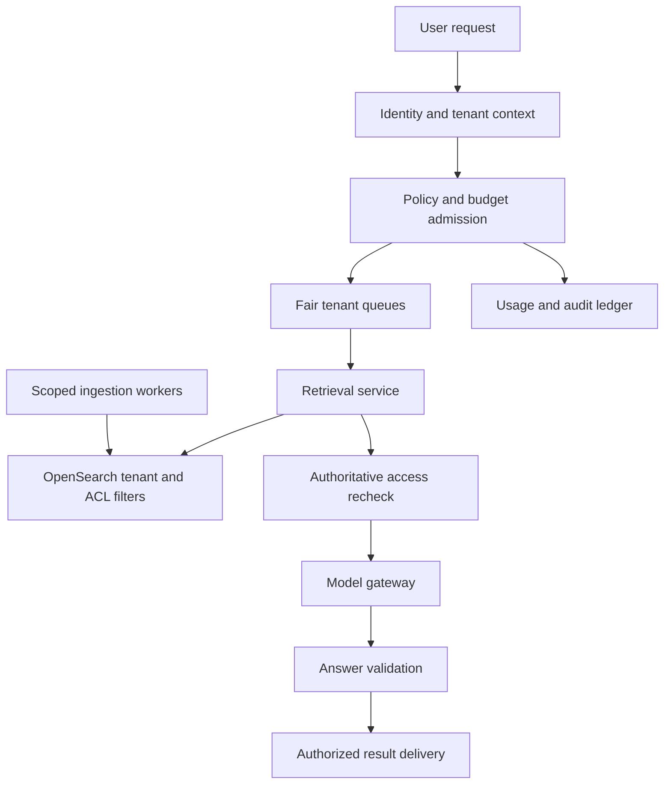
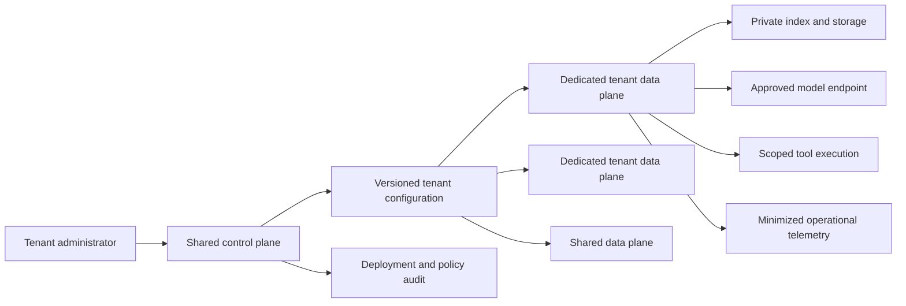

# A secure multi-tenant AI application platform

A shared AI platform must isolate more than database rows. Prompts, retrieved documents, caches, model requests, tool credentials, execution sandboxes, logs, and evaluation datasets can all cross tenant boundaries. The central design problem is carrying trusted identity and policy through every stage while controlling cost and limiting the effect of a noisy or compromised tenant.

This chapter develops a shared SaaS assistant and a platform with dedicated environments for selected tenants. Retrieval follows the [OpenSearch study](opensearch-retrieval.md), but isolation must also cover ingestion, generation, tools, and operations.

!!! note "Scope and evidence — researched September 7, 2026 (UTC)"

    Kubernetes and PostgreSQL behavior is grounded in official documentation. Deployment tiers, budgets, and threat models are illustrative recommendations. An isolation architecture does not itself establish regulatory compliance. Confirm the exact services, Regions, contracts, and operational controls required by the application.

## 1. Define the boundary before choosing infrastructure

A tenant is an administrative and data-access boundary, not necessarily a database or Kubernetes namespace. A user can belong to multiple tenants, and service identities can act on behalf of users. Every request needs an unambiguous active tenant and authorized subject resolved by trusted code.

Kubernetes documentation distinguishes different multi-tenancy scenarios and discusses namespaces, access control, quotas, network isolation, and stronger isolation approaches. A namespace alone is not a complete security boundary. Cluster configuration and workload isolation determine what sharing actually means. [^1]

PostgreSQL row-level security can enforce row policies, with important owner and privileged-role bypass behavior. A shared-table design must use the intended execution roles and test both allowed and denied paths. [^2] A tenant column without enforcement is only a convention.

Isolation needs separate answers for confidentiality, integrity, availability, cost, and operator access. Dedicated compute can improve performance isolation while a shared logging system still exposes data. A shared database can be acceptable when policies, roles, and operations satisfy the threat model; “shared” and “secure” are not mutually exclusive, but the details matter.

## 2. Best fit and deployment choices

| Model | Good fit | Main cost or limitation |
|---|---|---|
| Shared application and data tables | Many smaller tenants with similar needs | Policy complexity and broad failure domain |
| Shared compute, separate data stores | Stronger data lifecycle separation | Connection, migration, and fleet overhead |
| Dedicated data and execution plane | Higher isolation or workload requirements | Provisioning, upgrades, idle capacity |
| Separate account/project environment | Strong administrative separation | More operational coordination and deployment cost |
| Single-tenant application | Small product or strict dedicated model | Lower sharing efficiency |

Do not offer a dedicated tier as a vague promise. State what is dedicated: compute, indexes, database, keys, credentials, logs, network, and administrative access. Any shared component remains part of the threat model.

A platform is justified when several AI applications need consistent identity, retrieval, budgets, model routing, tools, and audit. One small application can start with a narrower service and explicit boundaries. Centralization saves repeated work but creates a high-value control plane.

## 3. Trusted request context

Create a signed or server-internal request context containing tenant ID, subject, application identity, permitted scopes, policy version, data region, budget class, and trace ID. Do not accept tenant IDs from model output as authority. Validate context at service boundaries and bind asynchronous jobs to it.

Use the intersection of tenant policy, user permissions, application privileges, and task scope. Retrieval, generation, tool execution, and result delivery may each require a decision. A user authorized when work started may be revoked before a long-running result is delivered.

### Core records

| Record | Purpose |
|---|---|
| Tenant configuration | Region, model policy, isolation tier, quotas, retention |
| Membership | Subject, roles, resource scopes, effective version |
| Request/job | Trusted context, state, deadline, budget reservation |
| Artifact | Tenant, classification, source ACL, content version, expiry |
| Credential binding | Tenant, downstream service, secret reference, scopes |
| Usage ledger | Reserved and actual units, rate class, accounting state |
| Audit event | Actor, decision, operation, resource, policy version |

Keep operational identifiers stable without embedding secrets or private document content. Tenant IDs can be opaque, but opacity alone is not authorization.

## 4. Design A: shared SaaS knowledge assistant

Assume 10,000 tenants, 100,000 questions/day, 200 peak requests/second, and substantial skew: 1% of tenants generate 50% of traffic. The initial service supports retrieval and answer generation, with no external write tools. Each answer must use only content authorized for the active user.

### Ingestion

A connector runs under a tenant-specific credential binding. It stores source ID, tenant, content version, ACL version, deletion state, and source timestamp with each document. Chunk IDs inherit the same ownership and policy metadata. Re-embedding does not create a new authorization identity.

Use an ingestion outbox or durable queue to apply updates and tombstones. Keep source version ordering so a delayed old update cannot restore a deleted document. ACL changes may require rapid invalidation or a final source authorization check, depending on the application's freshness requirement.

### Request flow

1. Authenticate the user, resolve active tenant, and validate membership.
2. Reserve budget and admit the request through a fair queue. Reject or defer work before spending on retrieval or inference if limits are exhausted.
3. Construct search filters from trusted context. The model may propose query text but cannot remove tenant or ACL predicates.
4. Retrieve candidates and recheck access before placing sensitive content in model context when required by the policy.
5. Route to an allowed model endpoint and region. Include only necessary excerpts and references, not whole documents by default.
6. Validate citations and response shape. Reauthorize result delivery if membership changed during execution.
7. Reconcile actual usage and persist the permitted artifact with tenant ownership and retention.

### Caches and observability

A retrieval cache key includes tenant, effective access scope, query, index/content version, and relevant ranking configuration. A generation cache additionally includes prompt/model configuration and evidence identity. Cross-tenant reuse is restricted to deliberately public, nonpersonalized content with a separate policy.

Logs and traces should avoid full prompts by default. Debug capture is an explicit controlled feature with limited access and expiry. Evaluation datasets derived from production requests preserve tenant permission and consent constraints; copying them into a shared benchmark can create a new leak even when the serving path is correct.

### Failure behavior

A policy service outage fails closed for protected data. A model outage can return retrieved evidence or a clear failure if the product supports that fallback. It cannot justify routing private data to an unapproved provider. A tenant budget-ledger outage should not silently permit unlimited requests; define a bounded emergency allowance only if explicitly part of the service policy.

## 5. Design B: dedicated execution for selected tenants

Assume 200 enterprise tenants, 20 requiring dedicated data and execution environments, and several thousand smaller tenants on the shared tier. A common control plane manages configuration and deployment, while dedicated planes hold tenant data, model connectivity, and tool credentials.

Provisioning creates the specified network, storage, keys, identities, quotas, and service configuration. Reconcile actual infrastructure against desired state and expose provisioning status. Do not mark a tenant ready merely because a database exists while its logging or network policy is incomplete.

The shared control plane should avoid storing tenant content. It manages nonsecret configuration and references to credentials held in the tenant plane. Administrative actions require scoped identities and audit. A support operator's access to one tenant must not automatically imply access to all dedicated planes.

### Tool execution

A tenant may run code or external tools in isolated workers. The model gateway and tool executor enforce the same trusted context. MCP transport authorization can help authenticate a tool connection, but object-level and tenant-specific policy remain application responsibilities. The MCP security guidance's token-audience and confused-deputy concerns are directly relevant when a central service acts for many tenants. [^3]

Use distinct read and write capabilities, action-specific limits, and destination bindings. A model cannot select another tenant's credential reference. Long-running work stores its policy version but rechecks current authority before material external actions.

### Upgrade and recovery

Deploy through canary tenants and compatible configuration versions. A control-plane change must not force all dedicated planes to accept an incompatible schema at once. Keep rollback paths for prompts, models, policies, and application code separate because their effects differ.

Backups and disaster recovery preserve tenant separation. Test restore into an isolated target, verify authorization and key access, and ensure restored data does not resurrect deleted records beyond the approved retention policy. Recovery objectives should be documented for each tier and tested rather than inferred from replication.

This design reduces shared data-plane failures but increases fleet complexity. Dedicated idle capacity and per-tenant upgrades can dominate cost. The shared control plane remains a common dependency and potential administrative blast radius.

### Concrete deployment and policy boundaries

Consider three implementation choices for the dedicated tier. Separate namespaces on shared nodes provide organizational boundaries and configurable policy, but still share the cluster control plane and worker hosts. Separate node pools reduce workload co-location while retaining cluster administration. Separate clusters or accounts expand administrative separation, at the cost of more deployment and recovery operations. The required boundary follows from the tenant threat model, not the tier's marketing name. [^1]

Kubernetes NetworkPolicy requires a network implementation that enforces it. A policy object existing in the API does not prove traffic is blocked. Test default-deny ingress and egress, explicitly permit required DNS and service paths, and verify the behavior from an actual tenant workload. Network policy is one layer; application identity and database authorization still protect shared services. [^4]

ResourceQuota constrains aggregate resource consumption within a namespace. Combine it with workload requests/limits and application-level token, query, and tool budgets. A namespace CPU quota does not prevent a tenant from consuming another system's model quota or running an expensive shared database query. The platform needs both infrastructure and business-resource accounting. [^5]

A policy matrix can make ownership concrete:

| Operation | Control-plane authority | Data-plane enforcement |
|---|---|---|
| Select allowed model | Tenant policy administrator | Gateway rejects unapproved endpoint/region |
| Add a source connector | Tenant integration administrator | Connector identity and source ACL checks |
| Execute a tool | Task/user authorization | Scoped credential and target preconditions |
| Change retention | Authorized tenant/platform policy | Artifact expiry, index deletion, backup process |
| Debug a failed request | Time-bound operator authorization | Minimized tenant-scoped diagnostic access |

Store desired policy as a versioned record and report the version each plane has applied. During propagation, define whether requests require the latest policy or can use a bounded older version. Revocations often need stricter handling than permission additions. A data plane that cannot confirm a required revocation should stop the affected operation rather than continue indefinitely on cached authority.

For key separation, define which service can decrypt which tenant's artifacts and under what identity. Distinct keys help only when access policy and operator paths preserve that distinction. An all-powerful shared service that routinely decrypts every tenant still has a broad compromise impact. Minimize such services and audit exceptional access.

Finally, verify deletion across the actual topology: source credentials, queued jobs, object versions, search chunks, embeddings, caches, diagnostics, and retained backups. Some retention obligations or backup mechanisms may delay physical removal; the application should disable normal access immediately and report the remaining lifecycle accurately. Do not advertise instant deletion based only on removing the primary database row.

## 6. Threat model and trade-offs

Test concrete paths: one tenant requests another's document ID; a cache omits access scope; a queue worker reuses prior context; a log viewer exposes prompts; a model-generated tool call selects a different connection; an operator exports data through a debugging feature.

Prompt injection is one trigger for these failures, not the sole threat. Ordinary programming mistakes, stale ACLs, compromised credentials, and support workflows can cross the same boundaries. Enforce isolation below the model layer.

| Control | Helps with | Does not by itself solve |
|---|---|---|
| Row or document filters | Data selection | Logs, caches, credentials, privileged bypass |
| Dedicated compute | Noisy neighbors and runtime scope | Shared control-plane access |
| Tenant-specific keys | Key management and some lifecycle needs | Authorized application misuse |
| Model gateway | Endpoint policy and usage accounting | Correct answers or source ACLs |
| Runtime sandbox | Untrusted tool execution | Business authorization and safe intent |

## 7. Capacity and economics

Design for skew rather than average traffic. Use per-tenant concurrency, request and token rates, queue limits, and spending caps. Reserve estimated expensive units before dispatch and reconcile actual usage. Streaming cancellation should stop additional work where possible, but already consumed provider units may still be chargeable according to the selected service.

Track cost per tenant and per completed task across inference, embeddings, storage, search, egress, tools, audit, and idle dedicated capacity. Shared infrastructure allocations should be transparent enough to identify a tenant whose ingestion or retained artifacts dominate costs even if query volume is small.

Service objectives include authorization correctness, queue delay by tier, retrieval freshness, model latency, budget accuracy, deletion completion, and restore success. Overall uptime can hide a noisy-neighbor failure that affects only small tenants.

## 8. Evaluation and practice

Create synthetic tenants with overlapping document titles and intentionally similar record IDs. Run the same questions under different users, roles, and tenant contexts. Inspect all output channels: response, streaming events, citations, cache, downloads, logs, traces, and evaluation exports.

Test revocation during a long request, deletion during reindexing, queue retries, connection-pool reuse, backup restore, and dedicated-plane upgrade. Verify that denial remains correct even when a model asks confidently for an out-of-scope resource.

A lab can implement two tenants over one reporting table and one search corpus, then deliberately remove tenant scope from a cache key. The test should catch the leak before adding more infrastructure.

1. What exactly is dedicated in the enterprise tier?
2. Which component supplies tenant identity to asynchronous workers?
3. How do you prove caches and logs preserve the same boundary as retrieval?
4. What happens when a user's access is revoked during generation?
5. Which shared control-plane operation has the largest blast radius?

## Related studies

- [R07 · Permission-aware retrieval across multiple sources](federated-retrieval.md)
- [A03 · An MCP tool gateway for enterprise applications](mcp-tool-gateway.md)
- [S01 · A multi-provider LLM gateway](llm-gateway.md)

## References

[^1]: [Kubernetes: Multi-tenancy](https://kubernetes.io/docs/concepts/security/multi-tenancy/) — tenancy models, namespace controls, resource quotas, and isolation considerations.
[^2]: [PostgreSQL: Row security policies](https://www.postgresql.org/docs/current/ddl-rowsecurity.html) — enforcement and privileged-role behavior.
[^3]: [MCP: Security best practices](https://modelcontextprotocol.io/specification/2025-06-18/basic/security_best_practices) — confused deputies, token boundaries, and transport-related threats; pinned compatibility reference.

[^4]: [Kubernetes: Network policies](https://kubernetes.io/docs/concepts/services-networking/network-policies/) — enforcement prerequisites and traffic policy.
[^5]: [Kubernetes: Resource quotas](https://kubernetes.io/docs/concepts/policy/resource-quotas/) — namespace resource limits and scope.
