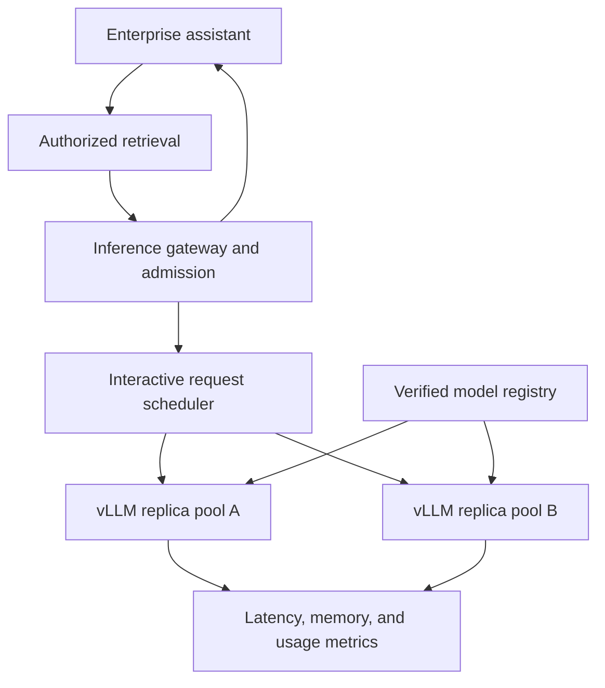
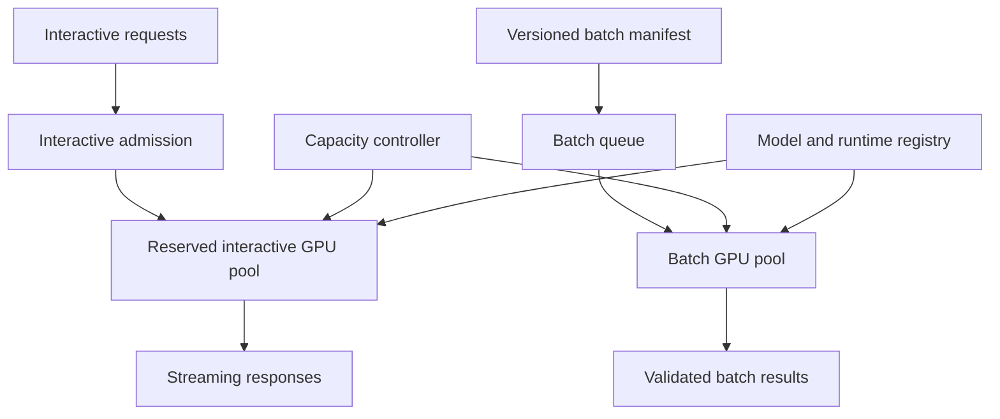

# Self-hosted LLM inference with vLLM and GPU serving

Self-hosting changes the question from “Which API should we call?” to “Can we operate enough model capacity at the required quality, latency, and availability?” It gives control over model artifacts and deployment boundaries, but transfers capacity planning, security patching, scheduling, and recovery to the application owner.

This is a serving-system study, not a claim that running an open-weight model is always cheaper or more private. The [OpenSearch example](opensearch-retrieval.md) provides the retrieval side of a RAG application; this chapter designs the model-serving tier that consumes its authorized context.

!!! note "Scope and evidence"

    Research date: September 7, 2026 (UTC). vLLM and NVIDIA Triton documentation were consulted. vLLM's PagedAttention design page explicitly describes a historical implementation; it is used here for the memory-management concept, not as a claim about every current kernel. Hardware sizes and throughput targets are illustrative and must be benchmarked on the exact model/runtime/GPU combination.

## 1. The serving mechanics

### Prefill and decode

During prefill, the model processes prompt tokens and builds attention state. During decode, it generates new tokens iteratively while reusing that state. Long prompts stress prefill; long answers occupy decode capacity and memory for many steps. Requests with the same total token count can have very different latency profiles.

Time to first token and time per output token are therefore separate service objectives. A server can produce high aggregate throughput while individual users wait too long. Benchmark mixed prompt/output distributions, not a single short prompt repeated at maximum concurrency.

### KV cache and paged memory

The key/value cache stores attention state for active sequences. A rough uncompressed estimate is:

`KV bytes ≈ 2 × layers × KV_heads × head_dim × cached_tokens × bytes_per_element`

The factor two represents keys and values. Architecture, precision, parallelism, allocation overhead, and implementation details change actual residency. Grouped-query attention uses fewer KV heads than query heads, so substituting query-head count can greatly overestimate memory.

PagedAttention's foundational idea is managing KV state in blocks rather than demanding one large contiguous allocation per sequence. This can reduce fragmentation and support sharing/copy-on-write patterns. The vLLM design page explains the approach while warning that its kernel description is historical. [^1] Capacity planning should use current runtime metrics and measured memory, not reproduce an old kernel diagram as a present implementation guarantee.

### Batching and scheduling

Batching combines work to improve accelerator utilization. Autoregressive serving needs scheduling that accommodates requests entering and finishing at different times; the details depend on the runtime. NVIDIA Triton documents dynamic batching for stateless models, with preferred sizes, queue delay, and queue policies. Do not equate that mechanism automatically with an LLM engine's iterative token scheduling. [^3]

Queue delay trades latency for utilization. A short classification service and a long chat service should not share an unconstrained queue. Admission limits on prompt length, output length, and concurrent tokens are as important as requests/second limits.

### Prefix caching

vLLM documents automatic prefix caching using block-based identity and cache-isolation mechanisms. Repeated identical prefixes can reuse prefill work; this does not eliminate the cost of generating new tokens. [^2] Prompt formatting, model version, tokenization, and tenant policy determine whether reuse is valid.

A cache hit is useful when stable prefixes recur, such as a shared instruction template. It is less useful when every request begins with unique user text. Cross-tenant reuse needs an explicit policy and isolation controls; cache timing and sensitive prompt reuse should be considered in the threat model.

## 2. Deployment choices and alternatives

| Choice | Best fit | Main responsibility or limitation |
|---|---|---|
| Managed model API | Variable load and fast product iteration | Provider policy, capacity, and feature dependence |
| Managed endpoint with your model | Model control with less infrastructure work | Endpoint cost and supported deployment constraints |
| vLLM-based service | Open-model generation with an optimized serving runtime | Runtime/model compatibility, GPU operations, and release testing |
| Triton plus an appropriate backend | Multiple model types or an existing NVIDIA serving stack | Backend-specific configuration and integration complexity |
| Local lightweight runtime | Development, edge, or low-concurrency use | Different throughput and hardware constraints |

Choose self-hosting when measured workload, deployment policy, customization, or sustained utilization justifies ownership. A low-volume assistant can be more expensive on an idle GPU than on a managed API. A model's open weights do not automatically grant every commercial use; inspect its license and distribution obligations before deployment.

Quantization can reduce memory and sometimes improve throughput, but supported formats, kernels, and quality depend on the combination. Tensor parallelism spreads computation and memory across devices but introduces communication. Pipeline parallelism partitions layers with different scheduling trade-offs. Do not choose GPU count from parameter size alone: weights, KV cache, runtime workspace, communication buffers, and headroom all matter.

## 3. Model artifacts and runtime contracts

A release bundle should pin weight hashes, tokenizer, chat template, quantization format, runtime image, accelerator libraries, generation defaults, context limits, and evaluation report. Two deployments using the same model name can behave differently if their chat templates differ.

Load artifacts from a controlled registry, verify integrity, and restrict runtime code execution during model loading. Model repositories can include custom code; evaluate and package required code instead of granting an inference service arbitrary download-and-execute privileges. Keep outbound network access and storage permissions minimal.

Expose an application contract for supported tools, schema behavior, modalities, and limits. An OpenAI-compatible route shape does not guarantee identical semantics. Validate the exact interface used by the application, including streaming cancellation and error responses, before calling the endpoint a replacement.

## 4. Design A: private enterprise RAG inference tier

### Workload and architecture

Assume 2,000 employees, 20 peak requests/second, mean prompt length 4,000 tokens, and mean answer length 400 tokens. Documents remain within an approved environment. The illustrative objectives are p95 first token below two seconds and steady output suitable for interactive reading. These targets may require smaller models, more capacity, or shorter context after benchmarking.

### Request and data flow

1. The application authenticates the user and retrieves only authorized evidence. The inference tier does not receive the entire document store.
2. The gateway validates the model contract, prompt size, output limit, and deadline. Oversized requests are rejected or reduced by an application-approved context-selection policy.
3. Admission uses available concurrency/token capacity and queue age. Assign the request to a healthy replica while considering prefix-cache locality only after fairness and capacity.
4. The runtime performs prefill/decode and streams output. The gateway propagates client cancellation where supported and records the final state.
5. The application validates citations and tool proposals. The inference server does not execute business actions.

State is mostly request-scoped: request ID, tenant/policy scope, model release, prompt token estimate, deadline, assigned replica, output count, and terminal status. Conversation history remains in the application. Prefix cache is an optimization and can be lost without corrupting business state.

### Capacity and overload

At an illustrative average 400 output tokens and 20 requests/second, demand is 8,000 output tokens/second before retries and tail behavior. That is a workload requirement, not a claimed GPU throughput. Benchmark the selected model to determine the replica count under the latency target and realistic input lengths.

When queue age exceeds the interactive budget, shed load early with a clear retry response or route to an explicitly approved alternative. Do not allow unbounded queues that turn a brief burst into minutes of stale responses. Reserve capacity for canaries and recovery; full utilization with no headroom is not a reliability plan.

### Failure and deployment

On GPU process failure, in-flight requests fail or regenerate under application policy. A replacement replica loads the pinned artifact and passes readiness tests that include actual generation. Process liveness alone does not establish model readiness.

Use blue/green or canary rollout with old capacity retained during validation. Drain existing streams before removing a replica, within a bounded grace period. If a model release regresses retrieval-grounded answers, rollback weights, tokenizer/template, and runtime configuration as a bundle.

## 5. Design B: shared inference for classification and generation

### Workload and architecture

Assume one organization needs interactive assistance plus nightly classification of five million short records. The batch workload can finish overnight; interactive requests need priority during business hours. The design must avoid allowing a cheap background job to degrade every active user.

### Workload separation

Use separate pools or rigorously enforced scheduling classes. Classification may use a smaller model and short constrained output; forcing it through the chat model wastes capacity and complicates sizing. The batch system supplies independent, idempotent records and validates outputs before publication.

Capacity can shift between pools only when model loading time, GPU compatibility, and demand forecast make it worthwhile. Reassigning a GPU is not instantaneous: weights must load, memory must be allocated, and health checks must run. Keep enough warm interactive capacity for unexpected arrivals.

Batch workers checkpoint completed record IDs and store attempt metadata. A replica restart should resubmit only incomplete records. The authoritative batch ledger lives outside the inference runtime; an in-memory scheduler is not durable job state.

### Model and quality management

Use separate contracts and evaluation suites for extraction/classification and conversational generation. A quantized model that preserves chat quality may still regress rare labels or exact JSON formatting. Evaluate class distribution, minority-class recall, and abstention on the actual task.

If batch data includes untrusted text, it remains data even when it says to ignore the classification schema. Parse and validate output, cap tokens, and quarantine invalid records. Do not let a model output become executable code or an unrestricted query.

### Failure and fairness

Preemption must be explicit. Canceling a batch request before its result is stored can waste computation; use short record batches and durable checkpoints to bound rework. An interactive surge can pause admission to the batch pool or reduce its quota rather than killing every running request.

If capacity is insufficient to finish overnight, report projected completion early using observed throughput. Do not silently weaken the quality contract by swapping to an untested model. A cheaper model migration is a separate evaluated release.

## 6. Memory, throughput, and economics

A 7-billion-parameter model at two bytes per parameter has roughly 14 GB of raw weight values before metadata and runtime overhead. Four-bit values would nominally be about 3.5 GB, but scales, packing, kernels, and other allocations add overhead. These calculations are lower-level estimates, not a promise that the model fits on a particular device.

For an illustrative architecture with 32 layers, eight KV heads, head dimension 128, 8,192 cached tokens, and two-byte elements, the simple KV estimate is `2 × 32 × 8 × 128 × 8,192 × 2`, or about 1 GiB per full-length sequence. Multiply by active sequences, then account for sharing, allocation, and runtime implementation. This shows why long-context concurrency can dominate memory.

Benchmark prompt-length/output-length buckets and concurrency sweeps. Report first-token latency, token latency, requests/second, output tokens/second, memory use, queue age, and error rate. A throughput number without latency and workload shape is not enough to size a service.

Total cost includes GPUs, idle capacity, storage, networking, engineering, monitoring, security, and incident response. Compare cost per successful application task with a managed API using the same quality bar. Utilization improves economics, but aggressive batching can violate latency. Plan for failures and deployments, not only ideal steady-state occupancy.

## 7. Security and release evaluation

Restrict access to inference endpoints, model artifacts, and metrics that might expose prompts. Keep raw prompt logging off by default unless a controlled evaluation workflow requires it. Apply tenant-aware quotas and cache isolation. Treat uploaded adapters and custom models as deployable artifacts requiring review, not ordinary request parameters.

Test model integrity, maximum context, malformed input, cancellation, out-of-memory behavior, replica restart, cache isolation, and graceful drain. Run the application's grounded-answer and tool-schema suites on the exact runtime release. Compare quantized and baseline outputs on edge cases, not only average benchmark scores.

Operational acceptance should include an overload drill and a failed-deployment rollback. Readiness must reflect ability to serve the required model; autoscaling should use queue/token pressure and latency as well as GPU utilization. A GPU can be busy doing work that is no longer useful to a disconnected client.

## 8. Practice: defend the design

1. Compute weight and KV-cache estimates for your model, then compare them with measured memory.
2. Benchmark long prompts and long outputs separately to identify the actual bottleneck.
3. Show why a static-batch configuration is not automatically equivalent to iterative LLM scheduling.
4. Drain a replica during active streams and measure user-visible failures.
5. Compare managed and self-hosted cost at 10%, 40%, and 80% useful utilization.
6. Demonstrate that a model/template rollback restores the complete tested release.

## Implementation review: benchmarking without misleading results

Use an open-loop load generator when studying overload: arrivals continue according to the target workload even when responses slow down. A purely closed-loop client that waits for each response can reduce its own arrival rate as latency rises and hide saturation. Report offered load, accepted load, completed load, and rejection rate together.

Include a warmup phase, but do not discard cold starts from operational planning. New replicas and model rollouts experience loading and cache misses. Measure both warm steady state and recovery after losing one replica. Benchmark with realistic prompt prefixes, since a repeated synthetic prompt can produce unusually favorable prefix-cache results.

Record the full configuration beside results: GPU model/count, memory, interconnect, driver/runtime, model and tokenizer hashes, quantization, context/output limits, scheduler settings, and concurrency distribution. A model-serving benchmark without these details is difficult to reproduce and can be misleading when transferred to another environment.

Finally, distinguish useful output from generated output. Tokens produced after a client disconnects, invalid structured responses, and answers rejected by the application are not successful capacity. Calculate cost and throughput per accepted task as well as raw tokens/second. This prevents an optimization that increases accelerator activity while decreasing application value from looking like a win.

For multi-GPU deployments, include the real interconnect and placement in the benchmark. A configuration tested with tightly connected devices may behave differently across hosts. Network contention and collective communication can change both latency and effective throughput. Keep topology-aware placement in the deployment contract, and retest after changing GPU type, host shape, or the number of tensor-parallel workers.

## Related studies

- [S01 · A multi-provider LLM gateway](llm-gateway.md)
- [S03 · An asynchronous batch inference platform](batch-inference.md)
- [S05 · Edge and on-device AI](edge-on-device-ai.md)

## References

[^1]: [vLLM: Paged attention design](https://docs.vllm.ai/en/latest/design/paged_attention/) — foundational block-based KV memory explanation; page marks the implementation description as historical.
[^2]: [vLLM: Automatic prefix caching](https://docs.vllm.ai/en/latest/design/prefix_caching/) — block identity, reuse, and cache isolation considerations.
[^3]: [NVIDIA Triton: Batcher](https://docs.nvidia.com/deeplearning/triton-inference-server/user-guide/docs/user_guide/batcher.html) — dynamic batching, queue delay, and policies for stateless models.
