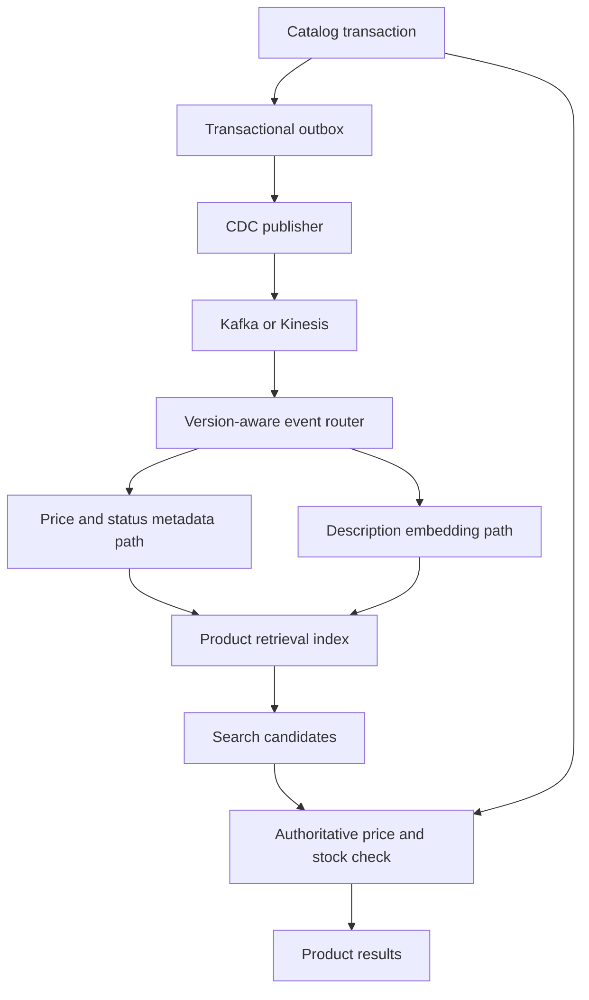
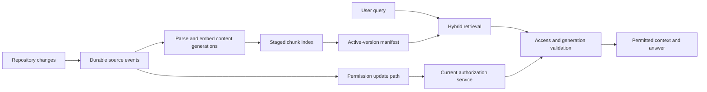

# Fresh retrieval indexes with Kafka or Amazon Kinesis

A retrieval index is useful only if it represents the right source version. Streaming ingestion is therefore a consistency problem before it is a throughput problem: capture committed changes, preserve the ordering that matters, make retries safe, and prevent a delayed update from restoring deleted content.

This chapter develops a live product-catalog index and a changing enterprise-knowledge index. Both feed systems such as the [OpenSearch retrieval design](opensearch-retrieval.md). Kafka and Amazon Kinesis carry events; neither automatically makes an external search index transactionally consistent with its source.

!!! note "Research and assumptions"

    Primary Kafka 4.1 design documentation, AWS Kinesis concepts, and Debezium outbox documentation were reviewed September 7, 2026 (UTC). Kafka 4.1 is a versioned mechanics reference, not a claim about the latest release. Capacities, retention choices, and processing protocols below are illustrative architecture recommendations.

## 1. What the stream provides

A durable event stream records changes for independent consumers to process and replay. Partitioning provides scalable parallelism but limits the scope of ordering. The indexer can fall behind and catch up while other consumers build analytics or audit views from the same events.

Kafka documents producer idempotence and transactions, but explicitly distinguishes Kafka-to-Kafka exactly-once processing from writes to external systems, which require cooperation with the destination. An external search sink still needs idempotency or a coordinated commit design. [^1]

Kinesis organizes records into shards and gives records partition keys and sequence numbers. Its documented capacity and retention modes determine how ingestion and replay are managed. Do not interpret a sequence number as a global business-object version across all shards and source systems. [^2]

Use a stream when changes are frequent, multiple consumers need them, replay matters, or burst absorption is valuable. For a small corpus updated nightly, a scheduled snapshot/reconciliation job may be simpler. A stream does not compensate for a source that cannot identify deletions or provide a reliable change boundary.

## 2. Capture committed changes

The unsafe dual-write pattern is “commit the database update, then publish an event.” A crash between the two leaves the index permanently unaware unless reconciliation finds it. Reversing the order creates events for changes that might never commit.

A transactional outbox writes application state and an event row in the same database transaction. A CDC connector later publishes the outbox. Debezium's outbox router uses an event ID for deduplication and an aggregate ID as the emitted key, helping preserve aggregate ordering within Kafka partitions. [^3]

Raw table CDC is another choice. It captures database changes without changing every application write, but the consumer must understand schema evolution, transaction boundaries, and how low-level rows map to search documents. Outbox events can express a stable domain contract, while adding application and cleanup responsibilities.

## 3. Event and state model

A robust event contains `event_id`, `tenant_id`, `entity_id`, `entity_generation`, `operation`, `source_commit_position`, `schema_version`, `occurred_at`, and either a complete payload or a versioned source pointer. A content hash and embedding revision support deduplication. A delete event must identify the same stable entity as prior updates.

Do not use wall-clock timestamps as the only ordering mechanism. Clock skew, equal timestamps, and delayed delivery make them ambiguous. Prefer a monotonic source generation or a source-specific commit ordering with a documented scope. If several systems can update one entity, define an authoritative merge rule instead of pretending their counters are comparable.

The indexer maintains a ledger with the highest accepted generation, operation, expected chunk IDs, and publication state. Stable index IDs make duplicate writes harmless, but **idempotency is not ordering**: replaying generation 4 after generation 5 can still overwrite good state unless the sink rejects older generations.

### Search visibility and publication

An acknowledged index write is not necessarily searchable immediately. Track `captured`, `processed`, `written`, and `visible` as separate states. A visibility probe or application manifest can confirm when a new revision is eligible for serving.

For multi-chunk documents, stage a complete generation and activate it only after all expected chunks are present. Old chunks remain excluded by the active-version check until cleanup. Without this boundary, an update from ten chunks to six can leave four obsolete chunks answering questions indefinitely.

### Deletion and replay

A tombstone records that a generation is deleted. Retain deletion information long enough to cover the maximum replay, outage, backup restore, and delayed-job window. Stream compaction or retention is not by itself a complete source-deletion ledger. If the index is rebuilt from an old snapshot, replay deletions before serving.

A deleted source may have derivatives beyond the index: embedding caches, summaries, reranker caches, and evaluation samples. The event pipeline should identify downstream consumers and track their deletion obligations rather than declaring success after one search API call.

## 4. Design A: live catalog retrieval

Assume five million products, 2,000 source changes per second at peak, and 300 peak search requests per second. Descriptions can lag one minute; price and availability must be revalidated before a definitive purchase claim. Only 5% of changes affect descriptive text and require new embeddings.

### State and flow

Partition by stable product identity, including tenant or market where needed. The source owns product generation. Consumers validate schema, reject obsolete generations, and route text changes separately from metadata-only changes. The embedding cache key includes normalized descriptive content and model revision, so a price change does not trigger an expensive model call.

For a product with variants, decide whether the retrieval unit is a product or a variant. A product-level document can contain structured variant relationships; independent arrays of size and availability can create false combinations. The event contract must preserve enough structure for the indexer to reconstruct the correct document.

The fast metadata path and slower embedding path must not overwrite one another. Use a materializer that combines the latest authoritative metadata with the accepted descriptive generation, or separate fields with a carefully validated conditional update protocol. An embedding job started before a stock update must not restore the old stock value when it finishes.

### Query correctness

Search uses index filters to reduce candidates, then reads current stock and price from the authoritative service. Refill within a bounded budget when candidates become ineligible. Checkout revalidates again because state can change after search. Streaming reduces lag; it does not remove this transactional boundary.

A recalled product is blocked by the authoritative eligibility service immediately, even if its index deletion is delayed. The assistant can explain attributes from the indexed description but must not promise current availability from stale metadata. A rollback of the index route never overrides live eligibility.

### Failure recovery

If an embedding provider fails, metadata changes continue and the old descriptive representation remains marked with its revision. If a sink write times out, retry the same idempotent operation and verify state rather than generating a new identity. If the stream backlog grows, preserve deletions and eligibility changes as high-priority work while bounding optional enrichment.

A poison event enters a quarantine queue with source identity, schema version, and a redacted error. It does not block unrelated keys forever. Reconciliation compares source and index generations and repairs missing records. A dead-letter queue is an observable backlog requiring ownership, not a successful final destination.

## 5. Design B: enterprise documents and permission changes

Assume one million documents, eight chunks per document, 100 content updates per second during business hours, and occasional bulk ACL changes affecting tens of thousands of documents. Content can lag several minutes; access revocation must affect new requests immediately through an authoritative authorization service.

### Ingestion protocol

A source change identifies document generation and a versioned source location. Workers parse headings, tables, and page coordinates, then write deterministic chunk IDs into a staged generation. The manifest tracks expected count and hashes. Activate only after all required chunks are written and validated for visibility.

The permission path is independent of embedding. Revoking access should not wait behind a thousand OCR jobs. Indexed ACL tags provide coarse filtering, while the authoritative service rejects revoked candidates before external model exposure. A document becoming less restricted still needs a deliberate publication decision; do not broaden access merely because an event payload omitted ACL fields.

Deletion increments the generation and invalidates the manifest. Pending parsing jobs check that generation before publication. If a source edit reduces chunk count, obsolete chunks are removed after activation; serving rejects them immediately through the manifest. Source-count reconciliation alone would miss these extra stale chunks, so compare per-document manifests too.

### Replay and reindexing

To build a new embedding revision, take a consistent source snapshot with a recorded change boundary. Build the new index from that snapshot while replaying subsequent events. If a truly consistent snapshot is unavailable, use a documented reconciliation protocol that converges source generations before cutover.

Keep the old and new paths receiving relevant updates and deletions during migration. Validate representative queries, access checks, source counts, and generation coverage. Switch query embedding configuration and index route together. Retain rollback only for a defined window, and keep deletion ledgers current on both paths.

Do not declare success because the new index contains the same number of documents. It may contain the wrong versions or omit the same number of records it duplicates. Use stable identities, generations, and hashes for reconciliation.

### Recovery objectives

Define how long the application may serve old content, how quickly revoked access is blocked, and how long a full rebuild may take. These are different objectives. A snapshot can reduce rebuild time while losing recent source changes unless the retained stream covers the gap.

If the authorization service fails, fail closed for protected text. If content processing fails, keep an explicit stale-version state rather than silently marking the document current. If the stream retention window is exceeded, stop incremental assumptions and rebuild/reconcile from the source instead of skipping missing history.

## 6. Kafka, Kinesis, and simpler alternatives

| Option | Prefer when | Trade-off |
|---|---|---|
| Kafka | Existing event platform, multiple consumers, partitioned replay, ecosystem fit | Broker/service operations, partition planning, and retention ownership |
| Kinesis | AWS-managed stream integration and supported capacity modes fit | Shard/key behavior, consumer model, quotas, and AWS-specific operations |
| Queue | Work distribution is primary and replay history is less central | Need separate event history/reconciliation for rebuilds |
| Scheduled snapshot | Small or slowly changing corpus | Coarser freshness and explicit deletion comparison |
| Direct synchronous indexing | Very small bounded write path | Source/index failure coupling and dual-write risks |

The stream choice does not change the need for source versions and idempotent sinks. Select based on the team's platform and workload, then test the end-to-end protocol under duplicate delivery and crashes.

## 7. Capacity, cost, and monitoring

At 2,000 events per second and an illustrative 2 KB payload, ingress is about 4 MB/s before protocol and replication overhead. If 5% need embeddings, the model path handles 100 text changes per second, not all 2,000. This separation can dominate cost and backlog behavior.

If processing capacity is 3,000 events/second while arrivals remain 2,000, a backlog of 3.6 million events takes roughly one hour to drain: `backlog / (service_rate - arrival_rate)`. This is a simplified steady-rate estimate; skewed keys and external quotas can make recovery slower. Headroom must exceed normal arrival rate, not merely match it.

Monitor source-to-stream lag, consumer lag, embedding backlog, sink failures, source-to-visible lag, deletion completion, and generation mismatches. Partition-level metrics reveal hot keys hidden by aggregate throughput. Track the oldest unprocessed event and the age of quarantined failures, not just queue length.

Costs include stream capacity and retention, connectors, worker compute, model calls, index writes, duplicated migration storage, and operations. Retaining enough history for recovery is a deliberate cost. Cheap short retention can make a prolonged outage much more expensive to repair.

## 8. Evaluation and practice

Build a deterministic event fixture: create version 1, update to version 2, delete version 3, then deliver versions 1 and 2 again. The final serving state must remain deleted. Repeat with a multi-chunk update and a delayed embedding worker. Crash the consumer after sink write but before checkpoint, then prove replay is harmless.

Test snapshot-plus-stream rebuild while writes continue. Verify that cutover uses the correct encoder and that a deletion during migration affects both paths. Inject a schema error and show how unrelated keys continue without losing the failed event's repair path.

Defend why your ordering scope matches the business entity, how you handle a hot key, and what happens after retention is exceeded. Explain why Kafka transactions do not automatically make OpenSearch writes exactly once, and show which application invariants provide the correctness you actually need.

## Implementation checkpoint: Kinesis duplicates and producer ordering

AWS explicitly documents duplicate processing from both producer retries and consumer restarts. A producer can time out after a record was accepted, and a consumer can replay records after its last checkpoint. [^4] Carry business event identity and entity generation in the payload; a newly assigned stream sequence number does not make a retried business event new.

The producer documentation distinguishes `PutRecords` batching from individual `PutRecord` calls and describes their ordering controls. [^5] Partial batch failures and retries can affect the order in which records become visible. Partition keys are necessary for the intended shard scope, but they do not replace application generation checks.

For the catalog design, simulate two updates for the same product in one producer batch, with the first failing and the second succeeding. Retry the first after the second has been processed. The final index must retain the higher source generation. Then crash the consumer after writing that generation but before checkpointing; replay must leave the same state and must not cause another embedding charge if the completed representation is already available.

Record duplicate event rate separately from stale-generation rejection rate. Duplicates are expected under the chosen delivery model; a sudden rise can still reveal network or checkpoint problems. Stale-generation rejection is evidence that the ordering defense is being exercised, not a reason to remove it. Investigate sustained increases while keeping the correctness invariant intact.

## Related studies

- [R01 · Retrieval with Amazon OpenSearch](opensearch-retrieval.md)
- [R02 · Retrieval with PostgreSQL and pgvector](postgres-pgvector.md)
- [S03 · An asynchronous batch inference platform](batch-inference.md)

## References

[^1]: [Kafka 4.1 design](https://kafka.apache.org/41/design/design/) — partitioning, delivery semantics, transactions, and external-system boundaries.
[^2]: [AWS Kinesis concepts](https://docs.aws.amazon.com/streams/latest/dev/key-concepts.html) — records, shards, partition keys, capacity, and retention.
[^3]: [Debezium outbox event router](https://debezium.io/documentation/reference/stable/transformations/outbox-event-router.html) — event identity, aggregate key, and routing.

[^4]: [AWS Kinesis duplicate records](https://docs.aws.amazon.com/streams/latest/dev/kinesis-record-processor-duplicates.html) — producer and consumer retry behavior.

[^5]: [AWS Kinesis producer SDK guidance](https://docs.aws.amazon.com/streams/latest/dev/developing-producers-with-sdk.html) — batching and ordering considerations.
