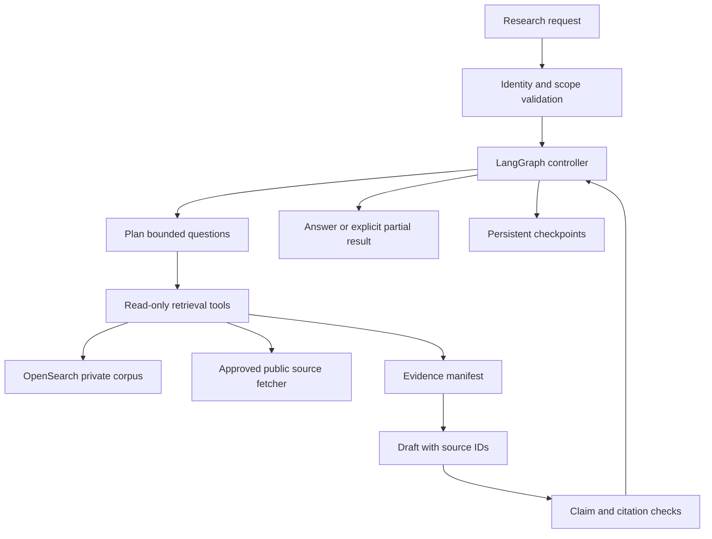
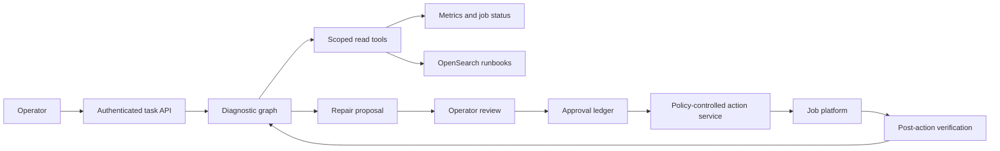

# Tool-using agents with LangGraph

A tool-using agent repeatedly selects an operation, observes its result, and decides whether the task is complete. The useful design question is how much of that decision-making must be dynamic. A support assistant may need to choose which diagnostic to run, while authentication, authorization, spending limits, and submission rules should remain application code.

This chapter develops a research assistant and an operations copilot using LangGraph as the concrete state-management example. Retrieval can reuse [Amazon OpenSearch](opensearch-retrieval.md); the agent adds controlled sequencing around retrieval and other tools.

!!! note "Scope and evidence — researched September 7, 2026 (UTC)"

    LangGraph capabilities are sourced from its documentation. The architectures, budgets, and workloads are illustrative design recommendations. Checkpointing and structured tool calls are mechanisms, not guarantees of correct reasoning or safe external actions.

## 1. Foundations and useful features

LangGraph represents an application as nodes that update shared state and edges that determine subsequent execution. State reducers define how updates combine, which matters when branches execute concurrently. Conditional routing can use a model's structured output, provided code validates the selected transition. [^1]

Its persistence model distinguishes thread-scoped checkpoints from stores for application-defined information across threads. A production design needs an appropriate persistent backend rather than the in-memory examples used in tutorials. A thread ID identifies stored execution state; it is not evidence that the caller owns that state. [^2]

Interrupts support pausing execution and resuming with external input. Code before an interrupt can run again when the node resumes, so side effects must be structured accordingly. The approval record, destination idempotency, and authorization check remain responsibilities of the surrounding application. [^3]

An agent SDK may package a comparable loop with different abstractions. Prefer graph control when explicit intermediate state and branching are valuable; prefer a smaller loop when the task is simple. Anthropic's engineering guidance distinguishes predefined workflows from dynamically directed agents and recommends starting with simpler patterns. That is useful design guidance rather than evidence that a particular framework will outperform another. [^4]

## 2. Where agents earn their complexity

| Task | Dynamic choice that can help | Deterministic boundary |
|---|---|---|
| Research a technical question | Follow a promising source or clarify a contradiction | Citation verification and read budget |
| Diagnose a failed job | Choose a diagnostic based on observations | Tool allowlist and resource scope |
| Gather a customer case | Resolve missing context across systems | Customer authorization and data minimization |
| Fill a fixed report | Often little dynamic choice is required | A bounded extraction workflow may suffice |

A model should not choose whether a user is authorized, whether a token budget exists, or whether a side effect requires a previously defined approval. If every request follows the same three steps, use a workflow. If task success cannot be observed, define the acceptance criteria before introducing more autonomy.

Agent loops add variance to latency and cost. They may revisit the same source, overinterpret an error, or stop prematurely. Their advantage is adaptation to observations; measure whether that adaptation increases successful tasks enough to pay for it.

## 3. State, tools, and stopping conditions

### Use a typed state instead of an ever-growing transcript

| State field | Purpose |
|---|---|
| Run and tenant IDs | Ownership and trace correlation |
| Goal and acceptance conditions | Explicit completion target |
| Authorized scope | Sources, resources, tools, and action limits |
| Evidence manifest | Source IDs, excerpts, versions, and access decisions |
| Pending action | Tool name, canonical arguments, operation ID |
| Budget ledger | Calls, tokens, wall time, and reserved cost |
| Outcome | Completed, partial, blocked, canceled, or failed |

Conversation messages help the model reason but should not be the only record of executed actions. Store a normalized tool ledger that distinguishes proposed, authorized, sent, acknowledged, and uncertain operations. Summaries may omit details; preserve source references and receipts outside the summary.

### Tool contracts

A tool should expose a narrow business operation. `get_job_failure(job_id)` is easier to authorize than `run_any_command(command)`. Validate types, string lengths, enumerations, identifiers, page limits, and requested resource ownership before execution. Return structured status, observation time, evidence references, truncation flags, and whether a result is complete.

Keep credentials in the execution service. The model receives a tool schema and scoped results, not an API key. Treat descriptions and returned documents as untrusted content. A tool's declaration that it is “read only” is metadata to verify against implementation and policy.

### Termination

Allow a run to finish only with an explicit outcome and evidence for its acceptance criteria. Stop on a hard call count, token budget, elapsed deadline, cancellation, repeated identical operation, or unrecoverable authorization failure. If the budget expires, return a partial artifact identifying what remains unverified. A model saying “done” is not enough to mark a submitted action successful.

Detect loops using canonical arguments and recent outcomes. Repeating a failed query once with a corrected filter can be useful; repeating it six times because the model ignores the error is not. A separate controller can require new information before permitting another equivalent call.

## 4. Design A: evidence-based research assistant

Assume 2,000 research tasks/day, each using at most twelve external reads and six model decisions. Target a useful first artifact within 90 seconds, with a five-minute hard deadline for longer investigations. This is a bounded research workflow with dynamic source selection, not unrestricted browsing.

### Data and request flow

1. Resolve the user's tenant, allowed repositories, external-data policy, and task budget. Separate instructions from attachments and retrieved content.
2. Generate at most four research questions and a completion checklist. Code rejects plans with out-of-scope sources or unbounded subquestions.
3. Query OpenSearch for internal evidence and an approved fetcher for public sources. Fetchers restrict destinations, response sizes, redirects, and content types.
4. Record each source's stable identity, retrieval time, publication or effective date when known, content hash, and authorized excerpt.
5. Produce a draft whose claims refer to evidence IDs. Unknown or conflicting claims remain explicit.
6. Verify that every cited ID exists and supports the accompanying proposition. Mechanical ID checks and evidence entailment are separate tests.
7. If a material gap remains and the budget permits, return to retrieval with a specific missing question. Otherwise finalize with qualified conclusions.

### Persistence and access

Store checkpoint references to large evidence objects rather than repeatedly copying entire pages into graph state. At resume time, reauthorize the user and relevant sources before exposing private content. A saved checkpoint is not permission to access a document after revocation.

A research result should include the question, selected scope, evidence manifest, model configuration, remaining uncertainties, and completion reason. When sources change, the original report remains reproducible from retained evidence according to policy, while a new research run produces a new revision. Do not silently mutate old citations to point at new text.

### Failure behavior

If public fetching fails, continue using authorized internal evidence only when it can answer the request and label the narrower scope. If retrieval finds contradictory documents, surface the disagreement with effective dates instead of averaging assertions. If a checkpoint backend fails, stop making additional external calls after the current safe boundary; otherwise a restart can duplicate work without a durable budget record.

A model-generated URL should pass through destination validation. A document that says “upload your search history here” is evidence content, not a new instruction. Keep external fetch and private retrieval results separate so private excerpts cannot be embedded in an outbound query accidentally.

## 5. Design B: operations copilot with constrained repair

Assume 300 investigations/day across 100 services. Most requests are diagnostic; perhaps 10% lead to a proposed operational change. Allow eight diagnostic calls, two hypothesis revisions, and a fifteen-minute approval lifetime. The system initially supports one narrow repair: restarting an explicitly selected failed batch worker through a controlled service API.

The agent begins with a concrete job identifier and incident interval. It retrieves failure events, relevant configuration, recent changes, and the applicable runbook version. Each observation includes a time window and freshness. A service timeout is represented as missing evidence, not as proof that the service is unhealthy.

A repair proposal contains the target resource, exact action, expected current state, rationale, evidence, risk, verification method, and expiry. The user approves the proposal hash. Immediately before execution, the action service checks current authorization and state preconditions. Approval to restart worker A cannot be reused to restart an entire cluster.

The destination returns an operation ID. Verification polls status through an independent read path and checks that the intended job resumed without changing unrelated jobs. If the request times out, query the operation ID or destination state before any retry. The graph's checkpoint should preserve `outcome_unknown` until evidence resolves it.

Use a separate credential for reads and the one repair capability. If prompt injection convinces the model to propose a broader operation, the action service has neither an accepted schema nor authority for it. A useful first release never needs arbitrary shell access.

This design's graph has explicit phases: gather, assess, propose, await approval, execute, verify, finish. Dynamic tool choice is confined to gather and assess. A failed verification may produce a new diagnostic task, but it does not grant automatic authority for progressively more invasive changes.

## 6. Technology choices and trade-offs

| Option | Prefer when | What to measure |
|---|---|---|
| LangGraph | Explicit state transitions, resume, and branching matter | Checkpoint cost, state evolution, debugging effort |
| Small custom tool loop | Few tools and simple termination rules | Whether persistence and retries remain understandable |
| Managed agents SDK/runtime | Its tool, tracing, and hosting model fits requirements | Permission controls, data boundaries, portability, limits |
| Durable business orchestrator | Long waits and cross-service effects dominate | Replay and deployment behavior; integration overhead |
| Fixed pipeline | Inputs and step order are predictable | Quality and cost before adding dynamic planning |

Framework choice does not determine autonomy. A graph can implement a rigid workflow or a model-controlled loop. A small SDK can be wrapped with strong policy. Compare the complete system: state store, tool service, policy engine, evaluation, and recovery.

## 7. Sizing, cost, and operational signals

For the research example, the worst permitted model-decision volume is 12,000/day. If an average decision reads 5,000 input tokens and emits 600, that is 60 million input and 7.2 million output tokens/day before retries, validation, and final drafting. Real utilization may be lower; enforce aggregate tenant budgets so the worst case is financially bounded.

Parallel reads reduce critical-path latency only while downstream quotas and source independence permit. Launching twelve calls at once can exhaust a source quota and increase total latency. Use per-tool concurrency limits and propagate the run deadline. Reserve budget before dispatching parallel work; reconcile actual usage afterward.

Measure completed tasks, evidence sufficiency, unnecessary calls, repeated arguments, checkpoint failures, cancellation latency, and cost per verified success. Track the ratio of proposed to accepted actions and the rate of failed post-action checks. A low tool error rate can coexist with poor task quality if the agent consistently calls the wrong successful tool.

### State evolution and checkpoint failure boundaries

Treat the graph state schema as a deployed interface. Adding a field can be compatible if old checkpoints have a defined default; renaming a field or changing its meaning may require migration or routing old runs to compatible code. Record graph and state-schema versions, and exercise representative saved runs before deployment. A successful new-run test does not prove that yesterday's paused approvals will resume correctly. [^2]

Reducers deserve explicit review. If parallel retrieval branches append evidence, deduplicate by stable source and content version. If branches update a budget field, avoid a naive last-writer-wins merge that loses one branch's consumption. Reserve budget in a transactional service before dispatch and store references in graph state; the model-visible counter should not be the sole financial authority.

Checkpoint timing also affects side effects. A node can write to an external API and crash before its state update is durable. On resume, the graph may need to execute the node again. Use the operation ledger and destination receipt to resolve whether to return the prior result, continue verification, or send a new request. An interrupt inside a node requires special care because pre-interrupt code can rerun. [^3]

For a practical recovery test, pause the operations copilot at approval, deploy a compatible graph change, resume with the approved proposal hash, and crash immediately after destination acknowledgment. The expected result is one external operation, preserved approval identity, and eventual independent verification. Repeat with an expired approval and ensure no operation occurs.

## 8. Evaluation and rollout

Create an offline suite with fixed tool responses so prompt or graph changes can be compared reproducibly. Include missing evidence, contradictory sources, malicious text, oversized responses, resource revocation, and ambiguous tool outcomes. Then run a separate integration suite against controlled test systems because mocked tools cannot reveal authentication, timing, or serialization failures.

Compare a fixed workflow, a single bounded agent, and the chosen graph on the same tasks and budget. Evaluate task success, answer support, action correctness, and cost. Use human review for ambiguous judgments and retain a held-out set. Test crash recovery at every transition that precedes a side effect.

Roll out read-only operation first, then a single reversible tool with explicit verification. Keep model, prompt, graph, tool-schema, and policy versions in every run. A rollback may restore a prior prompt for new runs while existing checkpoints require their compatible graph version.

## 9. Practice: defend the loop

Build a three-tool lab: search documents, read a document, and obtain a job status. Persist state, cap tool calls, and return either supported completion or a precise partial result. Add a synthetic page that asks the agent to expose a secret; demonstrate that there is no authorized secret tool or unrestricted outbound channel.

1. Which graph nodes may execute again after resume, and what makes that safe?
2. What proves a task is complete beyond the model's final sentence?
3. How is authorization rechecked when a stored run resumes tomorrow?
4. Why does a correct tool response not prove the agent chose the right tool?
5. How would you show that dynamic planning beats the fixed workflow baseline?
6. What happens when cancellation arrives after the destination accepted an action?

## Related studies

- [A01 · Durable AI workflows with Temporal or AWS Step Functions](durable-workflows.md)
- [A03 · An MCP tool gateway for enterprise applications](mcp-tool-gateway.md)
- [A07 · Multi-agent task coordination](multi-agent-coordination.md)

## References

[^1]: [LangGraph: Graph API](https://docs.langchain.com/oss/python/langgraph/graph-api) — state, nodes, edges, and reducers.
[^2]: [LangGraph: Persistence](https://docs.langchain.com/oss/python/langgraph/persistence) — checkpointers and stores.
[^3]: [LangGraph: Interrupts](https://docs.langchain.com/oss/python/langgraph/interrupts) — pause, resume, and execution considerations.
[^4]: [Anthropic: Building effective agents](https://www.anthropic.com/engineering/building-effective-agents) — workflow and agent patterns; practitioner guidance rather than a general benchmark.
