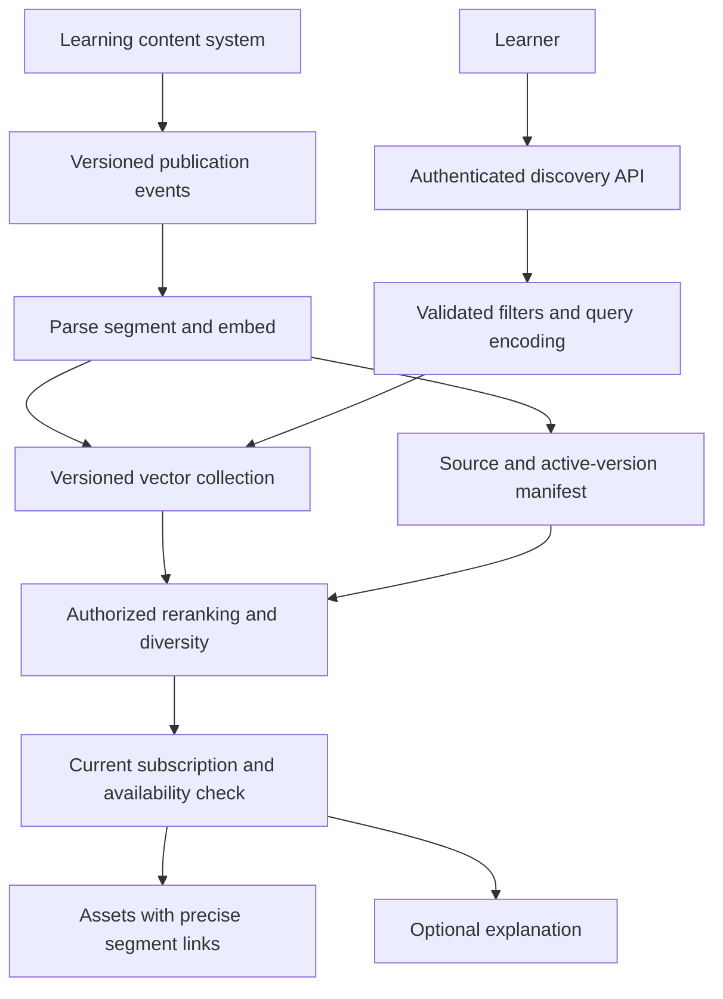
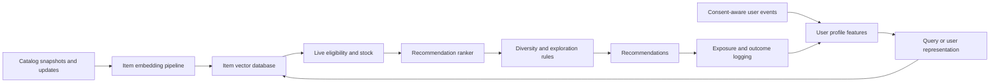

# Retrieval with a dedicated vector database

A dedicated vector database is useful when similarity retrieval deserves its own capacity, deployment, and operational lifecycle. The decision is broader than choosing an ANN algorithm: filtering, update visibility, hybrid search, tenant boundaries, backup, and migration often determine whether an otherwise fast engine works for an application.

This chapter compares Pinecone, Qdrant, Weaviate, and Milvus through two proposed systems: semantic content discovery and recommendation candidate retrieval. The [OpenSearch chapter](opensearch-retrieval.md) provides the search-engine baseline; [PostgreSQL and pgvector](postgres-pgvector.md) provides the relational baseline.

!!! note "Research and assumptions"

    Primary documentation was reviewed September 7, 2026 (UTC). Capacities and architecture choices are illustrative, not vendor benchmarks. Feature availability depends on deployment, API version, plan, and client. Milvus's main documentation endpoint could not be retrieved during research; its official repository was read, and this chapter deliberately avoids unsupported consistency-mode details.

## 1. What the database owns

The core record is an identity, one or more vectors, and filterable metadata. The service builds structures that find nearby vectors without scoring every stored value. An application still owns source documents, semantic meaning, current authorization, and the correctness of generated claims. Treat the retrieval store as rebuildable unless the chosen product and your operational design explicitly make it authoritative.

Dense embeddings capture learned similarity. Sparse representations contain a small number of weighted coordinates, often corresponding to tokens or learned lexical features. Hybrid retrieval combines signals, but implementations differ: native BM25, learned sparse vectors, rank fusion, and normalized score fusion are distinct mechanics. “Supports hybrid search” is the beginning of a comparison, not the conclusion.

An ANN index returns candidates for a downstream decision. For recommendations, those candidates are not the final ranking. For RAG, they are not verified facts. Hard constraints such as market eligibility and document permissions belong in trusted application policy and must survive every branch of retrieval.

## 2. A fair product comparison

Pinecone's current documentation distinguishes document indexes using the Documents API from vector indexes using the Vectors API. Document indexes can combine dense, sparse, and full-text fields, including BM25/Lucene-style queries; namespaces partition operations. Do not repeat the outdated claim that Pinecone necessarily requires a separate engine for all lexical search. [^1]

Qdrant's Query API supports prefetch stages, named vector representations, and fusion approaches including reciprocal rank fusion and distribution-based score fusion. The final query operates on prefetched candidates, making candidate limits a correctness consideration for multistage retrieval. [^2]

Weaviate documents hybrid BM25 and vector search, with relative-score and rank-based fusion. The weighting parameter should be set explicitly: client and server combinations can affect the effective default. A vector-distance cutoff is not the same as a universal confidence threshold for a hybrid answer. [^3]

Milvus's official repository describes vector and scalar data, metadata filtering, hybrid search, and Lite, standalone, and distributed deployment choices; Zilliz Cloud is a managed option. Those deployment choices carry different operational implications and should not be treated as performance equivalents. [^4]

| Candidate | Reason to investigate | Questions the proof of concept must settle |
|---|---|---|
| Pinecone | Managed service and current multi-signal indexing options | Required API/index family, namespace limits, update visibility, export/rebuild path, regional cost |
| Qdrant | Explicit vector-centric multistage query design | Filter selectivity, payload indexing, chosen deployment's availability and restore behavior |
| Weaviate | Object-oriented search with integrated lexical/vector fusion | Fusion configuration, schema evolution, resource use, module and model dependencies |
| Milvus | Choice of local, standalone, or distributed vector infrastructure | Operational footprint, actual index choice, load behavior, freshness and recovery contracts |
| OpenSearch | Search product needs analyzers, facets, and broad relevance controls | Whether its search breadth justifies engine operations |
| pgvector | SQL relationships and transactions dominate | Whether retrieval can share database resources safely |

This is a shortlist, not a universal ranking. A vendor feature checklist cannot substitute for the same corpus, filters, query distribution, and failure tests across candidates. Do not use a vendor's published throughput number as your workload estimate.

## 3. Mechanics to evaluate before choosing

### Metric, representation, and index

Fix the embedding model, dimension, preprocessing, and similarity metric before testing databases. If one system uses compressed vectors and another uses float32, report that difference. Separate algorithm recall against exact neighbors from human relevance. An index can faithfully retrieve the wrong neighbors because the embedding model is inappropriate.

Quantization can reduce storage and memory while changing ranking. Test whether reranking original vectors or text restores enough quality to justify the extra stage. Consider the time needed to build the initial index and ingest updates, not just steady-state warm queries. Cold start and recovery can expose costs hidden by a cache-resident benchmark.

### Filters and candidate starvation

A query such as “videos about welding available in Canada for this subscription” combines similarity with hard constraints. Post-filtering a small global candidate set may return no eligible videos. Choose a supported filter-aware path and compare it with exact retrieval over the eligible subset. Track results by filter selectivity, especially rare languages and small tenants.

Namespaces, collections, partitions, and payload filters are not interchangeable abstractions. A namespace may help isolate query scope, but the application must choose it from authenticated identity. A user-provided namespace name must never become authorization. Large customers may need isolated capacity even if logical filtering is correct.

### Mutation and migrations

Use stable IDs derived from tenant, source, version, and chunk location. Maintain a separate active-version manifest so a document update cannot expose a mixture of old and new chunks. Decide how to prevent delayed writes after deletion; an ingestion coordinator or conditional source-generation check may be needed even when the store's upsert is idempotent.

Keep source text and embedding lineage in durable storage outside transient worker memory. A new embedding model requires a separately searchable corpus revision. Switch the query encoder and retrieval route as one application release, retaining a bounded rollback window. Never mix spaces because they happen to share a dimension.

## 4. Design A: semantic discovery for a learning library

Assume 500,000 learning assets, four searchable segments per asset, 1,024-dimensional vectors, 150 peak searches per second, and hourly publication batches. Users filter by language, subscription, accessibility features, and course level. Results should arrive within an illustrative p95 350 ms retrieval budget; a generated learning-path explanation is optional.

### Data model and ingestion

Each segment stores `tenant_id`, `asset_id`, `segment_id`, `source_version`, `language`, `level`, `allowed_plan_ids`, `duration_seconds`, `embedding_revision`, and source offsets. Keep volatile entitlements in the authoritative service; indexed plan tags are a coarse filter. An asset can have both a title/summary vector and segment vectors, provided their roles are explicit.

The publication event identifies a complete asset version. Workers extract transcript paragraphs, chapters, and slide descriptions, then record provenance and model revisions. A manifest lists expected segments. Publication activates only a completed version; the query layer rejects candidates from older generations. Deletions invalidate cached recommendations and segment links as well as vectors.

### Query flow and ranking

Normalize the user's request without dropping exact course names. Resolve mandatory language and subscription constraints from trusted account context. Run lexical and dense candidate retrieval where supported; otherwise compare a separate lexical service against a vector-only baseline. Fuse stable asset/segment identities and rerank a bounded set, for example 60 candidates down to 12 assets.

The result unit is an asset, not an arbitrary segment. Group strong segment hits by asset while preserving the best evidence locations. Apply diversity so a single course does not occupy every slot. A query for “introductory probability without calculus” should consider both semantic match and an explicit prerequisite constraint; popularity cannot compensate for an ineligible prerequisite level.

Read authoritative subscription and publication state before returning private text or generating explanations. The explanation may say why the retrieved course matches the request, but it must not invent learning outcomes or certifications. A direct link resolves through an access-controlled asset endpoint, never through a permanent public URL copied from source text.

### Degradation and recovery

If the encoder is unavailable, use a previously evaluated lexical path. If the vector service is unavailable, the product can retain category browsing and exact-title search. If current entitlements cannot be verified, return public assets only or fail closed. Do not preserve private recommendations merely because a cached vector result exists.

Rebuild exercises should start from a source snapshot plus the publication event stream. Validate expected segment counts, tombstones, and current manifests before traffic switches. Test one tenant with a highly selective plan filter under concurrent bulk ingestion. This is more informative than an unfiltered top-10 demonstration.

## 5. Design B: recommendation candidate retrieval

Assume eight million products, 768-dimensional item vectors, 500 peak recommendation requests per second, and rapidly changing stock and price. The vector database retrieves a few hundred plausible items; a ranking service chooses the final list using current business features. Product explanations are generated only for the selected items.

Store stable descriptive features in vectors and fast-changing facts in an authoritative feature/catalog service. Item state includes product ID, market, category, lifecycle generation, model revision, and descriptive source hash. User state is separately permissioned and retention-limited; do not copy raw browsing history into every query log.

At request time, build a user or session representation from approved signals. A cold-start user receives an explicit category/popularity baseline rather than a fabricated preference profile. Retrieve, for example, 300 items under market and age-appropriateness constraints. Remove previously purchased or unavailable items according to product policy, then fetch live features for a ranker. If too many candidates disappear, perform one bounded refill before falling back.

The embedding retrieves substitutes or complements only if the training objective represents that relationship. A text-similarity model might return ten nearly identical adapters when the user needs a compatible cable. Keep compatibility as structured data, and use distinct retrieval branches for similarity, complementarity, and editorial recommendations. Their scores need not share a scale.

Log which candidates were retrieved, filtered, ranked, and actually exposed. A purchase following a recommendation is not proof that every retrieved item was relevant. Without exposure logs, the learning pipeline confuses unseen candidates with rejected ones. Use user- or session-level experiment assignment to avoid contamination when comparing models.

If the feature service fails, use a conservative evaluated baseline and avoid definitive inventory claims. If user-profile processing is delayed, prefer a current session representation or popular eligible items. If an item is recalled, the authoritative eligibility service must block it immediately even while vectors catch up. A vector-index rollback must never undo a recall.

## 6. Capacity and cost model

Design A's raw vectors use `2,000,000 × 1,024 × 4 = 8.192 GB`; Design B's use `8,000,000 × 768 × 4 = 24.576 GB`. Neither includes index structures, sparse fields, text, metadata, replicas, or build overhead. Returning large text payloads can dominate network cost even when vectors are compact.

Measure query and write concurrency together. Record p50/p95/p99, timeout rate, recall, CPU/memory or service consumption, and source-to-visible delay. Include rare filters, cold caches, growing indexes, and one component unavailable. Calculate the total cost of the quality target, including query embeddings and reranking, rather than the cheapest nominal database request.

A managed service shifts operations into service charges and deployment constraints. Self-hosting replaces some service charges with capacity planning, patching, on-call, and recovery work. Count both honestly. Estimate full re-embedding and side-by-side index migration before locking into a representation that is costly to replace.

## 7. Evaluation and release decisions

Build identical test fixtures for all candidates and pin SDK/server configuration. Report the exact retrieval path, fusion method, candidate counts, filter placement, and payload fields. A comparison where one engine reranks 200 candidates and another returns 10 raw ANN hits does not isolate database performance.

For discovery, evaluate nDCG, exact-title success, prerequisite compliance, source-link correctness, and result diversity. For recommendations, evaluate candidate recall against eligible positive outcomes, coverage, novelty, constraint violations, and controlled online task metrics. Offline historical data can be biased by the old ranking policy; explain that limitation before claiming lift.

Require zero unauthorized content in model inputs during the tested cases and a working source-deletion propagation test. Add an operational gate for rebuilding within the team's recovery objective. A retrieval system that is fast but cannot be restored predictably is not ready.

## 8. Practice: defend the choice

Create a representative corpus with one large tenant and many tiny tenants. Run exact eligible-set retrieval as a reference, then vary ANN effort and filter selectivity. Compare native fusion with application-side RRF while holding the reranker constant. Introduce a delayed update after deletion and trace the active-generation decision.

Explain why your selected product wins for this workload, which current API family you use, and what would make you change that choice. Demonstrate that recommendations remain correct when inventory is stale, the profile service fails, or a user withdraws personalization consent. Finally estimate the migration cost of changing the embedding model; a portable client abstraction alone does not make the data portable.

## Implementation checkpoint: nested eligibility is a correctness test

Qdrant's filtering documentation distinguishes ordinary payload conditions from nested-object filtering. Conditions over array fields can match different objects unless the query expresses the required same-object relationship. [^5] This is directly relevant to product variants: a size match on one variant and an in-stock match on another must not make an unavailable size appear purchasable.

Include a small adversarial fixture in every database comparison. Product A has size 9 out of stock and size 10 in stock; Product B has size 9 in stock. A request for available size 9 should return only B. Repeat the test for language/subscription combinations and effective-date intervals. These deterministic cases catch schema mistakes that aggregate ANN benchmarks miss.

Also test replacement semantics. Update a product so one variant disappears, retry the same update, then replay the preceding generation. Verify both the final eligibility fields and the candidate text. A database's supported nested filter is useful only if the ingestion model preserves the relationship and stale updates cannot restore it.

Treat the proof of concept as an executable contract: fixed corpus, source generations, query vectors, mandatory filters, expected eligible IDs, and a versioned result report. Record which checks run inside the database and which require an authoritative application read. That report makes a later vendor or API-family migration assessable; a generic repository interface alone cannot capture these semantic differences.

## Related studies

- [R01 · Retrieval with Amazon OpenSearch](opensearch-retrieval.md)
- [R02 · Retrieval with PostgreSQL and pgvector](postgres-pgvector.md)
- [D02 · Multimodal retrieval over text, tables, and images](multimodal-retrieval.md)

## References

[^1]: [Pinecone indexing overview](https://docs.pinecone.io/guides/index-data/indexing-overview) — current index families, hybrid fields, namespaces, and ingestion.
[^2]: [Qdrant hybrid and multistage queries](https://qdrant.tech/documentation/concepts/hybrid-queries/) — prefetch and fusion mechanics.
[^3]: [Weaviate hybrid search](https://docs.weaviate.io/weaviate/concepts/search/hybrid-search) — fusion strategies and explicit weighting.
[^4]: [Milvus official repository](https://github.com/milvus-io/milvus) — architecture scope, deployments, and vector/scalar search.

[^5]: [Qdrant filtering](https://qdrant.tech/documentation/concepts/filtering/) — logical clauses and nested-object semantics.
