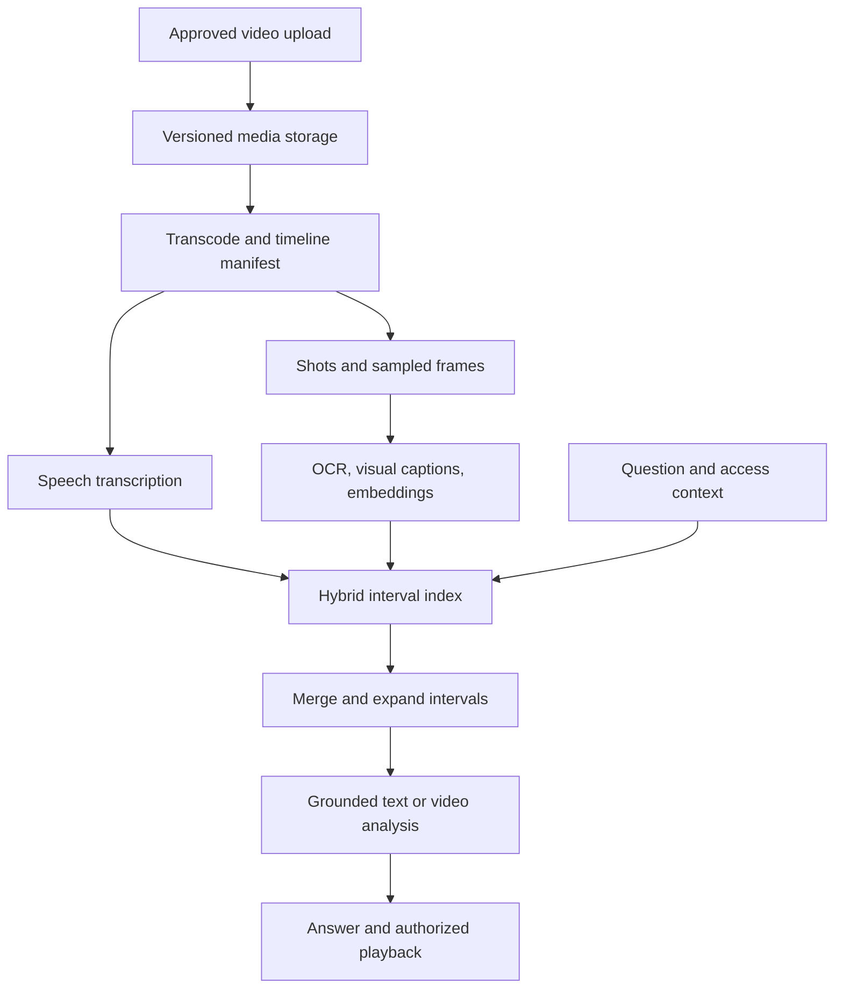
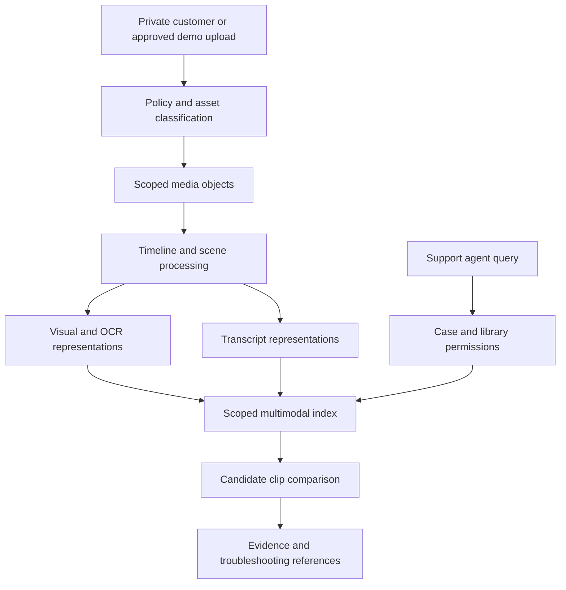

# Video retrieval and grounded question answering

Video retrieval finds the moment that answers a question. A transcript can locate spoken words, but may miss a silent demonstration, a slide, an instrument reading, or the order of actions. A useful system aligns audio, frames, text, and metadata on one timeline, then returns a playable evidence interval.

The [OpenSearch example](opensearch-retrieval.md) remains a good retrieval foundation. Video changes the unit of evidence from a document chunk to an interval with several synchronized representations. The search engine stores those representations; object storage and a media service serve the original evidence.

!!! note "Scope and evidence"

    Research date: September 7, 2026 (UTC). AWS Rekognition documentation and Google's video-understanding documentation were consulted. Workload sizes, sampling strategies, and thresholds are illustrative. A sampled representation cannot prove that an unsampled event never occurred. Verify model-specific media limits, retention, and accounting before implementation.

## 1. What a video index contains

A video asset has a stable identity, source version, duration, frame rate/timebase, audio tracks, and access policy. Derived records include transcript spans, shot boundaries, sampled frames, OCR text, captions, embeddings, and event proposals. Every derived record points back to a time interval in the source version.

Amazon Rekognition supports asynchronous analysis of stored video and documents job start, completion notification, and result retrieval flows. Individual analysis operations have their own outputs and availability constraints; a generic “video processed” flag should not imply every analysis succeeded. [^1]

Rekognition segment detection can identify shot segments and technical cues such as black frames or credits. These are useful segmentation signals, but shot boundaries are not equivalent to semantic task boundaries. One explanation can span many shots; one static shot can contain multiple meaningful actions. [^2]

Multimodal models can reason over video inputs. Google's Gemini documentation describes video inputs, timestamps, frame-rate controls, and limitations associated with visual sampling. The documented default static-processing path samples one frame per second; supported models can offer other processing modes. Fast actions may require denser sampling or another analysis path, so pin the model and input configuration. [^3]

Use these services as components, not as a substitute for a timeline model, access control, or quality evaluation.

## 2. Representation and temporal mechanics

### Choose intervals before choosing embeddings

Fixed windows are simple, but can split a sentence or action. Shot segmentation respects visual edits but can fragment a tutorial. Transcript sentence/topic boundaries preserve speech while missing silent actions. A hybrid segmenter can combine boundaries and allow limited overlap, then store parent-child relationships among scene, shot, and retrieval window.

Assign canonical timestamps in milliseconds or another explicit unit. Record conversion from source timebase and avoid accumulating rounding drift. Transcoding can change frame positions; citations should resolve through a manifest rather than treating frame number as universal across encodings.

A retrieval interval might contain transcript text, selected frame IDs, OCR text, a generated visual description, and embeddings. Keep these fields separate. A generated caption is a proposal about the frames, while OCR is a noisy extraction and a transcript is a noisy audio representation. The answer should distinguish visible evidence from spoken claims.

### Sampling is a recall decision

Uniform one-frame-per-second sampling may cover slides well but miss a brief switch or hand movement. Increase sampling around motion, shot changes, or candidate intervals when the task requires it. An adaptive second pass can inspect a short candidate clip at higher density rather than embedding every frame of every video.

Sampling strategy must be reproducible. Store sampler version, timestamps, crop/resolution, and model processor. Avoid claiming temporal order from unordered keyframes: two frames showing an open and closed valve do not establish which occurred first unless timestamps and sufficient continuity support the inference.

### Retrieval and temporal expansion

Search transcript, OCR, and visual representations in parallel under the same policy filters. Fuse candidates, merge overlapping intervals, and expand around the selected evidence to include prerequisites or the end of an action. Preserve a maximum total duration and model input budget.

A query such as “Where does the instructor explain torque?” may be transcript-heavy. “Where is the red lever moved?” needs visual evidence. “Was the pressure released before opening the cover?” needs ordering and may require a contiguous clip rather than isolated frames. Route these classes differently and allow uncertainty when evidence is incomplete.

## 3. Alternatives and best fit

| Approach | Useful for | Important limitation |
|---|---|---|
| Transcript-only hybrid search | Lectures, interviews, narrated demonstrations | Silent actions and visual details are invisible |
| Transcript plus sampled-frame captions | Mixed speech and slower visual content | Caption/sampling omissions become retrieval gaps |
| Shared visual/text embeddings | Appearance-based scene discovery | Exact events and temporal relationships need further verification |
| Direct video-model questions | Small collections or a retrieved short clip | Repeated media cost and input/sampling limits |
| Specialist event detection | Narrow, well-defined observable events | Requires task-specific evaluation and may not generalize |
| Human tags and chapter markers | Curated catalogs with stable taxonomy | Manual effort and incomplete coverage |

Video retrieval is valuable for training libraries, media archives, product demonstrations, and finding evidence in recorded workflows. It is less useful than simple metadata search when users know the title or exact chapter. It is a poor basis for asserting absence of a fast event when only sparse frames were processed.

Avoid conflating general video search with person identification, employee scoring, or safety certification. Those applications have separate requirements. This chapter's designs retrieve and explain evidence; they do not automatically establish that a procedure is safe or that a person violated a rule.

## 4. Design A: enterprise training-video assistant

### Workload and architecture

Assume 20,000 hours of approved training video, 200 new hours weekly, and 40 peak questions/second. Most videos contain narrated demonstrations, slides, and occasional silent sequences. The goal is a useful playable result within two seconds for search, with a grounded answer following when requested. Content is versioned by product and training revision.

### Ingestion flow

1. Store the original video and validate that it can be decoded within resource limits. Record source duration and media tracks before transcoding.
2. Produce serving renditions and a mapping to the original timeline. Extract authorized audio, transcript spans, shots, and selected frames through separate idempotent jobs.
3. Build retrieval windows around transcript/shot boundaries with controlled overlap. Generate visual descriptions only from selected evidence and label their provenance.
4. Index text and compatible visual embeddings with `asset_id`, source version, interval start/end, product, language, and access metadata.
5. Validate coverage and promote a manifest. A video with failed visual processing can remain transcript-searchable only if that partial capability is explicit.

Record jobs per stage and input hash. A caption-model update should not retranscode the entire archive. A transcript correction should invalidate affected text windows and summaries, while unchanged frame embeddings can be reused.

### Query flow

Authenticate, resolve current product/training version, classify the evidence need, and retrieve authorized intervals. For “How do I replace the filter?”, search both spoken instructions and visible filter scenes. Expand to include warnings and prerequisite steps, then present the full relevant chapter when a short clip would omit essential context.

The answer cites timestamps and identifies whether a statement came from speech, on-screen text, or visual interpretation. Clicking a citation requests an authorized playback URL for the selected interval. A citation to minute 12 of an obsolete revision should not silently open minute 12 of the current video.

For procedural topics, use approved training wording and do not generate missing steps. If the clip begins midprocedure or excludes a warning, show the surrounding section or state that the evidence is incomplete. Product-specific exact terms should use lexical retrieval alongside semantic search.

### Recovery and permissions

If visual analysis fails, transcript search can continue for appropriate queries. If media playback is unavailable, the system should not present a broken citation as verified evidence. If the source revision is withdrawn, block retrieval immediately through the active manifest and reconcile derived deletions afterward.

Background jobs use leases, bounded retries, and a failure queue with stage-specific causes. Completion events can arrive twice; update the same logical stage result. A stale job from an old source version must not overwrite the new manifest. Retain failed intermediate artifacts only as allowed by the storage policy.

## 5. Design B: product demonstration and support archive

### Workload and architecture

Assume 500,000 short support/demo videos averaging four minutes, with 5,000 new uploads daily. Support agents ask for examples of a visible symptom, such as “screen flickers after docking,” and need to compare the customer's issue with approved demonstrations. Uploaded customer videos are private and should not automatically become general training content.

### Different evidence and data boundaries

The approved demonstration library and a customer's case attachments are distinct corpora. The agent may search both in one interaction only under the applicable permissions. A generated answer must not use another customer's video because it looks relevant. Tenant/case filters apply before external reranking or generation.

Store asset class, case ID where relevant, consent/retention policy identifier, product version, and source rights. A reviewer can approve a sanitized derivative for the shared library through a separate workflow. Sanitization must address audio, screen text, metadata, and visible personal information; copying only a thumbnail does not remove every disclosure path.

### Request flow and comparison

The support query preserves exact model numbers and error strings. Retrieve OCR/transcript matches and visual candidates, then group by product version and symptom. For a customer's clip, inspect a bounded interval around the reported timestamp rather than automatically processing the whole recording through an expensive model.

The comparison stage reports observable similarities and differences: “both clips show the display going black after the dock is connected.” It should not infer the same root cause solely from visual similarity. Link to approved troubleshooting material for next steps and keep diagnostic claims grounded in that source.

A specialist detector might help for a well-defined flicker event, but it needs task-specific labels and temporal resolution. Sparse frame embeddings alone are a weak detector for rapid flicker. If the media's frame rate or exposure hides the phenomenon, report insufficient evidence rather than a negative diagnosis.

### Failure and deletion

If a video contains malformed frames or extreme dimensions, isolate decoding and enforce time/memory limits. If the timestamp reported by the customer exceeds the video duration, request correction or search the available clip; do not fabricate a matching moment. If an attachment is deleted, remove all frames, transcripts, vectors, captions, and cached answers derived from it according to policy.

Keep an asset-to-derivative manifest so deletion and replay are deterministic. External model submission logs should record reference IDs and policy, avoiding copied media in ordinary observability. Downstream case summaries should identify when cited media is no longer available.

## 6. Capacity and economics

At one sampled frame/second, 20,000 hours produce `20,000 × 3,600 = 72 million frames`. Even modest per-frame processing and storage becomes significant. An assumed 50 KB thumbnail per frame is 3.6 TB before replicas and original media. Sampling every five seconds reduces frame count, but only evaluation can establish whether the lost recall is acceptable.

Indexing one vector per ten-second interval gives 7.2 million vectors for the same archive. With illustrative 768-dimensional float32 vectors, raw values require about 22.1 GB. Graph indexes, metadata, text, replicas, and multiple representation types add overhead. Vector storage is often smaller than retained media and image derivatives.

Budget separately for transcription minutes, video analysis, decoding, embeddings, image/video model calls, storage, egress, and retrieval. A two-stage strategy can use inexpensive coarse retrieval and inspect only a few candidate clips at higher temporal resolution. Record how often that second stage changes the answer; otherwise it may be pure cost.

Interactive admission control should bound total candidate duration and frame count. Large uploads belong in asynchronous processing queues. Track ingestion lag by stage and asset class so a huge archive backfill does not delay new support cases. Queue priorities should have fairness limits to prevent old content from starving forever.

## 7. Evaluation and release

Create a labeled set with answer intervals, acceptable temporal tolerance, and required modalities. Measure interval recall, temporal intersection-over-union where useful, ranking quality, and citation accuracy. A result in the right video but ten minutes away is not a successful retrieval.

Stratify speech-only, slide text, silent action, rapid event, and temporal-order questions. Compare transcript-only, caption-enriched, and multimodal systems under equal access and latency budgets. Include missing audio, mismatched subtitles, frame sampling gaps, obsolete revisions, and near-identical product videos.

Evaluate answers for evidence support and overclaiming. “No sampled frame shows it” is different from “it did not happen.” Test whether the system preserves that distinction. Verify that cited clips include enough context and that transcript offsets align with playback after transcoding.

Operational drills include duplicate completion events, failed transcodes, partial indexes, permission revocation, deleted media, and model migration. A release should improve measured retrieval failures without introducing unauthorized media exposure or unsupported temporal claims.

## 8. Practice: defend the design

1. Compare one-frame-per-second and adaptive sampling on fast and slow events.
2. Demonstrate a timestamp citation surviving a new serving rendition.
3. Explain why transcript-only search fails on a silent demonstration.
4. Retrieve the complete action sequence when the relevant step spans two shots.
5. Prove that a private customer clip never enters another customer's candidate set.
6. Estimate archive reprocessing cost and identify stages that can be reused.

## Implementation review: evidence manifests

Use a manifest to connect the original asset, serving rendition, transcript run, frame sampler, and retrieval index version. A frame record should contain the original media offset, derived image hash, processing settings, and parent interval. This makes a citation reproducible even after the serving codec changes or a thumbnail is regenerated.

Avoid treating a generated scene description as a permanent factual tag. If the caption model changes, keep its output versioned and evaluate whether retrieval improves before replacing the active representation. Human-approved chapter titles can coexist with machine captions, with provenance visible to ranking and answer construction. Prefer authoritative titles for exact chapter navigation and visual representations for evidence that titles omit.

For temporal questions, record the evidence coverage used to answer: contiguous clip duration, sampled timestamps, audio availability, and any decode gaps. The answer validator can then reject claims stronger than that coverage supports. A five-second clip with complete frames supports a different claim from five isolated frames spread over a minute. This coverage record is also useful during incident review, when a plausible answer needs to be traced back to what the model actually received.

## Related studies

- [D02 · Multimodal retrieval over text, tables, and images](multimodal-retrieval.md)
- [D04 · A meeting intelligence pipeline](meeting-intelligence.md)
- [S03 · An asynchronous batch inference platform](batch-inference.md)

## References

[^1]: [AWS: Working with stored video](https://docs.aws.amazon.com/rekognition/latest/dg/video.html) — asynchronous stored-video processing model.
[^2]: [AWS: Segment detection](https://docs.aws.amazon.com/rekognition/latest/dg/segments.html) — shot and technical-cue segmentation.
[^3]: [Google: Video understanding](https://ai.google.dev/gemini-api/docs/video-understanding) — video inputs, temporal controls, timestamps, and sampling considerations.
